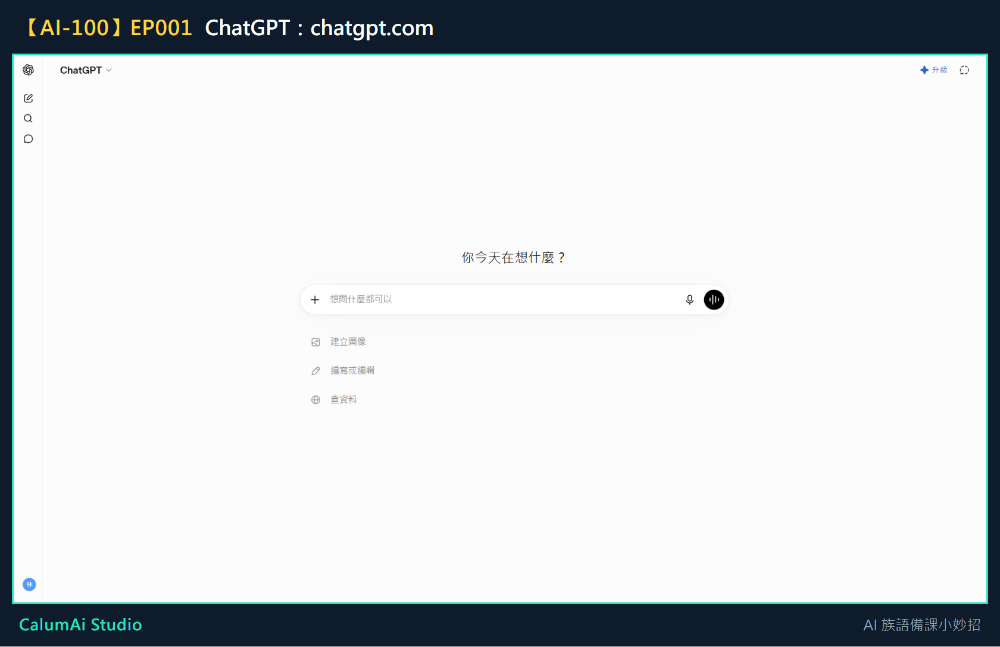
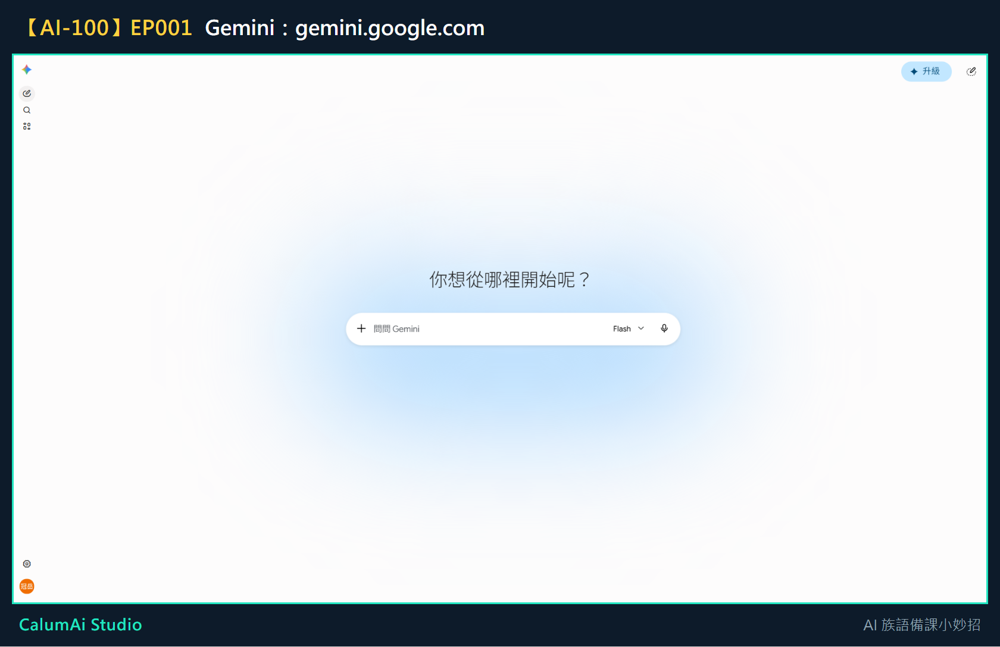

# EP001 講義：今天，我們來認識 AI

本集不教操作，是讓老師先認識「AI 是誰、能幫上什麼忙」。這份講義整理今天認識的重點，方便之後回頭查。

## 今天只做一件事

先認識三位可以幫忙備課的 AI 小助手，還不用動手操作。

## 為什麼要學這個

以前備一堂課，可能要翻好多本教材、查好多網站，還要自己設計活動——這些事情很重要，但真的很花時間。AI 可以想成一位很認真的助教，幫老師把想法整理得更快、更清楚。

**AI 不會取代老師**。因為真正了解學生的人，永遠都是老師。AI 可以幫忙想點子、整理資料，但最後要不要用、怎麼用，還是老師決定。

## 今天認識的三位新朋友

| 工具 | 像什麼 | 最適合做什麼 |
| --- | --- | --- |
| ChatGPT | 一位很會聊天、說故事的夥伴 | 把想法說出來、請它幫忙想故事、設計遊戲、寫教案 |
| Gemini | 一位圖書館管理員 | 查最新的資訊、找參考資料 |
| Gemini Notebook | 老師專屬的知識庫 | 把老師自己的教材整理起來，之後找重點、查資料會快很多 |

> **名稱變動提醒**：第三個工具原本叫「NotebookLM」，Google 已將它改名為「**Gemini Notebook**」。影片中如果聽到 NotebookLM，指的就是同一個工具。

### 它們長這樣

**ChatGPT**——網址是 `chatgpt.com`：

**Gemini**——網址是 `gemini.google.com`：

三個工具的畫面長得不太一樣，但**共同點是**：中間都有一個可以打字的框。認得這個框，就等於學會了一半。

**Gemini Notebook**（原 NotebookLM）——網址是 `notebooklm.google.com`，這個要登入後才看得到內容，我們留到第四模組再一起操作。

## 三位小助手以後怎麼合作

這是未來會一起練習的流程，今天先知道方向就好：

1. **Gemini** 找資料
2. **Gemini Notebook** 整理教材
3. **ChatGPT** 幫忙做成教案

老師只需要提出想法，AI 就能一起幫忙。

## 今日金句

> AI 不會取代老師，它可以幫老師整理想法、設計活動、準備教材。

## 下一集預告

下一集開始動手：一起建立第一個 ChatGPT 帳號。
