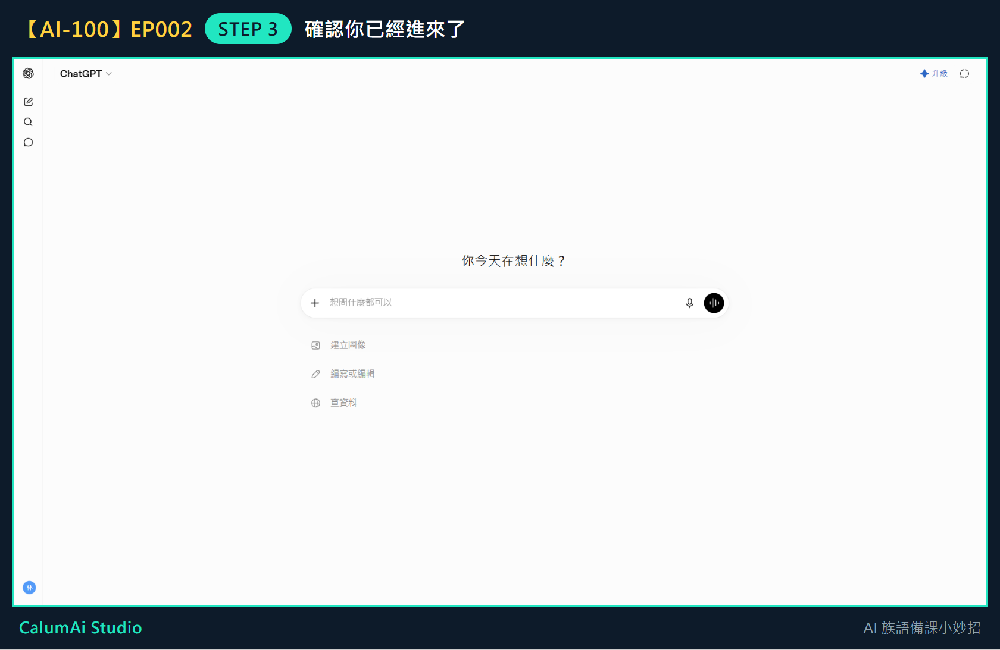
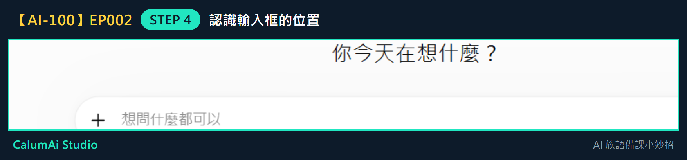
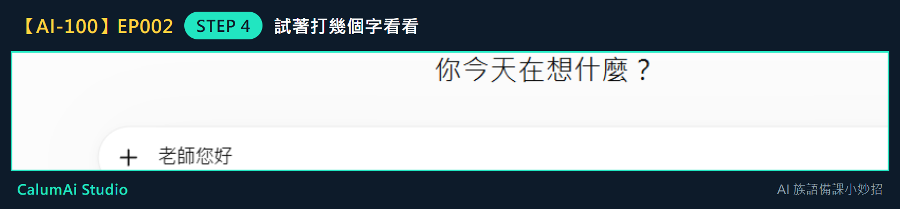

# EP002 講義：建立第一個 ChatGPT 帳號

## 今天只做一件事

成功進入 ChatGPT。不教寫 Prompt、不教進階功能，這些留到之後幾集。

## 需要準備

- 一台可以上網的電腦或手機、瀏覽器。
- 一個常用的 Email，或 Google／Apple 帳號（登入用，不需要新申請）。
- 不用先想好要問什麼問題，今天只練「進去」這件事。

## 步驟 1：打開網站

打開瀏覽器，在**上面的網址列**輸入：

```
chatgpt.com
```

慢慢打，打完按 Enter，看到畫面出現後再往下一步。

## 步驟 2：登入或註冊

畫面出現「登入」或「註冊」時：

- **已經有帳號**的老師 → 點「登入」
- **還沒有帳號**的老師 → 點「註冊」

接著選一個自己熟悉的方式：用 Email、或用 Google／Apple 帳號都可以。

> **密碼不用告訴任何人**，包括這門課。畫面如果請你收信或做驗證，照著指示慢慢完成就好。

## 步驟 3：確認你已經進來了

登入成功後會看到這個畫面：



看到中間有一個可以打字的長條框，就代表**你已經成功進入 ChatGPT 了**。

## 步驟 4：認識畫面上的位置

把畫面中間那個框放大來看：



這個寫著「想問什麼都可以」的框，就是**以後要打字的地方**。

試著點一下它，隨便打幾個字看看：



打得出字，就表示一切正常。今天可以先把字刪掉，不用送出。

## 老師的小提醒

- 今天不用真的問問題，看到輸入框、確認自己能進來，就算完成任務。
- 畫面左邊的「新對話」，是以後想重新開始問問題的地方。
- 左下角是你的帳號，今天不用調整任何設定。
- 這一步看起來很小，但它是後面所有集數的起點——先進去，才能開始慢慢學。

## 今日金句

> 先進去，再慢慢學。

## 下一集預告

下一集，我們會一起問 ChatGPT 第一個備課問題。
