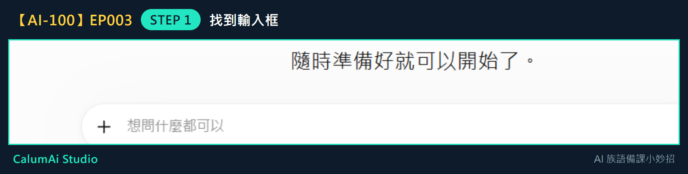
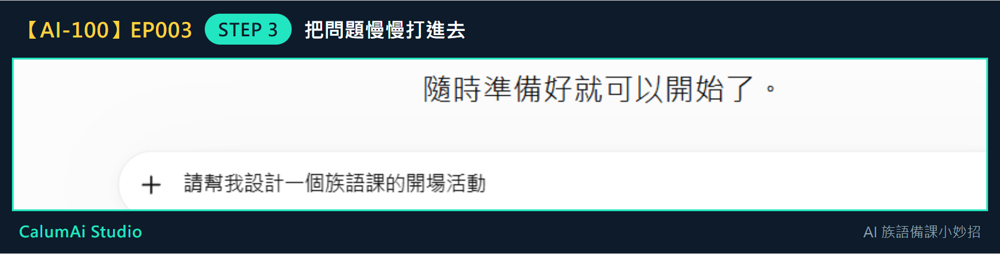
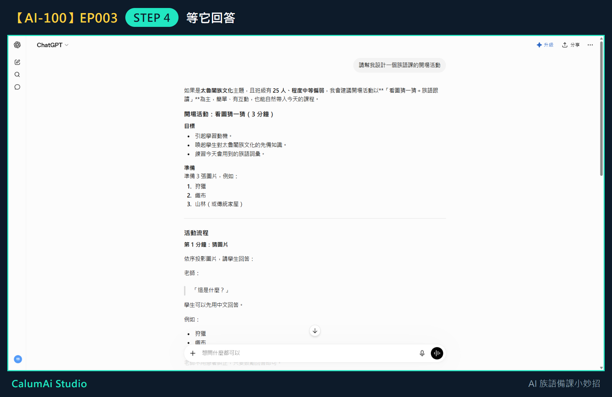

# EP003 講義：問 ChatGPT 第一個備課問題

## 今天只做一件事

問 ChatGPT 第一個備課問題。不教 Prompt 公式、不教角色設定、不教多輪追問，這些留到之後幾集。

## 需要準備

- 已經能進入 ChatGPT（上一集完成的事）。
- 一個想問的簡單問題，不用寫得很厲害。

## 步驟 1：找到輸入框

進到 ChatGPT 後，看畫面中間：

這個框就是**把想法告訴 ChatGPT 的地方**。點一下它。

## 步驟 2：想一句簡單的問題

問題不用複雜，例如：

> 請幫我設計一個族語課的開場活動

## 步驟 3：慢慢打進去

把問題打進框裡，打完會長這樣：

**打錯字沒關係**，可以刪掉再改。確認沒問題後，按右邊的送出鍵（或按 Enter）。

## 步驟 4：等它回答

送出後**先不要急**，讓 ChatGPT 慢慢把答案寫出來。寫完長這樣：

只問了一句話，它就給出**活動名稱、時間、步驟、效果**，是一份可以直接看懂的活動草案。

## 步驟 5：先看大概就好

不需要馬上全部照用。如果有一兩句覺得適合，就先記下來，放進自己的備課筆記。

## 老師的小提醒

- AI 只是小助手，真正了解學生的人，永遠都是老師——回答不一定要照單全收。
- 如果 ChatGPT 的回答太長，可以直接跟它說「請改短一點」（下一集會練到這種追加要求）。

## 今日金句

> 想到什麼，先問一句。

## 下一集預告

下一集，我們會請 ChatGPT 幫忙整理一小段教材。
