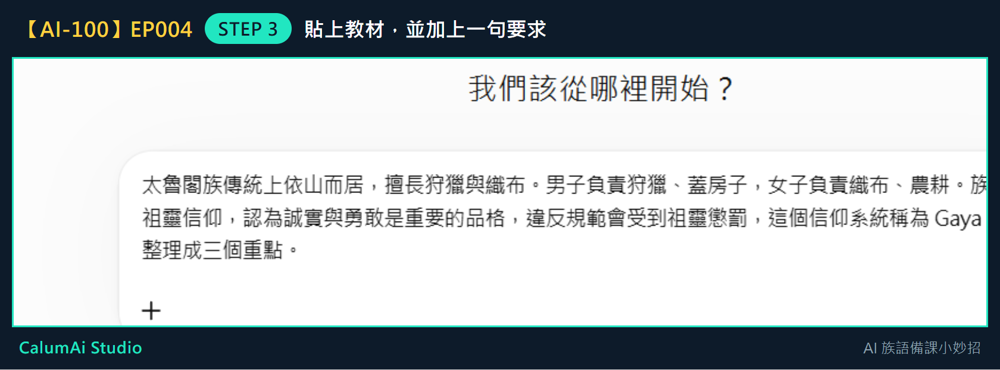
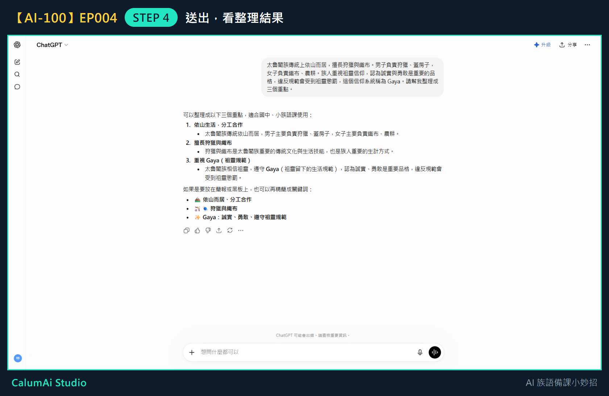

# EP004 講義：請 ChatGPT 幫忙整理一段教材

## 今天只做一件事

把一小段教材文字，請 ChatGPT 整理成清楚的重點。不處理長篇教材、不上傳 PDF，這些留到之後幾集。

## 需要準備

- 一小段教材文字（**兩三句就可以練習**，不用一次貼太多）。
- 已經能進入 ChatGPT 並輸入問題（前兩集學過的事）。

## 步驟 1：準備一小段教材

先找一段短短的教材文字。這份講義用這段當例子：

> 太魯閣族傳統上依山而居，擅長狩獵與織布。男子負責狩獵、蓋房子，女子負責織布、農耕。族人重視祖靈信仰，認為誠實與勇敢是重要的品格，違反規範會受到祖靈懲罰，這個信仰系統稱為 Gaya。

## 步驟 2：複製這段文字

用滑鼠把文字選起來，按右鍵選「複製」（或按鍵盤 Ctrl+C）。

## 步驟 3：貼進 ChatGPT，並加上一句要求

回到 ChatGPT，點輸入框，貼上教材，**然後在後面加一句話**：

> 請幫我整理成三個重點。

貼好加好之後，畫面會像這樣：

這一句要求很重要——**沒說要幾個重點，它就會自己決定**。

## 步驟 4：送出，看整理結果

按下送出，稍等一下：

原本一整段落落長的文字，變成三個清楚的重點：

1. **依山而居，善於狩獵與織布**
2. **男女分工合作**
3. **遵守 Gaya（祖靈規範）**

每個重點下面還附一句說明。這樣的整理，直接放進簡報或學習單都很方便。

## 步驟 5：檢查有沒有被改錯

**這一步不能跳過。** 一條一條看，確認意思有沒有跑掉，特別是族語詞彙和文化用語。

如果有不適合的地方，可以自己改，也可以跟 ChatGPT 說「第三點請改得更簡單一點」。

## 老師的小提醒

- 整理好的重點可以放進教案，也可以變成課前提醒。
- **AI 整理得再漂亮，也要由老師確認內容正不正確**，尤其是族語相關的內容，一定要老師把關，不能直接照用。
- 練習時請用可以公開的範例教材，不要貼未授權或敏感的內容。

## 今日金句

> 貼上教材，整理三點。

## 下一集預告

下一集，我們會用這些重點設計一個 5 分鐘暖身活動。
