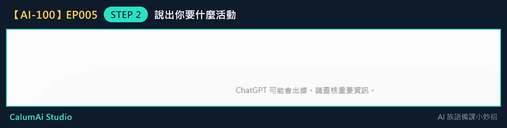
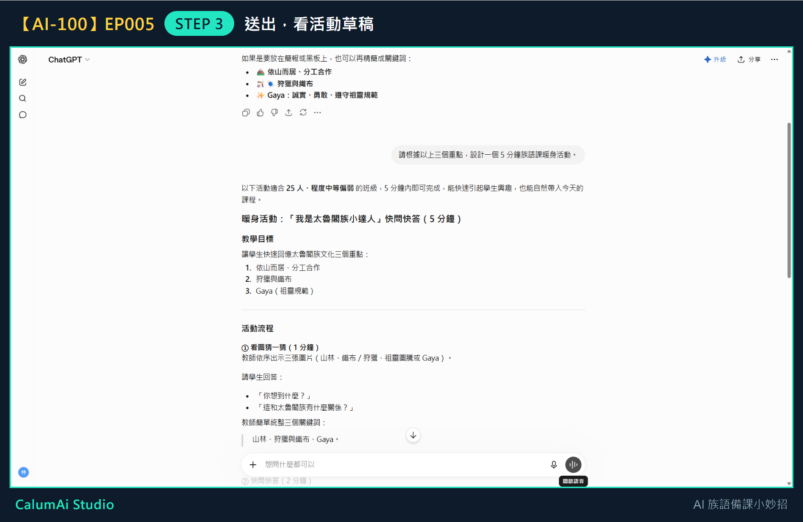

# EP005 講義：請 ChatGPT 幫忙設計 5 分鐘暖身活動

## 今天只做一件事

把教材重點變成一個 5 分鐘暖身活動。不做完整教案、不做評量設計，這些留到之後幾集。

## 需要準備

- 上一集整理好的 3 個教材重點。
- 已經能進入 ChatGPT 並輸入問題。

## 步驟 1：接著上一集的對話問

**不用重新開始。** 上一集整理出三個重點的那個對話，直接往下問就好——ChatGPT 記得剛剛整理的內容。

## 步驟 2：說出你要什麼活動

在輸入框打上：

> 請根據以上三個重點，設計一個 5 分鐘族語課暖身活動。

打好之後長這樣：

這句話裡有三個關鍵:「**根據以上三個重點**」（接續前面）、「**5 分鐘**」（時間）、「**暖身活動**」（用途）。三個都說清楚，它給的東西才會準。

## 步驟 3：送出，看活動草稿

它給的活動有**名稱、目標、時間分配、詳細流程**——這就是一份可以往下修改的草稿了。

## 步驟 4：檢查三件事

拿到活動先看這三個地方：

- **時間**：真的做得完嗎？
- **步驟**：學生聽得懂嗎？
- **場地**：教室的桌椅擺設做得到嗎？

## 步驟 5：不滿意就直接說

- 太難 → 「請改簡單一點」
- 太長 → 「請縮短成 3 分鐘」
- 學生太多做不到 → 下一集會專門練這個

## 老師的小提醒

- 這個活動是**草稿**，不是成品——重點給 AI，活動老師改，一定要依自己班級狀況調整過再用。
- 暖身活動可以放在上課前 5 分鐘，幫學生先開口說一點族語。

## 今日金句

> 重點給 AI，活動老師改。

## 下一集預告

下一集，我們會練習把活動改成更適合自己班級的版本。
