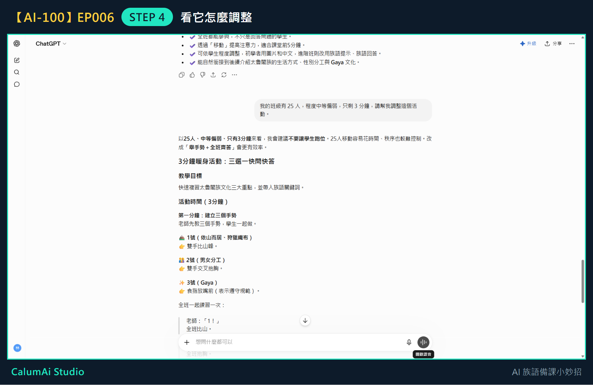

# EP006 講義：請 ChatGPT 幫我調整暖身活動，更適合自己的班級

## 今天只做一件事

把上一集做好的活動，改成適合自己班級的版本。不重新設計新活動、不做完整教案，這些留到之後幾集。

## 需要準備

- 上一集 ChatGPT 給的暖身活動內容。
- 想清楚自己班級的三件事：**學生人數、程度、還剩多少時間**。

## 步驟 1：先想清楚班級的三個條件

不用寫下來，心裡有數就好：

- **有幾個學生？**
- **程度大概如何？**
- **這個活動實際上能用幾分鐘？**

## 步驟 2：接著上一集的對話問

**不用重新開始**，也不用把活動再貼一次——ChatGPT 記得剛剛給你的活動。

## 步驟 3：把條件說出來

在輸入框打上你的實際狀況，例如：

> 我的班級有 25 人，程度中等偏弱，只剩 3 分鐘，請幫我調整這個活動。

## 步驟 4：看它怎麼調整

## 調整前後差在哪裡

|  | 上一集的版本 | 說出班級條件後的版本 |
| --- | --- | --- |
| 活動名稱 | 三角落站一站 | 三選一快問快答 |
| 時間 | 5 分鐘 | 3 分鐘 |
| 學生要做什麼 | 走到教室三個角落 | 坐在原位比三個手勢 |
| 為什麼改 | — | 25 人移動花時間、秩序難控制 |

最值得注意的是它**主動說明理由**：「25 人移動容易花時間、秩序也較難控制，改成『舉手勢＋全班齊答』會更有效率。」

它還針對「中等偏弱」做了調整——學生只要**辨識三個概念、比出手勢**就好，不用開口回答，這樣程度較弱的學生也不會因為怕說錯而不敢參與。

## 老師的小提醒

- **說得越清楚，AI 調得越準**。只說「幫我改短一點」，它不知道你的難處在哪；說「25 人、只剩 3 分鐘」，它才知道該把「走動」拿掉。
- 調整完**不代表就能直接用**。老師還是要看一次：這個班的學生會不會覺得手勢太幼稚？教室座位排列做得到嗎？
- 這一招不只用在暖身活動。任何 AI 給的東西，都可以用「我的情況是……，請幫我調整」再問一次。

## 今日金句

> 說出班級狀況，AI 才調得準。

## 下一集預告

下一集，我們會一起練習把整堂課的節奏排出來。
