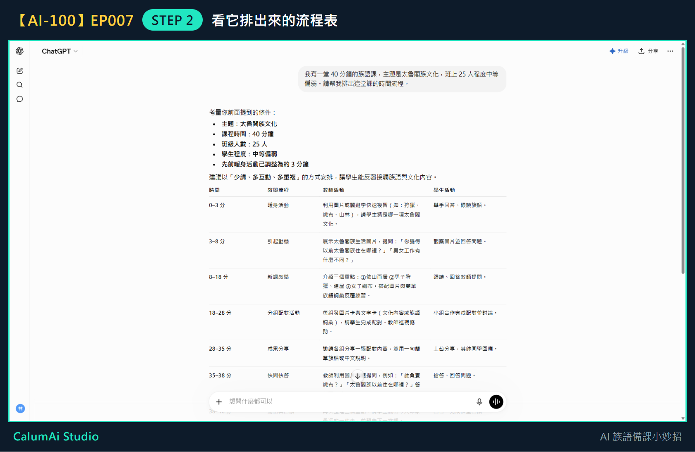
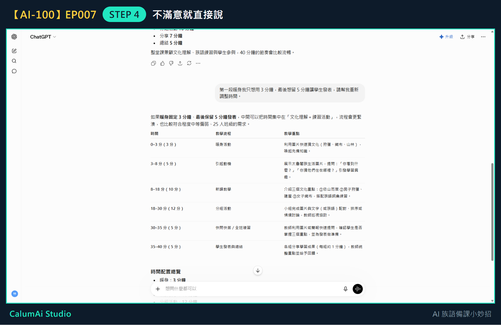

# EP007 講義：請 ChatGPT 幫我排一堂課的節奏

## 今天只做一件事

把一堂課的時間排出來。不寫完整教案、不做學習單，這些留到之後幾集。

## 需要準備

想清楚三件事就好：

- **這堂課有幾分鐘？**（例如 40 分鐘）
- **今天要教什麼？**（例如太魯閣族文化）
- **班上什麼狀況？**（例如 25 人、程度中等偏弱）

## 步驟 1：把三件事一起說出來

在輸入框打上：

> 我有一堂 40 分鐘的族語課，主題是太魯閣族文化，班上 25 人程度中等偏弱。請幫我排出這堂課的時間流程。

三件事**一次講完**，不要分三次問——它才能一起考慮。

## 步驟 2：看它排出來的流程表

它用表格排出七個段落，每段都有**起訖時間、老師活動、學生活動**。

## 它排出來的節奏長這樣

| 時間 | 段落 |
| --- | --- |
| 0–3 分 | 暖身活動 |
| 3–8 分 | 引起動機 |
| 8–18 分 | 新課教學 |
| 18–28 分 | 分組配對活動 |
| 28–35 分 | 成果分享 |
| 35–38 分 | 快問快答 |
| 38–40 分 | 總結與回饋 |

它還附了幾條建議：文化重點不要超過 3 個、每 8–10 分鐘安排一次互動、族語詞彙控制在 5–8 個、圖片比例高於文字。這些都是針對「程度中等偏弱」給的。

## 步驟 3：把暖身活動放進第一段

前幾集做好的暖身活動，剛好就是流程表第一段（0–3 分）要用的東西。整個系列到這裡就串起來了。

## 步驟 4：不滿意就直接說

跟它說「暖身只要 3 分鐘、最後留 5 分鐘發表」之後：

它重新分配了整堂課：分組活動從 10 分鐘**加長到 12 分鐘**，並且在發表前**多插了 5 分鐘複習**。它給的理由是：「發表前安排 5 分鐘快速複習，學生能先整理想法，再上台分享，發表品質通常會更好。」

這就是重點——你只說了兩個要求，它會自己把中間的時間重新算過，不是只把數字改一改。

## 老師的小提醒

- 這是**草稿**，不是課表。老師最清楚自己班上哪一段會拖、哪一段學生會很快做完。
- 覺得哪一段太趕，直接說「第三段時間不夠，請多給 5 分鐘」就好，不用自己重算。
- 前幾集做的暖身活動，剛好可以放進第一段，整個系列就串起來了。

## 今日金句

> 先讓 AI 排一版，老師再改。

## 下一集預告

下一集，我們會請 ChatGPT 幫忙做一張學習單。
