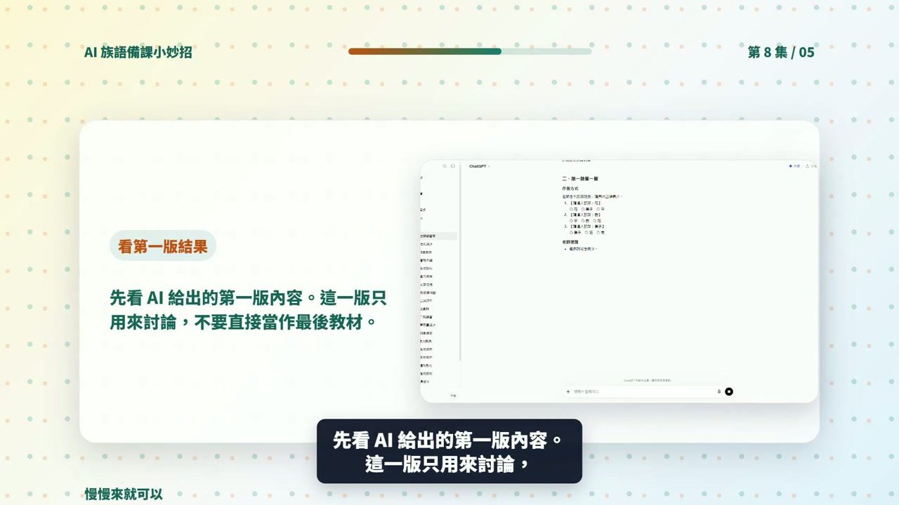

# EP008 講義：做一張學習單

<!-- handout-screenshot:auto -->
## 講義截圖

> 圖說：EP008 本集操作畫面截圖，協助老師對照影片步驟與講義內容。
<!-- /handout-screenshot:auto -->

## 今天只做一件事

老師能把上課重點轉成一張學習單初稿。

## 你會學到

老師能理解「做一張學習單」可以怎麼交給 ChatGPT 協助，並知道 AI 產出後要如何檢查與修改。

## 需要準備

- 一個你真的要拿來上課的小主題。
- 學生程度、上課時間或班級狀況。
- 可以替換成自己族語內容的詞句、例子或教材片段。

## 步驟 1：先把任務縮小

不要一開始就請 AI 做整套教材。先用一句話說清楚你今天要完成什麼，例如：「我想做一份可以讓初學者練習的課堂材料」。

> 這集帶老師完成「做一張學習單」。影片不是要把老師變成工具專家，而是讓老師看見一個很小、很安全、可以明天就試的 AI 備課步驟。

## 步驟 2：把提示詞貼進 ChatGPT

可以直接從這段開始改：

> 我想做「做一張學習單」。請用族語課初學者可以理解的方式，幫我產生一份可修改的教材草稿。請包含題目、作答方式、老師提醒、答案或評分重點，並標出哪些地方需要我替換成自己的族語內容。

## 步驟 3：看 AI 給的第一版

你要先確認它是不是有產出這些東西：

- 有沒有清楚對應今天的課堂任務。
- 有沒有把作答方式、老師提醒或檢查重點寫出來。
- 有沒有標出哪些內容需要老師替換或修正。

這集期待的 AI 產出是：一份有題目、作答方式、答案或評分重點的教材草稿。

## 步驟 4：老師最後把關

- 題目、範例與答案要符合學生程度。
- 族語、文化內容與班級脈絡要由老師最後確認。
- AI 產出的文字可以改短、改白話，不需要照單全收。

## 影片流程速記

- 1. EP008｜本集任務
- 2. 老師先準備什麼
- 3. 打開 ChatGPT
- 4. 輸入本集任務
- 5. 看第一版結果
- 6. 補條件再修改

## 今日金句

> 不用先會寫漂亮提示詞。先把想做的事情說清楚，讓 AI 做第一版；真正能進課堂的版本，永遠由老師最後把關。

## 下一步

把這份草稿改成你自己班上能用的版本，再存成下次備課可以重複使用的模板。
