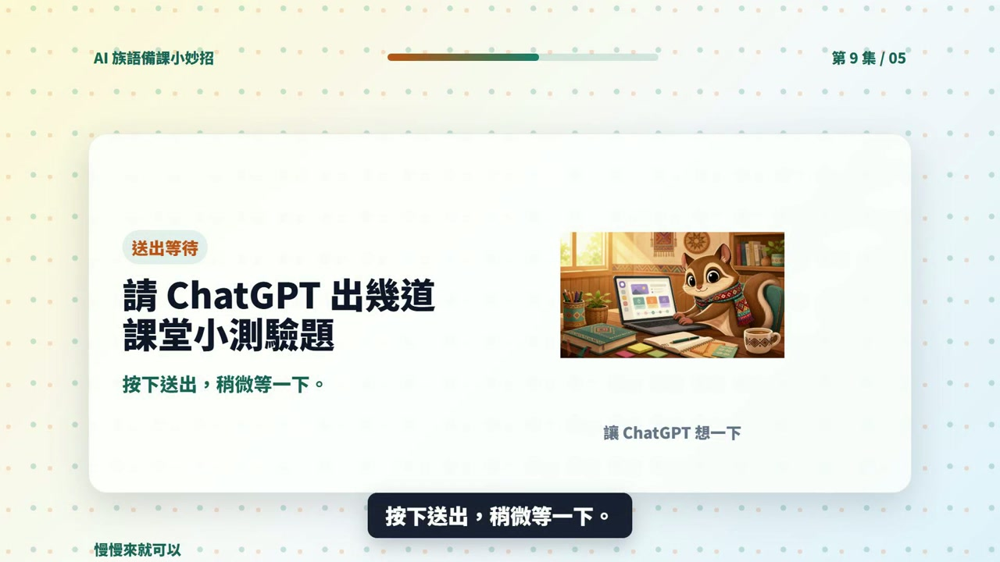

# EP009 講義：請 ChatGPT 出幾道課堂小測驗題

<!-- handout-screenshot:auto -->
## 講義截圖

> 圖說：EP009 本集操作畫面截圖，協助老師對照影片步驟與講義內容。
<!-- /handout-screenshot:auto -->

## 今天只做一件事

請 ChatGPT 根據今天上課的重點，出 3～5 題下課前可以直接開口問的快問快答，並附上參考答案。

這不是正式考試，也不需要計分。目的是用最後 5 分鐘，快速確認學生哪些地方聽懂了、哪些地方還需要再說一次。

## 需要準備

開始前，先寫下這四項資料：

- **今天教的主題**：例如太魯閣族文化。
- **今天教的 3 個重點**：請使用你已確認正確的內容。
- **學生程度**：例如初學者、已學過一次。
- **想要幾題**：建議先從 4 題開始。

本集示範使用的三個重點是「依山而居、男女分工、遵守 Gaya」。實際上課時，請換成你自己確認過的族語與文化內容。

## 步驟 1：打開 ChatGPT

1. 打開瀏覽器，進入 [ChatGPT](https://chatgpt.com/)。
2. 登入後，點一下畫面下方的輸入框。
3. 如果畫面裡還留著上一個主題，可以開啟一個新的對話，避免舊內容混進來。

## 步驟 2：輸入本集任務

以下這段可以直接複製：

> 今天教了太魯閣族依山而居、男女分工、遵守 Gaya 三個重點。學生是初學者。請出 4 題下課前可以直接口頭問學生的快問快答，每題都要附參考答案。題目要短、一次只問一件事，學生不需要看文字也能回答。不要增加我沒有提供的族語或文化知識。

如果要改成自己的課程，請替換「主題、三個重點、學生程度、題數」，其他句子可以保留。

## 步驟 3：送出並等待回答

1. 再讀一次輸入內容，確認三個教學重點沒有打錯。
2. 點輸入框旁邊的送出按鈕。
3. 等 ChatGPT 完整回答後，再從第一題開始往下看。

## 步驟 4：逐題念一次

不要只用眼睛看，請真的把每一題念出來。每題都檢查：

- 老師能不能一口氣念完。
- 一題是不是只問一件事。
- 學生能不能在幾秒內回答。
- 題目有沒有超出今天教過的內容。
- 參考答案是否和老師的教材一致。

如果題目需要學生讀一大段文字、同時回答兩三件事，或答案沒有在今天的課程裡出現，就不適合當口頭快問快答。

## 步驟 5：不順口就請它改

第三題太長時，可以直接複製：

> 請把第 3 題改得更短、更口語。一次只問一件事，讓初學者聽完就能回答。參考答案也請控制在一句話內。

如果所有題目都太難，可以直接複製：

> 請把全部題目改成初學者程度，只能使用我原本提供的三個教學重點，不要增加新的知識。

## AI 回覆檢查點

可以使用的回答，至少要符合下面幾點：

- 有 3～5 題，而且每題都有參考答案。
- 題目短、口語、可以直接開口問。
- 題目只使用今天教過的內容。
- 答案明確，不會出現兩種互相矛盾的說法。
- 難度符合學生目前的程度。

只要有一點不確定，就先修改或刪除，不要直接拿去問學生。

## 族語與文化安全提醒

- ChatGPT 可能會補出看起來合理、其實不正確的族語詞或文化說法。
- 族語拼寫、發音、語意與文化內容，要以老師、族語辭典、部落耆老或可信教材的確認為準。
- 不要因為 AI 寫得很完整，就把不同部落、方言別或家族的做法當成完全相同。
- 涉及祭儀、禁忌、神聖知識或不適合公開的內容時，不要貼入 ChatGPT，也不要做成測驗題。

## 今天完成了什麼

你已經把今天的三個教學重點，變成一組可以在下課前直接使用的口頭快問快答。

## 下一步

實際問完後，不必急著打分數。先記下「很多人答錯的是哪一題」和「學生常怎麼回答」。下一集會把去掉姓名的作答內容交給 ChatGPT，找出可能的共同誤解與下一步教學方法。
