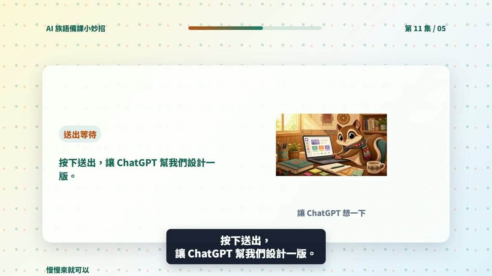

# EP011 講義：請 ChatGPT 幫我設計一個分組活動

<!-- handout-screenshot:auto -->
## 講義截圖

> 圖說：EP011 本集操作畫面截圖，協助老師對照影片步驟與講義內容。
<!-- /handout-screenshot:auto -->

## 今天只做一件事

告訴 ChatGPT 班級人數、組數、時間與活動主題，請它排出一個每位學生都有明確任務的分組活動。

這一集不處理複雜的分組工具。先拿到一個能在教室裡直接試做的簡單版本就好。

## 需要準備

開始前，先寫下：

- **班級人數**：例如 24 人。
- **想分幾組**：例如 4 組，每組 6 人。
- **活動時間**：例如 20 分鐘。
- **活動主題與學習目標**：例如複習三個文化重點，並練習口頭說明。
- **學生程度**：例如族語初學者。
- **教室與材料限制**：例如座位不方便移動、只有白紙和筆。

如果總人數不能平均分配，也要先寫出來，例如「23 人，希望分 4 組，其中一組可以 5 人」。

## 步驟 1：先確認人數算得通

以 24 人分 4 組為例：

- 24 ÷ 4＝每組 6 人。
- 教室裡要有 4 個可以討論的位置。
- 每組至少要有 6 個能輪流或同時參與的工作。

如果座位不能移動，可以請 ChatGPT 設計「前後桌一組」；如果有行動不便或不方便大聲發言的學生，也要把需要的調整一起說明。

## 步驟 2：打開 ChatGPT

1. 打開 [ChatGPT](https://chatgpt.com/)。
2. 開啟一個新的對話。
3. 點一下畫面下方的輸入框。

## 步驟 3：輸入本集任務

以下這段可以直接複製：

> 我的班級有 24 人，學生是族語初學者，想分成 4 組，每組 6 人。活動時間是 20 分鐘，主題是複習太魯閣族文化的三個課堂重點，目標是讓每位學生都能開口說出至少一個重點。教室座位不方便大幅移動，材料只有白紙和筆。
>
> 請設計一個簡單的分組活動，寫出：
>
> 1 每一個步驟要做什麼和需要幾分鐘
>
> 2 每組 6 個人的分工
>
> 3 老師要說的簡短指令
>
> 4 學生完成後要交出或說出什麼
>
> 5 老師怎麼快速確認學生有沒有理解
>
> 請確保每位學生都有事情做，不要安排競賽，不要增加我沒有提供的族語或文化知識。

實際使用時，請把人數、組數、時間、主題、目標和教室限制換成自己的資料。

## 步驟 4：送出並先看時間

1. 點送出按鈕。
2. 把每個步驟的分鐘數加起來，確認沒有超過活動時間。
3. 看活動開始時，老師要不要花太多時間搬桌椅或發材料。
4. 確認最後有留下分享與收尾的時間。

如果 ChatGPT 排了 25 分鐘，但你只有 20 分鐘，就要請它重排，不要硬塞進課堂。

## 步驟 5：再看每個人做什麼

逐一檢查 6 個人的分工：

- 每個人都有清楚、做得到的任務。
- 不會只有一個人從頭說到尾，其他人都在等。
- 不熟族語的學生也有可以參與的工作。
- 分工不會讓固定幾位學生總是負責寫字、搬東西或公開發言。
- 老師能用一句簡單指令說明活動。

## 步驟 6：不合用就直接改條件

如果要改成 3 組，可以直接複製：

> 請改成 3 組，每組 8 人，總時間仍是 20 分鐘。請重新安排 8 個人的分工，確保每位學生都能參與。

如果學生程度較弱，可以直接複製：

> 請把活動改成更適合族語初學者。老師的指令要短，學生每次只做一件事，並加入一次老師示範。不要增加新的族語詞彙。

如果教室不能移動座位，可以直接複製：

> 教室座位不能移動，請改成前後桌就能完成的活動，其他條件不變。

## AI 回覆檢查點

可以使用的分組活動，至少要符合：

- 組數、每組人數和全班總人數一致。
- 各步驟時間加起來沒有超過可用時間。
- 每位學生都有明確任務，不會長時間等待。
- 老師指令簡單，學生聽完知道先做什麼。
- 教室座位與現有材料真的做得到。
- 活動結果能看出學生是否達成學習目標。
- 沒有加入老師未提供、也未確認的族語或文化知識。

## 族語與文化安全提醒

- ChatGPT 安排的是活動方法，不代表它提供的族語與文化內容一定正確。
- 族語詞句、拼寫、發音與文化說明，仍要由老師、可信教材或文化知識持有人確認。
- 不要用性別、年齡、身分或家族背景固定分配角色，例如預設某一類學生只能做某一種工作。
- 不要要求學生公開分享家族私密經驗、祭儀細節、禁忌或不適合在課堂公開的知識。
- 同一文化主題可能因部落、方言別或家族而有不同說法，活動中要保留說明差異的空間。

## 今天完成了什麼

你已經把人數、組數、時間與教室限制說清楚，取得一個每位學生都有任務的分組活動初版。

## 下一步

先在自己的教室座位圖上排一次，確認人坐得下、材料來得及發、時間也足夠。接著挑一個步驟實際試做；如果學生程度不同，再把需要調整的地方告訴 ChatGPT，請它做成較簡單與較有挑戰的兩種版本。
