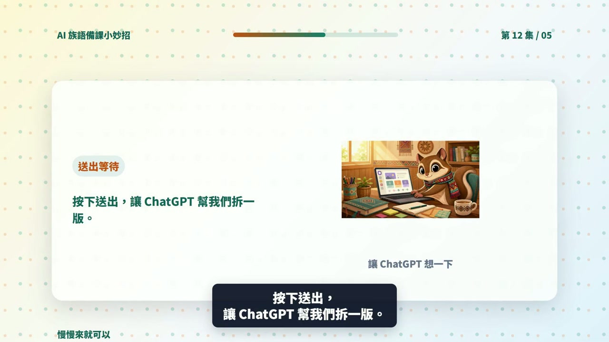

# EP012 講義：請 ChatGPT 幫忙把活動改成適合不同程度的學生

<!-- handout-screenshot:auto -->
## 講義截圖


> 圖說：EP012 本集操作畫面截圖，協助老師對照影片步驟與講義內容。
<!-- /handout-screenshot:auto -->

## 今天只做一件事

把一個已經有的課堂活動，改成「基礎版」和「進階版」。兩個版本教同一個主題，只是給學生的提示和挑戰不同。

## 需要準備

先把下面四樣資料放在手邊：

- **原來的活動內容**：學生要做什麼、怎麼分組、最後要交出什麼。
- **共同學習目標**：例如「學生能說出三個太魯閣族文化重點」。
- **上課限制**：活動有幾分鐘、幾人一組、可以使用哪些教材。
- **班級的大致狀況**：哪些地方有人需要多一點提示，哪些學生已經可以自己組織完整句子。

請只寫全班的大致狀況，不要輸入學生姓名、成績、身心狀況或其他可以認出個人的資料。

## 步驟 1：打開 ChatGPT

1. 打開 ChatGPT。
2. 如果上一集的活動就在目前的對話裡，可以接著使用同一個對話。
3. 如果是新的對話，先把原活動完整貼進去，讓 ChatGPT 知道學生原本要做什麼。
4. 點一下畫面下方的輸入框。

## 步驟 2：貼上這一集的提示詞

下面這段可以直接複製。要換成自己課程時，再修改主題、時間和原活動。

```text
我是族語老師，想把同一個活動調整成兩種難度。

課程主題：太魯閣族文化
共同學習目標：學生能說出三個太魯閣族文化重點
活動時間：20 分鐘
分組方式：4 人一組
原活動：每組閱讀三張文化重點卡，討論後選出一個重點，用自己的話向全班說明。
班級狀況：有些學生需要詞語提示和句型範例，另一些學生已經可以自己整理內容並說明理由。

請把原活動改成「基礎版」和「進階版」，並遵守以下要求：
1. 兩個版本的主題、共同學習目標和活動時間要相同。
2. 基礎版要提供詞語表、句型範例和清楚的分段步驟。
3. 進階版要讓學生自己整理重點、說明理由，或加入一個延伸問題。
4. 分別列出學生步驟、老師可以怎麼提示、需要的材料和完成標準。
5. 最後建議這兩個版本如何在同一班或同一組中一起使用。
6. 不要替學生貼上聰明、落後或能力不足等標籤。
7. 只使用我提供的族語與文化資料。沒有資料的地方請標示「請老師補充」，不要自行編造。
```

貼好後，按下送出按鈕，等 ChatGPT 回答完成。

## 步驟 3：先看兩個版本有沒有教同一件事

不要只看哪一版字比較多。請逐項檢查：

- 兩個版本是不是都在學同一個文化主題。
- 兩個版本是不是都要達成相同的學習目標。
- 基礎版有沒有多提供詞語、句型或一步一步的提示。
- 進階版有沒有增加思考或表達的挑戰，而不是只增加作業量。
- 兩個版本能不能在差不多的時間內完成。
- 老師能不能在同一間教室裡同時帶兩個版本。

## 步驟 4：不合用就直接請它調整

時間太長時，可以接著貼：

```text
請把兩個版本都調整成 15 分鐘內可以完成，保留相同的學習目標，並把老師要準備的材料減到最少。
```

提示還不夠清楚時，可以接著貼：

```text
基礎版對初學者還是太難。請增加一份 6 個詞語的詞語表、2 個可以直接套用的句型，以及老師逐步提問的順序。族語詞語先留空讓我填寫。
```

進階版只是作業變多時，可以接著貼：

```text
進階版不要增加抄寫量。請改成讓學生比較兩個文化重點、說明理由，並提出一個自己想追問的問題。
```

## AI 回覆檢查點

可以使用的版本，至少要符合這些條件：

- [ ] 基礎版與進階版的學習目標相同。
- [ ] 每一版都有清楚的學生步驟、時間、材料和完成標準。
- [ ] 基礎版真的增加了協助，不只是把題目變少。
- [ ] 進階版增加的是思考深度，不是單純增加份量。
- [ ] 沒有用負面詞語形容學生，也沒有把學生固定分成高低等級。
- [ ] 沒有出現老師未提供的族語詞句、文化說法或歷史細節。

## 族語與文化安全提醒

- ChatGPT 不知道你所在部落、語別或方言別的實際用法。族語拼寫、發音、翻譯與使用場合，都要由老師或熟悉該文化的人確認。
- 不要請 AI 判定哪一種文化說法才是唯一正確。不同部落、家族或世代可能有不同說法。
- 涉及祭儀、禁忌、傳統知識或不適合公開的內容時，不要直接貼進 ChatGPT，也不要因為 AI 寫得流暢就拿來教。
- 這裡的兩種版本只是教學活動的調整，不是學生能力診斷，也不能代替學校正式的支持或特殊教育程序。

## 今日金句

> 程度不同不代表要分開上課，同一個任務，換一個難度就好。

## 下一步

先選一個小活動試用兩個版本。下課後記下「哪一個提示有幫助」和「哪一個步驟仍然太難」，下一次再把這兩點告訴 ChatGPT，請它做第二版。
