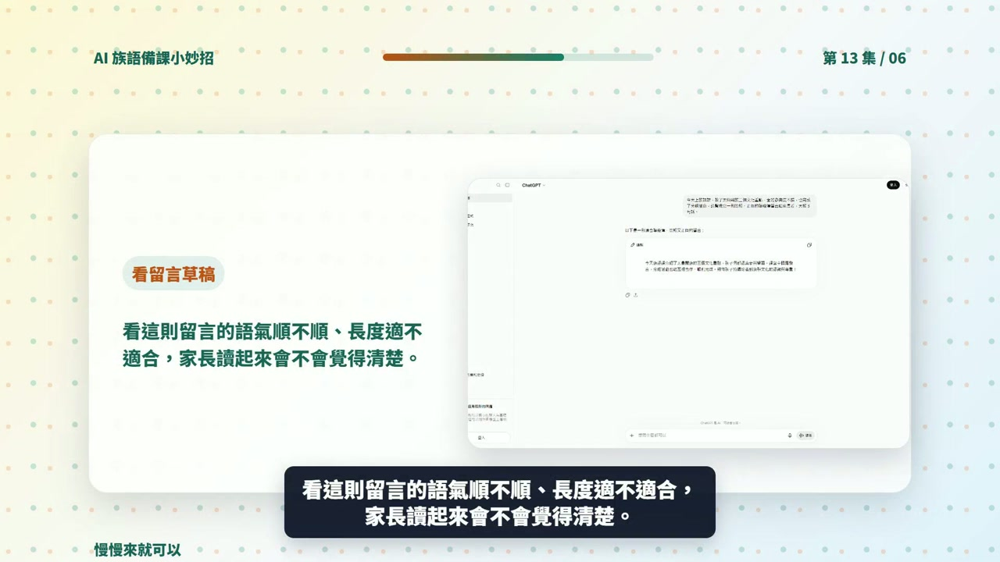

# EP013 講義：請 ChatGPT 幫忙寫一則給家長的聯絡簿留言

<!-- handout-screenshot:auto -->
## 講義截圖


> 圖說：EP013 本集操作畫面截圖，協助老師對照影片步驟與講義內容。
<!-- /handout-screenshot:auto -->

## 今天只做一件事

把今天真的發生的上課情況，整理成一則簡短、正向、家長看得懂的聯絡簿留言草稿。

ChatGPT 可以幫忙把句子寫順，但事實是否正確，最後一定要依正式資料核對。

## 需要準備

先用自己的話記下四件事：

- **今天教了什麼**：例如三個太魯閣族文化重點。
- **學生做了什麼**：例如快問快答、分組討論或口說練習。
- **全班整體情況**：只寫真的觀察到的情況，例如「多數學生願意參與」。
- **希望家長知道什麼**：例如回家可以一起複習三個詞語。

不要輸入學生姓名、家長姓名、電話、住址、成績、醫療資訊或個別學生的負面表現。

## 步驟 1：先分清楚「事實」和「感覺」

可以寫進留言的是已經發生、老師可以確認的事，例如：

- 今天練習了三個詞語。
- 班上完成了分組活動。
- 多數學生願意開口練習。

不要把猜測當成事實，例如：

- 每一位學生都完全學會了。
- 學生回家一定會主動複習。
- 家長一定會覺得這堂課很有趣。

## 步驟 2：打開 ChatGPT 並貼上提示詞

1. 打開 ChatGPT。
2. 點一下畫面下方的輸入框。
3. 複製並貼上下面這段話。
4. 確認內容符合今天的實際情況，再按下送出按鈕。

```text
請根據我提供的事實，寫一則給家長看的聯絡簿留言草稿。

今天的上課事實：
- 課程：族語課
- 主題：太魯閣族三個文化重點
- 活動：三選一快問快答和分組討論
- 全班整體情況：多數學生願意參與，也完成了分組活動
- 希望家長協助：回家後請孩子說一個今天印象最深的文化重點

寫作要求：
1. 寫成 3 句話，語氣親切、正向、自然。
2. 使用一般家長容易理解的白話，不要使用艱深的教育名詞。
3. 只寫我提供的事實，不要自行加入學生表現、家長反應或沒有發生的事情。
4. 不要加入任何學生姓名或可以認出個人的資料。
5. 族語和文化名稱保留我提供的寫法，不要自行改寫或補充。
6. 先給我留言草稿，再另外列出「老師送出前要確認的 3 件事」。確認清單不要寫進家長留言裡。
```

## 步驟 3：一句一句對照事實

ChatGPT 回答後，不要立刻傳給家長。請從第一句開始檢查：

1. 這句寫的事情今天真的有發生嗎？
2. 人數、活動、學習內容和學生反應有沒有被誇大？
3. 有沒有出現自己沒有提供的新資料？
4. 家長看得懂嗎？語氣會不會像在責備或評分？
5. 族語名稱、部落名稱和文化說法有沒有被改錯？

只要有一項不確定，就先刪掉或改成老師能確認的說法。

## 步驟 4：太長或語氣不對，就請它重寫

留言太長時，可以接著貼：

```text
請保留原來的事實，改成 3 句、120 字以內。不要新增任何資訊。
```

語氣太生硬時，可以接著貼：

```text
請把語氣改得更親切自然，像老師平常寫給家長的聯絡簿留言，但不要過度稱讚，也不要改變事實。
```

需要把提醒說得更柔和時，可以接著貼：

```text
請把最後一句改成溫和、可以做到的家庭練習建議，不要讓家長覺得被要求完成額外作業。
```

## AI 回覆檢查點

可以送出的留言，至少要符合這些條件：

- [ ] 只有 3 句左右，家長可以很快看完。
- [ ] 每一句都能在老師的上課紀錄中找到根據。
- [ ] 沒有「全部都會了」「表現完美」等無法確認的說法。
- [ ] 沒有學生或家長的個人資料。
- [ ] 沒有把個別學生的困難公開寫給全班家長看。
- [ ] 家庭練習簡單、清楚，而且做不到也不會造成壓力。
- [ ] 族語與文化內容已依正式資料核對。

## 族語與文化安全提醒

- 族語拼寫、翻譯、部落名稱與文化說明，要沿用老師確認過的版本。ChatGPT 改得比較順，不代表改得比較正確。
- 不要在公開留言中寫入不適合公開的傳統知識、祭儀細節或家族資訊。
- 如果同一文化內容有不同部落或世代的說法，可以寫「本次課堂介紹的是本班使用的說法」，不要宣稱只有一種正確答案。
- 涉及學生個別行為、學習困難或親師溝通爭議時，不要交給 AI 自動寫完就送出，應依學校規定由老師親自處理。

## 今日金句

> AI 寫草稿，事實要老師確認。

## 下一步

把確認過的留言存成自己的格式。下次只要換掉「今天教了什麼、做了什麼、全班整體情況、希望家長協助什麼」，就能更快完成新的聯絡簿留言。
