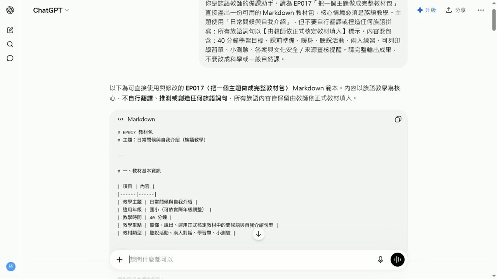

# EP017 講義：把一個主題做成完整教材包

<!-- handout-screenshot:auto -->
## 講義截圖


> 圖說：EP017 本集操作畫面截圖，協助老師對照影片步驟與講義內容。
<!-- /handout-screenshot:auto -->

## 今天只做一件事

把一個族語課程主題整理成一套可以修改的教材初稿，內容包含：

- 學習目標
- 課堂活動
- 學習單
- 口頭小測驗

AI 先協助整理第一版，最後依正式資料核對內容，才能帶進課堂。

## 需要準備

開始前，請先準備：

- **課程主題**：這一堂課只選一個清楚的小主題。
- **學生狀況**：年齡、人數、族語程度與學習需要。
- **上課時間**：例如 40 分鐘或 50 分鐘。
- **學習重點**：希望學生下課前能聽懂、說出或完成什麼。
- **已確認的族語內容**：建議先準備 5～8 個詞句，附中文意思。
- **已確認的文化內容**：只放適合課堂使用、可以分享的資料。
- **現有教材**：課本頁面、老師筆記或已取得使用同意的資料。

不要放入學生姓名、成績、聯絡方式、家庭情況或可以辨認個人的資料。

## 步驟 1：先把資料整理在一起

在送給 ChatGPT 前，先自己看一次：

1. 主題是否只有一個。
2. 族語詞句是否已確認拼寫與意思。
3. 文化內容是否適合這個班級使用。
4. 上課時間與學生程度是否寫清楚。

資料還不完整也可以開始，但不確定的地方要明確標出，不要讓 AI 自己猜。

## 步驟 2：打開 ChatGPT

1. 打開 ChatGPT。
2. 找到畫面下方的輸入框。
3. 把準備好的資料放在旁邊，方便一項一項填入。

## 步驟 3：輸入本集專用任務

把中括號裡的內容換成自己的資料，再整段貼上：

```text
請協助我把一個族語課程主題整理成可以修改的教材初稿

課程主題：[填入主題]
學生年齡或年級：[填入]
學生人數：[填入]
學生族語程度：[初學／已有基礎]
上課時間：[填入分鐘數]
這堂課希望學生學會：[填入 1～3 項具體目標]

本課可使用的族語詞句：
1. [族語詞句]＝[中文意思]
2. [族語詞句]＝[中文意思]
3. [族語詞句]＝[中文意思]
4. [可繼續增加]

本課可使用的文化內容與來源：
[填入已確認、適合課堂分享的內容]

請只使用我提供的族語詞句與文化內容
不確定的地方標示「待補資料」，不要自行編造

請依序整理出：

一、學習目標
寫出 2～3 個學生下課前能做到的具體目標

二、課堂流程
依照總上課時間安排每一個步驟
每一步都寫出時間、老師怎麼帶、學生怎麼做
所有步驟的時間加起來必須等於總上課時間

三、課堂活動
設計一個不需要複雜道具的活動
寫出準備物、老師說明、學生做法與結束方式

四、學習單
設計 5 題
每題寫清楚作答方式
另外提供答案或老師判斷重點

五、口頭小測驗
設計 5 題由簡單到稍難的問題
每題附參考答案

六、老師檢查清單
列出上課前必須確認的族語、文化、時間、難度與學生安全事項

請使用簡短、白話的繁體中文
內容要適合較不熟電腦的老師閱讀
```

## 步驟 4：分段檢查第一版

ChatGPT 回答後，不要一次從頭看到尾。依序檢查：

1. 先看學習目標。
2. 再把課堂流程的分鐘數加起來。
3. 接著看活動是否真的能在教室進行。
4. 再逐題檢查學習單與答案。
5. 最後念出口頭小測驗，確認學生聽得懂。

## AI 回覆檢查點

- [ ] 學習目標是學生能做到的事情，不是模糊口號。
- [ ] 課堂流程每一步都有時間、老師做法與學生做法。
- [ ] 各步驟分鐘數加起來等於總上課時間。
- [ ] 活動符合學生年齡、人數、程度與教室空間。
- [ ] 學習單共有 5 題，每題都有清楚的作答方式。
- [ ] 學習單答案與題目能互相對應。
- [ ] 口頭小測驗共有 5 題，順序由簡單到稍難。
- [ ] 所有族語詞句都來自老師提供的資料。
- [ ] 不確定的地方有標示「待補資料」，沒有假裝確定。
- [ ] 四個部分都在教同一個主題，沒有前後矛盾。

## 步驟 5：一次只改一種問題

第一版太難時，可以貼上：

```text
請保留原來的課程主題與族語內容
把活動、學習單和口頭小測驗改成更適合族語初學者
每一個指令都改成更短、更白話
```

時間排不下時，可以貼上：

```text
這堂課只有 40 分鐘
請重新安排課堂流程
所有步驟加起來必須剛好 40 分鐘
學習目標、族語詞句與文化內容不要改
```

發現 AI 加了陌生內容時，可以貼上：

```text
請刪除所有不是我提供的族語詞句與文化內容
缺少資料的地方標示「待補資料」
不要自行補充
```

## 步驟 6：老師完成最後確認

1. 把不會使用的活動刪掉或改短。
2. 用老師自己的說話方式改寫指令。
3. 實際做一次學習單，確認題目能作答。
4. 把口頭小測驗念出來，確認沒有拗口或容易誤解的句子。
5. 保存前，在檔名加上主題與日期，日後比較容易找到。

## 族語與文化安全提醒

- AI 不能代替族語老師、族語使用者、耆老或文化知識持有者做最後判斷。
- 同一個詞在不同方言別、地區或使用情境中可能不同，不能自行混用。
- 祭儀、禁忌、傳統領域、身分與部落故事等內容，使用前要確認是否可以教、可以寫、可以公開。
- 引用教材、圖片、錄音或族人提供的內容時，要保留來源並確認使用方式。
- 若 AI 寫出老師沒有提供的族語或文化說法，先刪除，再查證，不要直接交給學生。
- 教材難度與活動方式要配合學生狀況，避免讓學生因口音、身分或答錯而感到難堪。

## 今日金句

> AI 可以先整理一版，真正能進教室的版本要由老師逐項確認。

## 下一步

先挑一個班級試用這套教材。上完課後記下「哪一段時間不夠」「哪一題學生看不懂」「哪個活動最有效」，再回到同一個對話請 ChatGPT 只修改有問題的部分。
