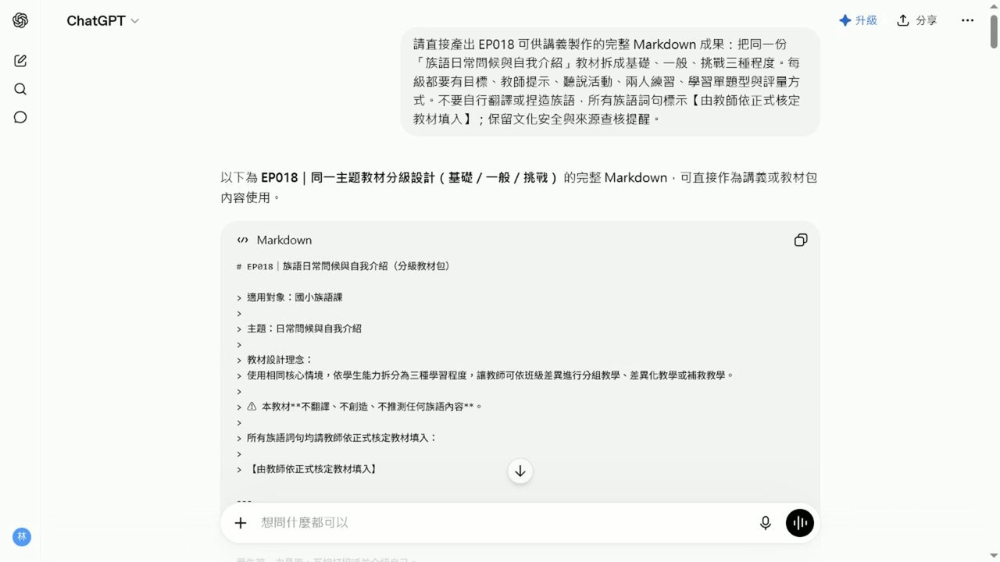

# EP018 講義：把教材包拆成三種程度

<!-- handout-screenshot:auto -->
## 講義截圖


> 圖說：EP018 本集操作畫面截圖，協助老師對照影片步驟與講義內容。
<!-- /handout-screenshot:auto -->

## 今天要完成什麼

把同一個族語課程主題，整理成「基礎、一般、挑戰」三種程度。三個版本教的是同一個核心內容，但練習量、回答方式與任務難度會逐步增加。

完成後，你會得到一份三種程度的教學草稿，可以依班級狀況挑選，也可以讓同一班不同程度的學生使用。

## 開始前請準備

- 一個真的要拿來上課的主題，例如日常問候、自我介紹或家庭稱謂。
- 學生的年齡與目前程度。
- 這堂課可使用的時間。
- 已經依正式資料核對正確的族語詞句、中文意思及出處。
- 原本使用的教材片段或活動內容。如果沒有完整教材，先準備這堂課一定要教會的內容即可。

> 如果族語內容尚未確認，先不要請 AI 翻譯。可以先用【由教師依正式核定教材填入】保留位置。

## 步驟 1：先決定三種程度的差別

開始前，先用白話想清楚三個版本要差在哪裡：

- **基礎版**：學生可以看提示、跟著說、做辨認或配對。
- **一般版**：學生要少看一些提示，能替換詞句並完成短對話。
- **挑戰版**：學生要在情境中自行組合內容，完成較長的口說或應用任務。

三個版本不是三個不同主題，也不是把文字單純變多或變少。它們應該教同一個重點，只改變學生需要完成的難度。

## 步驟 2：打開 ChatGPT

1. 開啟 ChatGPT。
2. 在畫面下方中央找到輸入框。
3. 先點一下輸入框，確認游標正在閃動。
4. 把下一段提示詞中的方括號內容換成自己的資料。
5. 完整複製提示詞，再貼進輸入框。

## 步驟 3：輸入這集專用任務

```text
你是一位協助族語老師備課的教學設計助理

請把同一個課程主題設計成基礎版 一般版 挑戰版三種程度

課程資料如下
課程主題：【填入主題】
學生年齡：【填入年齡】
學生目前程度：【填入程度】
上課時間：【填入分鐘數】
本課一定要學會的內容：【填入學習重點】
已確認正確的族語詞句與中文意思：【貼上老師已核對的內容】

請遵守以下要求
1 三個版本必須教同一個核心內容
2 基礎版以看提示 跟讀 辨認和配對為主
3 一般版加入詞句替換 短句回答和兩人練習
4 挑戰版加入情境應用 自行組句和較完整的對話
5 每個版本都要列出學習目標 準備材料 老師示範 學生活動 練習時間和簡單評量
6 每個步驟都要寫出老師可以直接說的引導語
7 最後用一張比較表整理三個版本的差異
8 不要自行翻譯或創造任何族語
9 資料中沒有提供的族語一律標示【由教師依正式核定教材填入】
10 文化背景 人名 地名 儀式 禁忌和傳統知識如無可靠資料 不得自行補寫 請標示【請教師或文化知識持有人確認】

請用繁體中文 條列清楚 讓較不熟電腦的老師也能直接照著使用
```

## 步驟 4：確認後再送出

送出前，先看一次提示詞：

- 主題、學生程度與上課時間是否已換成自己的資料。
- 是否要求產生基礎、一般、挑戰三個版本。
- 已確認的族語詞句是否貼對，沒有混入其他課程內容。
- 【由教師依正式核定教材填入】的安全標記是否仍然保留。

確認後，點輸入框右下角黑色圓形中的向上箭頭一次。

看到輸入框右側出現黑色圓形中的白色方塊，表示 ChatGPT 還在回答。先不要重複點擊，等文字停止增加，而且白色方塊消失後，再開始檢查。

## 步驟 5：檢查 AI 的回覆

從回覆最上方往下看，逐項確認：

- 有基礎版、一般版、挑戰版三個完整區塊。
- 三個版本都在教同一個主題與相同的核心內容。
- 基礎版有明顯提示，學生能跟讀、辨認或配對。
- 一般版有替換詞句、短句回答或兩人練習。
- 挑戰版有情境應用、自行組句或較完整的對話。
- 每個版本都有目標、材料、老師示範、學生活動、時間與評量。
- 難度確實逐步增加，不只是文字變長。
- 沒有出現老師未提供、未核對的族語或文化資訊。

如果內容不符合，可以接著輸入：

```text
請保留原本的課程主題 重新調整三種程度
基礎版再簡單一點並增加提示
一般版加入兩人替換練習
挑戰版加入真實情境對話
三個版本都要使用同一組已確認的族語內容
不要新增任何我沒有提供的族語或文化資料
```

## AI 回覆檢查點

- [ ] 三種程度都完整，沒有少一個版本。
- [ ] 三個版本的學習重點一致。
- [ ] 活動難度由基礎到挑戰逐步增加。
- [ ] 每一步都有老師可以直接使用的引導語。
- [ ] 活動時間加總沒有超過實際上課時間。
- [ ] 評量方式能看出學生是否真的理解或會說。
- [ ] 所有族語詞句都已由老師依正式教材核對。
- [ ] 文化內容沒有猜測、杜撰或過度概括。

## 族語與文化安全提醒

- AI 可以協助整理活動與難度，但不能代替族語老師判斷語音、語法、方言別與使用情境。
- 不要因為 AI 寫得很流暢，就直接把它當成正確族語。
- 涉及部落歷史、祭儀、禁忌、傳統領域、親屬關係或身分認同時，應由文化知識持有人確認。
- 未公開、受限制或不適合課堂傳播的文化知識，不要貼進公開的 AI 服務。
- 不要輸入學生姓名、聯絡方式、成績或其他可辨識個人的資料。

## 下一步

選一個最符合目前班級的版本，先實際試教其中一個活動。記下學生在哪裡需要更多提示、哪裡太簡單，再回來調整三種程度。保存前，請為檔案加上主題與日期，方便下次找到。
