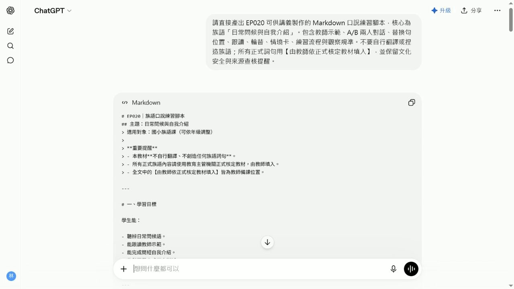

# EP020 講義：做口說練習腳本

<!-- handout-screenshot:auto -->
## 講義截圖


> 圖說：EP020 本集操作畫面截圖，協助老師對照影片步驟與講義內容。
<!-- /handout-screenshot:auto -->

## 今天要完成什麼

完成一套可以直接帶進課堂的口說練習流程，依序包含老師示範、學生跟讀、詞句替換與兩人對話。每一步都會有老師可以直接說的引導語，也會保留族語內容的內容核對位置。

## 開始前請準備

- 一個學生真的可能遇到的口說情境，例如見面問候、自我介紹、詢問姓名或介紹家人。
- 學生的年齡與目前程度。
- 可使用的上課時間。
- 每組學生預計練習的句數與次數。
- 已經依正式資料核對正確的族語句型、替換詞與中文意思。
- 如果有文化情境，準備可靠來源或可以協助確認的文化知識持有人。

> 先選一個短而真實的情境。初學者能把兩到四句話說清楚，比一次塞進很多句子更重要。

## 步驟 1：先寫出口說練習的骨架

先決定四個練習要做什麼：

1. **老師示範**：老師先完整說一次，讓學生知道速度、語氣與互動順序。
2. **學生跟讀**：老師說一句，學生跟著說一句。
3. **替換練習**：保留句型，只替換一個已確認的詞。
4. **兩人對話**：學生分成甲、乙兩個角色，依順序完成短對話。

如果句型與替換詞還沒核對完成，先保留空格，不要請 AI 自行翻譯。

## 步驟 2：打開 ChatGPT

1. 開啟 ChatGPT。
2. 在畫面下方中央找到輸入框。
3. 點一下輸入框，確認游標正在閃動。
4. 把下一段提示詞中的方括號內容換成自己的資料。
5. 完整複製提示詞，再貼進輸入框。

## 步驟 3：輸入這集專用任務

```text
你是一位協助族語老師設計口說活動的教學助理

請依照以下資料設計一套可以直接帶領的口說練習腳本

口說情境：【填入真實情境】
學生年齡：【填入年齡】
學生程度：【填入程度】
活動時間：【填入分鐘數】
每組練習句數：【填入句數】
學習目標：【填入學生最後要能說出的內容】
已確認正確的族語句型 替換詞與中文意思：【貼上老師已核對的內容】

請依照以下順序設計
1 老師示範
2 學生逐句跟讀
3 保留句型的替換練習
4 甲乙兩人的短對話
5 交換角色再練習一次
6 老師最後的口說檢查

每一個步驟都要包含
老師可以直接說的引導語
學生要做的動作
建議練習次數
預計使用時間
學生卡住時可以給的提示
老師要觀察的重點

請注意
由淺到深安排 每次只增加一個新要求
初學者的句子要短 並保留足夠重複練習
不要自行翻譯或創造任何族語
資料中沒有提供的族語一律標示【由教師依正式核定教材填入】
文化背景 人名 地名 儀式 禁忌和傳統知識如無可靠資料 不得自行補寫 請標示【請教師或文化知識持有人確認】
請用繁體中文 條列清楚 讓老師能直接照順序帶領
```

## 步驟 4：確認後再送出

送出前，先確認：

- 情境是真實而且適合學生的。
- 程度、時間與練習句數已換成自己的資料。
- 提示詞包含老師示範、學生跟讀、替換練習與兩人對話。
- 貼入的族語句型與替換詞都已由老師核對。

確認後，點輸入框右下角黑色圓形中的向上箭頭一次。

看到輸入框右側出現黑色圓形中的白色方塊，表示 ChatGPT 還在回答。請等文字停止增加，而且白色方塊消失後，再繼續。

## 步驟 5：按順序檢查四個主要練習

回覆完成後，從上往下找：

1. 老師示範。
2. 學生跟讀。
3. 替換練習。
4. 甲乙兩人對話。

確認四個部分都有完整內容，而且順序沒有顛倒。對較不熟悉族語口說的學生，應該先聽、再跟著說、接著替換，最後才獨立對話。

## 步驟 6：檢查老師是否能直接帶領

每一段都要看得到：

- 老師開場要說什麼。
- 學生要聽、跟讀、替換還是輪流回答。
- 要練習幾次。
- 學生卡住時，老師要給哪一種提示。
- 完成後，老師要觀察發音、理解、互動順序還是流暢度。

如果步驟太快或太難，可以接著輸入：

```text
請保留原本的口說情境和已確認的族語內容
把活動調整得更適合初學者
老師每說一句後都安排學生跟讀
替換練習一次只換一個詞
兩人對話先提供完整提示 再安排第二次不看提示
每一步補上老師可以直接說的引導語
不要新增任何我沒有提供的族語或文化資料
```

## 步驟 7：試念並調整時間

正式上課前，老師先自己念過完整流程：

- 每一句是否太長，學生能不能一次聽清楚。
- 示範與跟讀之間是否留有足夠停頓。
- 替換詞的數量是否太多。
- 甲乙角色是否清楚，學生會不會不知道輪到誰。
- 所有練習加總是否能在預定時間內完成。

如果時間不夠，優先減少替換詞與對話輪數，不要省略老師示範和學生跟讀。

## AI 回覆檢查點

- [ ] 老師示範、學生跟讀、替換練習、兩人對話都完整。
- [ ] 練習順序由簡單到困難，每次只增加一個要求。
- [ ] 每一步都有老師可以直接使用的引導語。
- [ ] 每一句的長度與練習次數符合學生程度。
- [ ] 甲乙角色、輪流順序與交換角色方式都清楚。
- [ ] 活動總時間沒有超過實際上課時間。
- [ ] 所有族語句子、發音與使用情境都已由老師核對。
- [ ] 文化內容沒有猜測、杜撰或不適合公開的資訊。

## 族語與文化安全提醒

- AI 可以協助安排練習順序，但不能代替老師判斷發音、語法、方言別、敬語與實際使用情境。
- 口說腳本中的每一句族語，都要回到正式教材、可靠來源或族語老師的判斷。
- 同一句話在不同年齡、身分、親屬關係或部落情境中，可能有不同說法，不要直接套用。
- 涉及祭儀、禁忌、傳統知識或不宜公開的內容時，要先由文化知識持有人確認。
- 練習角色請使用虛構稱呼，不要把學生真實姓名或個人資料貼進 AI。

## 下一步

先找一位同事或家人，依照腳本完整練習一次。記下哪一句不順、哪一步說明不清楚，再調整句數與時間。確認族語與文化內容正確後，保存一份老師帶領版，並另外整理學生只需要看到的對話內容。
