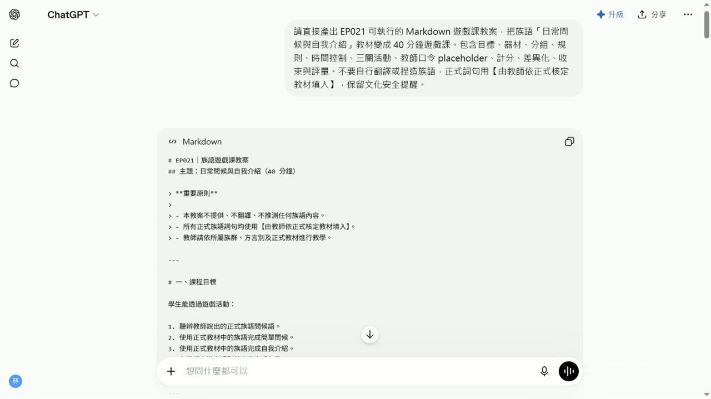

# EP021 講義：把教材變成十五分鐘遊戲課

<!-- handout-screenshot:auto -->
## 講義截圖

> 圖說：EP021 本集操作畫面截圖，協助老師對照影片步驟與講義內容。
<!-- /handout-screenshot:auto -->

## 這集要解決什麼

手上已經有「打招呼與自我介紹」教材，卻不知道怎麼讓全班一起開口練習。

這集不是重新做教材，而是用 ChatGPT 把現有教材整理成一個老師帶得動、學生聽得懂的紙卡口說遊戲。

## 完成後你會拿到

一份可以試教的十五分鐘遊戲稿，裡面會有：

- 三個由簡單到困難的回合。
- 每個回合的開始方式、學生任務與結束條件。
- 十二位學生都能開口、不淘汰人的參與規則。
- 鼓勵開口與合作的計分方式。
- 開始、暫停、換回合、收尾四句老師口令。
- 合計十五分鐘的時間表。

## 需要準備

- 前面完成的「打招呼與自我介紹」教材。
- 班級人數，本集示範為十二位成人初學者。
- 紙卡與白板。
- 經老師核定的族語內容。

## 操作步驟

### 步驟一：告訴 ChatGPT 班級條件

先說明教材主題、學生程度、人數、上課時間與現場材料。條件越具體，產出的遊戲越有機會真的用得上。

### 步驟二：說清楚最後要拿到什麼

要求三個遊戲回合，而且每個回合都必須寫出：

1. 老師怎麼開始。
2. 學生要做什麼。
3. 什麼情況代表回合結束。

### 步驟三：加上安全與參與限制

- 每位學生都要開口。
- 不得淘汰學生。
- 不要讓學生長時間等待。
- 族語詞由老師依正式教材填入。
- ChatGPT 不得翻譯、推測或創造族語內容。

### 步驟四：檢查 AI 的遊戲稿

先找到三個回合，再逐項確認：

- 三個回合是否由簡單到困難。
- 每個回合是否看得懂學生要做什麼。
- 計分是否鼓勵開口與合作。
- 是否所有學生都能參加。
- 四句老師口令是否齊全。
- 全部流程是否能在十五分鐘內完成。

## 本集輸入範例

> 請把前面完成的「打招呼與自我介紹」教材改成一個 15 分鐘的紙卡口說遊戲。教學對象是 12 位成人初學者，材料只有紙卡與白板。學習目標是每位學生至少完成一次問候和一次自我介紹。請設計三個由簡單到困難的回合，每個回合都要寫出開始方式、學生任務與結束條件。所有學生都要參與，不得淘汰或長時間等待。計分要鼓勵開口與合作，不要只獎勵速度。請另外提供老師開始、暫停、換回合、收尾四句控制口令，以及合計 15 分鐘的時間表和課後快速檢查。族語詞由老師依正式教材填入，請不要翻譯、推測或創造任何族語內容，也不要使用真實學生資料。

## 怎樣算完成

當你可以回答下面五個問題，這集就完成了：

- 第一回合學生要做什麼？
- 第二、三回合怎麼增加難度？
- 十二位學生是否都能開口？
- 老師要怎麼開始、暫停、換回合與收尾？
- 三個回合加起來是否真的只有十五分鐘？

## 上課前最後一步

先找兩三個人試跑一個回合。若規則說不清、等待太久或時間超過，就先修改遊戲稿，再帶進全班。
