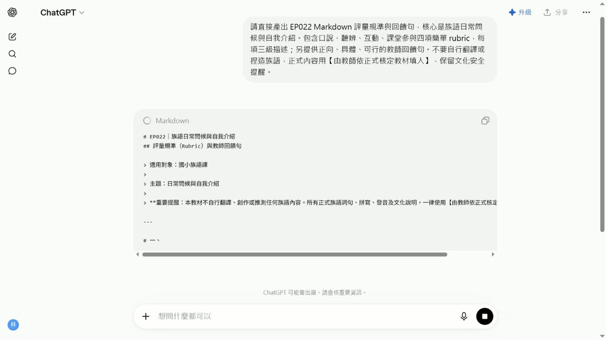

# EP022 講義：做評量規準與回饋句

<!-- handout-screenshot:auto -->
## 講義截圖

> 圖說：EP022 本集操作畫面截圖，協助老師對照影片步驟與講義內容。
<!-- /handout-screenshot:auto -->

## 今天只做一件事

老師能產生口說、聽力或作業的簡單評量規準。

## 你會學到

老師能理解「做評量規準與回饋句」在族語備課流程中的用途，並能用 ChatGPT 或相關工具完成第一版成果。

## 需要準備

- 一個你真的要拿來上課的小主題。
- 學生程度、上課時間或班級狀況。
- 可以替換成自己族語內容的詞句、例子或教材片段。

## 步驟 1：先把任務縮小

不要一開始就請 AI 做整套教材。先用一句話說清楚你今天要完成什麼，例如：「我想做一份可以讓初學者練習的課堂材料」。

> 這集要完成「做評量規準與回饋句」。照著畫面做，最後留下可以直接修改、保存或交接的成果。

## 步驟 2：把提示詞貼進 ChatGPT

可以直接從這段開始改：

> 我想做「做評量規準與回饋句」。對象是族語老師，請幫我完成一個明天就能使用的成果。請包含：準備資料、操作步驟、完成品、課堂用法、老師要內容核對的地方。

## 步驟 3：看 AI 給的第一版

你要先確認它是不是有產出這些東西：

- 有沒有清楚對應今天的課堂任務。
- 有沒有把作答方式、老師提醒或檢查重點寫出來。
- 有沒有標出哪些內容需要老師替換或修正。

這集期待的 AI 產出是：一份可檢查、可修改、可保存的第一版成果，包含清楚步驟、完成品草稿與內容核對點。

## 步驟 4：老師最後把關

- 成果是否真的能放進備課或課堂。
- 是否太多功能塞在同一集。
- 是否需要補真實截圖、來源或文化審查。
- 是否有任何 AI 杜撰、假畫面、錯誤族語或錯誤文化內容。

## 影片流程速記

- 1. EP022｜本集任務
- 2. 為什麼這集值得學
- 3. 老師先準備什麼
- 4. 打開工具
- 5. 輸入本集任務
- 6. 檢查第一版

## 今日金句

> 不要為了學功能而學功能。先問：這個成果明天能不能拿去備課或上課？能用，才值得教。

## 下一步

把這份草稿改成你自己班上能用的版本，再存成下次備課可以重複使用的模板。
