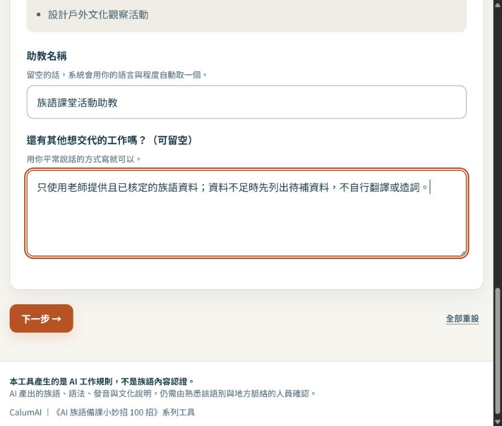
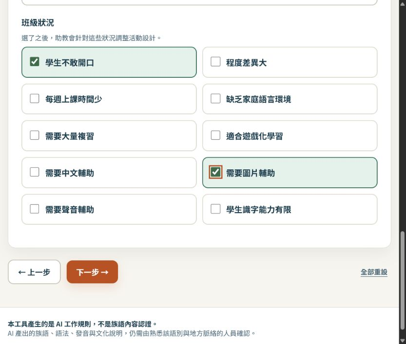
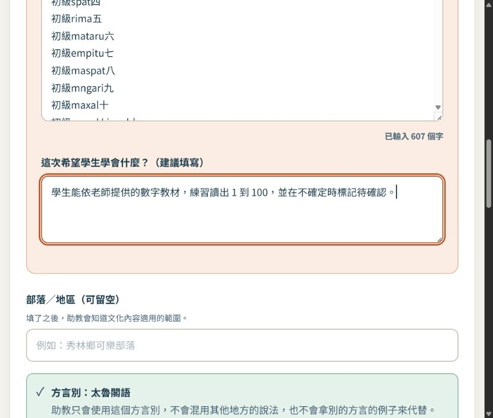
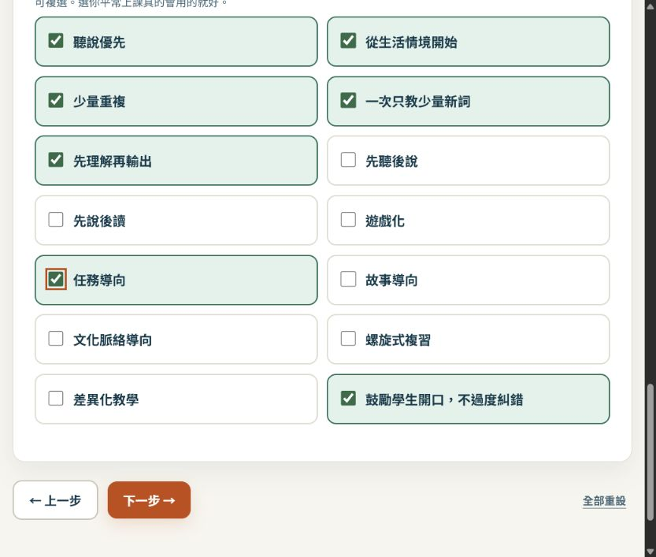
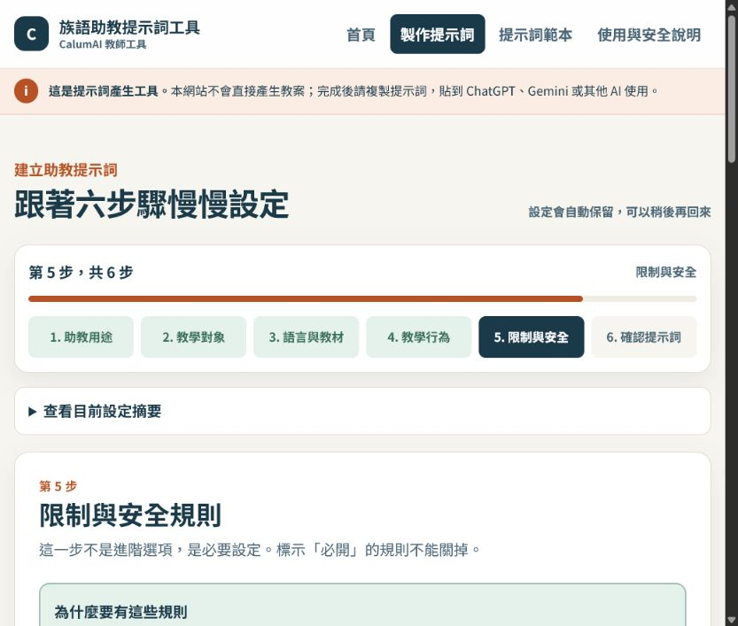

# EP024｜用族語教學提示詞助教產生提示詞

## 今天只做一件事

今天不請 AI 直接寫教案。

我們先使用「族語教學提示詞助教」，把老師的教學需求整理成一份完整提示詞。完成後，再把這份提示詞複製到 ChatGPT、Gemini 或其他 AI 使用。

這個網站的工作是整理規則，不是替老師判定族語正不正確，也不是直接產生教材。

工具網址：

[開啟族語教學提示詞助教](/tools/prompt-builder/)

## 今天做完會拿到什麼

- 一份可以複製的族語教學助教提示詞。
- 一組學生程度、語言資料與教材來源設定。
- 一套不自行造詞、不混用方言的工作規則。
- 一份可以貼到 ChatGPT 或 Gemini 測試的完整指令。

## 開始前先準備

先準備一個小任務，不要一開始就做整學期。例如：

| 要準備的資料 | 示範寫法 |
|---|---|
| 這次要做什麼 | 設計國小族語課的五分鐘暖身活動 |
| 學生是誰 | 國小初學者 |
| 族語資料 | 老師提供且已核定的詞彙表或課文 |
| 學生要學會什麼 | 依教材練習數字或問候，不自行新增詞句 |

畫面中的示範資料只是操作示範。正式使用時，請換成自己的語別、方言別和核定教材。

---

## STEP 1｜選擇助教用途

打開網站後，選擇最接近今天任務的用途。今天示範選：

**族語課堂活動助教。**

這代表之後的提示詞會要求 AI 協助整理課堂活動，而不是直接替老師創作族語內容。



### 填寫方式

1. 選擇「族語課堂活動助教」。
2. 助教名稱可以寫成「族語課堂活動助教」。
3. 在補充欄寫下固定要求，例如：

```text
只使用老師提供且已核定的族語資料；資料不足時先列出待補資料，不自行翻譯或造詞。
```

4. 按「下一步」。

### 做完這一步，請確認

- 用途是課堂活動，而不是另一種不相關的助教。
- 你知道這個網站是在建立提示詞。
- 你沒有把真實學生個資貼進去。

---

## STEP 2｜設定學生對象

這一步會影響活動長度、文字難度和中文輔助方式。

今天的示範設定：

- 學生：國小低年級、國小中年級。
- 程度：初學。
- 每堂課：40 分鐘。
- 班級狀況：學生不敢開口，需要圖片輔助。



### 填寫方式

1. 勾選學生年齡，可複選混齡班。
2. 選擇族語程度。
3. 填寫一堂課大約有幾分鐘；不確定可以先留空。
4. 勾選會影響活動設計的班級狀況。
5. 按「下一步」。

不要只寫「學生」。年齡和程度越清楚，後面的活動越不容易超出學生能力。

---

## STEP 3｜選擇語言與教材來源

這一步最重要。方言別沒有確認以前，不要讓 AI 自己猜。

### 先填語言資料

依畫面選擇：

- 族語。
- 方言別。
- 使用的文字系統。
- 中文輔助程度。

### 再貼教材

把老師自己的課文、詞彙表或句型貼進教材欄位。示範時可以使用老師已核定的數字教材，但正式上課前仍要再核對一次。



### 教材來源怎麼選

只勾選這次真的會使用的來源，例如：

- 老師貼上的教材。
- 老師提供的單字表。
- 官方教材。
- 部落自編教材。

沒有提供的資料不要勾選。資料不足時，選擇「不提供固定教材」，讓助教只整理活動架構，不產生族語內容。

### 做完這一步，請確認

- 族語和方言別選對。
- 教材是老師提供或正式核定的資料。
- 不確定的詞句沒有要求 AI 自己補。

---

## STEP 4｜設定助教的工作方式

這一步是在告訴助教怎麼工作，不是在增加更多族語資料。

今天可以選：

- 耐心的族語教學助教。
- 先詢問，再產生內容。
- 一次只完成一項任務。
- 使用簡單中文。
- 優先使用可以直接帶進教室的格式。
- 每次附上教學目標、時間和材料清單。
- 先理解再輸出。



### 為什麼要選「一次只完成一項任務」

如果一次要求 AI 同時設計課程、翻譯、出題、做圖卡，最後很難知道是哪一段出錯。先讓它完成一件小事，比較容易檢查和修改。

---

## STEP 5｜確認限制與安全規則

這些不是裝飾，而是提示詞裡的必要規則。畫面中的「必開」項目不能關閉。

至少要確認：

- 不確定的族語內容不得假裝正確。
- 不得混用不同方言別。
- 不得自行創造不存在的詞彙。
- 沒有可靠依據時，要標示待老師確認。
- 老師教材優先於 AI 既有知識。
- 不得擅自修正老師提供的族語文字。
- 不把不同族群的文化混合描述。
- 不把神聖或限制公開的文化內容當成一般素材。
- AI 不是族語正確性的最後裁判。



### 這一步要記住

提示詞可以要求 AI 遇到不確定內容先停下來，但不能取代族語老師、語言使用者或文化知識提供者的確認。

---

## STEP 6｜選擇輸出欄位並產生提示詞

最後選擇每次回答要包含什麼。今天示範可勾選：

- 教學目標。
- 教材重點。
- 課程流程。
- 老師說明。
- 學生活動。
- 時間與材料。
- 評量。
- 教師版與學生版。
- 關鍵詞、中文提示、內容來源和文化提醒。
- 待確認內容。

再按「產生可複製的提示詞」。


產生結果後：

1. 複製「可直接使用版」。
2. 開啟 ChatGPT 或 Gemini 的新對話。
3. 貼上完整提示詞。
4. 再貼上今天真正要使用的教材。
5. 送出後，檢查 AI 是否遵守剛才設定的規則。

---

## 可直接測試的開場白

這段可以貼在完整提示詞後面。族語教材請換成老師已核定的版本。

```text
請先閱讀我提供的族語教材，再設計一個適合國小初學者的五分鐘課堂暖身活動。

請依序輸出：
1. 教學目標
2. 教材中真正出現的重點
3. 老師準備的材料
4. 課堂操作流程
5. 學生要做的事情
6. 還需要老師確認的內容

族語詞句、拼寫、發音、方言別與文化內容只能使用我提供的資料。
沒有資料的地方請標示【待老師補充核定資料】，不要自行翻譯、造詞或補寫。
```

## 貼到 AI 後怎麼測試

先不要問太大的問題，可以用三個小測試：

1. 「請先列出你需要我補充的資料，不要自行產生族語詞句。」
2. 「請只根據我貼上的教材整理活動，不要增加新的族語內容。」
3. 「請把活動改成國小初學者可以在 5 分鐘完成的版本。」

如果 AI 開始自行翻譯、造詞或混用方言，先不要使用結果，回頭檢查提示詞與教材來源。

## 這個網站不會幫你做什麼

- 不會保證 AI 產出的族語一定正確。
- 不會替老師決定文化內容能不能公開。
- 不會把沒有提供的資料變成正式教材。
- 不會直接產生學生可以使用的完整教案。

它的用途是：**把老師的需求和工作規則整理好，方便交給其他 AI 使用。**

## 完成前最後檢查

- 我選對助教用途。
- 我填了學生年齡與族語程度。
- 我確認了族語與方言別。
- 我貼的是老師提供或正式核定的教材。
- 我開啟了不造詞、不混方言和待確認規則。
- 我選好了輸出欄位。
- 我已複製完整提示詞。
- 我已在 ChatGPT 或 Gemini 用小問題測試一次。
- 沒有把學生個資或不可公開資料貼進工具。

## 今天記住一句話就好

**先把助教規則建立好，再把已核定的教材交給 AI；沒有資料的地方，讓它停下來問。**
