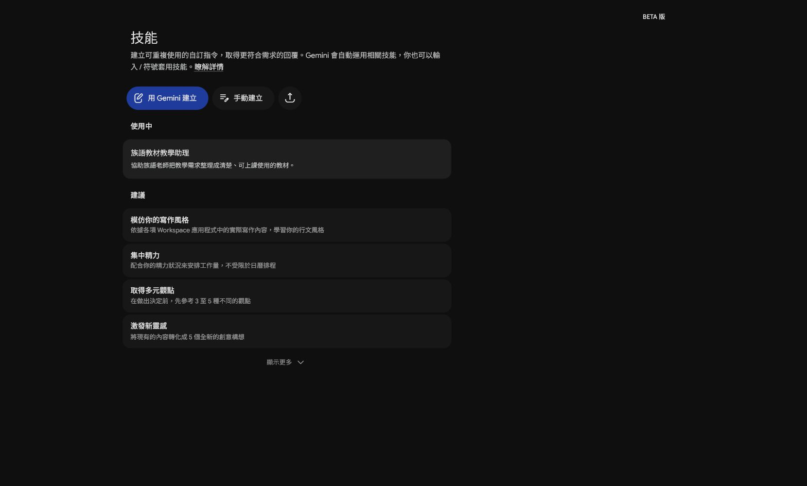
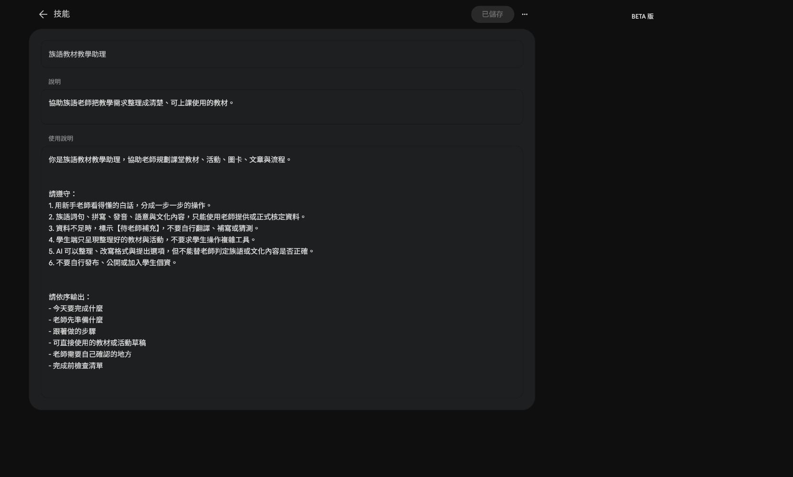
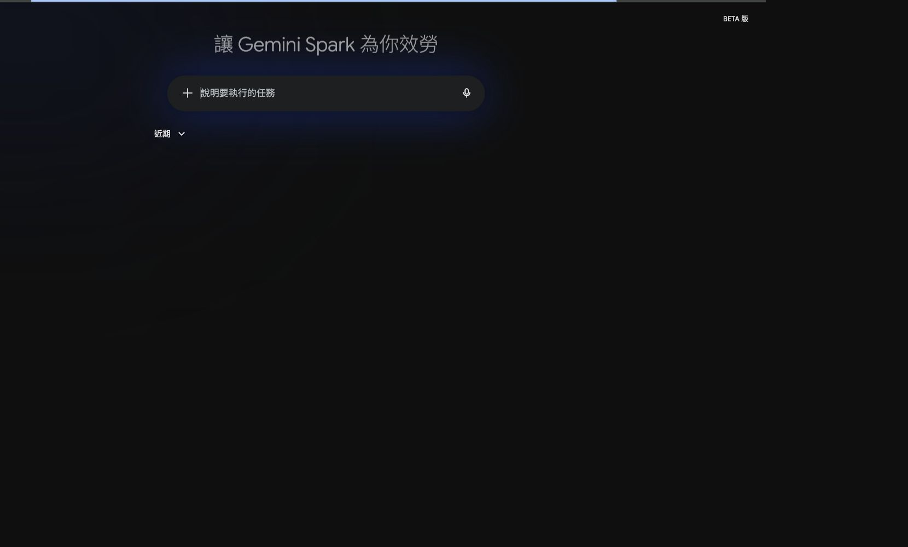

# EP025｜認識 Gemini Spark：先分清楚技能、工作與排程

## 今天只做一件事

這一集先不急著做大型自動化。

我們先打開 Gemini Spark，認識三個會反覆用到的區域：

1. **技能**：把固定的做事方式保存起來。
2. **工作**：交代一件需要執行的任務。
3. **排程**：讓重複工作在指定時間執行。

看懂這三個區域後，你才知道下一個備課需求應該放在哪裡。

> 本集畫面依目前 Spark 介面整理。按鈕名稱和位置之後可能調整；如果畫面不同，先找相同功能名稱，不要硬照座標點擊。

## 今天做完會得到什麼？

- 一張「我的備課需求要放哪裡」判斷卡
- 一段可以貼到 Spark 工作裡的測試文字
- 一次實際查看 Skills、Tasks 的操作經驗

本集只用示範檔名，不連接學生資料，也不要求 Spark 自動發布內容。

---

## 步驟 1｜進入 Spark 的技能頁

1. 打開 Gemini。
2. 進入 Spark 工作區。
3. 在左側導覽找到「技能」。
4. 確認頁面標題是「技能」，並看到「用 Gemini 建立」或「手動建立」等入口。



### 先看懂這個畫面

這裡不是一般聊天記錄，而是保存「以後還會重複使用的做法」。

例如：每次整理族語教材時，都用相同欄位輸出，這種需求才適合整理成技能。

---

## 步驟 2｜打開一個技能，看懂兩個欄位

在「使用中」找到「族語教材教學助理」，點開它。



請依序看兩個地方：

1. **說明**：用一句話說明這個技能是做什麼的。
2. **使用說明**：寫清楚 AI 應該怎麼整理、哪些資料不能自行補上，以及最後要輸出什麼。

這裡的重點不是背設定畫面，而是知道：

**固定規則放在技能裡，這次要做的事情放在工作裡。**

### 可以先記下這個判斷

- 同一種整理方式會一直用：考慮放進「技能」。
- 只是今天要整理一次：先不要建立技能。
- 需要特定時間重複做：再看「排程」。

---

## 步驟 3｜打開「工作」，先看輸入位置

1. 從左側導覽點「工作」或「任務」入口。
2. 找到可以輸入「說明要執行的任務」的欄位。
3. 先不要連接 Drive、Gmail 或其他應用程式。
4. 這一集只用三個假檔名測試。



### 可直接貼上的最小測試

```text
請建立一個教材整理測試。

請只整理下面三個示範檔名，並用表格列出「檔案名稱」與「可能用途」：
- EP001_問候語教材.docx
- EP001_問候語圖片.png
- EP001_課堂流程草稿.md

限制：
- 只處理這三個檔名。
- 不連接外部資料。
- 不寄出訊息。
- 不修改或發布檔案。
- 不自行新增族語內容。
```

送出前，先確認文字中沒有真實學生姓名、電話、Email 或未公開教材。

---

## 步驟 4｜用三個問題選對地方

把你的備課需求拿來問：

| 問題 | 如果答案是「是」 | 優先查看 |
|---|---|---|
| 這件事只需要做一次嗎？ | 是 | 一般對話或一次性的工作 |
| 之後會用同一套規則一直做嗎？ | 是 | 技能 |
| 需要在固定時間重複執行嗎？ | 是 | 排程 |

不要因為看到 Spark 就把所有工作都放進去。工具越複雜，越需要先把任務說小。

### 我的判斷卡

```text
我的備課工作：

它只做一次嗎？ □ 是 □ 否
它會一直用同一種格式嗎？ □ 是 □ 否
它需要固定時間執行嗎？ □ 是 □ 否

我先放到：□ 一般對話 □ 技能 □ 工作 □ 排程
```

---

## 這一集先不要做的事

- 不要先連接含有學生資料的 Drive。
- 不要授權 Gmail 後就讓 AI 寄信。
- 不要把一次性的問題硬做成長期技能。
- 不要把 Spark 的畫面當成每個帳號都一定相同。

如果你的畫面沒有 Spark，先保留「看不到入口」的畫面與帳號類型，下一集再處理可用性檢查。

## 完成前檢查

- 我知道「技能」是保存固定做法的地方。
- 我知道「工作」是交代這一次要執行的任務。
- 我知道「排程」是處理重複時間的工作。
- 我用假檔名完成最小測試。
- 我沒有連接或公開學生資料。
- 我保存了自己的判斷卡。

## 今天記住一句話就好

**先判斷工作型態，再決定要放進技能、工作或排程。**

**下一篇｜EP026 檢查 Spark 是否能用與帳號限制**
