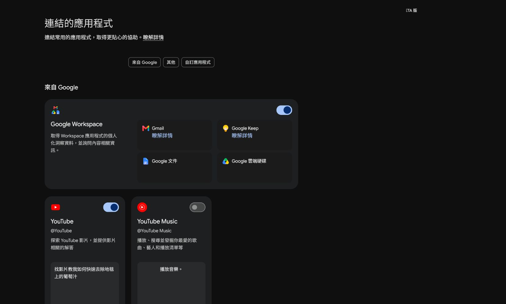
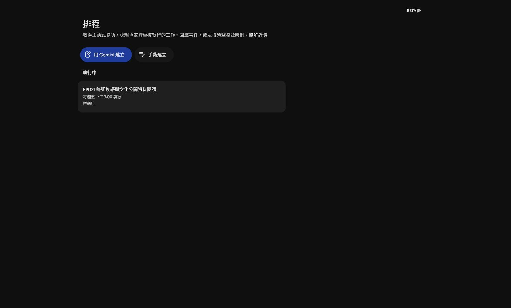

# EP026｜檢查 Gemini Spark 是否能用：先看帳號與權限

## 今天只做一件事

今天先不做完整自動化，也不急著授權所有應用程式。

我們要完成一張「Spark 可用性檢查卡」，確認：

1. 目前帳號看不看得到 Spark。
2. 能不能看到技能、工作與排程入口。
3. 哪些應用程式已連結，哪些還沒有。
4. 如果功能不見了，下一步要記錄什麼。

Spark 會受到帳號類型、管理設定、地區、版本與功能開放狀態影響。畫面不同，不代表老師做錯了。

---

## 步驟 1｜先確認目前登入的是哪個帳號

1. 打開 Gemini。
2. 進入 Spark。
3. 先確認右上角目前使用的 Google 帳號。
4. 只記錄「個人帳號、學校帳號或機構帳號」，不要把完整 Email 貼進公開教材。

接著進入左側「技能」。如果頁面上看到「技能」標題與建立入口，代表這個帳號目前至少看得到 Spark 的技能區域。


### 請填寫

```text
測試日期：
帳號類型：□ 個人 □ 學校 □ 機構 □ 不確定
看得到 Spark：□ 是 □ 否
看得到「技能」：□ 是 □ 否
畫面異常或錯誤訊息：
```

---

## 步驟 2｜檢查「連結的應用程式」，不要急著開權限

1. 從左側導覽點「連結的應用程式」。
2. 先看有哪些應用程式卡片。
3. 看清楚哪些開關目前已開啟，哪些仍然關閉。
4. 只截圖功能狀態，不要截學生資料或私人文件內容。



這個畫面能幫你回答：

- Spark 是否看得到 Google Workspace？
- Gmail、Google 文件、Google 雲端硬碟是否列在可連結項目裡？
- YouTube 或其他應用程式是否已經開啟？

本集只做「看懂狀態」，不因為看到開關就全部打開。授權前要先知道 AI 會讀取或處理什麼資料。

---

## 步驟 3｜檢查排程頁面是否可進入

1. 回到左側導覽。
2. 點「排程」。
3. 確認是否看得到「用 Gemini 建立」或「手動建立」入口。
4. 如果畫面列出既有排程，只閱讀名稱與執行狀態，不要修改別人的排程。



排程頁面看得到，不代表你現在就要建立排程。第一次測試仍然建議先用一次性的工作，確認內容正確後，再考慮重複執行。

---

## 步驟 4｜建立最小測試，確認不是只看得到入口

如果你看得到「工作」入口，請先使用三個假檔名測試：

```text
請建立一個測試工作。

任務名稱：教材整理測試
任務內容：把下面三個示範檔名整理成清單，並標出可能用途。

示範檔名：
- EP001_問候語教材.docx
- EP001_問候語圖片.png
- EP001_課堂流程草稿.md

限制：
- 只整理這三個檔名。
- 不連接外部資料。
- 不寄出訊息。
- 不修改、不發布任何檔案。
```

送出後檢查：

- 是否成功建立工作？
- 是否只整理三個檔名？
- 是否出現需要授權的提示？
- 是否出現帳號或權限錯誤？

如果測試失敗，把錯誤文字和畫面記下來，不要先猜原因。

---

## 如果你的畫面沒有 Spark

請照這個順序處理：

1. 記下帳號類型。
2. 記下使用的裝置與瀏覽器。
3. 截下目前功能選單。
4. 記下看得到的功能與看不到的功能。
5. 把錯誤訊息完整保留。

可複製的回報文字：

```text
我目前在這個帳號看不到 Gemini Spark 的＿＿＿＿入口。

已確認：
- 帳號類型：＿＿＿＿
- 裝置與瀏覽器：＿＿＿＿
- 看得到的功能：＿＿＿＿
- 看不到的功能：＿＿＿＿
- 畫面上的錯誤訊息：＿＿＿＿

請協助確認這是功能尚未開放、帳號方案、管理設定或其他原因。
```

在問題釐清前，可以先用 Gemini 一般對話或已核准的技能完成本週教材整理，不要把帳號限制當成操作失敗。

## 完成前檢查

- 我已記錄帳號類型，但沒有把完整 Email 放進公開講義。
- 我知道自己看得到哪些 Spark 入口。
- 我看過連結應用程式的狀態，沒有任意開啟權限。
- 我看過排程頁面，但沒有修改既有排程。
- 我用假檔名做過最小測試。
- 如果功能不可用，我保存了畫面與錯誤訊息。

## 今天記住一句話就好

**先確認帳號能做什麼，再決定要不要授權與建立自動化。**

**下一篇｜EP027 建立第一個 Spark 技能**
