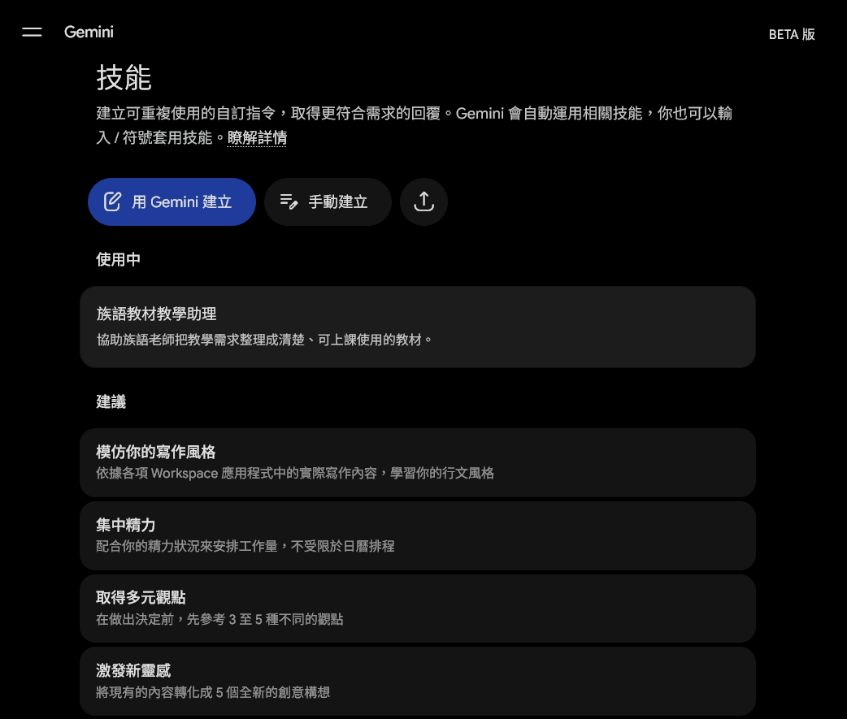
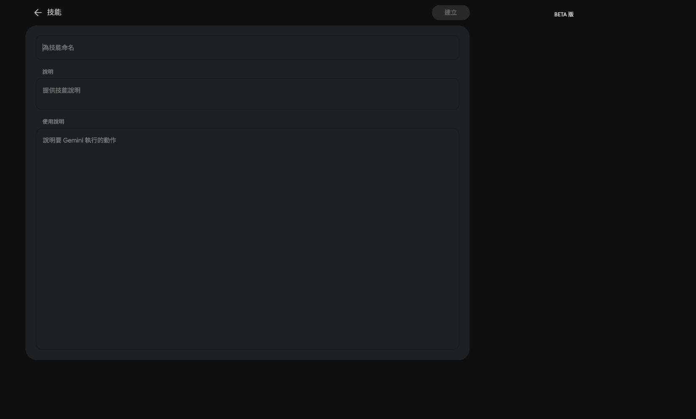
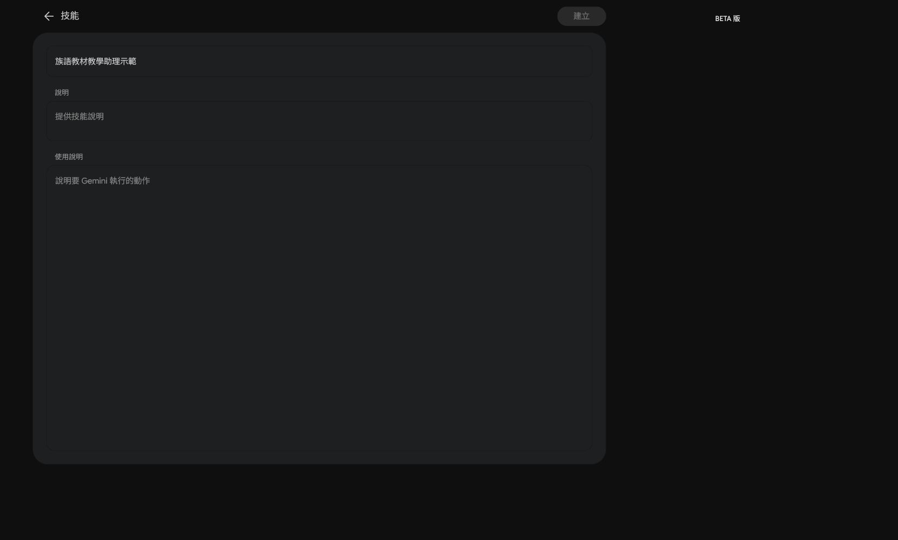
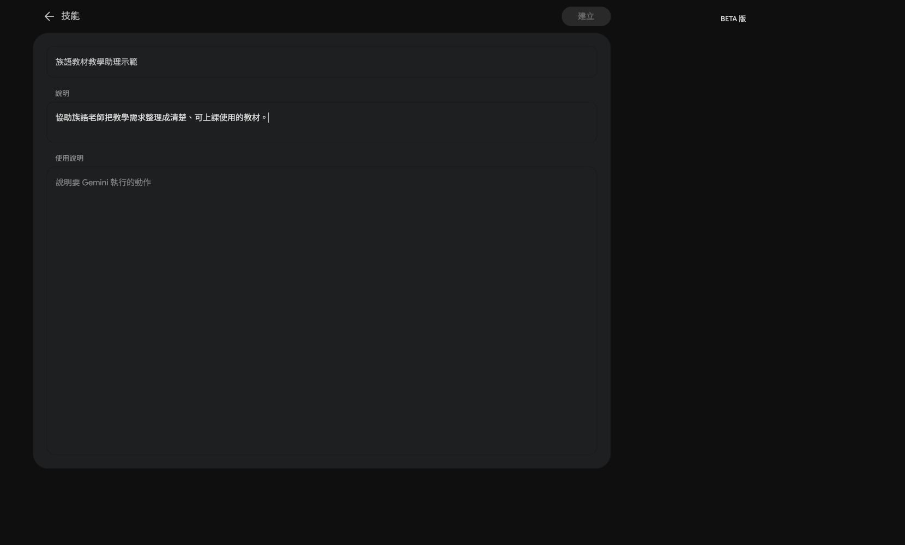
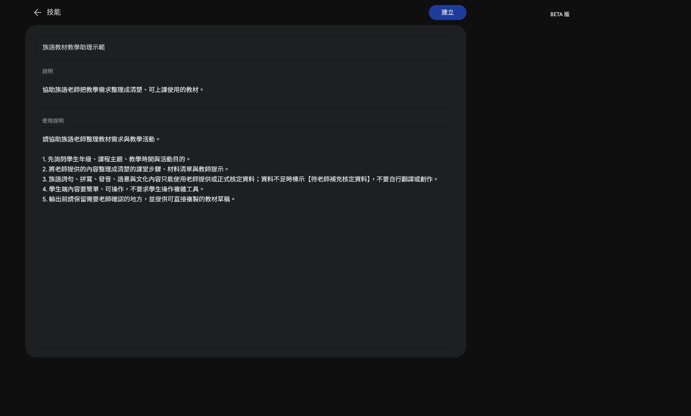
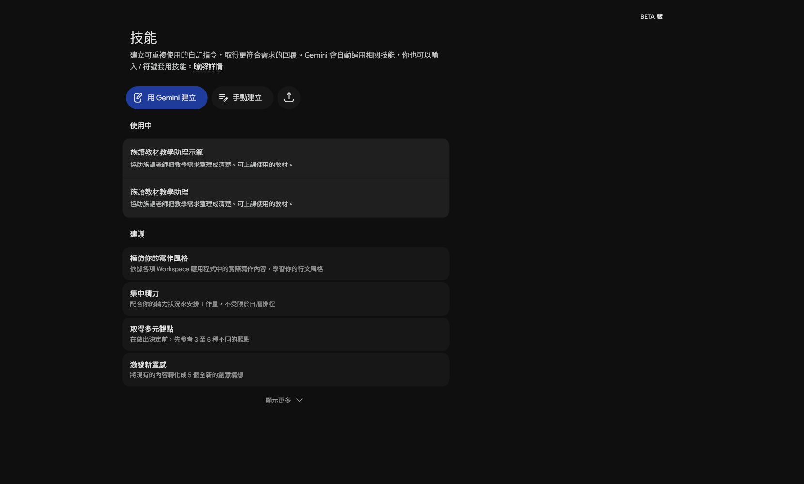

# EP027｜用 Spark 建立族語教材教學助理

## 今天只做一件事

這一集要在 Gemini Spark 裡建立一個自己的 Skill。

Skill 可以先記住一套固定工作方式。之後老師要整理教材時，就不用每次重新貼一大段規則。

今天做完，你會有：

- 一個可以重複使用的 Skill
- 一段可以直接貼上的使用說明
- 一個能提醒 AI「只能整理，不能自行補族語內容」的工作規則

## 先準備

- 已登入 Gemini 的帳號。
- 一個不含學生個資的教材小例子。
- 下面三段可複製文字：名稱、說明、使用說明。

> 這一集只建立 Skill，不上傳學生資料，也不要求 AI 自行翻譯族語。

## STEP 1｜進入 Spark 的「技能」頁

打開 Gemini，進入 Spark 的「技能」頁。你應該會看到「用 Gemini 建立」、「手動建立」和「上傳技能」等按鈕。


> 圖說：先確認目前是在 Spark 的「技能」工作區，再開始建立 Skill。

如果你的畫面沒有「技能」，先不要照著猜。先確認帳號、功能是否開放，並把目前畫面記錄下來。

## STEP 2｜選擇「手動建立」

按下「手動建立」。畫面會出現三個主要欄位：

1. 技能名稱
2. 技能說明
3. 使用說明


> 圖說：先看懂三個欄位的位置，不需要先研究程式碼。

## STEP 3｜填入技能名稱

名稱要讓自己一眼看懂用途。這次輸入：

```text
族語教材教學助理
```


> 圖說：名稱先寫清楚用途，之後在技能清單裡才找得到。

如果畫面提醒名稱已經存在，可以保留原本的 Skill，不要重複建立；本集示範畫面使用「族語教材教學助理（示範）」避免覆蓋既有技能。

## STEP 4｜填入技能說明

在「技能說明」欄位貼上：

```text
協助族語老師把教學需求整理成清楚、可上課使用的教材。
```


> 圖說：說明欄位回答「這個 Skill 是拿來做什麼的」。

## STEP 5｜填入使用說明

在「使用說明」欄位貼上下面文字。這裡是本集最重要的部分，請不要只貼一句「幫我做教材」。

```text
1. 使用新手看得懂的白話，分步驟整理。
2. 族語文字、拼寫、發音、語意與文化內容，只使用老師提供或正式資料。
3. 資料不足時標示【待老師補充】，不要自行翻譯或創作。
4. AI 可以整理、排版與列出選項，但不能替老師判定正確性。
5. 不要處理學生個資，也不要替老師發布或分享。

每次輸出請包含：
- 今天要完成什麼
- 老師先準備什麼
- 跟著做的步驟
- 可直接使用的教材或活動草稿
- 老師需要自己確認的地方
- 完成前檢查清單
```


> 圖說：使用說明要同時寫工作方式、不能自行補資料的限制，以及固定輸出順序。

## STEP 6｜保存後確認 Skill 出現在「使用中」

填完後按右上角的「建立」。建立完成後，回到技能清單，確認看得到：

- 「使用中」區塊
- 「族語教材教學助理」Skill
- 清楚的用途說明


> 圖說：看到 Skill 出現在「使用中」，才算完成建立；只填完表單還不算完成。

## 建立後，用小資料測試一次

先不要拿整套課程測試。請貼一小段已核准的教材資料，例如：

```text
請用「族語教材教學助理」整理下面的教材小段落。

主題：日常問候
教材內容：
【貼上老師已核對的文字】

請輸出：
1. 今天要完成什麼
2. 一個簡單的課堂活動
3. 需要老師補資料的地方
4. 完成前檢查清單
```

測試時只看三件事：

1. 有沒有照固定順序輸出。
2. 資料不足時有沒有標示【待老師補充】。
3. 有沒有自行翻譯、創作族語或替老師判定文化正確性。

如果出現自行補寫的族語內容，不要直接拿去上課。先回到使用說明，把規則寫得更清楚，再用同一段小資料測試。

## 這個 Skill 可以拿來做什麼

- 把老師提供的教材整理成講義步驟。
- 把課堂活動整理成可執行流程。
- 把缺少的資料列成「待補」清單。
- 先產生通知、圖卡或活動的草稿。

它負責整理與排版，不負責替老師判定族語、發音、文化內容或發布權限。

## 完成前檢查

- [ ] 已進入 Spark 的「技能」頁。
- [ ] 已看懂「技能名稱、技能說明、使用說明」三個欄位。
- [ ] Skill 名稱一看就知道用途。
- [ ] 使用說明有寫出固定輸出順序。
- [ ] 使用說明有寫「資料不足時標示【待老師補充】」。
- [ ] 使用說明有寫 AI 不可自行翻譯或判定文化內容。
- [ ] 已建立後回到「使用中」確認 Skill 存在。
- [ ] 已用不含個資的小資料測試一次。
- [ ] 沒有把 AI 的族語猜測直接放進教材。

## 今天記住一句話就好

**先把工作規則存進 Skill，再讓 AI 幫你整理教材；正確性仍由老師確認。**
