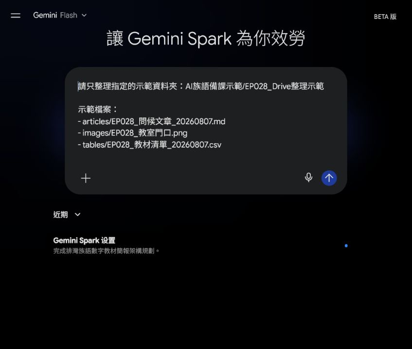
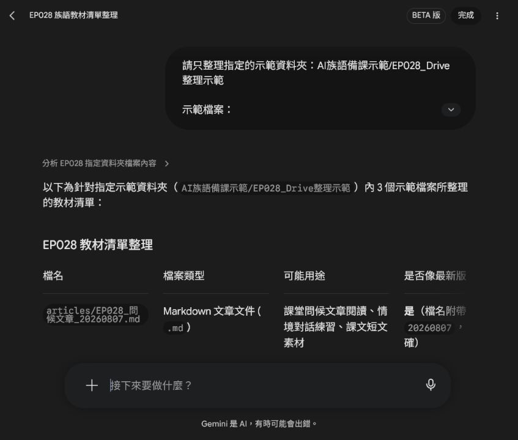
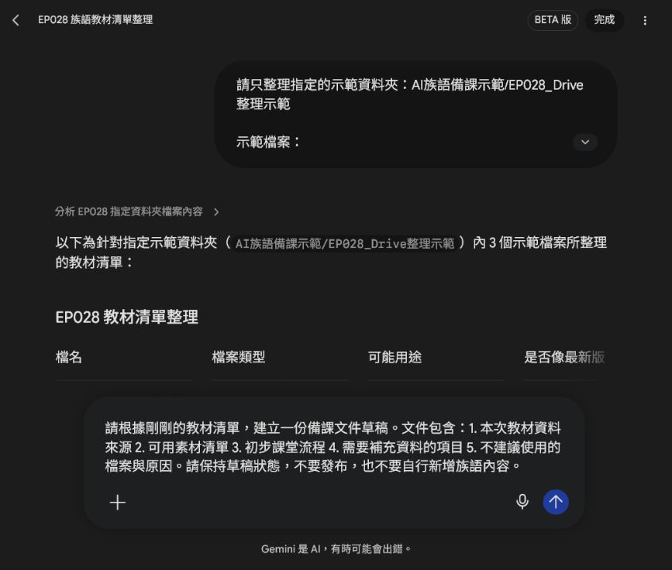
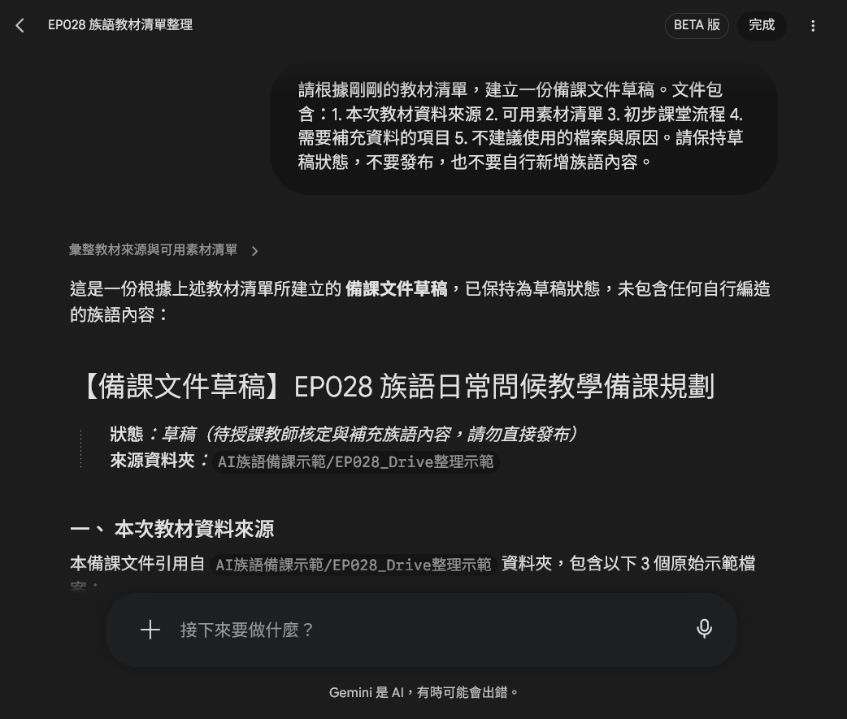
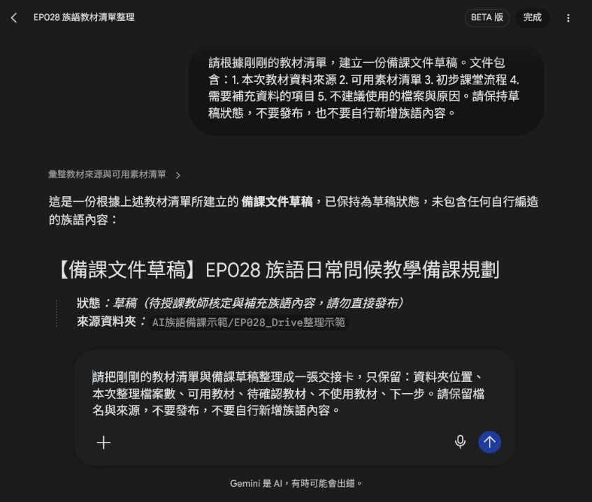
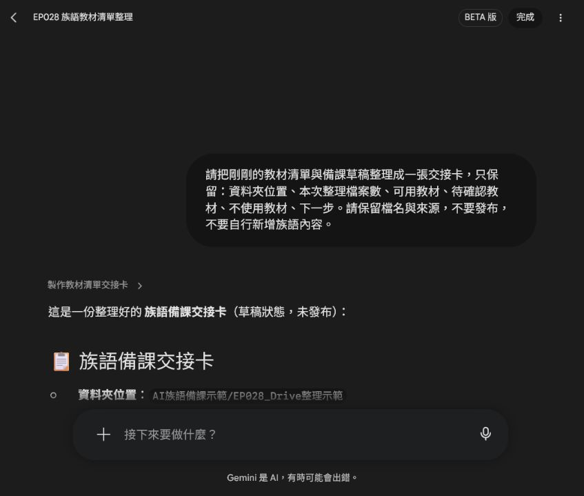

# EP028｜用 Spark 整理 Drive 與教學文件

## 今天只做一件事

這一集要把分散在雲端資料夾裡的文章、圖片和表格，整理成一份老師看得懂的教材清單，再整理成備課草稿與交接卡。

今天先使用「示範檔名」練習，不直接處理學生資料，也不讓 Spark 自己修改或發布檔案。

完成後會得到：

- 一份有來源的教材清單。
- 一份保持草稿狀態的備課文件草稿。
- 一張可以交給下一位工作者的交接卡。

## 先準備

- 一個指定的 Drive 資料夾，不要一開始就開放整個雲端硬碟。
- 3 到 5 個示範檔案：文章、圖片、表格都可以。
- 檔名規則，例如 `EP028_主題_用途_日期`。
- 不含學生姓名、照片、電話或其他個資的測試資料。

本集截圖使用以下示範檔名，不代表你的 Drive 裡一定有完全相同的檔案：

```text
articles/EP028_問候文章_20260807.md
images/EP028_教室門口.png
tables/EP028_教材清單_20260807.csv
```

## STEP 1｜進入 Spark 的「工作」

打開 Spark，從側邊選單進入「工作」。你會看到「讓 Gemini Spark 為你效勞」的任務輸入區。


> 圖說：先進入 Spark 的「工作」，後面所有任務都從這個輸入區開始。

## STEP 2｜先說清楚資料夾範圍

不要只說「幫我整理雲端資料」。要先寫清楚 Spark 只能看哪個資料夾，以及要整理哪些欄位。

可直接複製：

```text
請只整理指定的示範資料夾：
AI族語備課示範/EP028_Drive整理示範

示範檔案：
- articles/EP028_問候文章_20260807.md
- images/EP028_教室門口.png
- tables/EP028_教材清單_20260807.csv

請輸出教材清單，欄位包含：
檔名、檔案類型、可能用途、是否像最新版本、需要老師確認的地方。

限制：
- 不要搜尋其他資料夾。
- 不要修改、移動或刪除檔案。
- 不要自行新增族語內容。
```


> 圖說：畫面中要看得到指定資料夾、檔案清單和「不要修改檔案」的限制。

如果你要整理真正的 Drive 資料，請把示範資料夾名稱換成老師已確認可以使用的資料夾，不要把整個雲端硬碟交給 AI 自己搜尋。

## STEP 3｜送出任務，先看教材清單

按下「傳送訊息」，等 Spark 回覆。第一輪只看它有沒有把檔名、類型、用途和待確認事項列出來。


> 圖說：教材清單要保留原始檔名，並把族語、版本與文化內容留給老師確認。

這一輪先不要急著叫 Spark 寫完整教案。清單的用途是先知道「有哪些資料、資料從哪裡來、哪些還不能直接用」。

## STEP 4｜請 Spark 產出備課草稿

看過清單後，再輸入下一個任務。這次仍然只產出草稿，不直接建立公開文件。

可直接複製：

```text
請根據剛剛的教材清單，建立一份備課文件草稿。

文件包含：
1. 本次教材資料來源
2. 可用素材清單
3. 初步課堂流程
4. 需要補充資料的項目
5. 不建議使用的檔案與原因

請保持草稿狀態，不要發布，也不要自行新增族語內容。
```


> 圖說：在送出前，先確認任務要求的是「草稿」，不是發布或覆蓋原始檔案。

## STEP 5｜檢查備課草稿

送出後，先看草稿開頭和來源段落。確認它有保留資料夾位置與原始檔名，也確認族語內容有標示待補，而不是 AI 自己補上去。


> 圖說：草稿要看得到來源、可用素材、課堂流程和【待老師補充】項目。

這份內容可以複製到 Docs 再由老師整理，但目前仍是草稿。正式放進教材前，要再核對來源、圖片授權、課程流程和族語資料。

## STEP 6｜把清單與草稿整理成交接卡

接著請 Spark 只保留交接需要的欄位：

```text
請把剛剛的教材清單與備課草稿整理成一張交接卡，只保留：
資料夾位置、本次整理檔案數、可用教材、待確認教材、不使用教材、下一步。

請保留檔名與來源，不要發布，不要自行新增族語內容。
```


> 圖說：交接卡要保留檔名、來源與下一步，不要只剩一段沒有來源的摘要。

## STEP 7｜確認交接卡可以交給下一位工作者

送出後，確認交接卡至少有：

- 資料夾位置。
- 本次整理檔案數。
- 可用教材與來源。
- 待確認教材。
- 不使用教材與原因。
- 下一步由誰確認或補充。


> 圖說：交接卡的重點是讓下一位工作者不用重新猜資料從哪裡來、還缺什麼。

## 如果 Spark 找到太多資料

先不要繼續往下做。把資料夾範圍縮小，只留下這一集要用的示範資料，再重新測試。

## 如果結果只有摘要，沒有檔名

補一句：

```text
請保留每一個原始檔名與相對路徑，不要只輸出摘要。
```

## 如果草稿出現 AI 自行補寫的族語

那段不能直接使用。請刪掉猜測內容，回到正式資料核對；必要時在任務裡寫明「資料不足請標示【待老師補充】」。

## 完成前檢查

- [ ] Spark 只處理指定資料夾。
- [ ] 任務中有保留檔名與相對路徑。
- [ ] 沒有要求 Spark 移動、刪除或覆蓋原始檔。
- [ ] 教材清單有列出待確認事項。
- [ ] 備課草稿有保留來源與草稿狀態。
- [ ] 交接卡有可用教材、待確認教材、不使用教材與下一步。
- [ ] 族語、拼寫、發音與文化內容沒有交給 AI 自行判定。
- [ ] 截圖沒有露出私人帳號、學生個資或不公開資料。

## 今天記住一句話就好

**先限制資料範圍，再整理來源，最後才做草稿與交接卡。**
