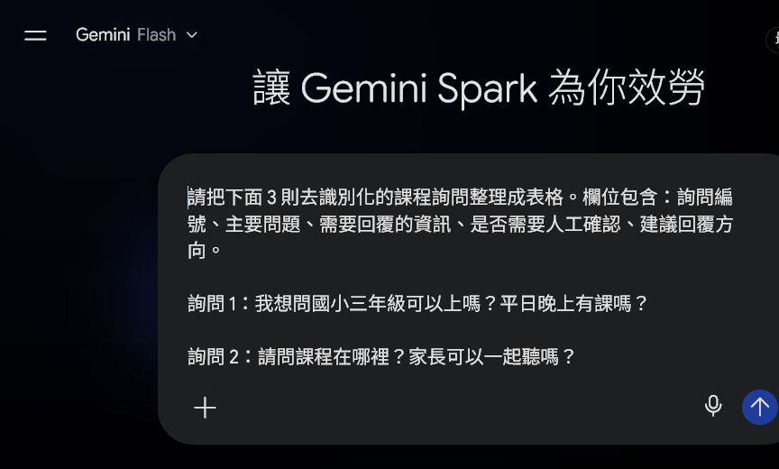
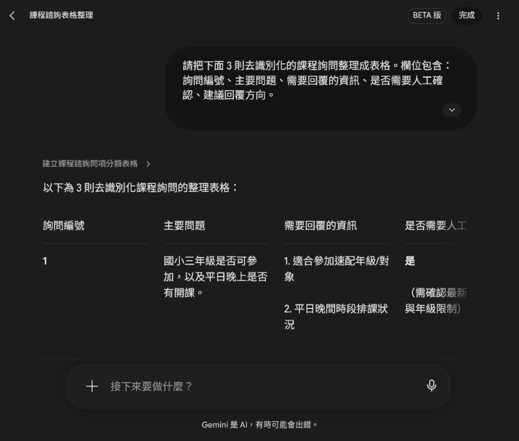
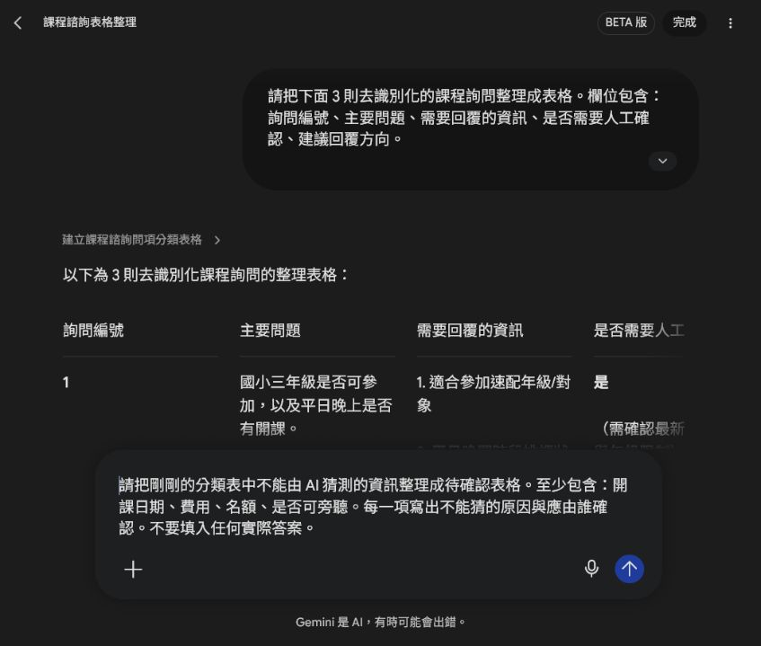
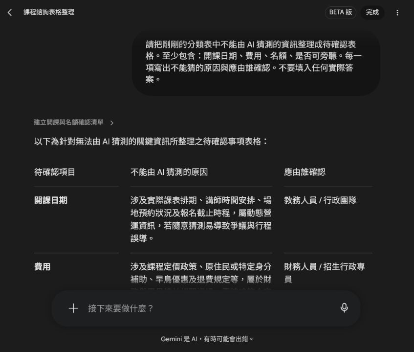
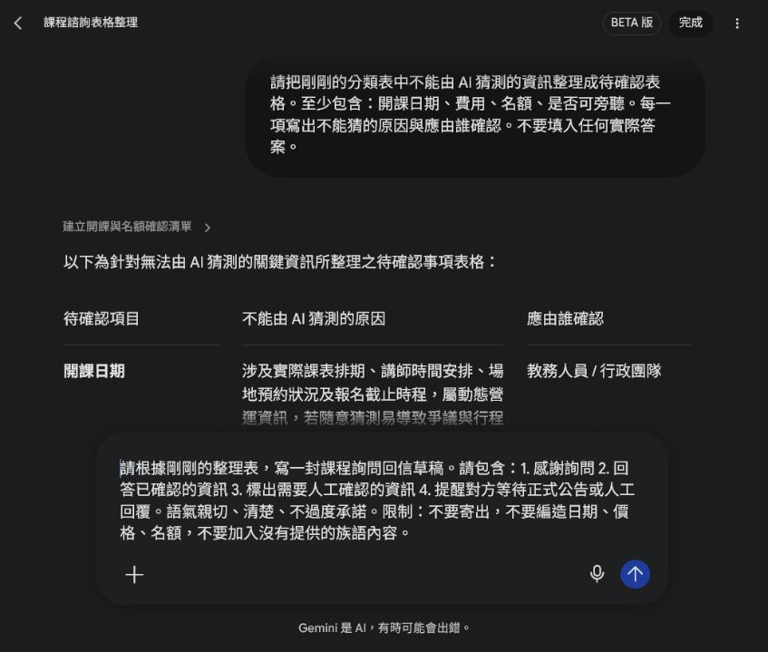
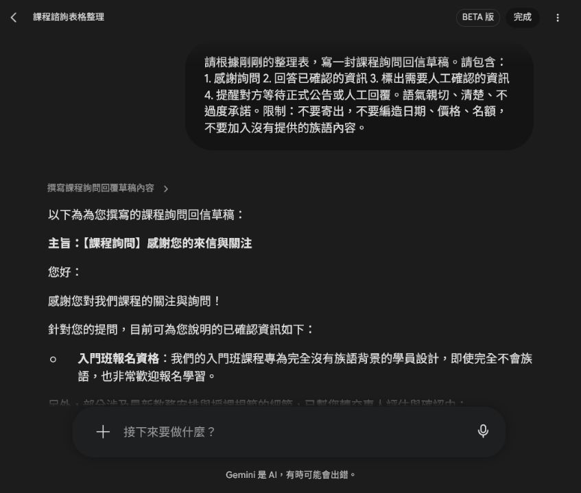
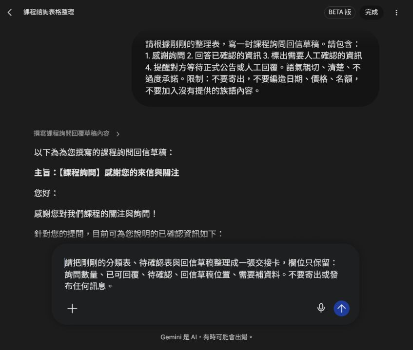
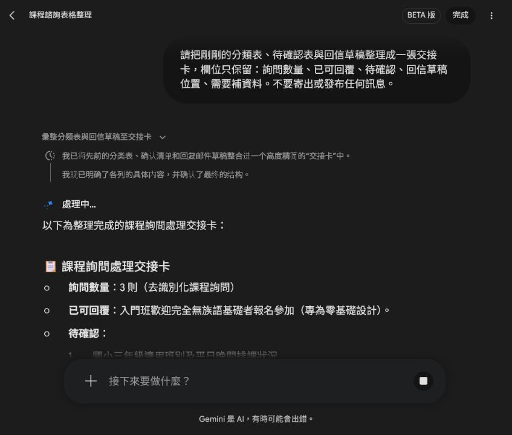

# EP029｜用 Spark 整理課程詢問與回信草稿

## 今天只做一件事

課程詢問一多，很容易漏掉問題，或不小心把還沒確認的日期、費用和名額寫出去。

這一集用三則去識別化的假詢問，練習一條比較穩的流程：

**先分類，再標出待確認資訊，最後才產出不會自動寄出的回信草稿。**

完成後會得到：

- 一份課程詢問分類表。
- 一份待確認資訊表。
- 一封保持草稿狀態的回信。
- 一張交接卡。

## 先準備

本集只使用假資料，不要貼真人姓名、電話、Email、報名編號或私人對話。

```text
詢問 1：
我想問國小三年級可以上嗎？平日晚上有課嗎？

詢問 2：
請問課程在哪裡？家長可以一起聽嗎？

詢問 3：
如果完全不會族語，可以報名入門班嗎？
```

## STEP 1｜把假詢問貼進 Spark

進入 Spark 的「工作」，把三則假詢問貼進任務欄位。先要求它整理，不要要求它直接回覆或寄信。


> 圖說：畫面只放假詢問，不放真人姓名、電話、Email 或其他可辨識資料。

## STEP 2｜請 Spark 產出分類表

可直接複製：

```text
請把下面 3 則去識別化的課程詢問整理成表格。

欄位包含：
1. 詢問編號
2. 主要問題
3. 需要回覆的資訊
4. 是否需要人工確認
5. 建議回覆方向

限制：
- 不要承諾名額、價格或開課日期。
- 不要寄出任何訊息。
- 不要自行新增族語內容。
```

送出後，先看表格欄位是否完整。


> 圖說：每一則詢問都要能回到「主要問題」和「需要人工確認」欄位。

## STEP 3｜把不能猜的資訊另外列出

日期、費用、名額和旁聽規則，不能讓 AI 用常識猜。請再輸入：

```text
請把剛剛的分類表中不能由 AI 猜測的資訊整理成待確認表格。

至少包含：
開課日期、費用、名額、是否可旁聽。

每一項寫出：
1. 不能猜的原因
2. 應由誰確認

不要填入任何實際答案。
```


> 圖說：這一步的要求是列出「要問誰」，不是讓 AI 自己填答案。


> 圖說：開課日期、費用、名額和旁聽規則都被保留為人工確認項目。

## STEP 4｜產出回信草稿，但不要寄出

分類表和待確認表都看過後，才請 Spark 寫回信草稿。

```text
請根據剛剛的整理表，寫一封課程詢問回信草稿。

請包含：
1. 感謝詢問
2. 回答已確認的資訊
3. 標出需要人工確認的資訊
4. 提醒對方等待正式公告或人工回覆

語氣：親切、清楚、不過度承諾。

限制：
- 不要寄出。
- 不要編造日期、價格或名額。
- 不要加入沒有提供的族語內容。
```


> 圖說：提示文字中要明確寫出「不要寄出」和「不要編造日期、價格、名額」。


> 圖說：草稿可以先回答已確認的內容，其他內容要標示待專人確認。

這封信目前只是草稿。承辦人要先核對內容，再決定是否使用任何文字；Spark 不會替你完成寄信核准。

## STEP 5｜整理成回信草稿交接卡

最後請 Spark 把前面的結果整理成一張交接卡：

```text
請把剛剛的分類表、待確認表與回信草稿整理成一張交接卡。

欄位只保留：
詢問數量、已可回覆、待確認、回信草稿位置、需要補資料。

不要寄出或發布任何訊息。
```


> 圖說：交接卡只整理工作狀態，不是對外公告。


> 圖說：下一位承辦人可以從交接卡看出哪些能回、哪些待確認、還缺什麼資料。

## 常見卡關

### 回信太像自動客服

請改成中性、親切、清楚的草稿，並保留「待專人確認」；不要讓 AI 代替承辦人做承諾。

### 回信出現費用、名額或日期

刪掉猜測內容，改成「待公告」或「待承辦確認」，再重新檢查來源。

### 詢問資料太多

先用 3 到 5 則假詢問測試欄位，確認流程好用後，再分批處理正式資料。

## 完成前檢查

- [ ] 詢問資料已完全去識別化。
- [ ] 分類表有主要問題、需要回覆的資訊和人工確認欄位。
- [ ] 日期、費用、名額和旁聽規則沒有交給 AI 猜。
- [ ] 回信草稿沒有亂填日期、價格或名額。
- [ ] 回信仍是草稿，沒有自動寄出或發布。
- [ ] 交接卡有詢問數量、已可回覆、待確認和需要補資料。
- [ ] 沒有加入未提供的族語內容。
- [ ] 截圖沒有露出真實收件匣或個資。

## 今天記住一句話就好

**Spark 先幫你整理問題，人再確認答案；草稿不是寄信。**
