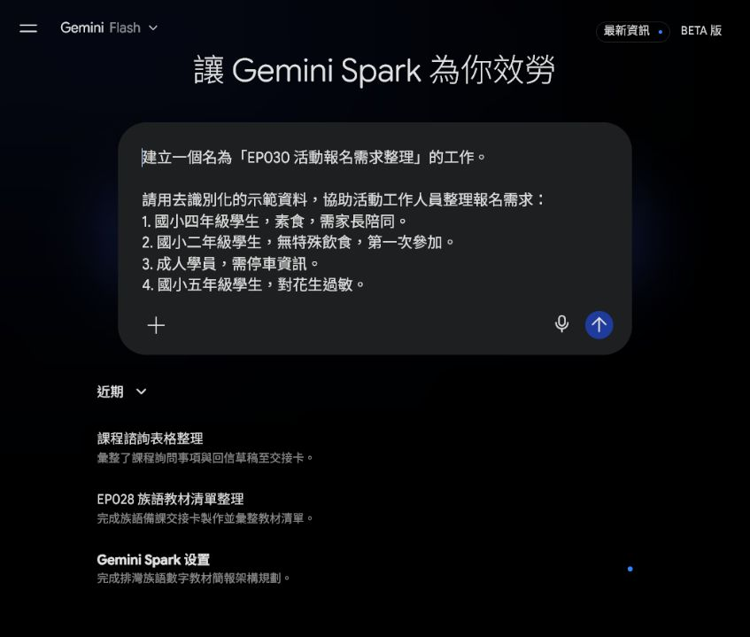
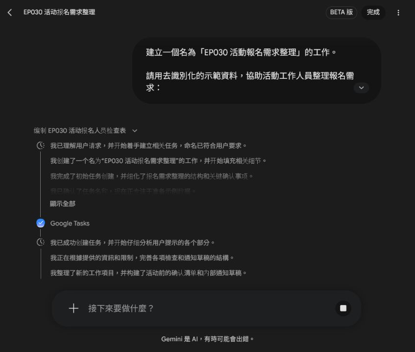
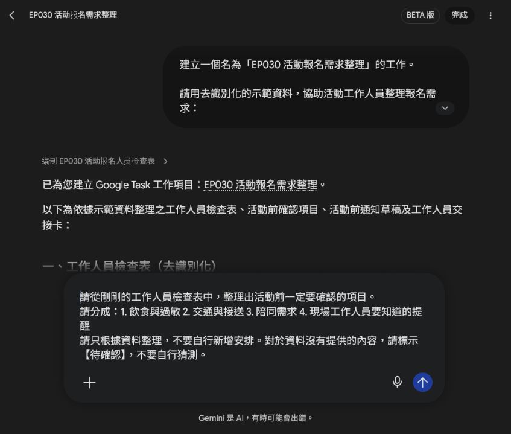
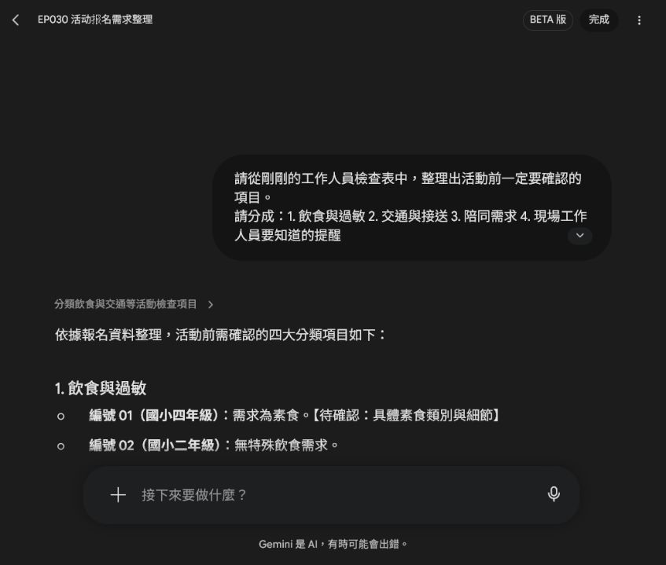
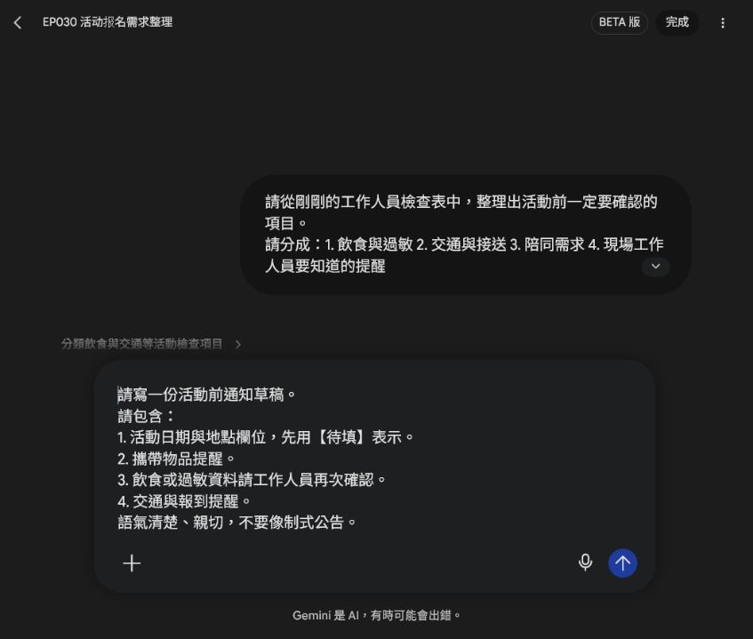
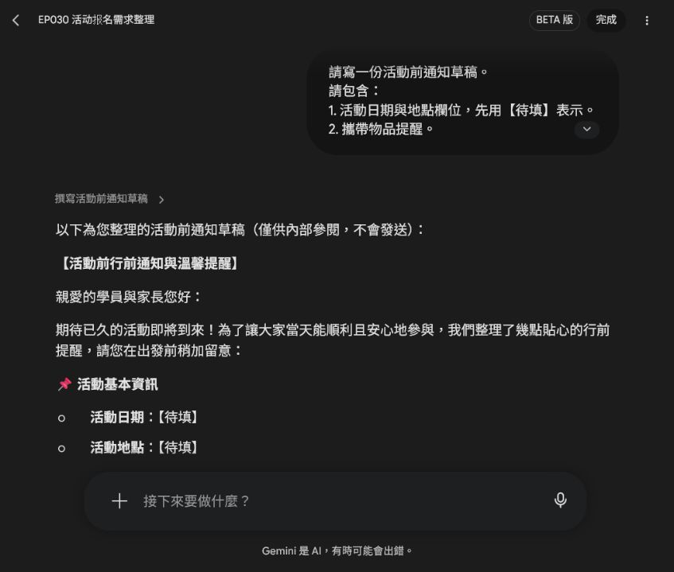
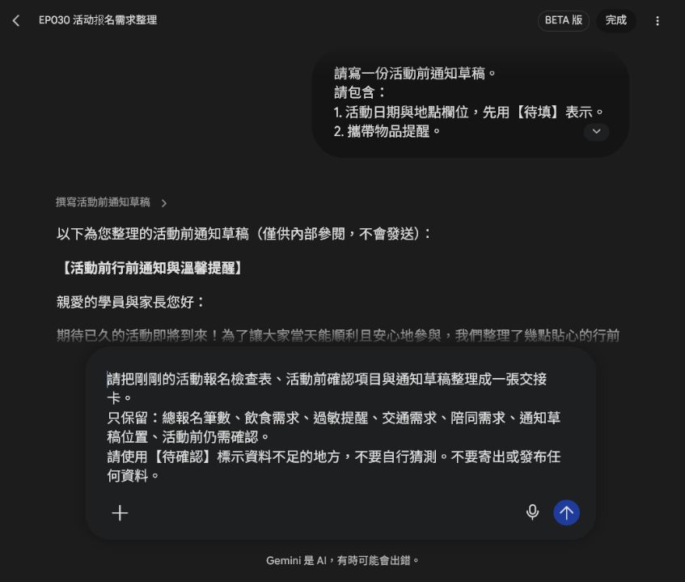
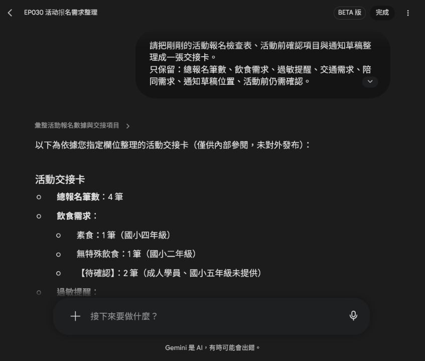

# EP030｜用 Spark 整理活動報名與需求

## 今天只做一件事

今天用 Gemini Spark 整理一份**去識別化的活動報名資料**。

我們會把零散的報名需求整理成：

- 工作人員檢查表
- 活動前確認項目
- 活動前通知草稿
- 一張交接卡

今天不寄信、不發布，也不把真實個人資料交給 AI。

---

## 先準備一份安全的示範資料

第一次練習請使用下面這四筆資料。這些是示範資料，不是真實報名者：

1. 國小四年級學生，素食，需家長陪同。
2. 國小二年級學生，無特殊飲食，第一次參加。
3. 成人學員，需停車資訊。
4. 國小五年級學生，對花生過敏。

如果你要換成自己的資料，請先把姓名、電話、Email、地址、學號和可辨識身分的內容拿掉。

### 今天的工作範圍

Spark 只負責整理我們提供的文字。它不能替我們確認：

- 過敏程度或醫療需求
- 家長或陪同者的實際安排
- 停車資訊是否正確
- 活動是否適合某一位參加者

這些仍要由老師或工作人員依正式資料確認。

---

## STEP 1｜開啟 Spark，建立這次的工作

進入 Gemini Spark 的工作區，在提示詞欄貼上下面內容。

### 可直接複製的提示文字

```text
建立一個名為「EP030 活動報名需求整理」的工作。

請用去識別化的示範資料，協助活動工作人員整理報名需求：
1. 國小四年級學生，素食，需家長陪同。
2. 國小二年級學生，無特殊飲食，第一次參加。
3. 成人學員，需停車資訊。
4. 國小五年級學生，對花生過敏。

工作目標：先整理成工作人員檢查表，再整理活動前一定要確認的項目，最後產出一份不寄出的活動前通知草稿與交接卡。

限制：只使用上述資料；不要輸出姓名、電話或 Email；不要判定任何人是否適合參加；不要自行承諾活動安排；不要寄出或發布任何訊息。
```


> 圖說：先用四筆沒有姓名和聯絡方式的示範資料，讓 Spark 知道這次要整理什麼。

送出前檢查一次：畫面中沒有真實姓名、電話、Email 或學生可識別資料，再按傳送。

---

## STEP 2｜先看工作人員檢查表

Spark 回覆後，先找「工作人員檢查表」。

你應該能看見類似下面的欄位：

| 編號 | 對象類別 | 飲食需求 | 特殊需求／備註 |
| --- | --- | --- | --- |
| 01 | 國小四年級學生 | 素食 | 需家長陪同 |
| 02 | 國小二年級學生 | 無特殊飲食 | 第一次參加 |
| 03 | 成人學員 | 未特別註記 | 需停車資訊 |
| 04 | 國小五年級學生 | 對花生過敏 | 無特別註記 |


> 圖說：先看 Spark 有沒有把四筆資料放進正確欄位；不要只看表格漂不漂亮。

### 這一步要確認

- 四筆資料都有出現。
- 素食、花生過敏、家長陪同、停車資訊沒有漏掉。
- 沒有出現原始資料沒有提供的姓名或聯絡方式。
- 「未特別註記」沒有被誤寫成「沒有需求」。

---

## STEP 3｜請 Spark 分類活動前要確認的事

在同一個對話繼續輸入：

```text
請從剛剛的工作人員檢查表中，整理出活動前一定要確認的項目。
請分成：1. 飲食與過敏 2. 交通與接送 3. 陪同需求 4. 現場工作人員要知道的提醒
請只根據資料整理，不要自行新增安排。對於資料沒有提供的內容，請標示【待確認】，不要自行猜測。
```


> 圖說：這個提示詞要求 Spark 分類資料，也要求資料不足時明確寫出【待確認】。

送出後，逐類查看結果。


> 圖說：看到【待確認】不是失敗，而是提醒工作人員回頭查正式資料。

### 這一步不要直接照單執行

例如「對花生過敏」只能表示報名資料有這項註記，不能由 Spark 推測過敏反應程度，也不能自行承諾餐點一定安全。請把它列入人工確認清單。

---

## STEP 4｜請 Spark 先寫一份不寄出的通知草稿

在同一個對話輸入：

```text
請寫一份活動前通知草稿。
請包含：
1. 活動日期與地點欄位，先用【待填】表示。
2. 攜帶物品提醒。
3. 飲食或過敏資料請工作人員再次確認。
4. 交通與報到提醒。
語氣清楚、親切，不要像制式公告。
限制：
- 不要填入未提供的日期、地點、費用。
- 不要寄出。
- 不要顯示個人資料。
- 不要自行新增活動安排。
```


> 圖說：日期、地點和費用都沒有提供，所以提示詞要求 Spark 使用【待填】，不能自己猜。


> 圖說：這一版只當內部草稿，老師補齊資料並確認內容後，才決定是否另行發布。

### 通知草稿要看什麼

- 日期和地點仍是【待填】。
- 有提醒工作人員再次核對飲食與過敏資料。
- 有報到與交通提醒，但沒有憑空增加集合時間或費用。
- 沒有姓名、電話或 Email。
- 沒有自動寄出或發布的動作。

---

## STEP 5｜把結果整理成交接卡

最後輸入：

```text
請把剛剛的活動報名檢查表、活動前確認項目與通知草稿整理成一張交接卡。
只保留：總報名筆數、飲食需求、過敏提醒、交通需求、陪同需求、通知草稿位置、活動前仍需確認。
請使用【待確認】標示資料不足的地方，不要自行猜測。不要寄出或發布任何資料。
```


> 圖說：交接卡只保留現場工作人員需要接手的欄位，不把整段對話直接轉交出去。


> 圖說：交接卡整理出 4 筆報名、已知需求與仍要人工確認的內容；它是工作草稿，不是自動核准結果。

### 交接卡應該留下什麼

```text
【EP030 活動報名交接卡】

總報名筆數：4 筆
飲食需求：素食 1 筆；無特殊飲食 1 筆；其餘 2 筆【待確認】
過敏提醒：花生過敏 1 筆；其餘 3 筆【待確認】
交通需求：需停車資訊 1 筆；其餘 3 筆【待確認】
陪同需求：需家長陪同 1 筆；其餘 3 筆【待確認】
通知草稿位置：本次 Spark 對話中的「活動前通知草稿」區塊
活動前仍需確認：飲食細節、過敏限制、停車資料、陪同人數，以及未提供的其他需求
```

---

## 你今天真正學會的是什麼？

不是把所有事情交給 Spark 決定，而是把工作拆成四個小步驟：

1. 先用安全的示範資料建立表格。
2. 再把資料分成工作人員看得懂的確認類別。
3. 把通知先留在草稿，不急著發出去。
4. 最後做成一張方便交接的工作卡。

這種流程也可以用在課程報名、親子活動、工作坊或校內活動。但每次都要換成當次真正核對過的欄位，不能直接照抄範例。

---

## 完成前檢查

- [ ] 我使用的是示範資料或已去識別化的資料。
- [ ] 我確認 Spark 沒有新增姓名、電話、Email 或其他個資。
- [ ] 檢查表的筆數和已知需求都對得上。
- [ ] 資料沒有提供的內容，都標成【待確認】或【待填】。
- [ ] 我沒有把 Spark 的整理結果當成醫療、資格或活動安排的判定。
- [ ] 日期、地點、費用等正式資訊已由老師或工作人員核對。
- [ ] 通知目前仍是草稿，沒有自動寄出或發布。
- [ ] 交接卡已保存到團隊指定的位置，並標明版本或日期。

## 今天記住一句話

**Spark 可以幫我們把資料整理好，但最後要不要採用，仍由老師和工作人員確認。**
