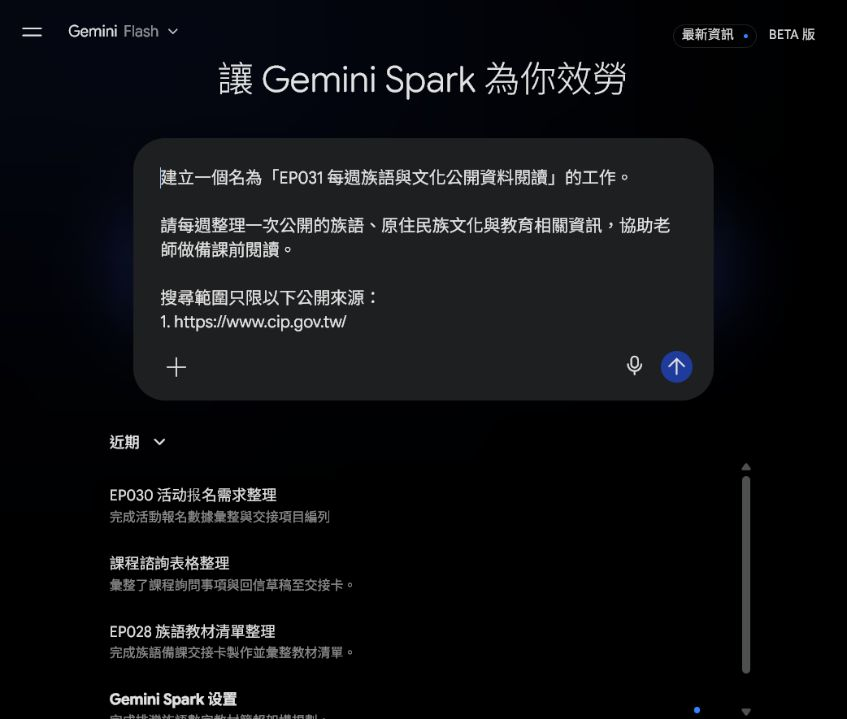
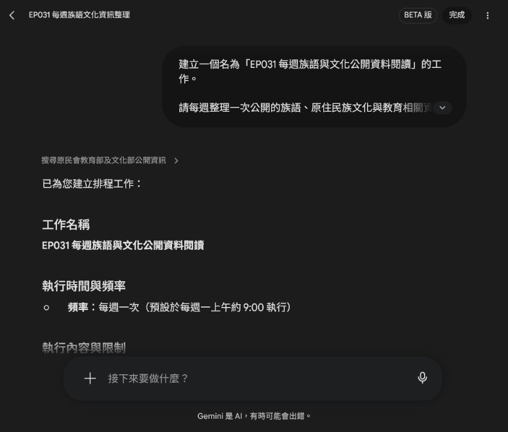
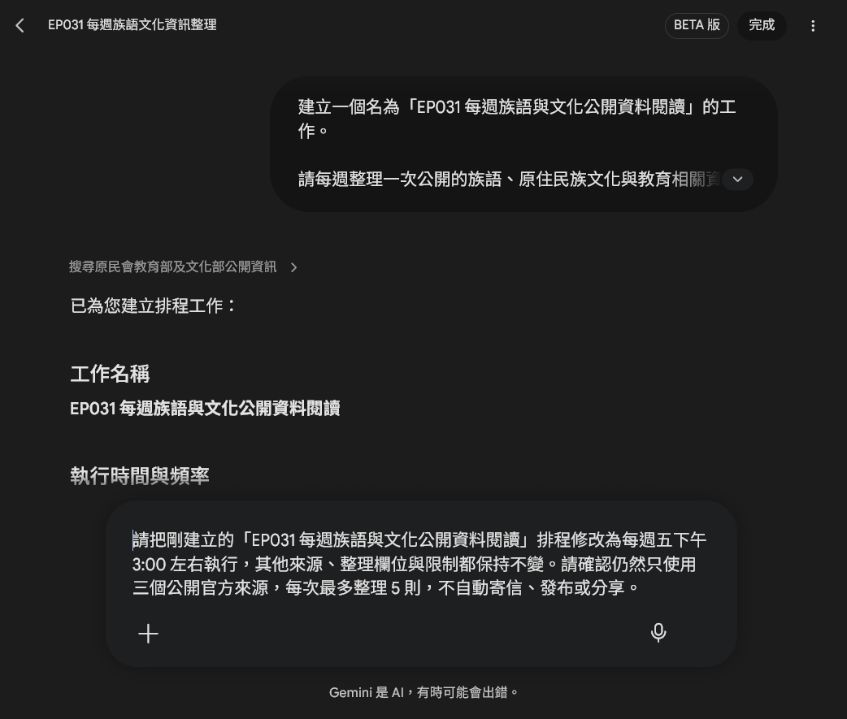
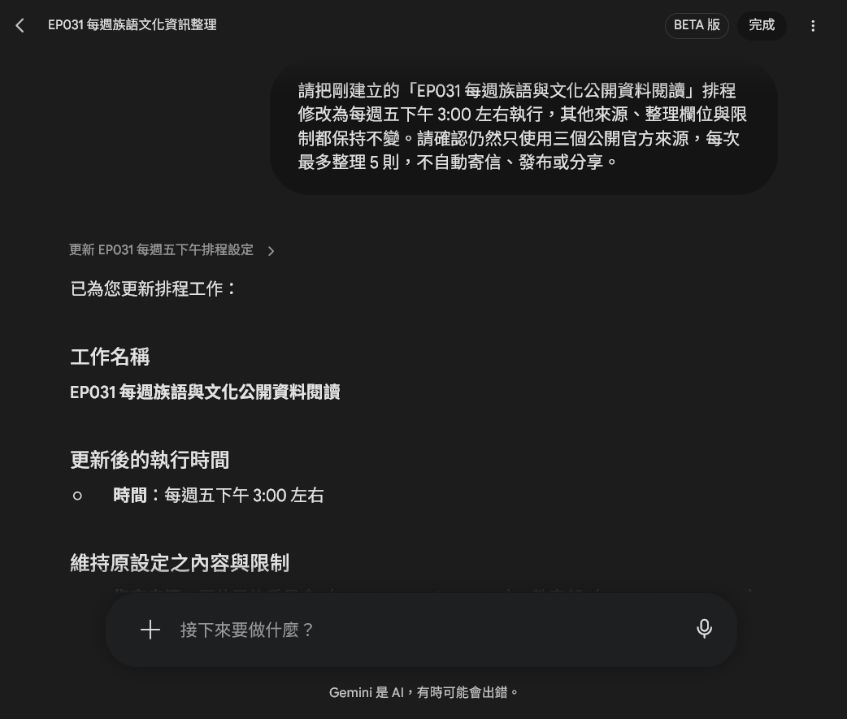
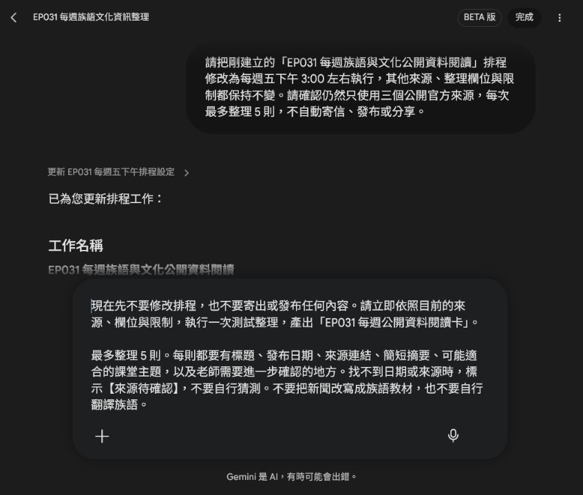
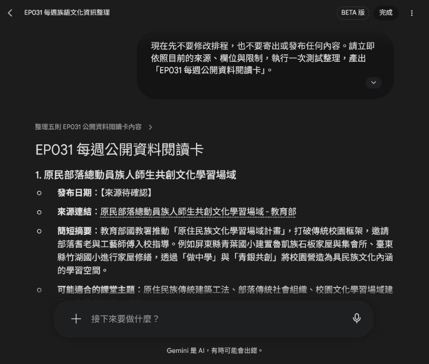

# EP031｜用 Spark 建立每週公開資料閱讀卡

## 今天只做一件事

這一集不把新聞直接變成教材，也不請 AI 自動翻譯族語。

我們要做的是一個備課前的小工具：

**每週從指定的公開官方網站整理最多 5 則資料，做成一張可以快速閱讀的資料卡。**

這樣老師不用每週重新找入口，也不會把還沒查證的內容直接放進課堂。

完成後，你會有：

- 一個每週執行的 Spark 工作
- 一次實際測試結果
- 一張可以自己填寫的「每週公開資料閱讀卡」

---

## 先知道：這張卡不是正式教材

這張卡的用途是**備課前閱讀**。

它可以幫你發現：

- 最近有哪些公開公告或教育文化資訊
- 哪些主題可能值得延伸成課堂活動
- 哪些資料還缺日期、來源或其他細節

讀完之後，老師仍然要回到原始連結，確認內容是否適合自己的課程。不要把 AI 的摘要直接當成族語教材、文化定論或新聞全文。

---

## 今天使用的公開來源

本集示範固定使用以下三個入口：

1. 原住民族委員會：https://www.cip.gov.tw/
2. 教育部：https://www.edu.tw/
3. 文化部：https://www.moc.gov.tw/

這三個網址可以直接複製到 Spark 的提示文字裡。第一次練習先固定來源，結果會比較容易比較。

不要把私人社群、需要登入的頁面、學生資料或尚未確認授權的內容放進這個工作。

---

## STEP 1｜先把來源和整理欄位說清楚

先開啟 Gemini Spark，建立一個新的工作。

不要只輸入「幫我找族語新聞」。這樣範圍太大，之後很難知道資料從哪裡來。

請改成把**來源、欄位和限制**一次寫清楚。

### 可直接複製的提示文字

```text
建立一個名為「EP031 每週族語與文化公開資料閱讀」的工作。

請每週整理一次公開的族語、原住民族文化與教育相關資訊，協助老師做備課前閱讀。

搜尋範圍只限以下公開來源：
1. https://www.cip.gov.tw/
2. https://www.edu.tw/
3. https://www.moc.gov.tw/

請整理：
1. 標題
2. 發布日期
3. 來源連結
4. 內容摘要
5. 可能適合哪一類課堂主題
6. 需要老師進一步確認的地方

限制：
- 只使用上述公開來源，不使用私人社群或登入後資料。
- 每則資料都要保留來源連結。
- 找不到日期或來源時，標示【來源待確認】，不要自行猜測。
- 不改寫成族語教材。
- 不自行翻譯族語。
- 不自動寄信、發布或分享。
- 每次最多整理 5 則。
```



### 這一步要確認什麼？

送出前，從上到下看一次提示文字：

1. 三個來源網址是不是自己指定的官方網站。
2. 每則資料是不是都要有標題、日期和連結。
3. 找不到資料時，是不是要寫「【來源待確認】」而不是猜答案。
4. 有沒有寫「不翻譯、不改寫成教材、不自動發布」。
5. 有沒有把數量限制在每次最多 5 則。

---

## STEP 2｜先建立每週排程

確認來源和規則後，請 Spark 建立排程。

第一次不必追求每天更新。每週一次比較容易閱讀，也比較不會讓資料淹沒備課時間。

Spark 會顯示它準備使用的執行時間。示範畫面一開始顯示每週一上午約 9:00，這只是建立時的預設時間，後面可以再修改。



### 建立後先讀這四個地方

- 工作名稱：是不是自己要做的 EP031 工作。
- 執行時間：是不是每週一次，而不是每天執行。
- 指定來源：是不是仍然只有三個官方網址。
- 限制事項：是不是保留最多 5 則、不翻譯、不發布。

排程建立成功，不代表資料已經適合上課。它只代表「之後會按照這些規則整理資料」。

---

## STEP 3｜把時間改成自己真的會看的時段

如果預設時間不方便，可以直接要求 Spark 只修改時間，其他內容不要變。

本集示範改成每週五下午 3:00 左右。

### 可直接複製的修改文字

```text
請把剛建立的「EP031 每週族語與文化公開資料閱讀」排程修改為每週五下午 3:00 左右執行，其他來源、整理欄位與限制都保持不變。

請確認仍然只使用三個公開官方來源，每次最多整理 5 則，不自動寄信、發布或分享。
```



送出後，檢查 Spark 回覆的時間和規則。



### 如果 Spark 連其他內容也一起改了

不要直接接受。重新說清楚：

```text
請只修改執行時間，來源、整理欄位、每次最多 5 則，以及不翻譯、不發布的限制都不要修改。
```

這就是「修改」和「重新建立」的差別：我們只動需要變的地方。

---

## STEP 4｜先執行一次測試，不要等到下週

排程建立好後，立刻做一次測試，確認它真的能整理出可讀的結果。

這次測試不會修改排程，也不會寄信或發布內容。

### 可直接複製的測試文字

```text
現在先不要修改排程，也不要寄出或發布任何內容。請立即依照目前的來源、欄位與限制，執行一次測試整理，產出「EP031 每週公開資料閱讀卡」。

最多整理 5 則。每則都要有標題、發布日期、來源連結、簡短摘要、可能適合的課堂主題，以及老師需要進一步確認的地方。

找不到日期或來源時，標示【來源待確認】，不要自行猜測。不要把新聞改寫成族語教材，也不要自行翻譯族語。
```



### 測試結果怎麼看？

本集實際測試時，Spark 產出了一張「EP031 每週公開資料閱讀卡」，列出最多 5 則來自三個指定官方來源的資料。畫面中的每一則都有標題、摘要、可能的課堂主題與後續確認方向；找不到日期的項目則保留「【來源待確認】」。



先不要急著複製整段摘要。請先點開來源連結，確認原始頁面真的存在，再把你需要的資訊填入自己的閱讀卡。

---

## STEP 5｜把測試結果整理成自己的閱讀卡

Spark 的輸出是原始整理結果；下面這張卡是給老師備課前快速掃讀的版本。

### EP031 每週公開資料閱讀卡

```text
【EP031 每週公開資料閱讀卡】

本週整理日期：

本週資料數：

值得追蹤的主題：

1.
2.
3.

每則資料的來源連結：

1.
2.
3.

可能延伸的課堂方向：

需要回到原始資料確認的地方：

來源待確認：

下週是否繼續追蹤：是／否
```

### 一張卡只做三件事

1. 記下這週值得回看的主題。
2. 留下每一則原始連結，之後找得到資料。
3. 把還沒確認的日期、名稱或內容放進「來源待確認」。

不要為了讓卡片看起來完整，就替資料補上不存在的日期或族語解釋。

---

## STEP 6｜從閱讀卡走到課堂，還要多一個步驟

閱讀卡只能幫你找到備課方向。要變成課堂內容，請按照這個順序：

1. 打開原始官方頁面。
2. 確認標題、日期、連結和文章內容。
3. 判斷這則資料是否真的適合自己的學生和課程。
4. 需要族語詞句時，只使用老師提供或正式核定的資料。
5. 另外設計活動、圖卡或講義，不要把 AI 的摘要直接貼給學生。

這樣 Spark 做的是「找入口、整理閱讀」，老師做的是「判斷是否適合教學、把資料轉成課堂活動」。

---

## 常見問題

### 找到的資料太多

把來源縮小，並保留「每次最多 5 則」。第一次先看少量結果，比較容易知道哪些主題真的有用。

### 來源連結不完整

請再要求：

```text
請逐則補上可以直接開啟的原始來源連結。找不到連結的項目請標示【來源待確認】，不要自行組合網址。
```

### 日期找不到

不要自己從標題或搜尋結果猜日期。保留「【來源待確認】」，回到原始頁面再查。

### 摘要看起來像正式教材

請把它改回閱讀資料：

```text
請保留這份內容作為備課前閱讀摘要，不要改寫成學生教材，不要自行翻譯族語，也不要替老師做文化內容的最後判定。
```

### 不想讓它自動通知別人

在排程提示文字中明確寫「不自動寄信、發布或分享」。建立後再看一次工作限制，確認沒有多出通知或發布動作。

---

## 完成前最後檢查

- 我使用的是自己指定的三個公開官方來源。
- 每次最多整理 5 則。
- 每一則都保留原始連結。
- 找不到日期或來源時，會寫「【來源待確認】」，沒有自行猜測。
- 我知道這張卡是備課前閱讀，不是直接給學生的正式教材。
- 沒有要求 Spark 翻譯族語或自行補寫族語內容。
- 排程是每週一次，時間符合自己的工作習慣。
- 沒有設定自動寄信、發布或分享。
- 我已經實際執行一次測試，並保存提示文字和結果。

## 今天記住一句話就好

**AI 幫你整理公開資料，老師再回到原始來源，把值得教的內容查清楚。**
