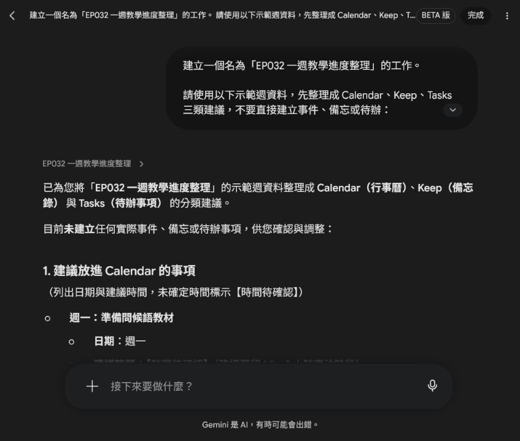
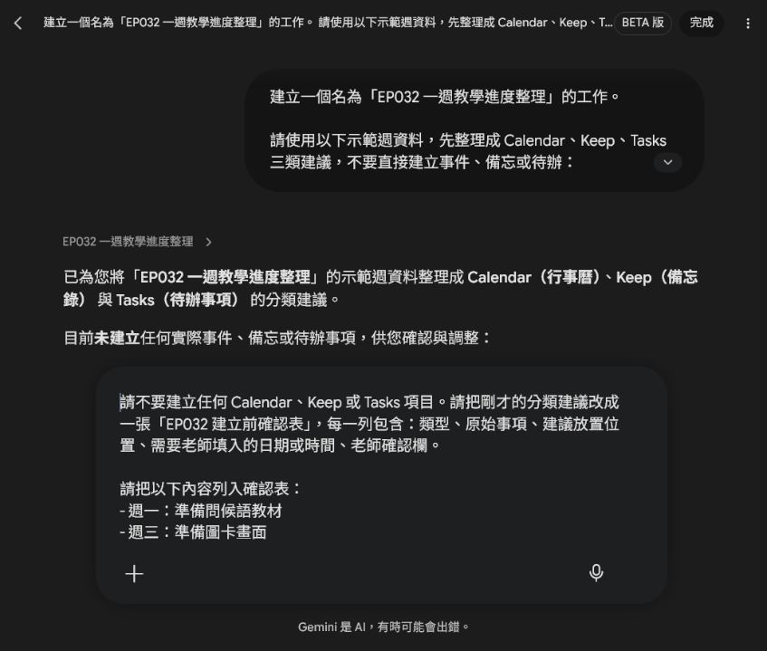
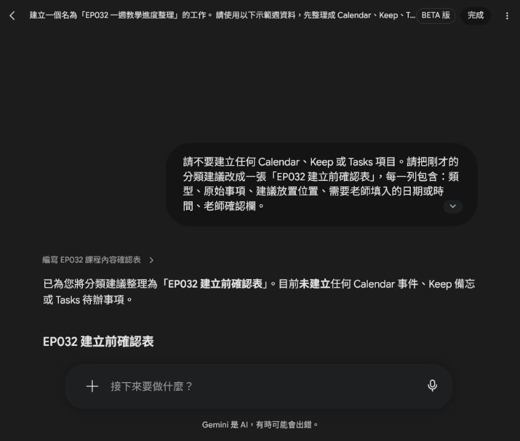
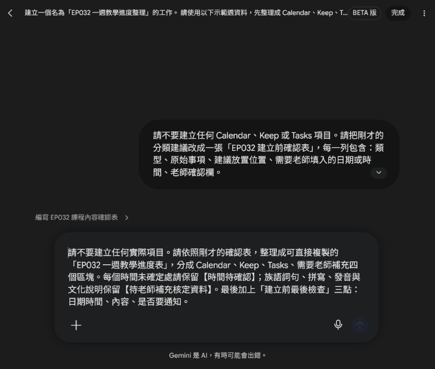
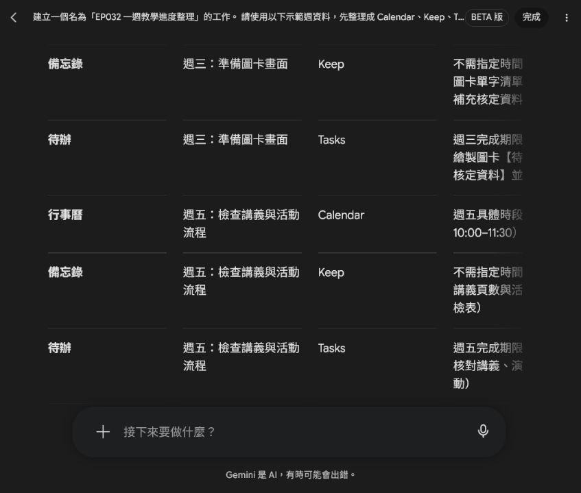

# EP032｜把一週備課工作分到 Calendar、Keep、Tasks

## 今天只做一件事

備課時，事情常常同時出現在腦中：哪一天要上課、哪個教材點子要記住、下一步要完成什麼。

如果全部混在一起，最後會變成「我知道有事情，但不知道現在該做哪一件」。

這一集先不碰真實帳號，也不直接建立任何事件、備忘或待辦。我們只用一組示範資料，練習把工作分到三個位置，再做一張建立前確認表。

今天完成後，你會得到：

- 一份 Calendar、Keep、Tasks 分類建議
- 一張建立前確認表
- 一張可直接複製的一週教學進度表

先分類，老師確認過後，才決定哪些內容真的要建立。

---

## 先記住三個位置怎麼分

| 位置 | 用來放什麼 | 例子 |
|---|---|---|
| Calendar | 已經知道日期或時間的事情 | 下週一上課、週五檢查講義 |
| Keep | 之後要回來看的想法、資料或提醒 | 圖卡設計想法、教材備忘 |
| Tasks | 可以一步一步完成的工作 | 整理教材草稿、檢查列印份數 |

同一件事可以有不同部分，但不要把所有內容都塞進 Calendar。日期時間要放行事曆，想法要放備忘，真正要完成的動作才拆成待辦。

---

## STEP 1｜先準備一組示範週資料

第一次練習不要打開私人行事曆，先用下面這組資料。這樣可以專心學分類，也不會把私人日期、學生資料或學校內部資訊放進示範畫面。

```text
示範週：
- 週一：準備問候語教材
- 週三：準備圖卡畫面
- 週五：檢查講義與活動流程
- 下週一：上課
```

把這段內容準備好，等等會貼到 Spark。


### 初學者先看這裡

現在畫面中的「建立一個名為 EP032……的工作」只是示範工作的名稱，不是要 Spark 替你建立 Calendar 或 Tasks。真正的工作內容會在下一步用提示文字說清楚。

---

## STEP 2｜請 Spark 先分類，不要直接建立

打開 Spark 的工作區，把下面這段提示文字完整貼上。這一段的重點是「先整理建議」，不是授權工具直接操作帳號。

### 可直接複製的提示文字

```text
建立一個名為「EP032 一週教學進度整理」的工作。

請使用以下示範週資料，先整理成 Calendar、Keep、Tasks 三類建議，不要直接建立事件、備忘或待辦：

示範週：
- 週一：準備問候語教材
- 週三：準備圖卡畫面
- 週五：檢查講義與活動流程
- 下週一：上課

請輸出：
1. 建議放進 Calendar 的事項，列出日期與建議時間；沒有確定時間請標示【時間待確認】。
2. 建議放進 Keep 的備忘。
3. 建議放進 Tasks 的待辦，請寫成可以完成的小工作。
4. 建立前需要老師確認的日期、時間或內容。

限制：
- 只使用以上示範週資料，不加入私人行事曆或學生個資。
- 先輸出分類建議，不要直接建立任何事件、備忘、待辦或通知。
- 不自動分享或通知其他人。
```


送出後，先看 Spark 有沒有遵守三件事：只使用示範週、沒有建立實際項目、沒有自行補出確定時間。



### 這次的分類結果怎麼讀

- Calendar：週一、週三、週五與下週一都是有時間順序的工作，但精確時間仍是【時間待確認】。
- Keep：保存問候語教材、圖卡規格與活動流程等之後要回看的內容。
- Tasks：把工作拆成「整理資料、排版、製作圖檔、演練流程」這類可以完成的小步驟。

如果族語詞句、拼寫、發音或文化說明還沒有正式資料，畫面中的位置要保留【待老師補充核定資料】，不能請 AI 自行補寫。

---

## STEP 3｜把分類結果變成建立前確認表

分類看起來合理，也不要立刻按建立。先讓 Spark 把每一列整理成老師能逐項勾選的確認表。

### 可直接複製的提示文字

```text
請不要建立任何 Calendar、Keep 或 Tasks 項目。請把剛才的分類建議改成一張「EP032 建立前確認表」，每一列包含：類型、原始事項、建議放置位置、需要老師填入的日期或時間、老師確認欄。

請把以下內容列入確認表：
- 週一：準備問候語教材
- 週三：準備圖卡畫面
- 週五：檢查講義與活動流程
- 下週一：上課

限制：只使用示範週資料；族語詞句和文化說明標示【待老師補充核定資料】；不要加入學生個資、私人行事曆、通知或分享。
```



送出後，確認表至少要能讓老師檢查：

1. 原始事項有沒有被改掉。
2. 建議放置位置是否合理。
3. 日期或時間是否仍清楚標示待確認。
4. 老師是否有「同意建立」或「待調整」的欄位。



### 老師要怎麼勾選

先逐列確認內容。只要日期、時間、族語資料或活動規格還不完整，就勾「待調整」或先保留空白；不要為了讓表格看起來完整，就讓 AI 猜一個答案。

---

## STEP 4｜整理成一週教學進度表

確認表完成後，再請 Spark 整理一張比較適合日常使用的進度表。它是「準備建立的草稿」，不是已經寫入帳號的結果。

### 可直接複製的提示文字

```text
請不要建立任何實際項目。請依照剛才的確認表，整理成可直接複製的「EP032 一週教學進度表」，分成 Calendar、Keep、Tasks、需要老師補充四個區塊。每個時間未確定處請保留【時間待確認】；族語詞句、拼寫、發音與文化說明保留【待老師補充核定資料】。最後加上「建立前最後檢查」三點：日期時間、內容、是否要通知。
```



### 完成結果要看什麼

完成結果應該有四個區塊：Calendar、Keep、Tasks、需要老師補充。時間不確定的地方要原樣保留【時間待確認】，還沒核定的族語資料要保留【待老師補充核定資料】。



---

## 這張表可以直接怎麼用

你可以把下面的格式複製到自己的備課筆記，再把空格補完整：

```text
【EP032 一週教學進度表】

Calendar：
- 週一｜【時間待確認】｜準備問候語教材
- 週三｜【時間待確認】｜準備圖卡畫面
- 週五｜【時間待確認】｜檢查講義與活動流程
- 下週一｜【時間待確認】｜上課

Keep：
- 問候語教材對照：【待老師補充核定資料】
- 圖卡設計清單：【待老師補充核定資料】
- 講義與活動流程檢查清單

Tasks：
- [ ] 整理問候語教材草稿
- [ ] 確認圖卡畫面與規格
- [ ] 核對講義並演練活動流程
- [ ] 課前確認講義與圖卡教具

需要老師補充：
- 日期與時間：
- 正式族語資料：【待老師補充核定資料】
- 圖卡數量與規格：
- 講義列印份數與活動時間：
```

只有當老師補完資料、確認日期時間，並決定要不要提醒或通知，才進入實際工具的建立步驟。這一集先停在確認表，不會替老師建立任何真實項目。

---

## 新手最容易分錯的三種情況

### 把所有事情都放進 Calendar

「我想做圖卡」不是固定時間的事件。先把它拆成待辦；只有確定要在某一天某個時段進行的工作，才放進 Calendar。

### Tasks 寫得太大

「完成整套教材」太大，無法知道下一步。改成「整理問候語草稿」「確認圖卡規格」「核對講義」這種做完就能打勾的工作。

### 把還沒核定的內容寫成確定答案

族語詞句、拼寫、發音、語意與文化說明，必須使用老師提供或正式核定的資料。沒有資料就留下【待老師補充核定資料】。

---

## 完成前最後檢查

- [ ] 我使用的是示範週，不是私人行事曆畫面。
- [ ] Spark 只輸出分類建議，沒有建立實際 Calendar、Keep 或 Tasks 項目。
- [ ] Calendar 的日期與時間仍有【時間待確認】就保留，不自行猜測。
- [ ] Tasks 已拆成可以一步一步完成的小工作。
- [ ] 族語與文化內容保留【待老師補充核定資料】。
- [ ] 我已經看過建立前確認表，才決定下一步。
- [ ] 沒有自動通知、分享或加入學生個資。
- [ ] 提示文字與操作截圖已一起保存。

## 今天記住一句話就好

**先把工作分對位置，再由老師確認要不要真的建立。**
