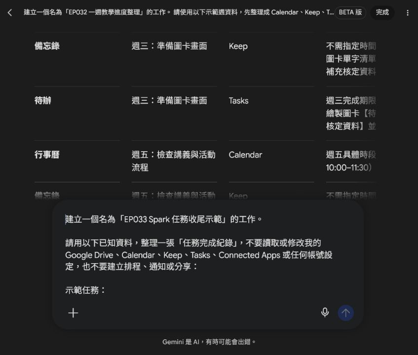
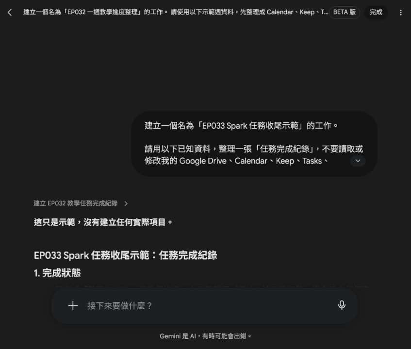
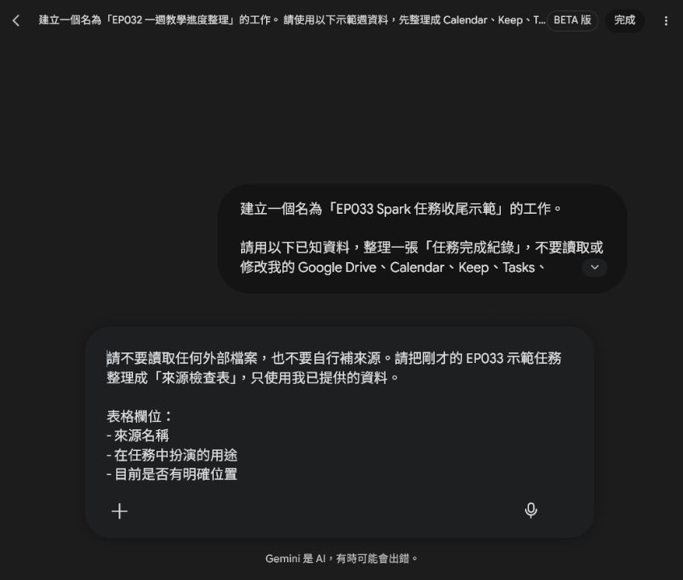
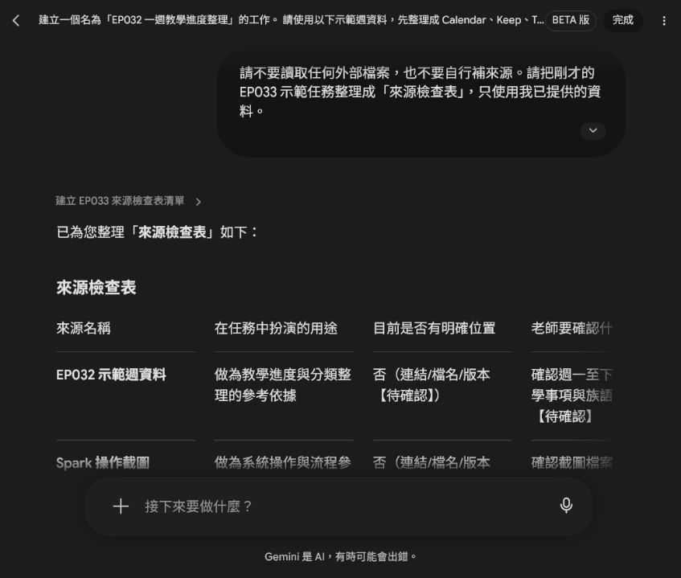
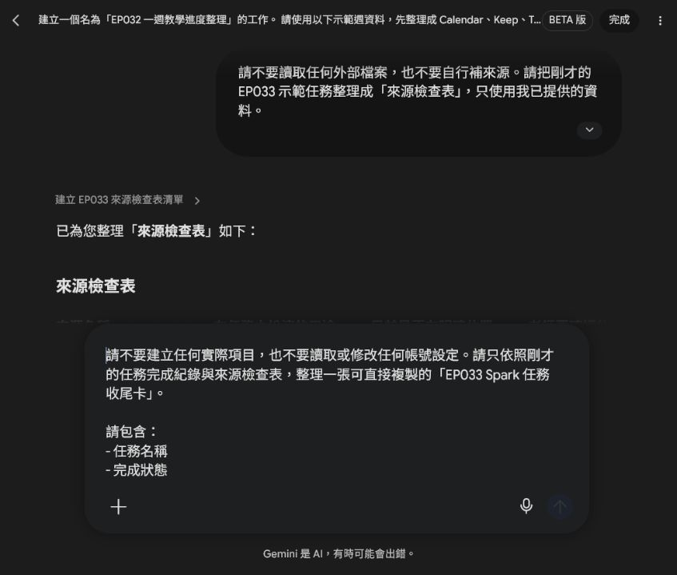
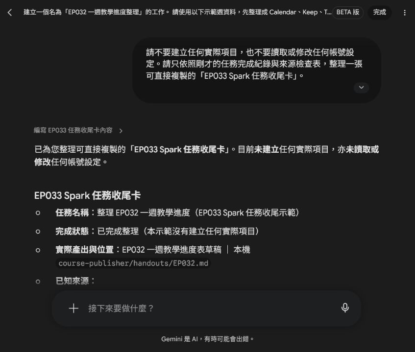

# EP033｜Spark 任務收尾：找成果、留來源、確認權限

## 今天只做一件事

Spark 顯示「完成」，不代表我們已經知道成果在哪裡，也不代表排程和權限已經處理好。

今天用一個小型示範任務，練習在工作結束時回答四個問題：

1. 成果在哪裡？
2. 使用了哪些來源？
3. 還有什麼地方沒有確認？
4. 有沒有不需要的排程、通知或權限？

這一集只做紀錄和檢查，不讀取或修改真實帳號，也不建立任何排程、通知或分享。

---

## 先分清楚三件事

| 看到的訊息 | 真正代表什麼 |
|---|---|
| Spark 說「已完成」 | AI 已經產出一段回覆或草稿 |
| 找到檔案位置 | 你知道成果實際保存在哪裡 |
| 完成收尾卡 | 成果、來源、待確認事項與權限狀態都有紀錄 |

今天的目標是第三件事。

---

## STEP 1｜準備一個不碰真實帳號的示範任務

先用上一集的成果當示範資料：

```text
示範任務：整理 EP032 一週教學進度
產出：EP032 一週教學進度表草稿
產出位置：本機 course-publisher/handouts/EP032.md
參考資料：EP032 示範週資料與 Spark 操作截圖
排程：本示範沒有建立排程
權限：本示範沒有新增 Connected Apps 權限
```

第一次練習時，不要把私人雲端資料夾、私人行事曆、學生資料或帳號畫面交給 AI。



### 這張畫面要確認什麼

- 提示文字寫的是「示範任務」。
- 已經明確寫出不讀取、不修改、不建立排程。
- 產出位置和參考資料都是你已經知道的內容。

---

## STEP 2｜先找出實際產出

把下面的提示文字貼到 Spark，請它整理完成紀錄。重點是把「產出名稱」和「產出位置」分開寫清楚。

### 可直接複製的提示文字

```text
建立一個名為「EP033 Spark 任務收尾示範」的工作。

請用以下已知資料，整理一張「任務完成紀錄」，不要讀取或修改我的 Google Drive、Calendar、Keep、Tasks、Connected Apps 或任何帳號設定，也不要建立排程、通知或分享：

示範任務：
- 任務名稱：整理 EP032 一週教學進度
- 產出：EP032 一週教學進度表草稿
- 產出位置：本機 course-publisher/handouts/EP032.md
- 參考資料：EP032 示範週資料與 Spark 操作截圖
- 排程：本示範沒有建立排程
- 權限：本示範沒有新增 Connected Apps 權限

請輸出：
1. 完成狀態
2. 實際產出與位置
3. 使用過的來源
4. 尚未確認的事項
5. 下一步

限制：
- 只使用以上資料，不自行補資料。
- 找不到的內容請標示【待確認】。
- 清楚寫出「這只是示範，沒有建立任何實際項目」。
```



### 初學者怎麼看結果

先找這三行：

- 完成狀態：這是示範整理，不是已經替你操作帳號。
- 實際產出與位置：要能看到檔名和保存位置。
- 尚未確認的事項：沒有資料的地方要出現【待確認】，不能被 AI 填成確定答案。

如果只看到「完成」，卻找不到檔案名稱或位置，先不要把任務標成完成。

---

## STEP 3｜檢查來源有沒有留下

有了產出位置，還要知道這份內容根據什麼整理。請 Spark 只使用你剛才提供的三項資料，不要自行掃描其他資料夾。

### 可直接複製的提示文字

```text
請不要讀取任何外部檔案，也不要自行補來源。請把剛才的 EP033 示範任務整理成「來源檢查表」，只使用我已提供的資料。

表格欄位：
- 來源名稱
- 在任務中扮演的用途
- 目前是否有明確位置
- 老師要確認什麼

請列出：
1. EP032 示範週資料
2. Spark 操作截圖
3. course-publisher/handouts/EP032.md

沒有提供的連結、檔名或版本請標示【待確認】，不要猜。最後註明：本示範沒有讀取其他檔案，也沒有建立任何實際項目。
```



### 來源檢查表要看什麼

每個來源至少要有三件事：

1. 它用來做什麼。
2. 現在是否找得到明確檔名或位置。
3. 老師還要確認什麼。



例如「Spark 操作截圖」可以用來說明操作流程，但不能因此推論某個外部網站的真實功能。來源找不到連結或版本時，就保留【待確認】。

---

## STEP 4｜確認排程與 Connected Apps 狀態

這一集的示範資料已經明確寫出：

- 沒有建立排程。
- 沒有新增 Connected Apps 權限。
- 沒有建立通知或分享。

如果你之後真的使用某個工具的排程或連結功能，請另外記錄：

| 要記錄的事 | 寫法 |
|---|---|
| 是否有排程 | 沒有／有，下一次執行時間：______ |
| 是否要保留 | 保留／待停用／已停用 |
| 使用哪個 App | App 名稱：______ |
| 權限拿來做什麼 | 用途：______ |
| 是否還需要 | 需要／不需要／待確認 |

不要只寫「有權限」。要寫清楚權限拿來做什麼，以及任務結束後還需不需要。

---

## STEP 5｜完成任務收尾卡

把前面的檢查整理成一張卡，下一次就不用重新翻對話找資料。

### 可直接複製的提示文字

```text
請不要建立任何實際項目，也不要讀取或修改任何帳號設定。請只依照剛才的任務完成紀錄與來源檢查表，整理一張可直接複製的「EP033 Spark 任務收尾卡」。

請包含：
- 任務名稱
- 完成狀態
- 實際產出與位置
- 已知來源
- 尚待確認
- 排程狀態
- Connected Apps 權限狀態
- 下一步

請把「本示範沒有建立排程、通知、分享或新增權限」寫清楚；沒有提供的資料保留【待確認】，不要自行補寫。最後加上收尾前檢查：成果找得到、來源留得住、排程與權限沒有被誤開。
```



### 完成結果

收尾卡應該能一眼看出：成果位置、已知來源、還沒確認的內容，以及本示範是否建立了排程或權限。



---

## 可直接使用的收尾卡格式

```text
【EP033 Spark 任務收尾卡】

任務名稱：
完成狀態：
實際產出與位置：

已知來源：
-

尚待確認：
-

排程狀態：沒有建立／待確認
Connected Apps 權限狀態：沒有新增／待確認
通知或分享：沒有建立／待確認

下一步：
-

收尾前檢查：
- [ ] 成果找得到
- [ ] 來源留得住
- [ ] 排程與權限沒有被誤開
```

---

## 新手常見卡關

### Spark 說完成，但我找不到成果

回到任務完成紀錄，先補上檔名和位置。找不到實際產物時，只能寫【待確認】，不要靠印象猜。

### 來源清單只有一句「參考資料」

請來源逐項列出，至少包含名稱、用途、位置和老師要確認的地方。來源不完整，就還不能當成可發布的成果。

### 看到權限畫面就想全部關掉

先確認哪個 App、哪個任務正在使用。不要在不清楚用途時亂改真實帳號設定；本集示範只記錄狀態，不實際修改權限。

### 把 AI 的回覆當成真正的檔案

回覆是內容，檔案是保存位置。兩者都要記錄，才能讓下一個人接手。

---

## 完成前最後檢查

- [ ] 我能指出實際產出名稱和保存位置。
- [ ] 我已列出使用過的來源，缺少的地方保留【待確認】。
- [ ] 我知道本示範沒有建立排程、通知、分享或新增權限。
- [ ] 我沒有把私人帳號、學生資料或私人檔案放進示範。
- [ ] 我沒有把 Spark 的「完成」誤當成真實帳號已完成操作。
- [ ] 我已經完成一張可交接的任務收尾卡。
- [ ] 提示文字和操作截圖已一起保存。

## 今天記住一句話就好

**任務做完只是開始，成果、來源和權限都說得清楚，才算真正收尾。**
