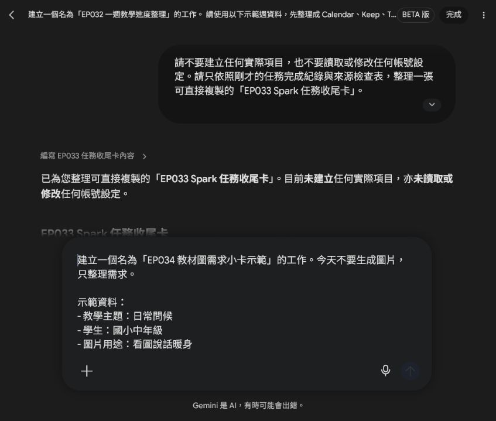
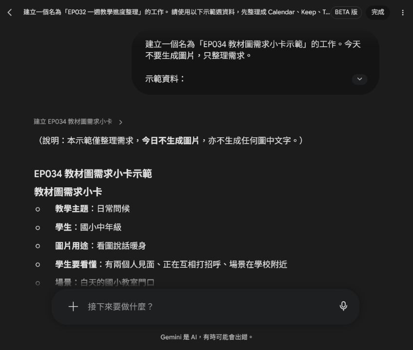
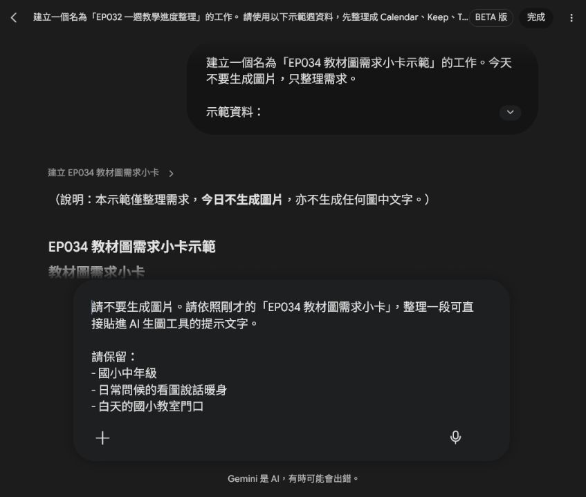
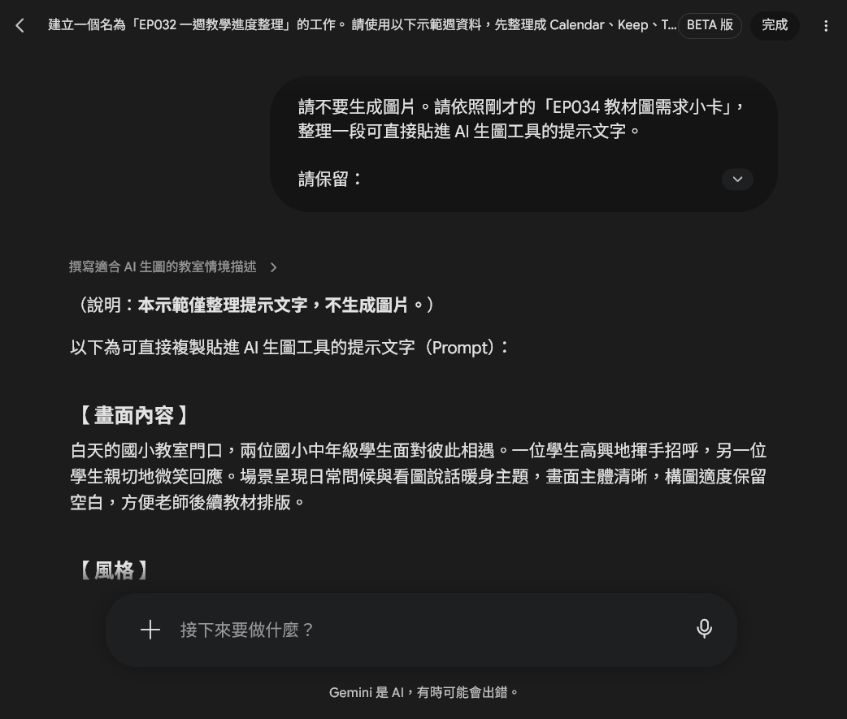
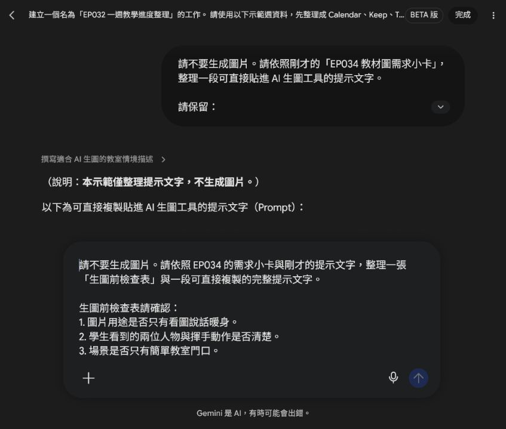
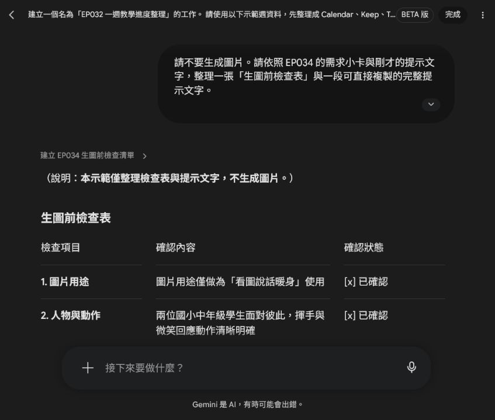

# EP034｜生圖前，先寫好教材圖需求

## 今天只做一件事

這一集先**不要急著叫 AI 畫圖**。

我們先花幾分鐘，把「這張圖片到底要拿來教什麼」寫清楚。

完成後，你會得到：

**一張教材圖需求小卡 ＋ 一段可以直接貼進 AI 生圖工具的提示文字。**

---

# 為什麼要先做這一步？

如果只跟 AI 說：

「幫我畫一張族語教材圖。」

AI 可能會畫得很漂亮，但你上課時才發現：

* 不知道要拿來教什麼
* 畫面東西太多
* 學生不知道要看哪裡
* 圖片裡出現亂碼文字
* 沒有地方可以放自己的教材文字

所以我們先告訴 AI：

**誰要看？要練什麼？畫什麼？不要畫什麼？**

---

# 今天的示範

先不要做整套教材，只選一個很小的課堂活動。

| 要決定的事情 | 今天的示範 |
| --- | --- |
| 教學主題 | 日常問候 |
| 學生 | 國小中年級 |
| 圖片用途 | 看圖說話暖身 |
| 場景 | 教室門口 |
| 不要出現 | 文字、校名、Logo、學生個資 |

接下來跟著做。

---

# STEP 1｜先決定「這張圖拿來做什麼」

先完成這一句：

**我要用這張圖，讓學生練習＿＿＿＿＿＿。**

今天的例子：

**我要用這張圖，讓學生練習日常問候。**

### 小提醒

先選一件事情就好。

不要一次要求：

「又要教問候、又要教單字、又要教文化、又要當學習單背景。」

圖片的任務越單純，通常越好用。

---

# STEP 2｜學生看完圖片，要看懂什麼？

想像你把圖片投影出來。

學生看 10 秒後，希望他能發現什麼？

今天我們希望學生看懂：

□ 有兩個人見面

□ 他們正在打招呼

□ 地點是在學校附近

不用寫很多，**2～3 件事情就夠了。**

換你填：

□ ____________________

□ ____________________

□ ____________________

---

# STEP 3｜決定一個簡單場景

接著決定：

**事情發生在哪裡？**

例如：

* 教室門口
* 校園走廊
* 操場旁
* 家裡客廳
* 商店
* 公車站

今天使用：

**教室門口。**

Spark 整理出的需求小卡會把用途、人物、場景和排除項目放在一起。先確認這張卡，再繼續寫提示文字。

### 初學者技巧

如果 AI 畫得很亂，通常不是要寫更多，而是要把場景縮小。

例如：

❌ 一整間熱鬧的學校

改成：

✅ 教室門口

---

# STEP 4｜寫出「不要出現什麼」

教材圖片有一些東西最好先排除。

今天我們寫：

□ 不要文字

□ 不要校名

□ 不要 Logo

□ 不要水印

□ 不要學生個資

□ 不要太複雜的背景

為什麼特別要求「不要文字」？

因為 AI 生成圖片裡的文字常常會拼錯、變形或出現亂碼。

比較穩的方法是：

**先生成沒有文字的圖片，教材文字之後再自己排版。**

---

# STEP 5｜完成你的「教材圖需求小卡」

把前面四步整理起來。

## 我的教材圖需求小卡

**教學主題：**

---

**學生：**

---

**圖片用途：**

---

**學生要看懂：**

1. ---
2. ---
3. ---

**場景：**

---

**不要出現：**

---

做到這裡，其實你已經完成最重要的部分了。

接下來只是把它交給 AI。

---

# STEP 6｜把小卡變成 AI 提示文字

你可以使用下面這個格式。

## 可複製提示文字

下面這段是把需求小卡轉成生圖工具看得懂的提示文字。這一步仍然只是整理文字，還沒有生成圖片。

請生成一張適合課堂使用的教材插圖。

圖片用途：

給＿＿＿＿＿＿學生進行＿＿＿＿＿＿活動。

學生看圖後要能看懂：

1. ＿＿＿＿＿＿
2. ＿＿＿＿＿＿
3. ＿＿＿＿＿＿

畫面內容：

場景位於＿＿＿＿＿＿。

畫面中有＿＿＿＿＿＿。

人物正在＿＿＿＿＿＿。

風格：

溫暖、清楚、畫面簡單，適合放進教材。

限制：

* 圖片中不要出現任何文字。
* 不要出現真實校名、Logo、水印或學生個資。
* 人物表情自然。
* 背景不要太複雜。
* 保留部分空白，方便之後加入教材文字。

---

# 今天示範的完成版

請生成一張適合國小課堂使用的教材插圖。

圖片用途：

給國小中年級學生進行「日常問候」的看圖說話暖身活動。

學生看圖後要能看懂：

1. 有兩個人見面。
2. 兩個人正在互相打招呼。
3. 場景是在學校附近。

畫面內容：

白天的國小教室門口，兩位學生遇見彼此。

一位學生自然地揮手，另一位學生微笑回應。

背景只需要簡單的教室門、窗戶與書包，不要放太多物品。

風格：

溫暖、清楚、畫面簡單，適合放進國小教材。

限制：

* 圖片中不要出現任何文字。
* 不要出現真實校名、Logo、水印或學生個資。
* 人物表情自然，不要過度誇張。
* 背景不要太複雜。
* 保留上方或側邊空白，方便老師之後加入教材文字。

Spark 整理後的版本會把內容分成「畫面內容、風格、限制」，方便老師複製到真正的生圖工具。

---

# STEP 7｜圖片出來後，先不要看漂不漂亮

在真正生成圖片前，先用下面的檢查表再看一次需求。這能避免提示文字寫得很完整，卻漏掉圖片用途或排版留白。

先檢查三件事。

### ① 我知道要看哪裡嗎？

✅ 一眼就看到兩個人在打招呼

❌ 背景人物太多，不知道誰是主角

---

### ② 場景看得懂嗎？

✅ 看得出是在教室或校園附近

❌ 背景太複雜，看不出地點

---

### ③ 可以拿來做教材嗎？

✅ 沒有亂碼文字，而且有地方可以加題目

❌ 圖片塞得滿滿的，沒有地方排版

三題都可以回答「可以」，這張圖才算適合繼續使用。

---

# 圖片不理想怎麼辦？

先不要整段提示文字重寫。

**一次只改一個地方。**

### 畫面太亂

原本：

「國小校園」

改成：

「教室門口，背景簡單」

---

### 學生不知道要看哪裡

把人物動作寫清楚。

例如：

「一位學生揮手，另一位學生看著對方微笑回應。」

---

### 圖片很像宣傳海報

加入：

「教材插圖、構圖簡單、背景簡潔、保留留白。」

---

### 圖片出現亂碼文字

不要要求 AI：

「把上面的文字改正。」

直接重新生成：

**「圖片中不要出現任何文字。」**

通常會比較穩。

---

# STEP 8｜拿進課堂試一次

例如把這張圖放在課堂開始的前 5 分鐘。

先讓學生看圖 10 秒。

接著問：

「你看到誰？」

「他們在做什麼？」

「他們可能要說什麼？」

最後再帶入今天真正要學習的族語詞句。

這樣圖片就不只是裝飾，而是幫學生進入今天的學習情境。

---

# 完成前最後檢查

□ 我知道這張圖片要拿來教什麼。

□ 我只安排一個主要學習任務。

□ 學生知道圖片要看哪裡。

□ 圖片沒有文字、校名、Logo 或個資。

□ 圖片有留白，可以繼續排版。

□ 我有保存最後使用的提示文字。

完成以上項目，你的第一張「教材圖需求小卡」就完成了。

---

## 今天記住一句話就好

**先決定學生要學什麼，再決定 AI 要畫什麼。**
