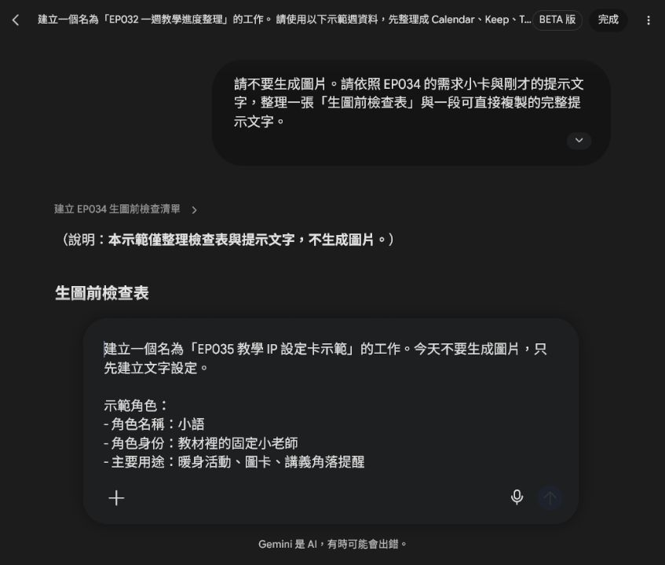
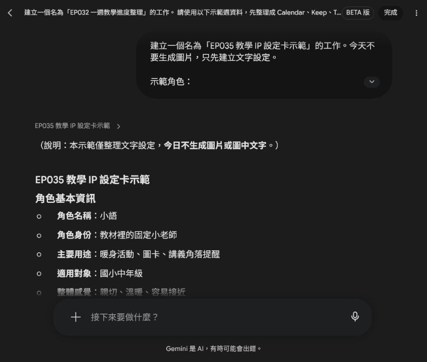
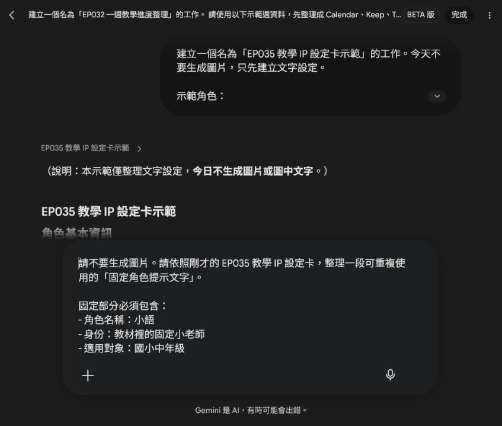
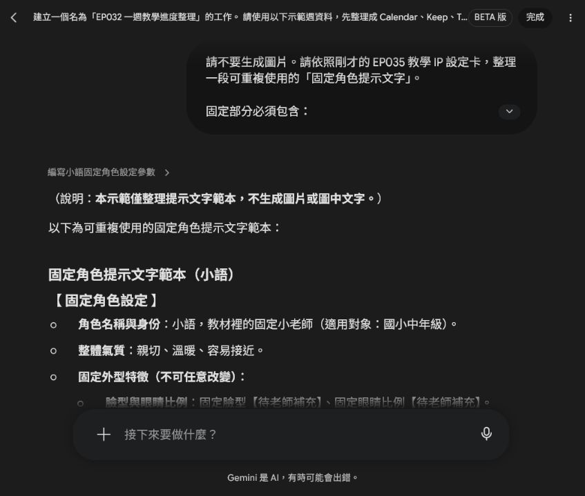
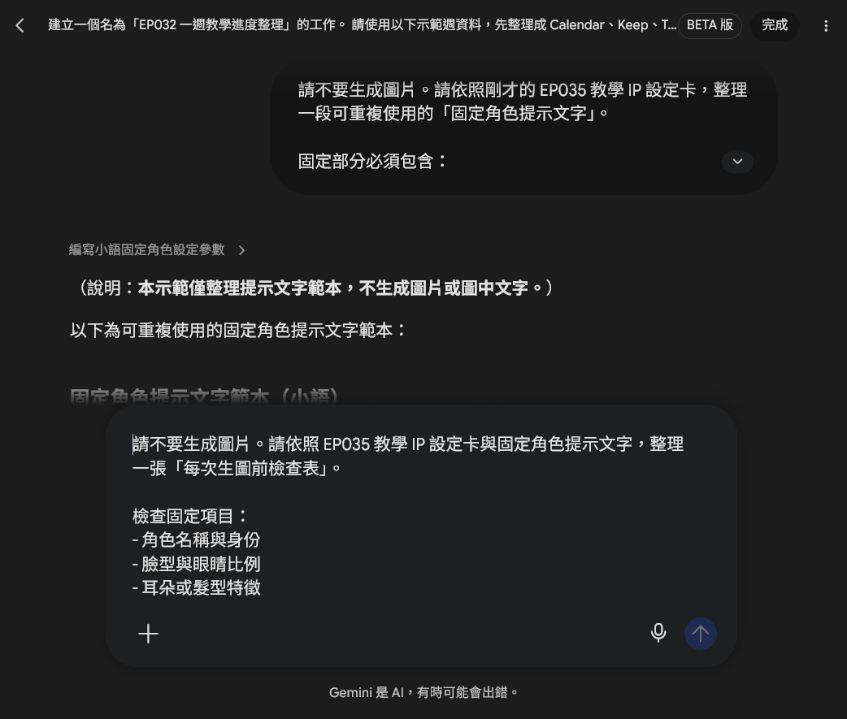
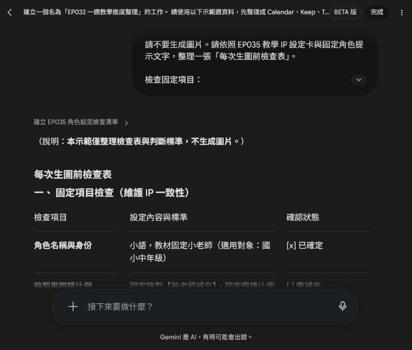

# EP035｜先建立自己的教學 IP

## 今天只做一件事

這一集先不要急著一直生很多圖。

我們先幫自己的教材，建立一個固定的教學 IP。

這個 IP 可以是一位小老師、一隻小動物角色，或是一個固定出現的教材夥伴。重點不是畫得多華麗，而是讓它在不同教材裡，看起來都像同一個角色。

## 為什麼要先做這一步？

很多老師第一次做角色圖時，今天叫 AI 畫一張，明天再畫一張，結果會發現：

* 臉不一樣
* 毛色不一樣
* 衣服不一樣
* 氣質不一樣
* 明明是同一個角色，學生卻覺得像不同人

這不是 AI 故意畫錯，而是因為你沒有先告訴它：

**這個角色哪些地方不能改，哪些地方可以改。**

所以這一集，我們先把自己的教學 IP 設定清楚。

## 今天做完會拿到什麼

今天完成後，你會有三個小成果：

* 一張教學 IP 設定卡
* 一段可重複使用的固定提示文字
* 一張生成後的檢查表

有了這三樣，之後你做教材角色圖會穩很多。

## 先理解：什麼是教學 IP？

這裡說的「教學 IP」，可以先想成：

**會反覆出現在教材裡的固定角色。**

它可以是：

* 帶學生進入主題的小老師
* 負責提醒任務的小幫手
* 出現在圖卡、學習單、封面的教材角色
* 讓學生一看到就知道「這是這門課的角色」

所以我們不是只是畫一張可愛圖，而是在建立：

**一個可以反覆使用的教材角色系統。**

## STEP 1｜先決定你的教學 IP 是誰

下面的示範先請 Spark 整理文字設定，不生成圖片。這樣可以先把角色用途說清楚，再決定外型。

先完成這一句：

**我要建立一個會固定出現在教材裡的角色，他的用途是＿＿＿＿＿＿。**

例如：

* 在課堂一開始帶學生進入主題
* 出現在講義角落提醒任務
* 在圖卡中做示範動作
* 在封面中代表這套教材

### 今天先不要想太多

先選一個最基本的用途就好。

例如：

**這個角色要用來當教材裡的固定小老師。**

## STEP 2｜先寫角色的基本身分

不要一開始就只想外表。

先寫這個角色的「角色定位」。

你可以先填這幾項：

| 要想的事 | 先寫什麼 |
| --- | --- |
| 角色名稱 | 先取一個容易記的名字 |
| 角色身份 | 小老師、小幫手、學習夥伴 |
| 主要用途 | 封面、圖卡、講義提醒、暖身活動 |
| 適用對象 | 國小、國中、成人初學者 |
| 整體感覺 | 親切、穩定、溫暖、清楚 |

### 範例

角色名稱：小語

角色身份：教材裡的固定小老師

主要用途：暖身活動、圖卡、講義角落提醒

適用對象：國小中年級

整體感覺：親切、溫暖、容易接近

## STEP 3｜把角色分成「不能改」和「可以改」

這一步最重要。

很多角色會跑掉，就是因為固定特徵和變動特徵混在一起。

### 教學 IP 設定卡要分兩欄

| 不能改 | 可以改 |
| --- | --- |
| 臉型、眼睛、耳朵、毛色 / 膚色、固定服裝、整體氣質、身形比例 | 場景、手上教材、姿勢、表情強弱、旁邊教具、動作 |

### 為什麼要這樣分？

因為如果你每次都連「臉型、服裝、氣質」一起改，AI 就會以為你是在畫新角色。

但如果你只有改：

* 今天在教室
* 明天在操場
* 今天拿圖卡
* 明天指著黑板

那學生看起來還是會知道：

**這是同一位教材角色。**

## STEP 4｜寫出你的教學 IP 設定卡

你可以直接照這個格式填。

## 教學 IP 設定卡

角色名稱：

角色身份：

這個角色主要做什麼：

適用對象：

整體氣質：

不能改的地方：

可以改的地方：

## STEP 5｜如果還沒有正式參考圖，也可以先做文字版

有些老師會想：

「可是我現在還沒有定案圖，怎麼做？」

沒關係。

一開始可以先做文字版設定卡，先把角色寫清楚，再用這張卡去生第一張基準圖。

也就是：

**先有設定，再有參考圖。**

不是反過來亂畫很多張，再回頭猜哪一張比較像。

## STEP 6｜把設定卡整理成固定提示文字

這一段就是你之後每次生圖都可以重複用的核心提示。

## 可複製提示文字

先把固定特徵寫在提示文字前面，再留下本次場景與動作的填寫位置。這次仍然只整理文字，不直接生成圖片。

請生成一張適合教材使用的角色插圖。

固定角色設定：

這是一個會固定出現在教材中的教學 IP。請保持同一個角色設定，不要改變角色的臉型、眼睛比例、耳朵或髮型特徵、主要配色、身形比例、固定服裝與整體氣質。

角色定位：

這個角色是教材中的固定小老師／學習夥伴，風格親切、清楚、溫暖，適合陪伴學生進行學習活動。

這次場景：

【填入教室、圖書角、走廊、戶外活動等】

這次動作：

【填入拿圖卡、指向教材、帶學生看圖說話、示範任務等】

限制：

* 不要改變角色的固定特徵。
* 不要在圖中生成文字。
* 不要出現真實學生姓名、校名、Logo 或水印。
* 畫面要簡潔，適合放進教材。
* 保留部分留白，方便後續排版。

## STEP 7｜生圖時，記得先貼「固定角色」，再貼「本次任務」

初學者最容易犯的錯是：

**一開始就只寫這次要做的場景，忘記貼固定角色設定。**

比較穩的順序是：

### 先貼固定內容

* 角色是誰
* 角色長什麼樣
* 哪些不能改

### 再貼這次變動內容

* 場景在哪裡
* 正在做什麼
* 旁邊有什麼教具

這樣每次換教材主題時，角色還是比較能維持一致。

## STEP 8｜生成後怎麼檢查？

在真正生圖前，先做一次固定項目和可變項目的檢查。如果臉型、配色、服裝或文化意義還沒有定案，就先停在【待老師補充】，不要讓 AI 猜。

不要只看「可不可愛」。

要把新圖和你的標準設定卡，或第一張基準圖，放在一起看。

先看這五個地方：

| 看哪裡 | 要注意什麼 |
| --- | --- |
| 臉 | 看起來是不是同一個角色 |
| 眼睛與表情 | 親切感有沒有保留 |
| 配色 | 有沒有突然換色太多 |
| 服裝 | 固定服裝有沒有被改掉 |
| 比例與氣質 | 頭身比例、感覺是否一致 |

### 記住一句話

**可愛，不等於可用。**

如果新圖很好看，但已經不像同一個角色，就不適合放進同一套教材系列。

## STEP 9｜這個教學 IP 之後可以放在哪裡？

建立好之後，不只是這一張圖能用。

它之後可以出現在：

* 講義封面
* 單字圖卡
* 看圖說話教材
* 學習單角落提醒
* 課堂任務卡
* 簡報頁面
* 系列影片縮圖

學生每次看到同一個角色，會更快建立熟悉感，也會比較知道：

「這是這門課固定的教材角色。」

所以角色一致，不只是為了好看，而是為了：

* 建立系列感
* 建立學生熟悉感
* 讓教材更有辨識度

## 如果不順，先這樣調

### 情況 1：每張圖看起來像不同角色

先不要一直重畫正式圖。

回到設定卡，把這些地方寫更清楚：

* 臉型
* 眼睛特徵
* 主要配色
* 固定服裝
* 整體氣質

### 情況 2：角色大致像，但服裝常跑掉

把固定服裝寫得更具體。

例如不要只寫：

「穿老師衣服」

改成：

「固定穿淺色上衣和深色背心，服裝簡單，不改主要配色」

### 情況 3：角色很穩，但畫面太像海報

補上：

* 教材插圖
* 畫面簡單
* 背景簡潔
* 不要文字
* 保留留白

### 情況 4：圖裡出現亂碼文字

不要花很多力氣修那幾個字。

直接重新生成一版：

**不要出現任何文字。**

通常比較穩。

## 完成前最後檢查

□ 我已經先決定這個角色的用途。

□ 我有寫角色的基本身分。

□ 我有分清楚哪些不能改、哪些可以改。

□ 我有整理出一段可重複使用的固定提示文字。

□ 我生成後有拿新圖和設定卡一起檢查。

□ 圖中沒有亂字、校名、Logo 或個資。

□ 我有把設定卡和最後版本一起保存。

## 今天記住一句話就好

**先建立自己的教學 IP，再讓 AI 幫你把它畫穩。**
