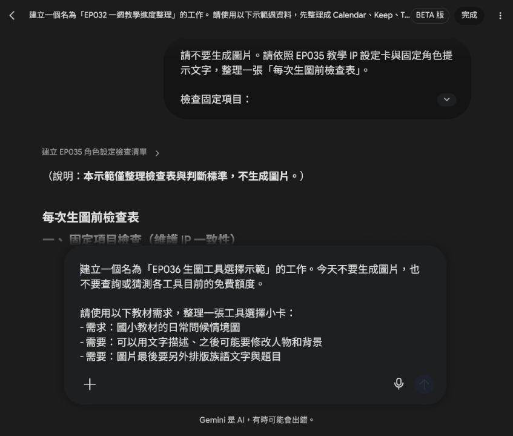
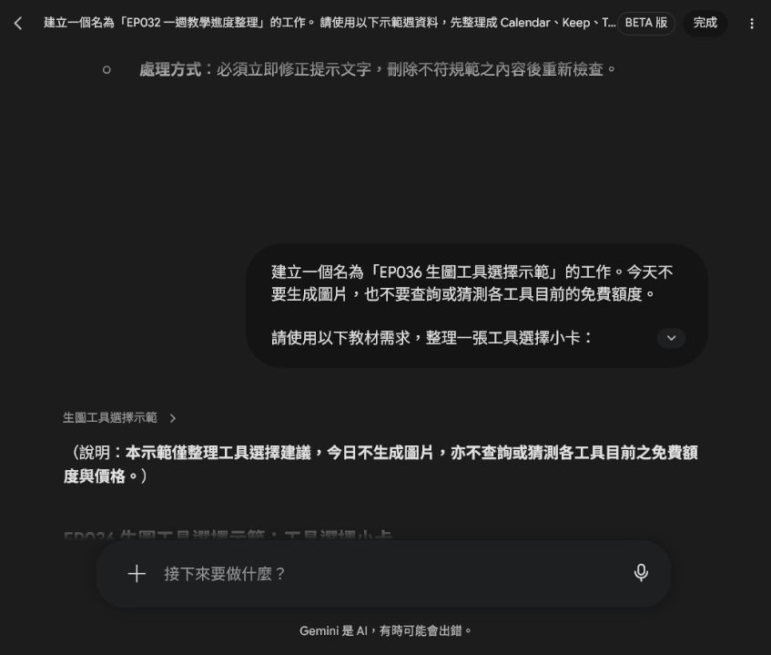
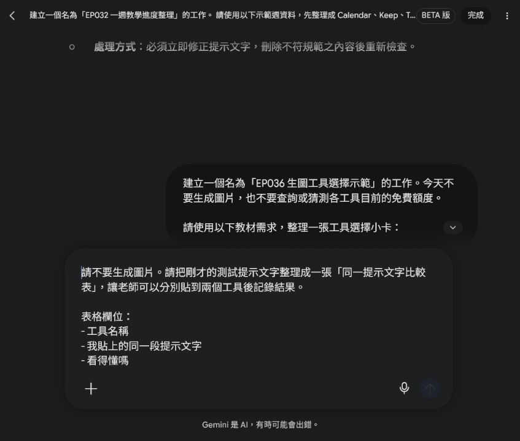
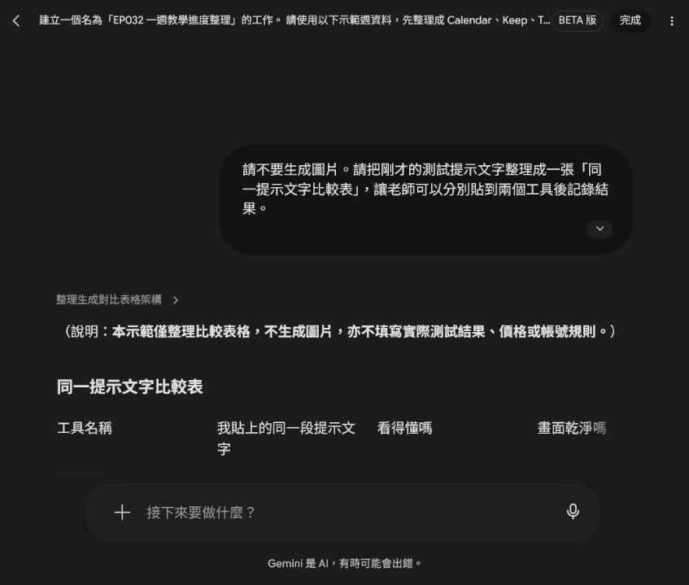

# EP036｜免費生圖網站怎麼選？

## 今天只做一件事

網路上的 AI 生圖網站很多。

有人推薦 ChatGPT，有人用 Gemini，也有人說 Bing Image Creator、Adobe Firefly 很好用。

初學者最容易發生的事情就是：

**還沒開始做教材，就先花很多時間研究哪一個 AI 最厲害。**

其實不用。

今天我們只學一件事：

**根據你現在要做的教材，選一個適合自己的生圖工具。**

## 先記住：免費不等於無限

看到「免費生圖」，不要先理解成：

**想生幾張就生幾張。**

免費方案常見的限制包括：

* 每天或每段時間有使用限制
* 免費版生成速度比較慢
* 某些進階模型不能使用
* 有些功能需要登入
* 免費額度可能隨時調整

所以我們今天不背「到底免費幾張」。

因為這些數字以後可能會改。

真正要學的是：

**我現在要做什麼？哪個工具最方便？**

## STEP 1｜先問自己：我要做哪一種圖片？

先不要看網站名稱。

先選你現在最接近的需求。

| 如果你現在想要…… | 可以先試 |
| --- | --- |
| 用聊天的方式慢慢把教材圖改好 | ChatGPT |
| 已經常用 Google，希望直接對話生圖 | Gemini |
| 想免費多試幾次不同圖片 | Bing Image Creator |
| 想多試不同視覺風格 | Adobe Firefly |

不用四個都學。

**第一次先選一個就好。**

先把「我需要圖片做什麼」寫清楚，再請 Spark 幫你整理工具適合情境。這一步不查免費額度，也不直接生成圖片。

## 選擇 1｜ChatGPT

### 適合誰？

如果你喜歡直接告訴 AI：

「人物太多，幫我減少。」

「把背景改成教室門口。」

「角色留下來，但是不要文字。」

這種一邊聊天、一邊修改圖片的方式，可以先從 ChatGPT 開始。

ChatGPT 免費方案目前也可以生成圖片，但免費版的圖片生成有使用限制，而且速度可能較慢。

### 適合做

* 情境教材圖
* 看圖說話
* 教學角色
* 講義插圖
* 已有圖片後繼續調整

### 優點

**不用很會寫專業提示詞。**

可以先說需求，再慢慢補充：

「太複雜了。」

「學生年齡再小一點。」

「背景簡單。」

對第一次接觸 AI 生圖的人比較容易理解。

## 選擇 2｜Gemini

### 適合誰？

如果你平常已經有 Google 帳號，而且常用 Google 的工具，可以從 Gemini 開始。

目前 Gemini 的免費方案包含圖片生成與圖片編輯功能。

### 適合做

* 教材插圖
* 情境圖片
* 圖片修改
* 教學活動概念圖
* 快速嘗試不同畫面

### 優點

操作方式也是直接用文字跟 AI 說：

**「我要什麼圖片。」**

不用另外學很複雜的生圖介面。

## 選擇 3｜Bing Image Creator

### 適合誰？

如果你只是想：

**「我想免費多試幾張圖看看。」**

可以認識 Bing Image Creator。

它目前可讓 Microsoft 個人帳號免費使用。每天提供 15 次快速生成，用完後仍可以改用較慢的標準生成速度。

### 適合做

* 一般教材插圖
* 場景圖
* 不同風格嘗試
* 同一個提示詞多試幾次

### 要注意

如果你使用的是學校或公司的 Microsoft 工作帳號，有可能無法直接使用 Bing Image Creator；Microsoft 官方目前說明它使用的是個人 Microsoft 帳號，而不是一般學校或公司使用的 Entra ID 帳號。

如果學校帳號進不去，不一定是你操作錯誤。

## 選擇 4｜Adobe Firefly

### 適合誰？

如果你已經開始在意：

* 插畫風格
* 畫面質感
* 不同視覺版本
* 後續設計處理

可以再試 Adobe Firefly。

Adobe Firefly 目前有免費方案，可以每天進行有限次數的免費生成。

### 適合做

* 教材插畫
* 不同視覺風格嘗試
* 背景素材
* 設計素材
* 想繼續進行圖片設計的人

### 但第一次不用急著學

如果你只是第一次做：

「兩位學生在教室門口打招呼」

這類簡單教材圖，不需要四個網站全部打開。

先用 ChatGPT、Gemini 或 Bing Image Creator 其中一個完成第一張，就可以了。

## STEP 2｜真的不知道怎麼選？用這三題

遇到新的生圖網站時，只問三件事情。

### 第一題：我要一直跟 AI 修改嗎？

如果你希望可以一直說：

「再簡單一點。」

「人物移到左邊。」

「不要文字。」

那就優先選擇**可以直接對話修改圖片的工具**。

### 第二題：我只是想多試幾張嗎？

如果現在只是練習：

「同一個提示文字會生出什麼？」

就選有免費生成額度，而且操作簡單的工具。

不要一開始就付費。

### 第三題：圖片生完，我還要排版嗎？

如果圖片最後還要加入：

* 族語文字
* 題目
* 箭頭
* 說明
* 學習單內容

生圖工具只負責：

**把圖片做好。**

文字和教材排版，再放到你熟悉的排版工具處理。

不要要求生圖 AI 一次把整張教材全部完成。

## STEP 3｜第一次不要比較十個網站

第一次練習，只選兩個工具就夠了。

而且要使用**同一段提示文字**。

這樣才知道差別在哪裡。

## 今天的測試提示文字

請生成一張適合國小教材使用的插圖。

圖片用途：

給學生進行日常問候的看圖說話活動。

畫面內容：

白天的國小教室門口，兩位學生遇見彼此。

一位學生自然地揮手打招呼，另一位學生微笑回應。

背景簡單，只需要教室門、窗戶和少量校園元素。

風格：

溫暖、清楚、簡單，適合國小教材。

限制：

* 圖片中不要出現任何文字。
* 不要出現校名、Logo 或水印。
* 人物表情自然。
* 背景不要太複雜。
* 保留部分空白，方便後續排版。

## STEP 4｜同一句話，放進兩個工具試試看

不要讓兩個工具使用不同提示文字。先用 Spark 做一張空白比較表，實際測試後再由老師填寫結果。

例如今天選：

**ChatGPT ＋ Gemini**

或：

**Gemini ＋ Bing Image Creator**

分別貼入完全相同的提示文字。

不要其中一個寫很詳細，另外一個只寫一句話。

這樣才比較得出來。

## STEP 5｜圖片出來後，只比四件事情

不要先問：

**「哪一張比較漂亮？」**

先看它適不適合教學。

| 要比較什麼 | 要看什麼 |
| --- | --- |
| 看得懂嗎？ | 學生一眼知道人物在做什麼 |
| 畫面乾淨嗎？ | 不會有太多不需要的東西 |
| 符合需求嗎？ | 場景、人物、動作有沒有正確 |
| 好修改嗎？ | 不滿意時，能不能容易繼續調整 |

## 我的生圖工具選擇小卡

試完後，把結果記下來。

**我試的工具：**

① ____________________

② ____________________

**我覺得比較容易操作的是：**

**比較符合教材需求的是：**

**我之後先固定使用：**

## 不用找到「最好的 AI」

這一點很重要。

沒有一個生圖網站會永遠：

* 最漂亮
* 最免費
* 最快
* 最會畫教材
* 最適合所有人

而且 AI 工具一直都在改。

所以不要一直問：

**「現在世界上最強的生圖 AI 是哪一個？」**

對老師更重要的問題其實是：

**「哪一個工具可以讓我最快完成今天的教材？」**

## 如果還是不知道選哪一個

可以先照這個順序。

### 我完全第一次用

先試：

**ChatGPT 或 Gemini**

因為可以直接用平常說話的方式描述圖片。

### 免費額度不夠

再試：

**Bing Image Creator**

### 開始想研究不同視覺風格

再試：

**Adobe Firefly**

## 一個常見錯誤：每張圖都換工具

今天 ChatGPT。

明天 Gemini。

後天 Bing。

下一張又換 Firefly。

最後你會發現：

每張教材的畫風、人物和感覺都不太一樣。

如果你正在製作同一套教材，找到適合自己的工具後，建議先：

**固定工具＋固定角色設定＋固定提示文字格式。**

教材會比較容易維持一致。

## 免費工具也不要放這些資料

不論使用哪一個網站，都不要把學生的：

* 真實姓名
* 照片
* 學號
* 電話
* 地址
* 成績
* 可以辨識個人的資料

直接拿來當教材生圖素材。

如果只是要做教材情境，可以改成：

「兩位國小學生」

「一位老師」

「教室裡的學生」

不用使用真實學生資料。

## 完成前最後檢查

□ 我知道免費不代表無限使用。

□ 我沒有一次學四、五個生圖網站。

□ 我有先決定自己要做什麼圖片。

□ 我用同一段提示文字測試不同工具。

□ 我比較的是教材能不能使用，不只是漂不漂亮。

□ 我選出一個目前最順手的工具。

□ 我沒有上傳學生個資。

## 今天記住一句話就好

**不要先找最強的生圖網站，先找最適合你現在教材工作的工具。**

> 教材備註
> AI 工具的免費方案、生成次數和功能會持續調整。本講義以 2026 年 8 月官方公開資訊為整理基準，實際使用時請以各網站當下顯示的方案為準。
