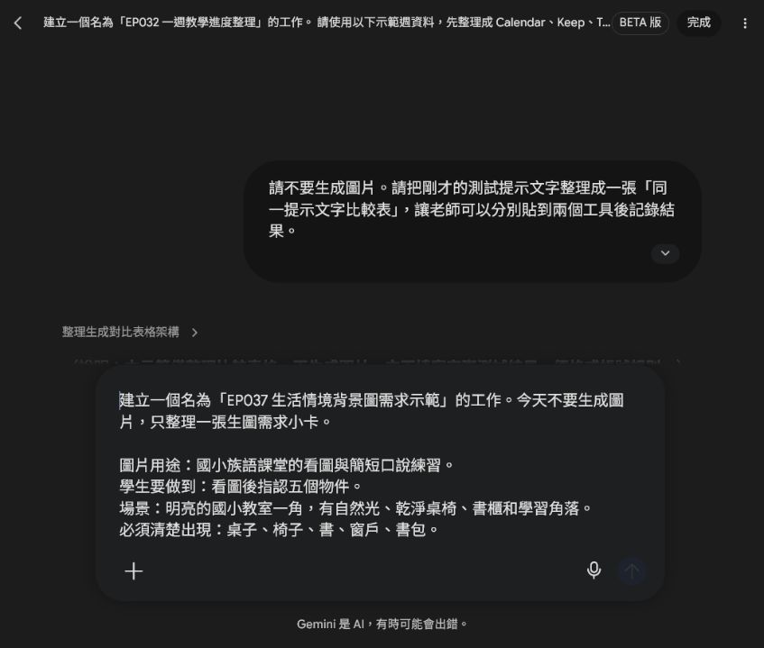
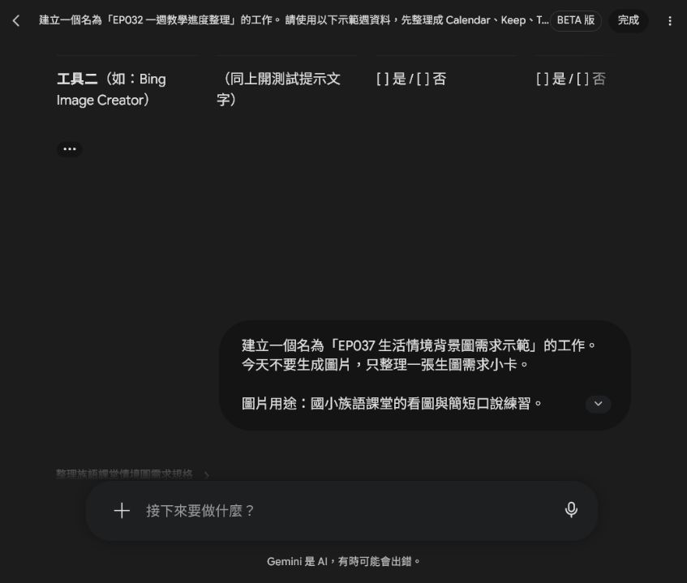
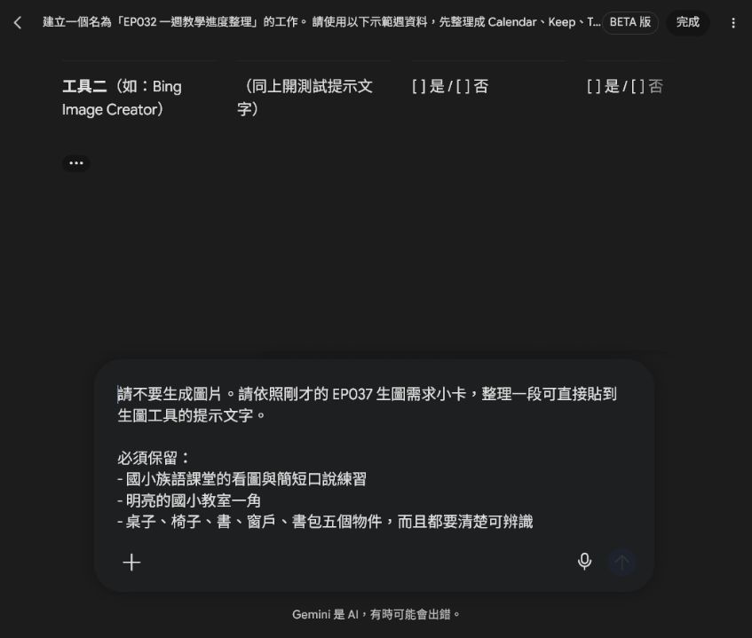
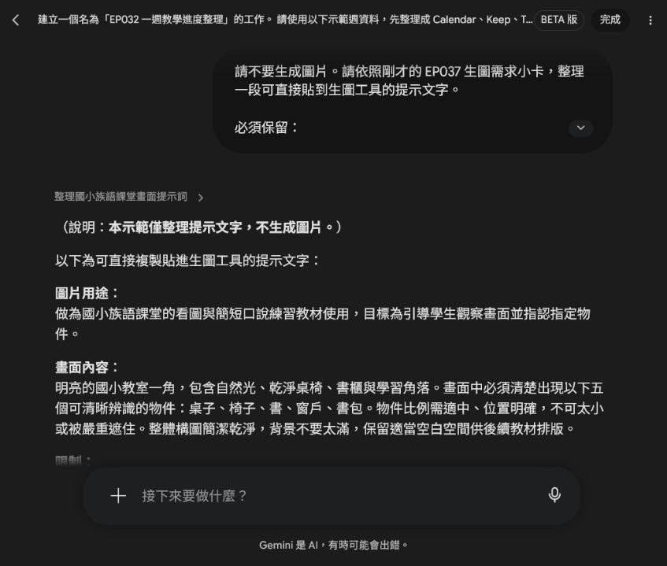

# EP037 講義：生成生活情境背景圖

## 開場：情境圖要讓學生開口，不只是好看

生活情境圖最怕畫得很滿、很漂亮，但學生不知道要說什麼。課堂上真正好用的圖，是學生一看就能說：「我看到桌子、書包、窗戶。」然後老師可以接著帶詞彙或句型。

這一集只做一張生活情境背景圖。畫面裡要有幾個清楚物件，讓學生可以指認、描述、練一句話。

這一集先把需求和檢查規則寫清楚，再把提示文字貼到生圖工具。正式生成的圖片要和物件清單一起保存，才知道它要服務哪個口說任務。

## 今天做完會拿到什麼

你會完成：

- 一張生活情境圖。
- 一份 5 個物件清單。
- 一段可以複製的生圖提示文字。

這三個要放在一起，圖片才不會只是裝飾。

## 先準備

先選一個學生熟悉的場景，例如：

- 教室一角
- 校園走廊
- 圖書角
- 家庭客廳
- 市場攤位

再列出 5 個學生要看得到、說得出來的物件。

## 跟著做

先用 Spark 整理需求小卡，這一步不生成圖片，也不自行加入族語詞句或文化說明。





1. 寫下這張圖要練的口說任務。
2. 選一個場景，不要一張圖混太多地方。
3. 列出 5 個必須清楚出現的物件。
4. 把物件寫進提示詞，要求清楚可辨識。
5. 加上限制：不要文字、不要校名、不要水印。
6. 生成後逐一檢查 5 個物件是否真的看得到。
7. 把圖片和物件清單一起保存。

## 可複製提示文字

把五個物件直接寫進提示文字，並要求每個物件清楚可辨識；不要只寫「教室佈置豐富」，那樣 AI 可能加很多不需要的東西。



```text
請生成一張國小族語課堂用的生活情境背景圖。

圖片用途：
學生看圖後要能指認五個物件，並進行簡短口說練習。

場景：
明亮的國小教室一角，有自然光、乾淨桌椅、書櫃和學習角落。

必須清楚出現的物件：
桌子、椅子、書、窗戶、書包。

限制：
- 不要出現任何文字。
- 不要出現真實校名、Logo 或水印。
- 不要讓物件太小或被遮住。
- 畫面不要太滿，保留老師後續排版空間。
```



## 圖片出來後怎麼看

不要只看美感。請直接拿圖片問自己：

| 問題 | 如果答案是否定，就這樣改 |
|---|---|
| 五個物件都看得到嗎 | 把缺的物件移到提示詞前面 |
| 學生知道要說什麼嗎 | 減少無關裝飾 |
| 圖片會不會太滿 | 改成「場景一角」 |

也可以請旁邊的人看 10 秒，問他看到什麼。如果他說出的物件和你設計的差不多，這張圖就比較穩。

## 課堂怎麼用

上課時先讓學生安靜看圖 10 秒，再問：

```text
你看到什麼？
你可以指給大家看嗎？
你能用今天學的詞說一個嗎？
```

這張圖適合暖身，也適合小組輪流說。重點是讓學生有東西可看、有話可說。

## 如果不順，先這樣調

如果物件不清楚，補上「large and clearly visible objects」。

如果畫面變成觀光照，改回「教室一角」或「學習角落」。

如果學生一直注意無關細節，下一版就刪掉那些裝飾。

## 完成前看一眼

- 五個物件都清楚。
- 圖片沒有文字。
- 場景和口說任務有關。
- 圖片不會讓學生分心。
- 圖片和物件清單有一起保存。
