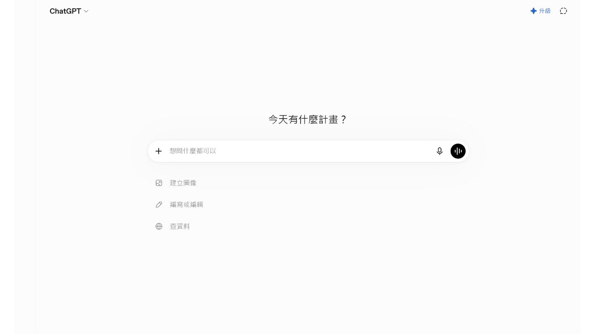
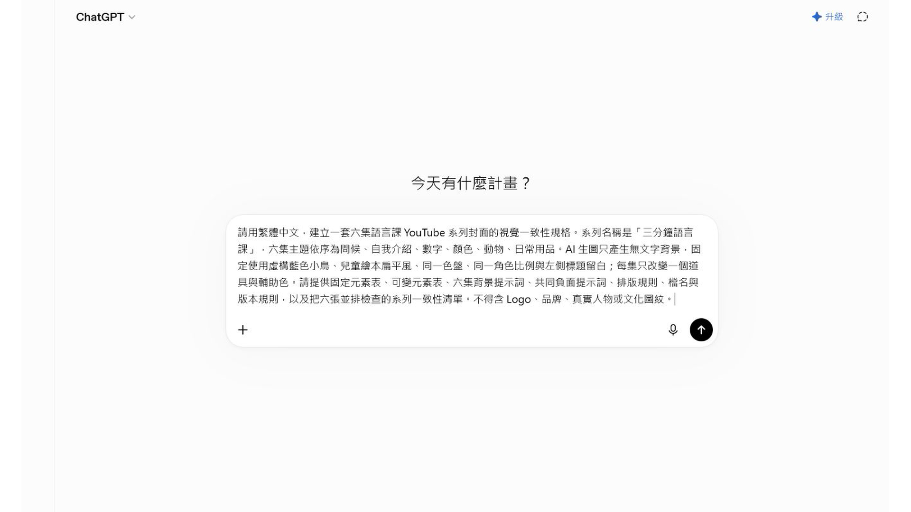
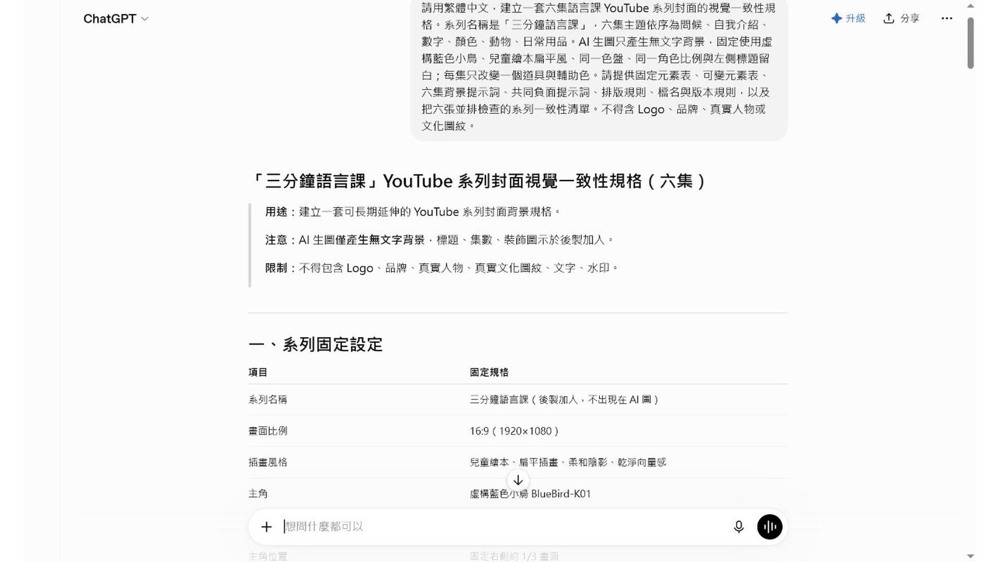

# EP038 講義：把草稿變成乾淨教材插圖

## 開場：草稿不用漂亮，但要說得出教學意思

老師常常不是沒有想法，而是想法還很粗：兩個孩子在門口打招呼、一組學生在分組、阿桃拿著圖卡提醒大家。這些草稿就算只是幾個字，也可以變成教材插圖。

這一集要做的，是把粗略想法整理成一段清楚提示詞，讓 AI 畫出能放進學習單的乾淨插圖。

## 今天做完會拿到什麼

你會完成：

- 一張草稿整理表。
- 一段完整生圖提示文字。
- 一張可以放進學習單的插圖草稿。

成果不需要像藝術展作品。它只要能幫學生理解活動，就很有價值。

## 先準備

準備一個粗略想法就可以。例如：

```text
我想要一張兩個孩子在教室門口打招呼的圖。
```

接著先分出三件事：

| 要素 | 示例 |
|---|---|
| 主體 | 兩位學生 |
| 場景 | 教室門口 |
| 動作 | 揮手打招呼 |

還不確定的文化內容、詞句、服飾，先不要硬補。

## 跟著做

1. 寫下原始草稿想法。
2. 把人物、場景、動作、物件分開列出來。
3. 決定插圖要放在哪裡，例如學習單或簡報。
4. 寫出學生看圖後要做的事。
5. 把不確定的內容先留白，不讓 AI 自己補。
6. 組成完整提示文字。
7. 生成後放進學習單版面看一次。

## 可複製提示文字

```text
請把下面的教材草稿整理成一張乾淨的教材插圖。

草稿想法：
兩位國小學生在教室門口遇見彼此，正在揮手打招呼。

圖片用途：
放在國小族語課學習單，讓學生看圖後進行簡短口說練習。

畫面內容：
明亮的教室門口，兩位學生面向彼此，一位揮手，另一位微笑回應。背景簡單，有教室門、窗戶和書包。

限制：
- 圖中不要放任何文字。
- 不要出現真實校名、Logo、水印或學生個資。
- 不要自行加入未提供的文化服飾、圖紋或族語文字。
- 畫面清楚，適合放在學習單。
```

## 圖片出來後怎麼看

把圖放進學習單草稿，而不是只在生圖工具裡看。

| 檢查 | 看什麼 |
|---|---|
| 主體 | 學生一眼看得出誰在做什麼 |
| 空間 | 旁邊放得下題目或詞彙 |
| 用途 | 圖片真的能引出口說任務 |
| 乾淨度 | 沒有亂字、Logo、水印 |

如果圖片縮小後看不懂，就不是好教材圖。先改構圖，不要急著加更多細節。

## 課堂怎麼用

這張插圖可以放在學習單第一題。老師先問學生：「他們在做什麼？」再帶入問候句或替換練習。

一張圖只支援一個任務就好。任務清楚，學生比較敢開口。

## 如果不順，先這樣調

如果 AI 畫偏了，把主體放到提示詞前面。

如果畫面太像海報，補上：

```text
worksheet illustration, simple layout, clear subject
```

如果它加了不確定文化元素，下一版改成一般教室服裝和低風險場景。

## 本集操作畫面

以下畫面是本集實際操作紀錄，請依序對照前面的步驟。










## 完成前看一眼

- 草稿原本的教學意思有保留下來。
- 圖片能放進學習單。
- 圖中沒有文字或水印。
- 不確定內容沒有讓 AI 自己補。
- 圖片和提示詞有一起保存。
