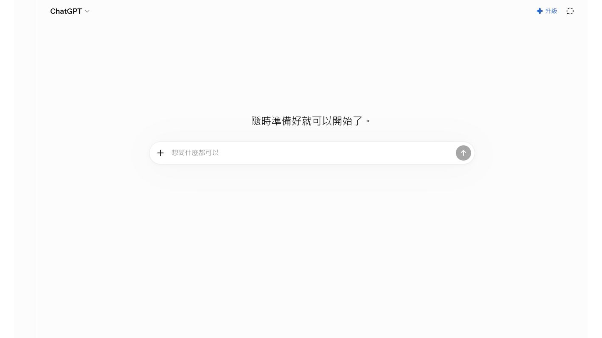
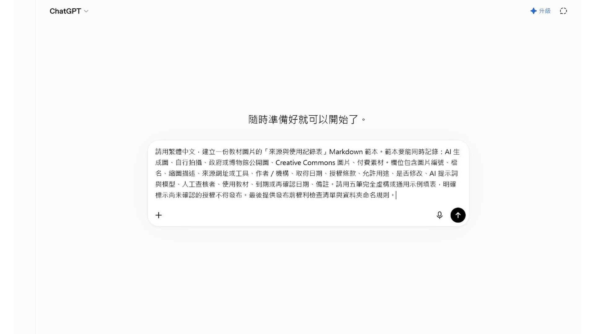

# EP039 講義：封面主視覺與中文字校對

## 開場：封面第一眼要吸引人，第二眼不能有錯字

AI 很會做熱鬧的封面，但中文字常常是最大風險。集數錯、標題少一字、背景冒出亂碼，都會讓一張漂亮封面不能用。

這一集要做的不是追求最炫，而是做出一張「能被看懂、能被找到、文字正確」的封面主視覺。

## 今天做完會拿到什麼

你會完成：

- 一張封面文字清單。
- 一段封面主視覺提示文字。
- 一張逐字校對表。

先把文字管好，再談美感，封面才不會變成看起來很帥但不能發布。

## 先準備

先把封面會出現的文字逐行寫好：

| 欄位 | 文字 |
|---|---|
| 系列名稱 | AI 族語備課小妙招 |
| 集數 | EP039 |
| 主標題 | 封面主視覺與中文字校對 |
| 短句 | 圖很美，字也要對 |

如果你的生圖工具中文常出錯，可以改成「先生成無文字封面背景，再用排版工具加字」。

## 跟著做

1. 先完成封面文字清單。
2. 決定主視覺，例如阿桃、教材圖、校對表、亮眼標題區。
3. 把文字清單貼進提示詞。
4. 生成後先不要看美不美，先逐字核對。
5. 檢查 EP 編號、標題、角落小字和背景亂碼。
6. 如果中文錯，就不要當正式封面。
7. 保存通過校對的封面、提示詞和版本。

## 可複製提示文字

```text
請生成一張「AI 族語備課小妙招」課程封面。

封面文字必須逐字呈現：
系列名稱：AI 族語備課小妙招
集數：EP039
主標題：封面主視覺與中文字校對
短句：圖很美，字也要對

主視覺：
活潑、清楚、有教育科技感的封面。畫面中可以有阿桃角色、教材圖、校對表、明亮工具畫面。標題要醒目，整體適合族語老師觀看。

限制：
- 不要改寫任何中文。
- 不要新增未提供的文字。
- 不要出現錯字、亂碼、水印。
- 如果無法正確生成中文字，請保留乾淨空白標題區。
```

## 封面出來後怎麼看

請把封面縮成首頁卡片大小，再檢查一次。

| 檢查 | 要看什麼 |
|---|---|
| 集數 | EP039 有沒有正確 |
| 標題 | 每一個中文字有沒有少或錯 |
| 背景 | 有沒有亂碼或假文字 |
| 可讀性 | 縮小後還看得清楚 |
| 系列感 | 和其他 AI-100 封面放一起不突兀 |

封面要吸引人，但不要為了熱鬧犧牲可讀性。

## 課堂怎麼用

封面不是學生練習內容，但它會影響老師找資料的速度。集數和標題正確，雲端資料夾、網站、短影音封面才不容易混。

## 如果不順，先這樣調

如果 AI 一直生錯中文，改成這個流程：

1. 只生成無文字主視覺。
2. 留出標題區。
3. 用 Canva、簡報或其他排版工具加上正確文字。
4. 再做最後校對。

這不是退步，這是比較穩的教材做法。

## 本集操作畫面

以下畫面是本集實際操作紀錄，請依序對照前面的步驟。







## 完成前看一眼

- 集數正確。
- 主標題逐字正確。
- 沒有亂碼或多餘文字。
- 縮小後仍然看得清楚。
- 封面圖、文字清單和提示詞都有保存。
