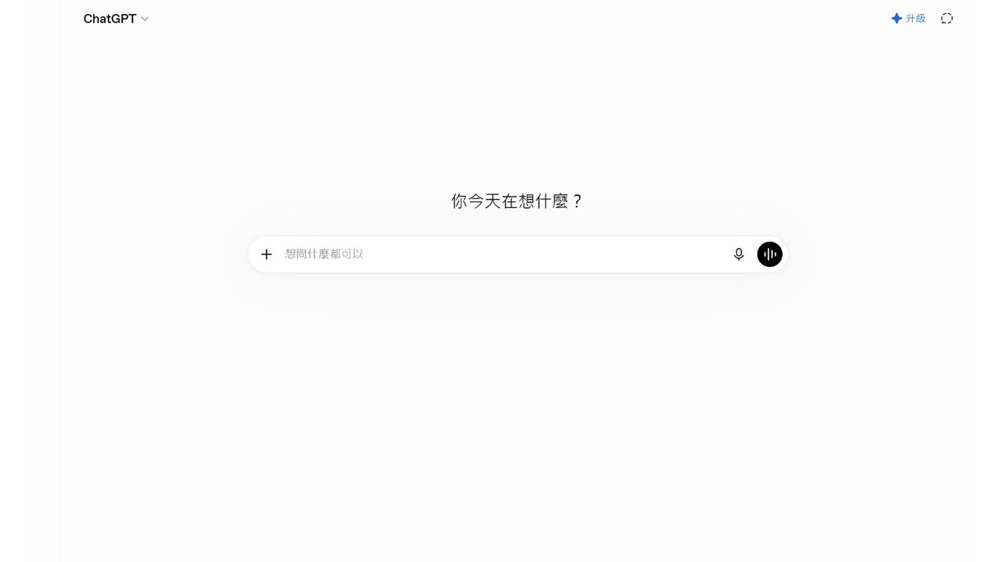
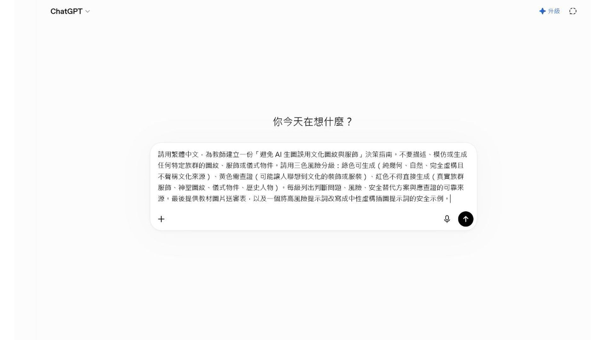
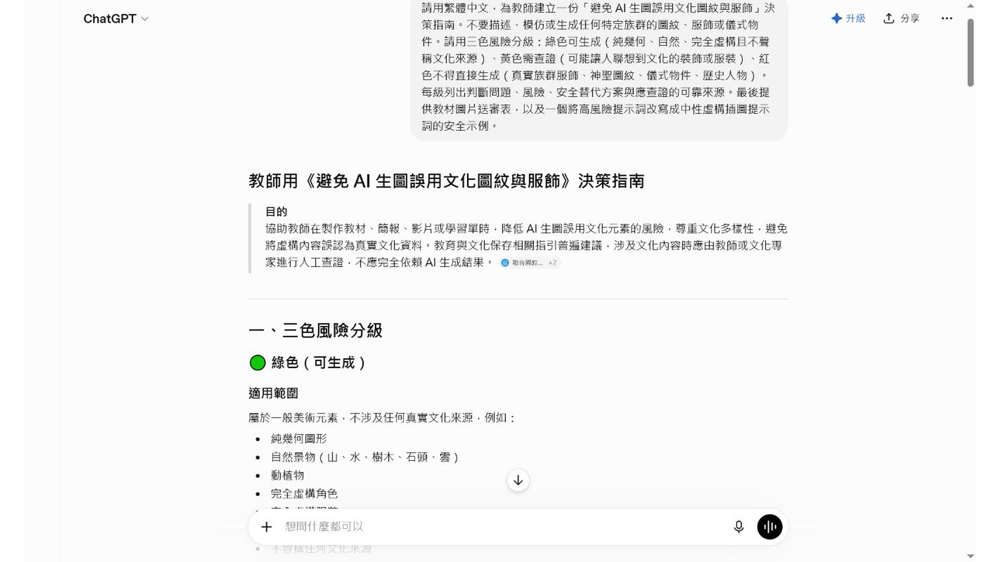

# EP040｜先建立生圖文化安全判斷指南

## 今天只做一件事

這一集先不要急著叫 AI 生圖。

我們先用 ChatGPT 做一份「生圖前判斷指南」，幫助老師分辨：哪些畫面可以直接用 AI 生成，哪些畫面需要先查資料或請熟悉文化內容的人確認。

完成後，你會有：

- 一份綠色、黃色、紅色的生圖判斷指南。
- 一張可以在生圖前先看的檢查表。
- 一段可以保存、之後重複使用的提示文字。

這一集的成果不是圖片，而是一個**生圖前的決定工具**。

---

## 為什麼要先做判斷指南？

AI 看到「傳統服飾」「族群圖紋」「祭儀」「歷史人物」這些詞時，可能會自行拼湊畫面。

畫面看起來漂亮，不代表內容就可以直接放進教材。老師如果先有一張簡單的判斷指南，就能在輸入提示文字以前先問：

1. 這張圖是不是只要一般美術元素？
2. 這張圖是不是會讓人聯想到特定文化？
3. 我手上有沒有正式資料可以核對？

---

## 先知道今天會看到什麼

本集截圖使用 ChatGPT 示範。畫面中會出現：

- ChatGPT 對話首頁。
- 貼上完整提示文字的輸入框。
- ChatGPT 整理出的三色風險分級。

畫面上的工具位置可能會改版，但操作順序不變：**貼上需求、送出、閱讀結果、整理成自己的檢查表。**

---

## STEP 1｜打開 ChatGPT

先打開你平常使用的 ChatGPT，進入可以輸入問題的對話畫面。

今天先不要上傳學生照片、族人照片或未公開的文化資料。練習只使用下面這段一般性的提示文字。



---

## STEP 2｜把需求貼到輸入框

點一下畫面下方的輸入框，貼上下面這段文字。

## 可直接複製的提示文字

```text
請用繁體中文，為教師建立一份「避免 AI 生圖誤用文化圖紋與服飾」的決策指南。

不要描述、模仿或生成任何特定族群的圖紋、服飾或儀式物件。

請使用三色風險分級：

綠色：可以生成的一般美術元素，例如純幾何圖形、自然景物、動植物、完全虛構角色。

黃色：可能讓人聯想到文化裝飾或服裝，需要先查證並由老師確認。

紅色：涉及真實族群服飾、神聖圖紋、儀式物件或歷史人物，不可以直接生成。

請每一級列出：判斷問題、可能風險、安全替代方案，以及需要查證的資料來源。

最後請提供：
1. 一張教材圖片送審前的檢查表。
2. 一個把高風險提示文字改寫成中性虛構插圖提示文字的安全範例。

不要自行翻譯族語，不要把虛構內容當成正式文化資料，也不要替老師判定文化內容正確與否。
```

貼上後，先對照畫面確認文字完整，再準備送出。


---

## STEP 3｜送出提示文字

按下送出按鈕，等待 ChatGPT 完成整理。

這個步驟不是請 AI 直接決定「這個文化內容可不可以用」，而是請它把老師之後要思考的問題整理成表格和分類。



如果畫面顯示正在產生，先等內容完整出現，不要在回答還沒完成時截圖或複製。

---

## STEP 4｜先讀懂三色分級

ChatGPT 完成後，先找到「三色風險分級」這個段落。

### 綠色：可以先做的低風險畫面

例如：

- 純幾何圖形。
- 一般自然景物。
- 一般動植物。
- 完全虛構、沒有指向特定族群的角色。

這不代表圖片一定正確，而是畫面沒有直接使用特定文化內容，通常比較容易開始。

### 黃色：先查資料再決定

如果畫面可能讓人想到特定文化的裝飾、服裝或器物，先停下來查證，不要因為 AI 說可以就直接使用。

### 紅色：不要直接交給 AI 生成

涉及真實族群服飾、神聖圖紋、儀式物件或歷史人物時，不要讓 AI 自行想像。先使用正式資料，並請適合的人確認。


---

## STEP 5｜把回答整理成自己的檢查表

不要只把 ChatGPT 的長篇回答留在對話裡。請把它整理成一張之後真的會使用的小卡。

## 我的生圖前判斷表

**這張圖要教什麼：**

________________________________

**畫面是否涉及特定文化服飾、圖紋、器物或儀式？**

□ 沒有，先列為低風險練習

□ 可能有，先查證

□ 有，先停止生圖並找合適的人確認

**我使用的正式資料或來源：**

________________________________

**需要誰確認：**

________________________________

**如果資料不足，我的處理方式：**

□ 改成一般教室或日常情境

□ 改成完全虛構、不中指特定族群的角色

□ 標記【待老師補充核定資料】

□ 暫停製作

把這張表和提示文字一起保存，之後做 EP041 的圖片檢查時可以繼續使用。



---

## STEP 6｜練習把高風險需求改成安全的練習題

假設原本想請 AI 畫出「某個真實族群的傳統服飾」。

在資料還沒有核定以前，不要直接生成。

可以先改成：

```text
請生成一張適合國小教材的完全虛構角色插圖。

角色穿著不指向任何真實族群的簡單日常服裝，畫面是一般教室門口，角色正在向同學揮手。

不要使用真實族群的服飾、圖紋、儀式物件、校名、Logo 或任何文化符號。
圖片中不要出現文字，保留空白方便老師後續排版。
```

這不是把文化內容刪掉，而是把「尚未確認的文化內容」先拿掉，避免 AI 自己猜。

---

## STEP 7｜保存今天的成果

請保存三樣東西：

1. ChatGPT 的原始提示文字。
2. 整理後的三色判斷指南。
3. 你自己的生圖前判斷表。

檔名可以這樣寫：

```text
EP040_生圖前文化安全判斷指南_日期.md
EP040_生圖前判斷表_日期.md
```

不要只保存截圖。之後要修改規則或交給另一位老師接手時，文字檔會比較容易閱讀和更新。

---

## 本集完成前檢查

□ 我知道這一集的成果是判斷指南，不是生成圖片。

□ 我已經把提示文字完整貼入 ChatGPT。

□ 我看懂綠色、黃色、紅色分別代表什麼。

□ 我沒有把 AI 的回答當成正式文化判定。

□ 我有記下需要查證的資料來源。

□ 資料不足時，我知道要停下來或標示待補充。

□ 我已保存提示文字、判斷指南和自己的檢查表。

---

## 今天記住一句話就好

**先判斷能不能安全地畫，再決定要不要叫 AI 生圖。**
