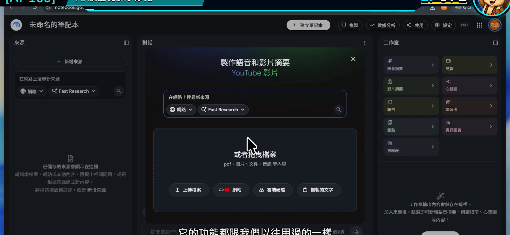
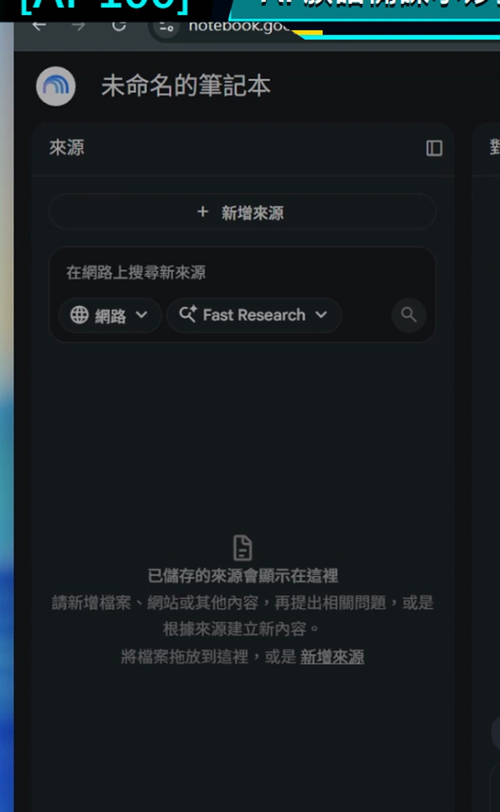
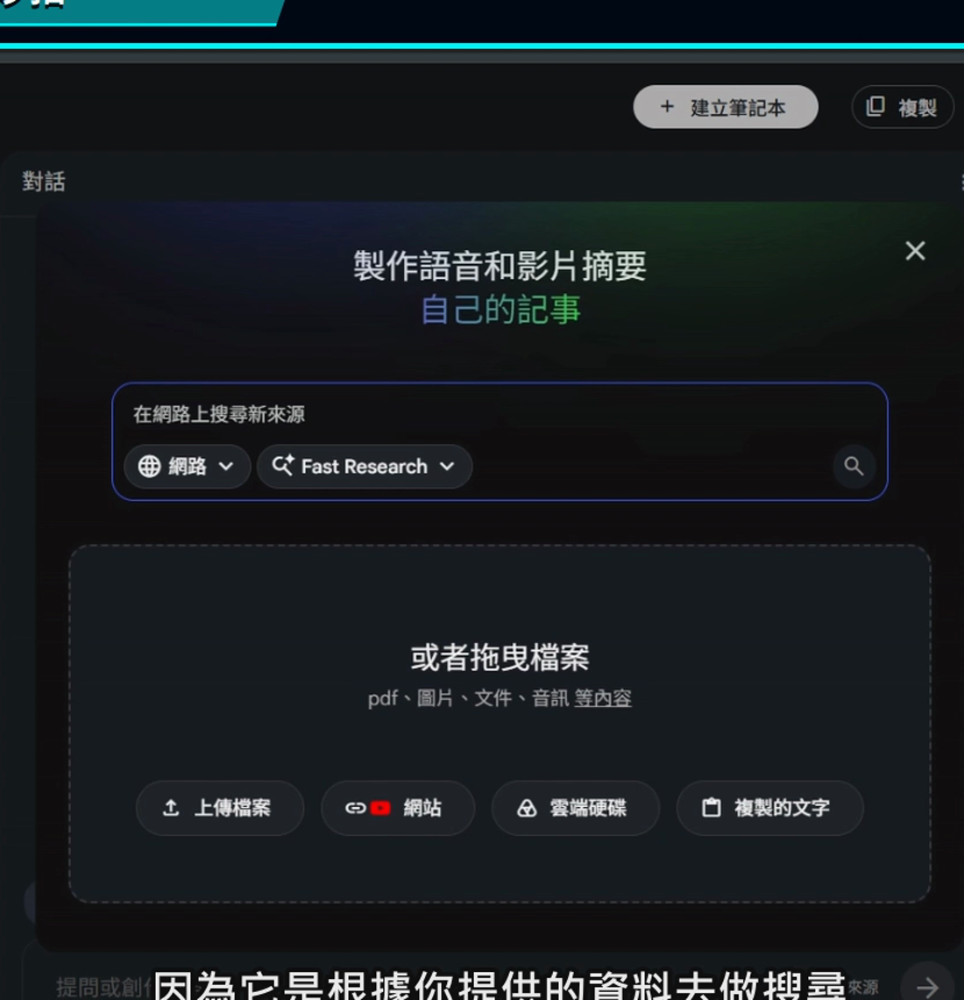
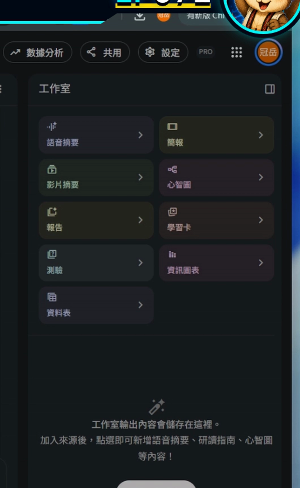
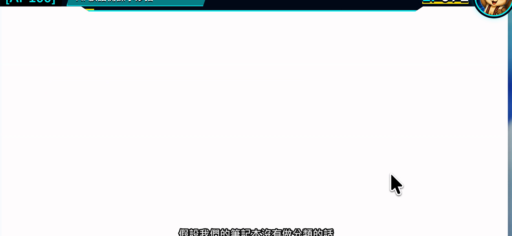

# EP071｜認識 Gemini Notebook：族語老師的備課神器

## 今天只做一件事

先不要急著把整學期教材全部丟進去。

這一集只要看懂 Gemini Notebook 的三個工作區：

**來源、對話、工作室。**

看完之後，你會知道資料放哪裡、問題在哪裡問，以及學習卡、簡報、心智圖等成果要去哪裡製作。

> Google 已把 NotebookLM 更名為 Gemini Notebook。不同帳號的介面可能仍看到 NotebookLM 名稱，但本系列說的是同一項工具。

---

## 為什麼族語老師會需要它？

備課時，我們常同時打開詞表、講義、簡報、教案和網站。資料一多，最花時間的不是「沒有資料」，而是找不到哪一份才是現在要用的版本。

Gemini Notebook 的用法可以先想成：

**把一個教學主題需要的資料放進同一本筆記本，再請工具只根據這些資料協助整理。**

例如要準備「日常問候」單元，可以把已核定詞表、老師自己的教案與課堂活動說明放在同一本筆記本裡。之後詢問時，回答旁邊還能回看引用來源，比在一般聊天視窗裡四處找資料容易得多。

---

## 今天做完會拿到什麼？

今天不做正式教材，只完成一張工作區導覽卡：

| 工作區 | 放什麼／做什麼 | 今天先記住 |
| --- | --- | --- |
| 來源 | PDF、文件、網站、音訊或貼上的文字 | 這是回答的依據 |
| 對話 | 輸入問題、查看回答與引用 | 在這裡整理教材 |
| 工作室 | 產生語音摘要、簡報、心智圖、學習卡、測驗等 | 在這裡把資料變成成果 |

---

## 開始前先準備

1. 一個可以登入 Google 的瀏覽器。
2. 一份可以拿來練習、沒有學生個資的教材檔。
3. 先決定一個小主題，例如「日常問候」或「數字練習」。

第一次只用一個主題就好。不同單元先不要混在一起，等熟悉後再慢慢增加。

---

# STEP 1｜打開 Gemini Notebook

進入 Gemini Notebook 後，先停在首頁或筆記本清單，不要急著上傳資料。

### 畫面要看到

畫面上可以建立新筆記本，也能看到以前建立過的筆記本。

### 老師要做

先確認自己登入的是準備教材用的 Google 帳號，再觀察頁面上建立筆記本的位置。

### 完成後確認

你能指出「建立筆記本」在哪裡，就可以繼續。

---

# STEP 2｜認識左邊的「來源」

打開一個練習筆記本後，先看左側。

來源區就是這本筆記本的資料櫃。之後加入的 PDF、Google 文件、網站或貼上的文字，都會列在這裡。

### 畫面要看到

左側有來源清單，以及新增來源的入口。

### 老師要做

記住一個判斷方法：

**回答怪怪的時候，先回來源區檢查目前到底勾選了哪些資料。**

### 完成後確認

你知道來源區不是存放最後講義，而是存放「AI 回答時要依據的資料」。

---

# STEP 3｜認識中間的「對話」

中間是和筆記本提問的地方。

來源準備好後，可以在這裡請它摘要、比較、整理成表格，或找出某一段內容。回答內若有引用標記，可以點開回到原始來源核對。

### 畫面要看到

中間有輸入問題的位置，以及根據來源產生的回答。

### 老師要做

先學會問一個範圍很小的問題，例如：「這份教材分成哪三個部分？」不要一開始就要求完成整套課程。

### 完成後確認

你知道問題要在中間輸入，而且回答仍要回到來源核對。

---

# STEP 4｜認識右邊的「工作室」

右側工作室是把來源加工成其他學習形式的地方。

不同帳號與版本可能看到語音摘要、簡報、心智圖、報告、學習卡、測驗、資訊圖表或資料表等功能。

### 畫面要看到

右側有一組可以選擇的成果類型。

### 老師要做

今天先不要全部按。只要找到「工作室」，知道後面的課程會從這裡製作成果即可。

### 完成後確認

你能說出來源、對話、工作室三區的用途。

---

# STEP 5｜回到筆記本清單，建立整理習慣

一個單元建立一本筆記本，名稱要讓三個月後的自己也看得懂。

### 建議命名

`年級或班級_主題_用途_版本`

例如：

`國小中年級_日常問候_備課資料_V1`

### 畫面要看到

筆記本清單中的名稱能清楚分辨，不是每一本都叫「未命名筆記本」。

### 完成後確認

你知道哪一本對應哪個教學單元，也知道資料要從哪裡再打開。

---

## 可直接複製的第一次測試文字

把一份練習資料加入後，可以先問：

> 請只根據目前勾選的來源，用三點告訴我這份教材的主題、適用對象，以及可以設計成哪一個小型課堂活動。每一點都標出引用依據；來源沒有寫到的內容請直接說沒有資料。

這段不是要它替老師決定課程，而是測試：

1. 問題有沒有送到對話區。
2. 回答有沒有根據來源。
3. 引用能不能回到原文。

---

## 放回族語備課會怎麼用？

以「日常問候」為例，可以把一本筆記本分工成：

- 來源：正式詞表、核定教材、老師教案。
- 對話：找出本課重點、整理活動順序、比較兩份版本。
- 工作室：做成課堂簡報、學習卡或複習測驗。

學生不用進入這個工作區。老師把整理好的成果帶進課堂即可。

---

## 如果畫面和講義不同

### 找不到 Gemini Notebook

可以先從 Google 應用程式選單尋找，或直接開啟 Notebook 網站。部分帳號仍可能顯示 NotebookLM 名稱。

### 看不到某個工作室功能

帳號、地區與方案可能讓功能不同。先完成來源與對話練習，不需要卡在某一顆按鈕。

### 回答內容太散

先檢查來源是否混入不同主題，再把問題縮小成一件事。

---

## 完成前最後檢查

□ 我已經找到 Gemini Notebook。

□ 我知道左邊是來源、中間是對話、右邊是工作室。

□ 我準備的是沒有學生個資的練習資料。

□ 我知道回答可以點引用回到原文。

□ 我已經想好第一本筆記本的清楚名稱。

---

## 今天記住一句話就好

**來源放對地方，問題才有可靠的起點。**

---

## 官方參考

- [Google：NotebookLM 更名為 Gemini Notebook](https://blog.google/innovation-and-ai/products/gemini-notebook/notebooklm-gemini-notebook/)
- [Google 說明：認識 NotebookLM／Gemini Notebook](https://support.google.com/notebooklm/answer/16164461?hl=zh-Hant)

**下一篇｜EP072 建立筆記本：認識四種教材來源**
