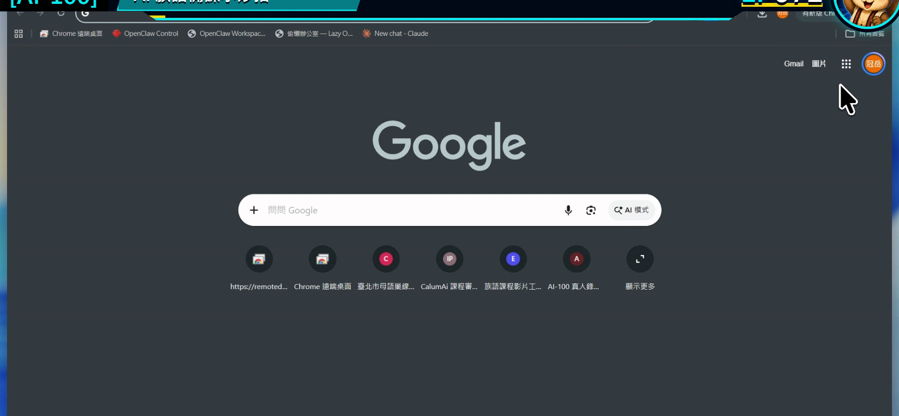
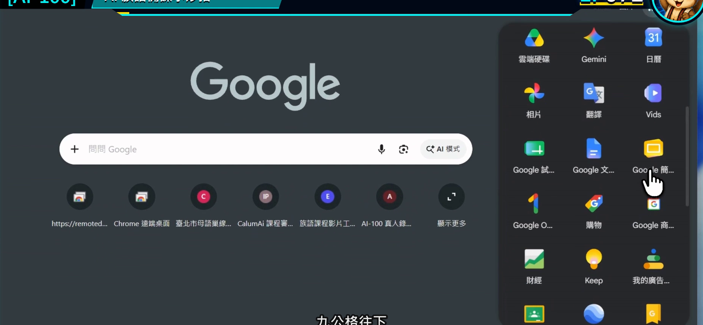
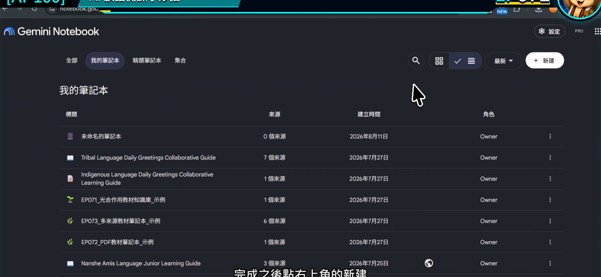
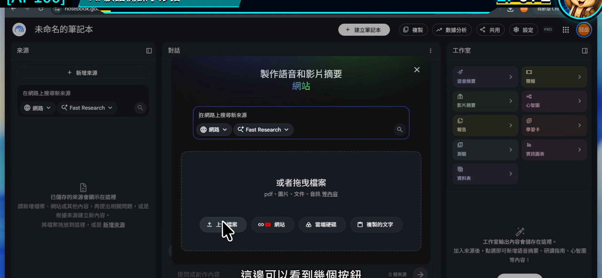
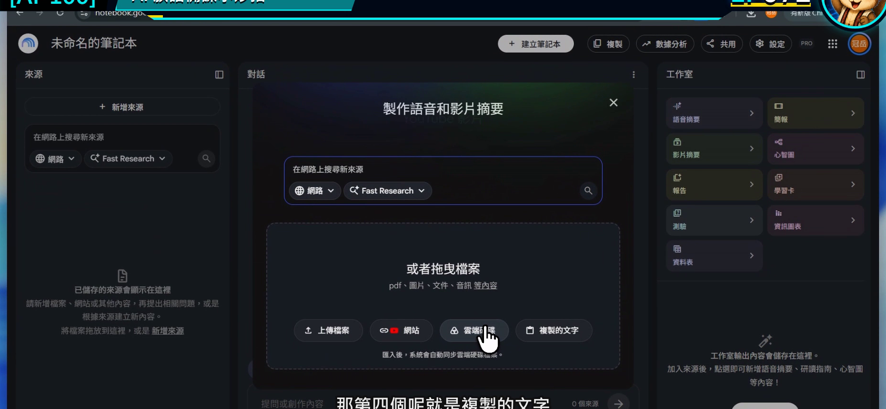

# EP072｜建立筆記本：認識四種教材來源

## 今天只做一件事

建立第一本 Gemini Notebook，並學會用四種常見方式加入教材來源：

**上傳檔案、貼入網站、從 Google 雲端硬碟加入、貼上文字。**

今天不追求資料很多。完成一個來源乾淨、名稱清楚的小筆記本，就已經成功。

---

## 今天的示範

我們要建立一本：

**「國小中年級＿日常問候＿備課資料」**

示範只放兩份資料：

1. 老師已核對的問候教材 PDF。
2. 一小段老師自己的課堂活動說明。

先用少量資料，是因為等等若回答有問題，比較容易找到是哪個來源造成的。

---

## 四種來源怎麼選？

| 你手上的資料 | 選哪一種 | 使用前先看 |
| --- | --- | --- |
| PDF、Word、簡報、圖片、音訊 | 上傳檔案 | 檔案是否為最新版 |
| 公開文章或有字幕的 YouTube 影片 | 網站 | 網址是否能公開讀取、內容是否適合引用 |
| Google 文件、簡報、試算表 | 雲端硬碟 | 登入帳號是否有權限 |
| 教案片段、課堂備忘、短篇文字 | 複製的文字 | 標題與來源要自己補清楚 |

同一份資料不要用四種方式重複加入，否則同樣內容可能在回答裡被重複計算。

---

## 開始前先準備

1. 建立一個專門練習的資料夾。
2. 把檔名改成看得懂的版本，例如 `日常問候_核定教材_2026.pdf`。
3. 移除學生姓名、照片、成績與其他不需要上傳的資料。
4. 記下資料來源與版本日期。

---

# STEP 1｜從 Google 進入工具

登入 Google 後，可以從首頁右上角的應用程式選單尋找 Gemini Notebook。

### 畫面要看到

先看到 Google 首頁與右上角的應用程式入口。

接著打開應用程式選單，找到 Notebook／NotebookLM 圖示。介面名稱可能因帳號更新時間不同。

### 老師要做

用備課帳號進入工具。若學校帳號看不到，可以先確認管理員是否開放，或改用自己被允許使用的帳號測試。

### 完成後確認

你已經到達筆記本清單頁。

---

# STEP 2｜建立一本新筆記本

按下建立新筆記本。

### 畫面要看到

頁面上有建立新筆記本的按鈕。

### 老師要做

先用單元名稱命名，不要保留「未命名」。

建議格式：

`教學對象_主題_用途_版本`

### 完成後確認

筆記本名稱能讓你立刻知道這本資料要拿來準備哪一堂課。

---

# STEP 3｜先看空白工作區

新筆記本建立後，中央會提示加入來源，左、中、右三區也會出現。

### 畫面要看到

左側來源目前是空的，中間還沒有根據資料產生回答。

### 老師要做

先停一下，確認自己不是進到別人的舊筆記本。再按「新增來源」。

### 完成後確認

頁面上顯示的是你剛命名的新筆記本。

---

# STEP 4｜認識四個加入入口

新增來源視窗裡，可以看到不同的資料入口。

### 畫面要看到

上傳檔案、網站、雲端硬碟與複製的文字等選項。

### 老師要做

今天先選兩個：

1. 用「上傳檔案」加入已核對的教材 PDF。
2. 用「複製的文字」貼入老師自己的活動說明。

貼上文字時，第一行先寫清楚標題與版本，例如：

> 文件名稱：日常問候課堂活動說明 V1  
> 整理者：授課老師  
> 更新日期：2026-08-13

### 完成後確認

左側來源清單出現兩筆，而且名稱不會混淆。

---

# STEP 5｜讓工具先列出來源，不急著做教材

資料加入後，第一個問題不是「幫我做完整講義」，而是確認工具讀到了什麼。

## 可直接複製的檢查文字

> 請只根據目前勾選的來源，列出每份來源的名稱、主要內容、版本或日期，以及它適合用在本單元哪一個備課工作。找不到版本時請寫「來源未標示」，不要自行推測。

### 畫面要看到

回答中的來源數量和左側一致，並且能指出每份資料的用途。

### 完成後確認

如果檔名、版本或內容不對，現在就先刪除錯誤來源並重新加入，不要等做到最後才發現用錯資料。

---

## 來源小卡：替每份教材留下身分

每加入一份重要教材，可以在自己的資料紀錄中留下：

| 欄位 | 填寫內容 |
| --- | --- |
| 顯示名稱 | 這份資料在筆記本裡叫什麼 |
| 原始來源 | 哪個單位、哪位老師或哪個網站 |
| 版本日期 | 何時更新 |
| 使用範圍 | 哪一班、哪一單元 |
| 備註 | 是否已核對、是否可公開 |

Gemini Notebook 幫忙讀資料，但版本管理仍然要由老師自己掌握。

---

## 四種來源常見問題

### PDF 上傳後內容很亂

先打開原始 PDF，確認文字能不能反白選取。若整份只是掃描圖片，辨識結果可能不完整，重要詞句要另外核對。

### 網址加入失敗

需要登入、被權限限制或沒有公開內容的頁面，工具可能無法讀取。可以改用有權限的原始文件，或將可使用內容整理成檔案再上傳。

### Google 雲端硬碟找不到檔案

確認目前登入帳號就是擁有檔案權限的帳號。

### 貼上的文字之後看不懂來源

在第一行補上標題、整理者、日期與資料依據，再重新加入。

---

## 放回族語備課會怎麼用？

同一個問候單元，可以先這樣分：

- 正式詞句與文化說明：放核定教材。
- 老師教學節奏：放自己的教案。
- 學生練習方式：放活動說明。

三種資料各有角色。不要把網路文章、學生作業和正式詞表全混成一份沒有名稱的來源。

---

## 完成前最後檢查

□ 我已建立一個名稱清楚的新筆記本。

□ 我知道四種常見的來源入口。

□ 我先加入少量、可辨識版本的資料。

□ 左側來源名稱能分辨用途。

□ 我先確認來源內容，再開始要求 AI 製作教材。

□ 練習資料沒有學生個資或未授權內容。

---

## 今天記住一句話就好

**先把來源整理好，後面的每一個成果才找得到根。**

---

## 官方參考

- [Google 說明：建立筆記本](https://support.google.com/notebooklm/answer/16206563?hl=zh-Hant)
- [Google 說明：加入或探索來源](https://support.google.com/notebooklm/answer/16215270?hl=zh-Hant)

**下一篇｜EP073 用教材提問：讓 AI 根據來源回答**
