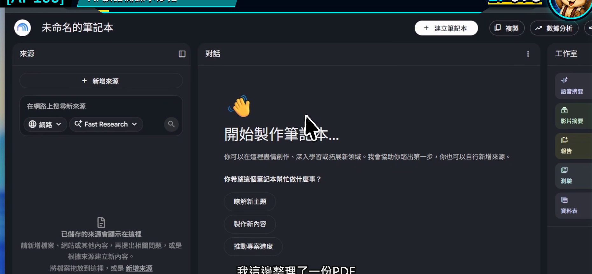
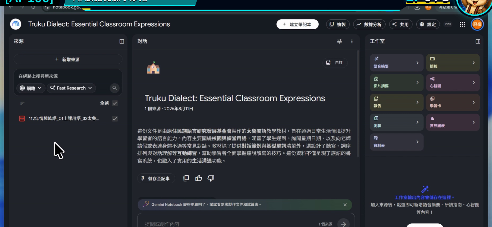
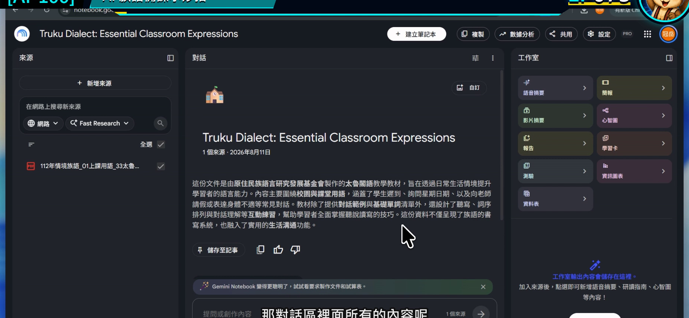
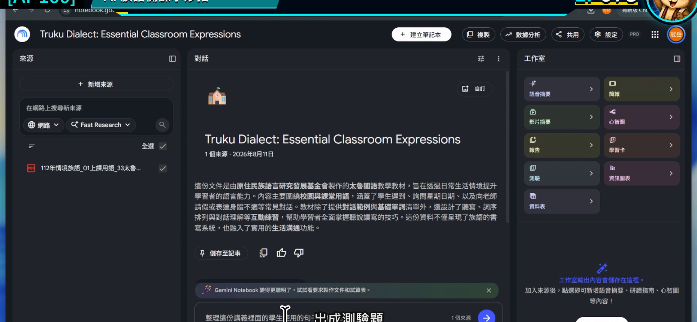
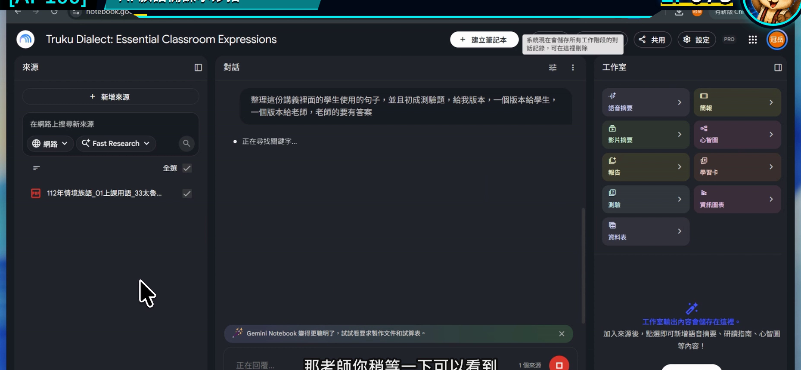

# EP073｜用教材提問：讓 AI 根據來源回答

## 今天只做一件事

把一個模糊問題，改寫成 Gemini Notebook 能根據教材回答、老師也能回頭核對的問題。

今天完成後，你會有：

**一段可重複使用的教材提問格式，以及一份帶有引用的整理結果。**

---

## 為什麼「有放資料」還不夠？

如果只問：

> 這份教材怎麼教？

範圍太大，回答容易同時混入教學目標、活動、評量與其他建議，老師反而不知道先用哪一段。

比較好用的問題會說清楚四件事：

1. 使用哪些來源。
2. 要處理哪一個教學主題。
3. 要整理成什麼格式。
4. 找不到資料時怎麼標示。

---

## 今天的示範

筆記本裡已經放入一份老師核對過的「日常問候教材」。

我們要請 Gemini Notebook 找出：

- 課堂可用的問候情境。
- 教材提供的活動線索。
- 每一點來自哪一份來源。

這一集不請 AI 自己翻譯族語，也不補寫教材沒有提供的句子。

---

## 開始前先準備

1. 打開上一集建立的筆記本。
2. 確認左側至少有一份可用來源。
3. 先在心裡決定今天只問一件事。

---

# STEP 1｜確認目前勾選的來源

在左側來源區，看清楚哪些資料有打勾。

### 畫面要看到

來源已完成載入，而且只有今天需要的資料被勾選。

### 老師要做

如果同一本筆記本裡有不同單元，先取消不相關來源。今天做問候活動，就不要同時選進數字、歌謠或其他主題。

### 完成後確認

輸入框旁顯示的來源數量，和你預計使用的數量一致。

---

# STEP 2｜先打開一份來源看原文

點選來源名稱，快速查看標題、內容與版本是不是正確。

### 畫面要看到

來源內容能正常開啟，文字不是空白，也不是錯誤版本。

### 老師要做

先找一個等一下可以核對的段落，例如活動目的或情境說明。這樣回答出來時，不會只憑印象判斷。

### 完成後確認

你知道這份資料大概在哪一段說了什麼。

---

# STEP 3｜先讀筆記本的來源摘要

回到對話區，看看工具根據來源顯示的摘要。

### 畫面要看到

摘要內容與剛才打開的來源主題一致。

### 老師要做

如果摘要已經認錯主題，先回來源區處理，不要在錯誤資料上繼續追問。

### 完成後確認

你能用一句話說出目前這本筆記本正在處理什麼。

---

# STEP 4｜用四段式寫出問題

在對話輸入框貼入下面格式。

## 可直接複製的教材提問

> 請只根據目前勾選的來源，整理「日常問候」課堂可使用的內容。  
> 請分成三欄：①教材明確提供的情境、②老師可以怎麼帶活動、③對應來源與引用。  
> 每一列只放一個重點，使用適合初學老師閱讀的白話。  
> 來源沒有提供的族語詞句、拼寫、發音或文化說明，請標示「來源未提供」，不要自行補寫。

### 畫面要看到

完整問題已放入輸入框，不是只有「幫我整理」四個字。

### 完成後確認

送出前，快速圈出問題裡的「來源、任務、格式、缺資料處理」四部分。

---

# STEP 5｜送出後先點引用

送出問題，等待回答完成。

### 畫面要看到

回答依照指定格式出現，重要段落旁有可點選的引用標記。

### 老師要做

先抽查一到兩個引用：

1. 點開引用。
2. 看原文是否真的支持這句回答。
3. 若只支持一半，就把問題問得更精準或自行修正文句。

### 完成後確認

至少有一項回答已經回到原始資料核對，而不是只因文字看起來順就直接使用。

---

## 一個問題太大時，怎麼拆？

原本問題：

> 幫我做完整的問候教材。

可以拆成四次：

1. 先列出來源中出現的問候情境。
2. 再整理每個情境對應的教學目標。
3. 再依指定年級設計一個活動流程。
4. 最後整理成老師可用的講義草稿。

每次只做一層，錯誤比較容易看見，也比較容易修。

---

## 回答不理想時，不用整本重來

### 回答太長

接著說：

> 請保留原本引用，把每一點縮成 40 字以內，只留下上課會用到的內容。

### 回答混入別的單元

取消不相關來源，再說：

> 請重新回答，這次只使用目前勾選的兩份來源。

### 回答沒有說明依據

改問：

> 請在每一點後標示來源名稱與引用位置。無法找到依據的句子請刪除。

### 引用點開後對不上

不要硬用那一句。回到來源原文，重新問更小的問題，或由老師自己整理。

---

## 放進課堂前，再做一次轉換

Notebook 的回答是備課材料，不一定適合原封不動給學生看。

老師可以把已核對的內容轉成：

- 課堂提問卡。
- 看圖說話活動順序。
- 教師備課摘要。
- 下一集要分級的學習單素材。

學生端只需要看到整理好的教材，不需要看到來源管理與提示文字。

---

## 完成前最後檢查

□ 我只勾選今天需要的來源。

□ 我先看過至少一段原始內容。

□ 問題有寫清楚來源、任務、格式與缺資料處理。

□ 我至少點開一個引用核對。

□ 我沒有把來源未提供的內容當成教材事實。

□ 我留下最後使用的問題文字，之後可以重複修改。

---

## 今天記住一句話就好

**問得越具體，越容易知道答案能不能用。**

---

## 官方參考

- [Google 說明：在筆記本中使用對話](https://support.google.com/notebooklm/answer/16179559?hl=zh-Hant)

**下一篇｜EP074 同一份教材做分級學習單**
