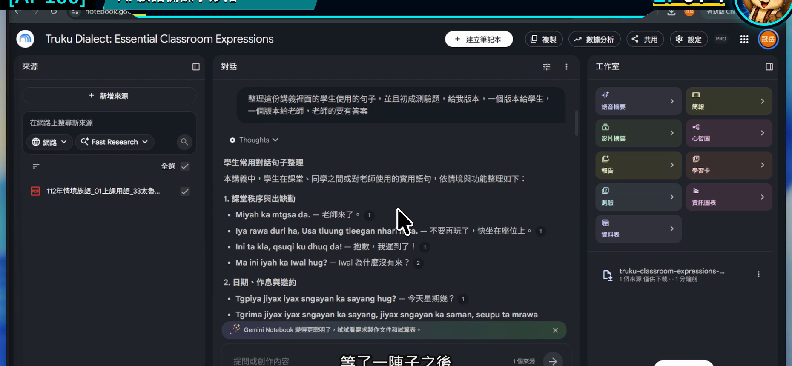
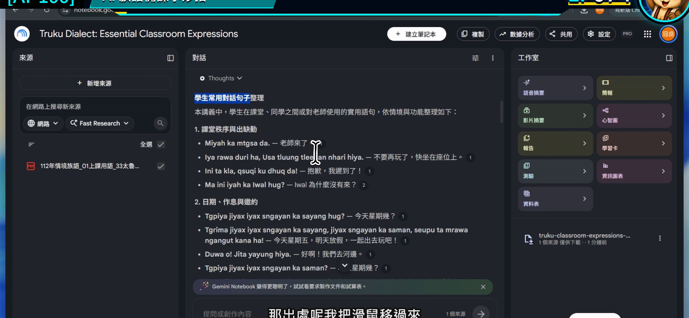
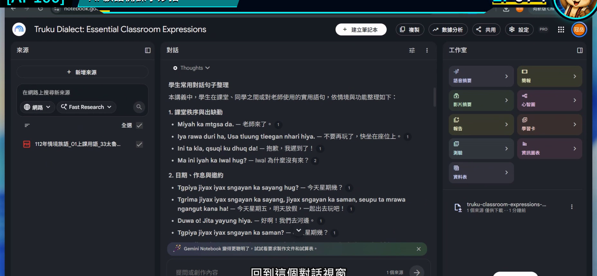
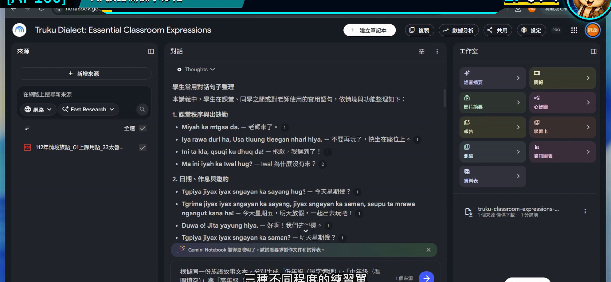
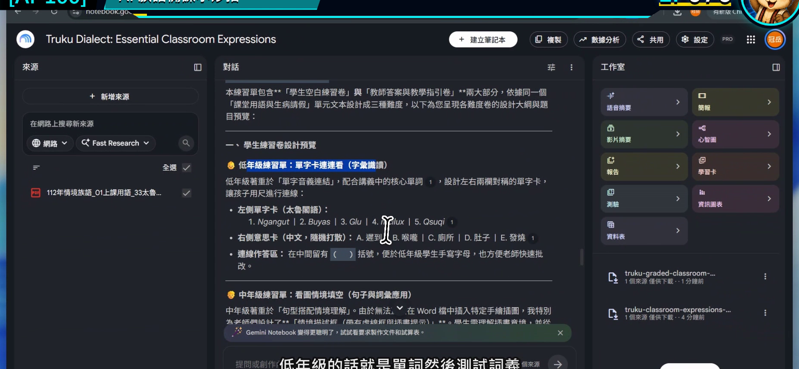

# EP074｜同一份教材做分級學習單

## 今天只做一件事

使用同一份已核對教材，做出三個難度不同、但教學重點一致的學習單草稿。

完成後會得到：

**低年級、中年級、高年級各一份可繼續編輯的活動框架。**

不是把同一題換三種字體大小，而是真正調整學生要做的動作與作答負擔。

---

## 為什麼要從「同一份教材」開始？

如果三個年段各自重新請 AI 發揮，很容易發生：

- 低年級教 A，中年級突然變成 B。
- 題目看似活潑，卻超出原始教材。
- 三份學習單使用的詞句版本不一致。

所以今天先把內容的根固定住，只調整：

**題型、提示程度、文字量與學生要完成的任務。**

---

## 今天的示範

使用同一份「日常問候」教材，做成：

| 年段 | 學生主要任務 | 先不做什麼 |
| --- | --- | --- |
| 低年級 | 看圖、圈選、跟讀 | 不寫長句 |
| 中年級 | 配對、排序、兩人練習 | 不做長篇解釋 |
| 高年級 | 判斷情境、完成短對話、說明選擇 | 不新增來源沒有的文化內容 |

族語詞句的位置一律使用老師核對後的原文，AI 只協助安排活動框架。

---

## 開始前先準備

1. 上一集已確認引用正確的教材整理結果。
2. 確定要分成哪三個年段。
3. 先寫出所有年段共同的單一學習目標。

今天示範的共同目標：

> 學生能看懂兩人見面問候的情境，並在老師帶領下完成一次口語練習。

---

# STEP 1｜先確認上一集的回答有依據

不要直接拿第一版回答做三份學習單。先回到對話結果，抽查引用。

### 畫面要看到

回答中的重點旁有引用，內容能回到原始教材。

### 老師要做

挑出這一集真正要用的三種材料：

1. 一個教學情境。
2. 一組已核對詞句的位置。
3. 一個可觀察的學生任務。

### 完成後確認

三種材料都能指出來源，不是 AI 額外想像出來的內容。

---

# STEP 2｜點開引用，確認原文

### 畫面要看到

引用開啟後，能看到對應來源與原始段落。

### 老師要做

把要放進三份學習單的族語詞句保留原樣，不請 AI 重新拼寫、縮寫或改寫。

### 完成後確認

共同教材內容已固定，接下來只改活動難度。

---

# STEP 3｜先寫三個年段的「學生動作」

回到對話區，先不要要求完整排版。

### 畫面要看到

對話仍使用同一組來源，可以繼續追問。

### 老師要做

先在紙上或文件中寫：

- 低年級：看、指、圈、跟著說。
- 中年級：配對、排序、兩人輪流說。
- 高年級：判斷、完成、比較、短句說明。

這些動詞會比「簡單一點、困難一點」更容易讓 AI 做對。

---

# STEP 4｜貼入分級提示文字

## 可直接複製的提示文字

> 請只根據目前勾選的教材來源，為同一個「日常問候」學習目標設計三份學習單草稿。  
> 低年級版：3 題，以看圖、圈選、教師帶讀為主，每題只做一個動作。  
> 中年級版：4 題，包含情境配對、順序排列與兩人練習。  
> 高年級版：4 題，包含情境判斷、完成短對話與一句理由。  
> 三份都要列出：活動目標、準備材料、題目指示、老師帶法、完成判準。  
> 族語詞句請保留來源原文並附引用；若來源不足，請放入【老師填入已核對詞句】，不要自行翻譯或創作。  
> 先輸出內容表格，不要製作華麗版面。

### 畫面要看到

輸入框中清楚列出三個年段、題數、任務與輸出欄位。

### 完成後確認

提示文字裡不是只有「簡單、中等、困難」，而是能看見學生實際要做什麼。

---

# STEP 5｜比較三份結果是否真的有分級

### 畫面要看到

回答分成三個年段，每個年段都有不同任務，但仍維持同一學習目標。

### 老師要做

用下面四題檢查：

1. 三份是否教同一件事？
2. 低年級是否真的減少閱讀與書寫負擔？
3. 高年級是否增加思考，而不只是增加字數？
4. 族語詞句是否仍是同一個已核對版本？

### 完成後確認

每一個年段的學生都知道自己要做什麼，老師也能在一節課內帶完。

---

## 把草稿變成真正可用的學習單

Gemini Notebook 先幫忙整理內容，接著由老師放進熟悉的文件或排版工具。

建議順序：

1. 保留已核對詞句。
2. 刪掉不適合班級的題目。
3. 加入老師自己的圖片或圖卡。
4. 留出學生作答空間。
5. 實際列印一張，檢查字級與頁數。

不要讓 AI 直接把族語字生成在圖片裡。文字與圖片分開排版，日後比較容易修正。

---

## 分級不明顯時，這樣修改

### 三份只是題目數量不同

補一句：

> 請改變學生的作答動作與提示程度，不要只增加題數。

### 低年級文字還是太多

補一句：

> 每題指示限 20 字以內，主要透過圖片、指認與口頭回答完成。

### 高年級突然出現新內容

補一句：

> 難度只增加情境判斷與表達，不得增加來源未提供的新詞句或文化知識。

### 結果看起來像教案，不像學習單

補一句：

> 請把「老師說明」與「學生看到的題目」分成兩欄，學生欄只保留可以直接操作的內容。

---

## 放進課堂的方式

同一班也可以使用分級結果：

- 全班先做共同的看圖暖身。
- 依學生熟悉程度提供不同任務卡。
- 最後回到同一個兩人問候活動。

分級不是把學生貼標籤，而是讓不同起點的學生都能進入同一個學習目標。

---

## 完成前最後檢查

□ 三份學習單使用同一份已核對教材。

□ 我先固定共同學習目標，再調整任務。

□ 三個年段的學生動作明確不同。

□ 引用內容已回到來源核對。

□ 來源不足處保留老師填寫位置。

□ 我已把結果整理成學生真正看得懂的版面。

---

## 今天記住一句話就好

**分級不是換三種難度標籤，而是替同一個目標安排三條走得進去的路。**

---

## 官方參考

- [Google 說明：在筆記本中使用對話與引用](https://support.google.com/notebooklm/answer/16179559?hl=zh-Hant)

**下一篇｜EP075 使用語音摘要掌握教材重點**
