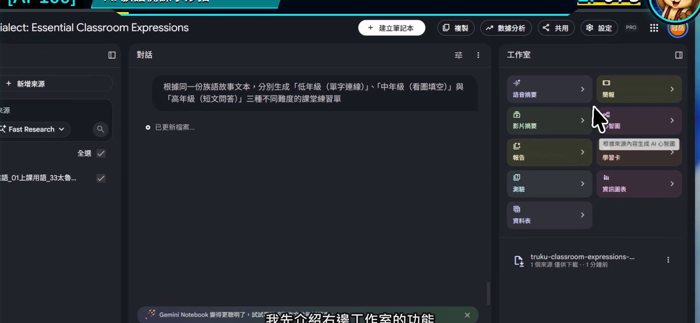
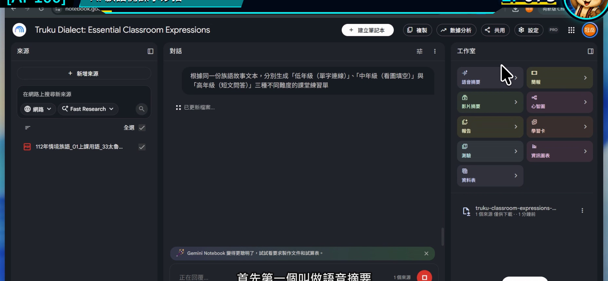
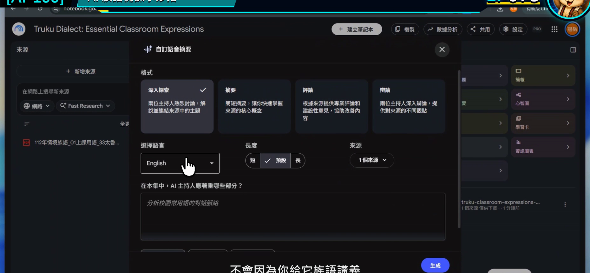
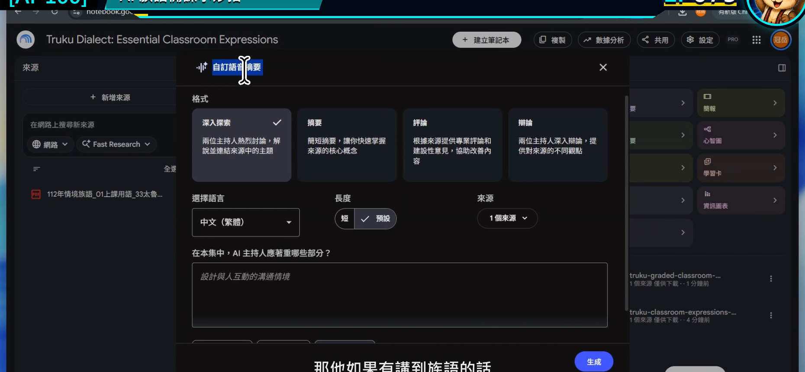
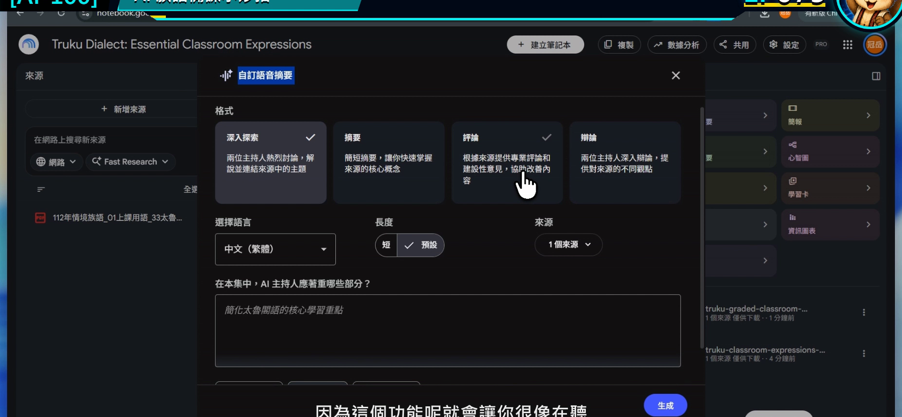

# EP075｜使用語音摘要掌握教材重點

## 今天只做一件事

把一份比較長的教材或研究資料，做成一段給老師自己聽的語音摘要。

今天的成果不是學生跟讀音檔，也不是族語發音示範，而是：

**一段幫老師先掌握資料結構與重點的備課音訊。**

---

## 什麼時候特別好用？

手上有一份二、三十頁的研究報告、教學手冊或課程計畫時，不一定能立刻坐下來逐頁讀完。語音摘要可以先幫忙回答：

- 這份資料主要在談什麼？
- 哪幾段和我下週的課有關？
- 正式閱讀時要優先看哪裡？

它適合通勤、整理教室或準備教材時先聽一次，再回到原文細讀。

---

## 先說清楚：這不是族語發音教材

Gemini Notebook 的語音是根據來源生成的。遇到族語人名、詞句或特殊拼寫時，發音不一定正確。

所以今天的分工很明確：

- 語音摘要：幫老師掌握中文說明、章節脈絡與備課重點。
- 族語示範音：仍使用正式錄音、族語老師錄音或核定教材音檔。

只要把用途分開，這個功能就很省時間。

---

## 今天做完會拿到什麼？

1. 一段聚焦在教學需求的語音摘要。
2. 一張聆聽筆記卡。
3. 三個需要回原文確認的頁面或段落。

---

## 開始前先準備

1. 一份內容較長、來源清楚的 PDF 或文件。
2. 先寫下你聽這段音訊的目的。
3. 準備耳機與一張簡單筆記紙。

今天示範的目的：

> 先了解這份教學手冊中，哪些內容可以協助安排「日常問候」單元。

---

# STEP 1｜只勾選這次要聽的來源

打開筆記本後，確認左側只勾選今天要做摘要的資料，再看右側工作室。

### 畫面要看到

右側工作室有語音摘要等成果入口。

### 老師要做

如果筆記本裡有很多不同主題，先取消不相關來源。語音摘要一旦混入太多材料，重點會變得很散。

### 完成後確認

輸入框旁的來源數量和你預計使用的一致。

---

# STEP 2｜開啟語音摘要

在工作室選擇「語音摘要」。

### 畫面要看到

語音摘要的建立或設定入口已開啟。

### 老師要做

第一次先不要直接按生成。找看看是否有自訂、格式、語言或長度等設定。

### 完成後確認

你已經進入語音摘要設定畫面，而不是影片摘要或其他功能。

---

# STEP 3｜選擇適合備課的格式

不同版本可能提供對談式、摘要式或其他格式。名稱可能更新，但選擇原則不變：

- 第一次快速掌握：選重點清楚的摘要格式。
- 想聽不同觀點：選較完整的討論格式。
- 資料很長：先做短版，確認方向後再做長版。

### 畫面要看到

設定視窗中可以調整語音摘要形式與語言等項目。

### 老師要做

語言先選自己最容易檢查內容的語言。不要因為來源含有族語，就把這段生成音訊當成發音依據。

### 完成後確認

你知道這段音訊要給誰聽，以及預計聽完要得到什麼。

---

# STEP 4｜把「想聽什麼」寫進自訂欄位

不要只讓工具自由摘要。把老師真正想解決的備課問題寫清楚。

## 可直接複製的自訂文字

> 這段語音摘要是給族語老師備課使用。請聚焦說明：  
> 1. 這份資料的主要目的與章節結構；  
> 2. 和「日常問候」課堂活動直接相關的三個重點；  
> 3. 老師正式備課時應回到原文查看的段落；  
> 4. 來源沒有提供、仍需要老師另行準備的項目。  
> 請使用清楚的繁體中文，不要朗讀或示範族語發音，也不要補寫來源沒有的族語內容。

### 畫面要看到

自訂焦點欄位已填入具體問題。

### 完成後確認

自訂內容有說明聽眾、目的與四個要點，不是只寫「整理重點」。

---

# STEP 5｜生成後，帶著聆聽卡來聽

確認設定後再按生成。完成時間會依資料長度、帳號與使用量不同。

### 畫面要看到

設定內容已完成，可以送出產生語音摘要。

### 老師要做

播放時不要逐字抄。只記下面四格：

| 聽到的內容 | 我的筆記 |
| --- | --- |
| 這份資料主要在談 | ____________________ |
| 可以帶進這一課的重點 | ____________________ |
| 要回原文查看的位置 | ____________________ |
| 聽完仍缺的教材 | ____________________ |

### 完成後確認

聽完後，你能指出下一步要讀哪一段原文，而不是只覺得「好像聽懂了」。

---

## 聽完一定要做的三分鐘核對

1. 打開摘要提到的原始段落。
2. 確認重要數字、名稱與結論沒有被簡化錯誤。
3. 把真正要放進教案的內容從原文整理出來。

語音摘要的價值是帶你找到重點，不是取代原始資料。

---

## 如果生成結果不理想

### 內容太廣，像整份資料導讀

把自訂文字改成：

> 只討論與國小中年級「日常問候」單元直接相關的內容，其餘章節用一句話帶過。

### 音訊一直念到族語詞句

補上：

> 遇到族語詞句時，請只說明它位於哪一段，不要嘗試示範讀音。

### 聽完不知道下一步

要求結尾固定提供：

> 最後列出老師接下來應回原文查看的三個段落或標題。

### 產生時間很久

先縮小來源，只選真正需要的一份；也可以先做較短格式。

---

## 放回備課流程的位置

最順的順序是：

**先聽摘要找方向 → 回原文查證 → 整理教案 → 使用正式族語音檔。**

它不是學生教材的最後成品，而是老師在大量資料前的一張路線圖。

---

## 完成前最後檢查

□ 我只勾選這次需要的來源。

□ 我先寫清楚聽這段摘要的目的。

□ 自訂內容聚焦在備課，不要求生成族語示範音。

□ 我有記下需要回原文查看的位置。

□ 重要內容已回到原始資料確認。

□ 學生若需要發音示範，會使用正式或老師錄製的音檔。

---

## 今天記住一句話就好

**語音摘要幫你找到要讀的地方，原文才是你做決定的地方。**

---

## 官方參考

- [Google 說明：建立與管理語音摘要](https://support.google.com/notebooklm/answer/16212820?hl=zh-Hant)

**下一篇｜EP076 生成簡報與教學文件**
