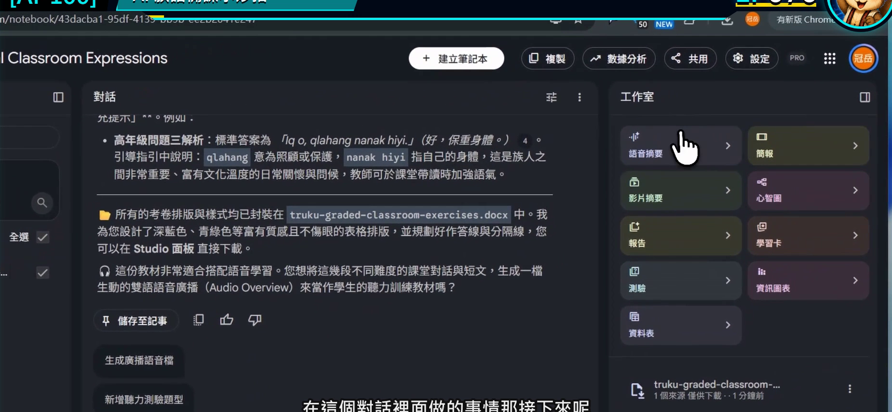
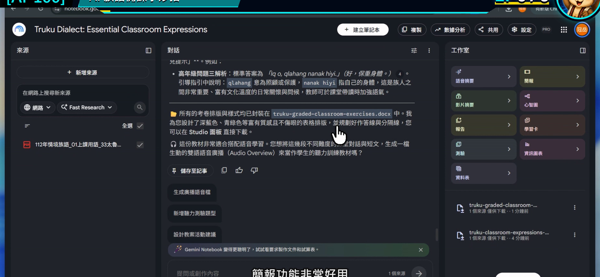
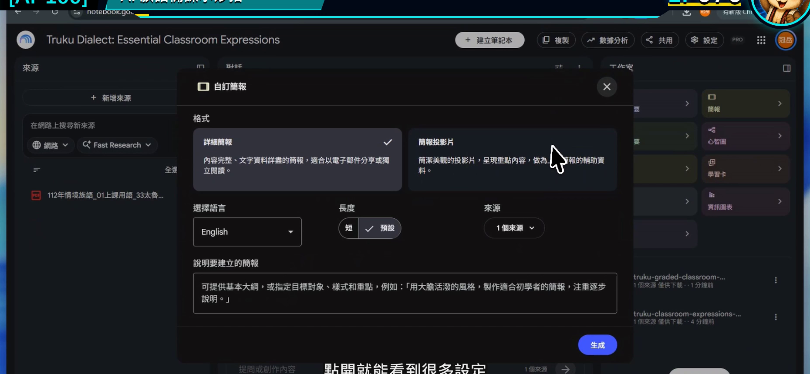
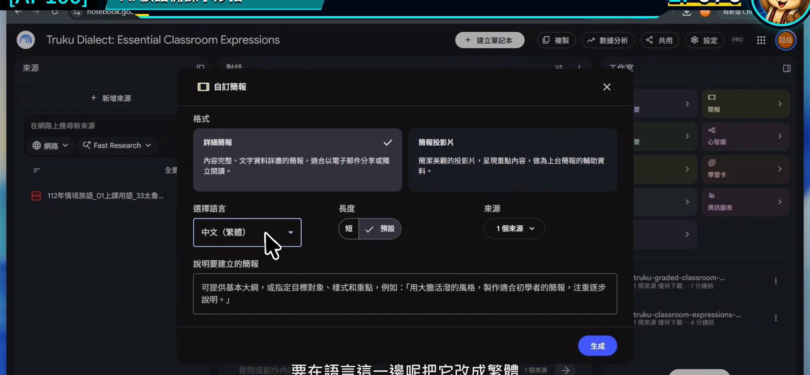
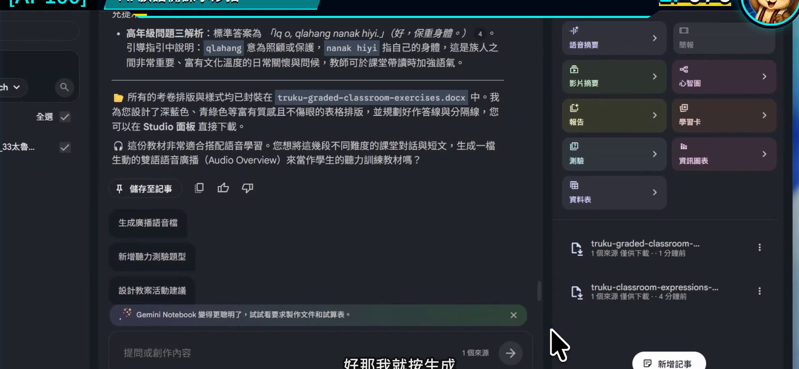

# EP076｜生成簡報與教學文件

## 今天只做一件事

把上一集整理好的教材重點，先做成一份可以繼續修改的課堂簡報，再留下老師自己的教學文件。

完成後會有兩個成果：

1. 一份頁數不多、順序清楚的簡報草稿。
2. 一份記錄每頁怎麼教的教師備課稿。

今天不是叫 AI 把課全部做完，而是先搭好一堂課的骨架。

---

## 先分清楚兩種成品

| 成品 | 誰會看 | 應該放什麼 |
| --- | --- | --- |
| 課堂簡報 | 學生 | 大字、少量重點、圖片或任務指示 |
| 教學文件 | 老師 | 目標、帶課說法、時間、材料、備註 |

如果把教師備註全塞進投影片，學生會看得很累；如果簡報只有漂亮圖片，老師上課時又找不到流程。兩份分開，反而更好用。

---

## 今天的示範

用「日常問候」的來源，建立 6 頁簡報：

1. 課程主題。
2. 看圖暖身。
3. 聽老師示範。
4. 兩人練習。
5. 情境挑戰。
6. 今天複習。

族語文字位置先放入老師已核對版本；沒有資料的頁面保留清楚的填寫位置。

---

## 開始前先準備

1. 一個來源範圍清楚的筆記本。
2. 上一集已核對的教學重點。
3. 預計上課時間，例如 40 分鐘。
4. 先決定簡報最多幾頁。

---

# STEP 1｜先看目前整理結果能不能支撐一堂課

回到對話區，確認已有學習目標、活動順序與教材依據。

### 畫面要看到

對話結果中已經有可辨認的教學重點，不是空白筆記本。

### 老師要做

先刪掉不打算放進這一堂課的內容。簡報只有 6 頁，就不要要求塞進整本教材。

### 完成後確認

你能先用六句話說完六頁要做什麼。

---

# STEP 2｜在工作室選擇簡報

到右側工作室，選擇「簡報」或「投影片」功能。

### 畫面要看到

簡報建立入口已開啟。

### 老師要做

如果畫面同時有報告、資訊圖表等選項，今天只選簡報。一次完成一個成果，比同時生成很多檔案更容易檢查。

### 完成後確認

你已進入簡報設定，不是在建立語音或影片摘要。

---

# STEP 3｜把頁數、用途與結構寫清楚

## 可直接複製的簡報焦點

> 請根據目前勾選來源，製作一份給國小中年級使用的 6 頁課堂簡報草稿。  
> 順序為：課程主題、看圖暖身、老師示範、兩人練習、情境挑戰、今天複習。  
> 每頁只放一個主要任務，標題簡短，學生指示使用白話。  
> 族語詞句只使用來源中已提供的原文並保留引用；來源沒有提供時放入【老師填入已核對詞句】。  
> 不要自行加入文化圖紋、服飾說明或來源沒有的圖片敘述。  
> 請另外在每頁備註中寫出老師要說的重點與建議時間。

### 畫面要看到

設定視窗裡能選擇簡報類型、長度或自訂焦點。

### 老師要做

把「6 頁」「給誰看」「每頁做什麼」明確寫進去。不要只說「做一份好看的簡報」。

### 完成後確認

簡報焦點和今天的 40 分鐘課程對得上。

---

# STEP 4｜選擇繁體中文，再檢查文字來源

在語言設定中選擇繁體中文或自己容易編修的語言。

### 畫面要看到

語言選項已開啟，並選到準備使用的語言。

### 老師要做

語言設定只控制輸出說明，不代表工具能自動判定族語拼寫。族語內容仍以來源原文為準。

### 完成後確認

中文說明使用你要的書寫方式，族語位置也已預留。

---

# STEP 5｜生成後，先檢查順序再看設計

按下生成，完成後逐頁查看。

### 畫面要看到

設定完成並可開始生成簡報。

### 老師要做

第一輪只檢查：

1. 六頁都有出現。
2. 順序符合課堂節奏。
3. 每頁只有一個主要任務。
4. 沒有多出來源未提供的族語內容。

第二輪才檢查字級、圖片、留白與整體風格。

### 完成後確認

你能照著六頁順序，把這堂課從開始帶到結束。

---

## 再把簡報轉成教師備課文件

簡報確定順序後，回到對話區貼入：

> 請依照剛才 6 頁簡報的順序，整理一份教師備課稿。每一頁列出：教學目的、老師說明重點、學生要做的事、建議時間、需要準備的材料、課堂中要觀察的反應。請保留來源引用，族語詞句不足處以【老師填入】標示。

把結果存入自己的教案文件。這份教師版可以詳細，學生版簡報則維持簡潔。

---

## 一頁簡報的檢查方法

每頁問四題：

1. 學生一眼知道現在要做什麼嗎？
2. 字能在教室後方看清楚嗎？
3. 圖片真的幫助理解，還是只是裝飾？
4. 老師的詳細備註有沒有留在教師文件，而不是塞在畫面上？

---

## 如果結果不理想

### 簡報頁數太多

說：

> 請縮成 6 頁，合併重複內容，但保留原本的課程順序。

### 每頁文字太滿

說：

> 每頁只保留一個標題、一個學生任務和最多三個短句；詳細說明移到教師備註。

### 畫面出現不適合的文化元素

移除該圖，改用老師提供的真實照片、核准素材或簡單無文化指涉的情境圖。

### 族語文字有變動

直接從正式來源貼回已核對版本，不讓工具憑印象修字。

---

## 完成前最後檢查

□ 簡報和教師備課稿分開整理。

□ 簡報頁數符合上課時間。

□ 每頁只有一個主要任務。

□ 學生指示簡短、能直接操作。

□ 教師備課稿包含時間、材料與觀察重點。

□ 族語內容已回到正式來源核對。

□ 我會在實際上課前完整播放並試講一次。

---

## 今天記住一句話就好

**簡報帶學生往前走，教師文件幫老師知道下一步怎麼帶。**

---

## 官方參考

- [Google 說明：建立簡報](https://support.google.com/notebooklm/answer/16757456?hl=zh-Hant)
- [Google 說明：工作室可建立的成果](https://support.google.com/notebooklm/answer/16206563?hl=zh-Hant)

**下一篇｜EP077 用心智圖整理教材與課程架構**
