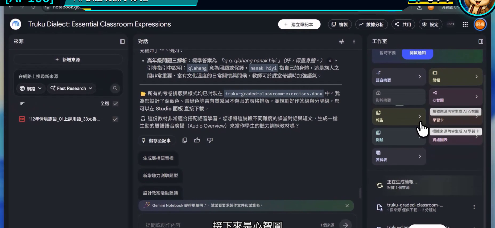
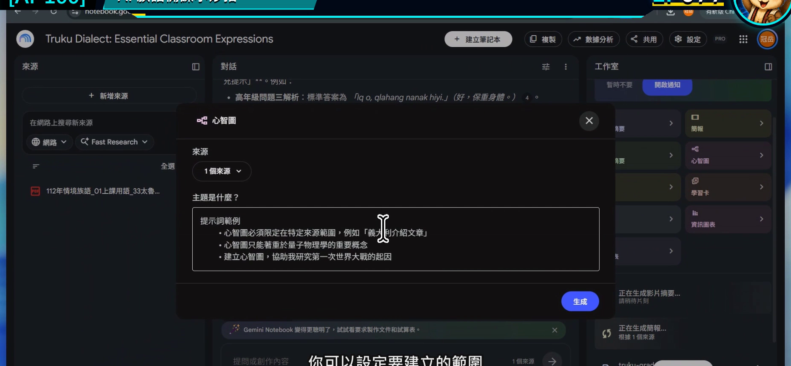
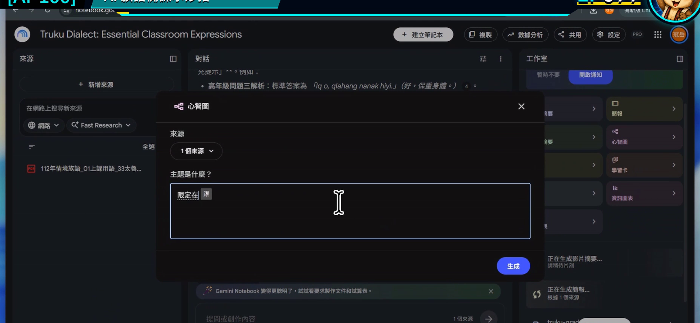
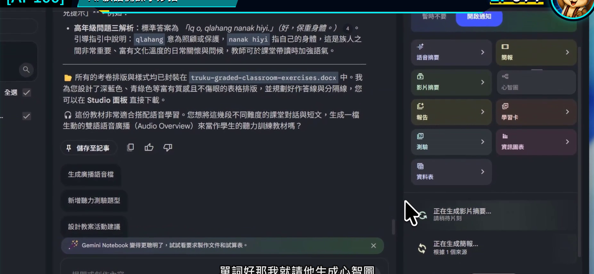
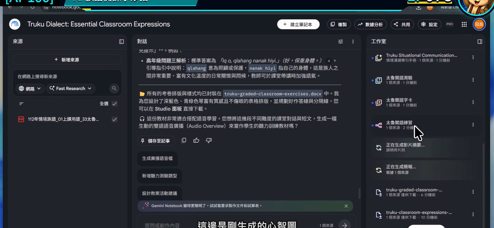

# EP077｜用心智圖整理教材與課程架構

## 今天只做一件事

把分散在多份教材裡的內容，整理成一張看得懂「先教什麼、後教什麼」的課程心智圖。

完成後，你會有：

**一張課程架構圖，以及一條可以直接拿來排課的教學順序。**

---

## 心智圖不是漂亮裝飾

一張對備課有用的心智圖，應該幫老師回答：

- 這個單元有哪些主要概念？
- 哪些內容需要先學？
- 哪些可以變成活動或評量？
- 哪個分支資料不足，需要再補？

如果心智圖只是把所有名詞堆在一起，看起來很多，卻沒有教學順序，就還不能拿來排課。

---

## 今天的示範

以「日常問候」單元為中心，整理成五個分支：

1. 使用情境。
2. 教材中的正式詞句。
3. 聽與說的練習。
4. 課堂活動。
5. 複習與觀察。

這五個分支只是課程骨架，真正的族語內容仍從目前來源中擷取。

---

## 開始前先準備

1. 選好與同一單元有關的來源。
2. 暫時取消其他主題。
3. 寫下心智圖要解決的問題。

今天的問題是：

> 如果要把這些資料排成三堂課，學生應該依序接觸哪些內容？

---

# STEP 1｜先把來源範圍縮到同一個單元

在左側只勾選和「日常問候」直接相關的教材。

### 畫面要看到

筆記本已經有整理結果，右側工作室可以建立新成果。

### 老師要做

如果來源裡同時有整學期課程，先用勾選縮小範圍。來源越集中，心智圖越容易看出結構。

### 完成後確認

目前勾選的每一份資料，都能說明它和這個單元的關係。

---

# STEP 2｜開啟心智圖設定

到右側工作室選擇「心智圖」。

### 畫面要看到

心智圖建立或自訂視窗已開啟。

### 老師要做

先找是否有自訂範圍或焦點的欄位。不要立刻生成整本筆記本的所有概念。

### 完成後確認

你已在心智圖設定中，而不是一般對話輸入框。

---

# STEP 3｜用「教學順序」限制心智圖

## 可直接複製的心智圖焦點

> 請只根據目前勾選的來源，建立「日常問候」課程心智圖。  
> 中心主題為日常問候，第一層分成：使用情境、正式教材內容、聽說練習、課堂活動、複習與觀察。  
> 每個分支最多保留三個重點，並標示它比較適合放在第 1、2 或 3 堂課。  
> 來源沒有提供的內容標示【待補資料】，不要新增族語詞句或自行解釋文化意義。

### 畫面要看到

焦點欄位中已經寫入中心主題、第一層分支與三堂課限制。

### 老師要做

如果只想整理一堂課，把「三堂課」改成「40 分鐘課程的開始、練習、收尾」。

### 完成後確認

你能在生成前預測心智圖第一層會出現哪些分支。

---

# STEP 4｜生成後先看第一層

確認設定並開始生成。

### 畫面要看到

設定完成，可以送出建立心智圖。

### 老師要做

結果出現時，先不要一口氣把所有分支展開。先看中心主題與第一層是否符合課程目的。

### 完成後確認

第一層沒有跑出無關單元，也沒有把工具功能誤當成教學內容。

---

# STEP 5｜展開分支，排出三堂課

點開與課程順序有關的分支，逐層查看細節。

### 畫面要看到

心智圖以中心主題向外展開，分支可以繼續點開查看。

### 老師要做

把結果轉成下面的排課表：

| 課次 | 核心任務 | 使用哪個心智圖分支 | 還缺什麼 |
| --- | --- | --- | --- |
| 第 1 堂 | 認識情境 | ____________________ | ____________________ |
| 第 2 堂 | 聽說練習 | ____________________ | ____________________ |
| 第 3 堂 | 實際使用與複習 | ____________________ | ____________________ |

### 完成後確認

每一堂課都有一個清楚任務，不是平均把所有內容切成三份。

---

## 心智圖太大時，怎麼縮？

### 分支太多

改成：

> 第一層只保留五個分支，每個分支最多三個子項目。

### 出現很多相似詞

改成：

> 合併意思重複的節點，保留來源用語，並列出合併依據。

### 看不出教學先後

改成：

> 在每個主要分支前標示建議課次，並說明先後關係。

### 心智圖把推測當成教材內容

縮小來源後重新建立，並要求來源沒有的節點全部標示【待補資料】。

---

## 放回族語課程規劃

心智圖最適合在這三個時刻使用：

- 新單元開始前：看資料是不是少了一塊。
- 排課時：決定先備哪一堂。
- 學期結束後：回看哪些分支教過、哪些要補強。

它是老師的規劃圖，不一定要直接投影給學生。學生需要的是從圖中整理好的清楚任務。

---

## 完成前最後檢查

□ 心智圖只使用同一個單元的來源。

□ 中心主題和第一層分支符合教學目的。

□ 分支數量不會多到無法閱讀。

□ 我已把心智圖轉成實際課次。

□ 資料不足處有明確標示。

□ 族語詞句與文化說明仍回到來源確認。

---

## 今天記住一句話就好

**好的心智圖不是把資料變多，而是讓下一堂課的順序變清楚。**

---

## 官方參考

- [Google 說明：使用心智圖](https://support.google.com/notebooklm/answer/16212283?hl=zh-Hant)

**下一篇｜EP078 製作學習卡、測驗與互動教材**
