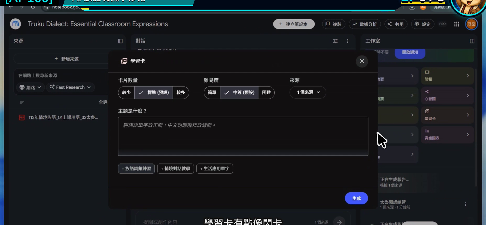
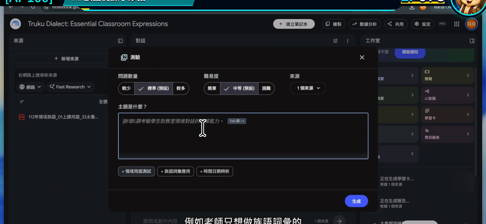
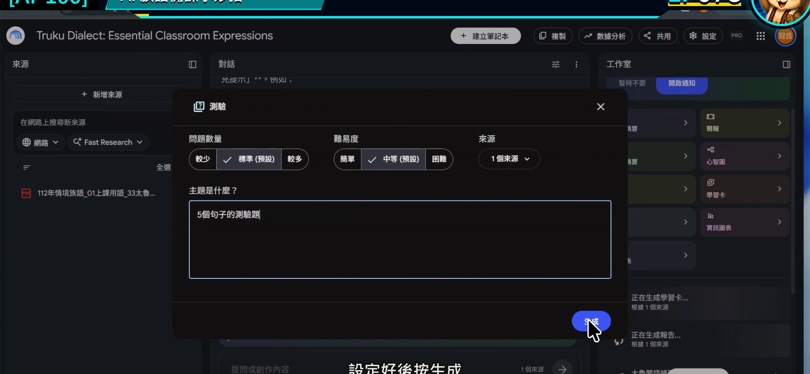
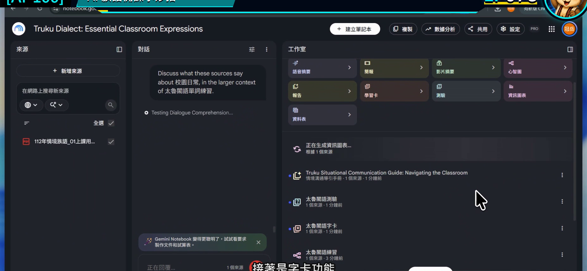
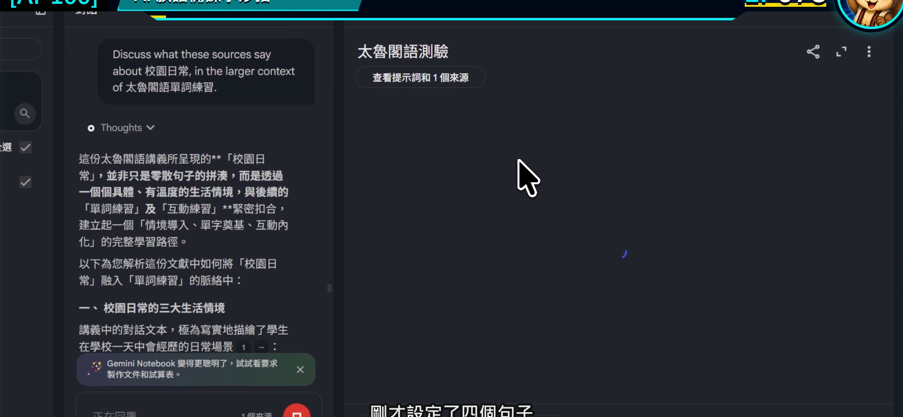
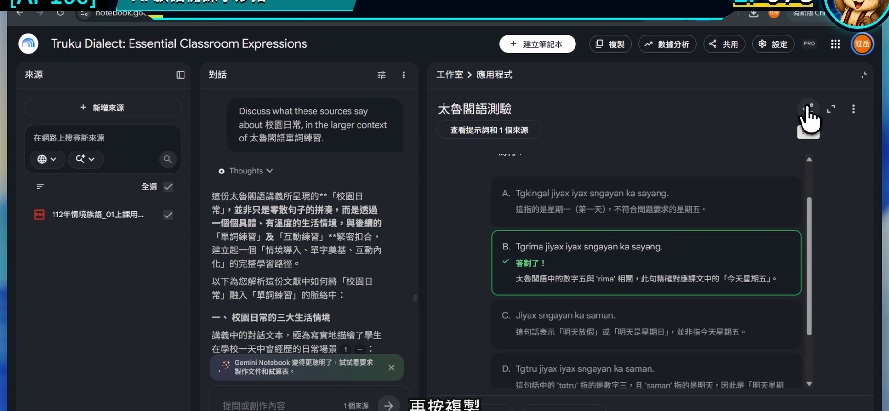

# EP078｜製作學習卡、測驗與互動教材

## 今天只做一件事

把同一份已核對教材，做成一小組可以實際操作的學習卡與課堂測驗。

完成後會得到：

1. 5 張複習卡。
2. 5 題小測驗。
3. 一份老師上課前的試玩紀錄。

先做小份量，是為了讓每一題都能真的核對，不讓題目數量掩蓋內容問題。

---

## 學習卡和測驗有什麼不同？

| 工具 | 適合拿來做什麼 | 學生怎麼用 |
| --- | --- | --- |
| 學習卡 | 看一面、回想另一面 | 自我複習、兩人互問 |
| 測驗 | 選擇或回答問題後看結果 | 暖身、課後檢查、分組挑戰 |

學習卡讓學生反覆接觸；測驗讓老師看見哪裡還不熟。兩個功能不是題目越多越好，而是每一題都和本課目標有關。

---

## 今天的示範

以「日常問候」來源製作：

- 學習卡：情境在正面，已核對內容或老師提示在背面。
- 測驗：判斷在什麼情境使用，以及活動步驟是否正確。

如果來源沒有提供可直接使用的族語文字，就放【老師填入已核對詞句】，不要讓工具自行補字。

---

## 開始前先準備

1. 只勾選本課需要的來源。
2. 寫下這 5 張卡要複習的單一重點。
3. 決定學生是個人、兩人還是全班使用。

---

# STEP 1｜在工作室開啟學習卡

到右側工作室選擇學習卡功能。

### 畫面要看到

學習卡的設定視窗已開啟，可以選擇數量、難度或自訂內容。

### 老師要做

第一次把數量控制在 5 張。先確認一小組內容正確，再決定要不要增加。

### 完成後確認

你知道這組卡片只要複習哪一個課堂重點。

---

# STEP 2｜設定測驗的對象與難度

切換到測驗設定，先選適合班級的題數與難度。

### 畫面要看到

測驗設定中可以調整題數、難度或題目焦點。

### 老師要做

難度不要只選「簡單」或「困難」，還要在自訂欄位說明學生要做的動作。

例如低年級以看情境、辨認與口頭回答為主；高年級才加入比較或簡短說明。

### 完成後確認

題目難度和實際學生的閱讀、書寫能力相符。

---

# STEP 3｜貼入同一份內容規格

## 可直接複製的學習卡提示文字

> 請只根據目前勾選來源，建立 5 張「日常問候」複習卡。  
> 正面放一個來源中出現的使用情境或老師任務提示；背面放對應的已核對內容、來源名稱與一個老師可使用的追問。  
> 來源沒有提供族語詞句時，背面放【老師填入已核對詞句】，不要自行翻譯。  
> 每張卡只練一件事，文字適合國小中年級閱讀。

## 可直接複製的測驗提示文字

> 請使用同一組來源建立 5 題課堂小測驗。  
> 題目聚焦在辨認問候情境、活動順序與本課重點，不考來源沒有提供的知識。  
> 每題提供答案、簡短說明與引用；族語文字只使用來源原文。  
> 錯誤選項要合理但不能扭曲文化內容，也不要把錯誤拼寫當成干擾選項。

### 畫面要看到

自訂欄位已有清楚的題數、對象、內容與限制，接著按下生成。

### 完成後確認

兩個提示都使用同一組來源與同一學習目標。

---

# STEP 4｜先試玩每一張學習卡

生成後，逐張翻面。

### 畫面要看到

學習卡能顯示正面與背面，並可切換下一張。

### 老師要做

每張卡檢查三件事：

1. 正面提示是否只指向一個答案。
2. 背面內容是否能在來源找到。
3. 學生第一次看到時是否看得懂任務。

### 完成後確認

五張卡沒有重複問同一件事，也沒有忽然出現別的單元。

---

# STEP 5｜像學生一樣完成一次測驗

不要只閱讀題目，要真的逐題作答。

### 畫面要看到

測驗會顯示題目、選項、作答結果與說明。

### 老師要做

刻意選一次錯誤答案，看看說明是否清楚；再選正確答案，確認系統判定沒有問題。

### 完成後確認

五題都能完成，答案與引用都已抽查，沒有按鈕失效或內容跑版。

---

# STEP 6｜分享前先決定使用方式

完成後可能會看到分享或匯出入口。

### 畫面要看到

分享設定能讓老師選擇誰可以存取成果。

### 老師要做

先決定：

- 課堂上由老師操作投影。
- 學生使用公開連結自行練習。
- 把內容整理成紙本或其他教學平台。

如果來源含有不公開教材，先不要直接開放整本筆記本。優先分享整理過、確定可以公開的學生成果。

### 完成後確認

你知道分享出去的人能看到什麼，也確認沒有學生個資。

---

## 三種課堂用法

### 課前 5 分鐘

投影三張學習卡，讓學生先猜再翻面。

### 兩人輪流

一人看正面提問，另一人回答，再一起看背面。

### 下課前檢查

全班完成 5 題測驗，老師記下最多人答錯的那一題，下一堂先複習。

---

## 如果題目不理想

### 每張卡都很像

指定五種不同任務，例如情境辨認、順序、用途、老師追問與課堂動作。

### 錯誤選項很荒謬

要求錯誤選項必須來自常見混淆，但不能使用錯誤族語拼寫或扭曲文化內容。

### 題目太長

要求每題題幹只留一個問題，背景說明移到教師備註。

### 學生答完還是不懂

把答案說明改成一句白話，再加一個「回到哪一份教材複習」的提示。

---

## 完成前最後檢查

□ 學習卡與測驗使用同一個學習目標。

□ 我先做 5 張卡與 5 題，不用數量充場面。

□ 每張卡都已實際翻面檢查。

□ 每道測驗都已實際作答。

□ 答案與說明能回到來源。

□ 分享設定符合教材權限。

□ 學生成果沒有出現學生個資或未核對的族語內容。

---

## 今天記住一句話就好

**先做少量、逐題試玩，五題真的能教，比五十題看起來很多更有用。**

---

## 官方參考

- [Google 說明：建立學習卡與測驗](https://support.google.com/notebooklm/answer/16958963?hl=zh-Hant)

**下一篇｜EP079 比較兩份教材版本**
