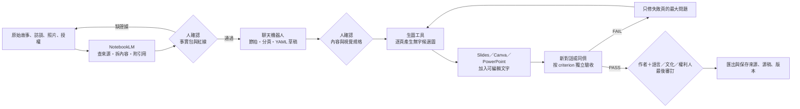

# 工具分工與素材分類

## 一張圖看完整流程



## 各工具只做自己擅長的事

| 工具／角色 | 適合做 | 不應交給它決定 | 主要產出 |
|---|---|---|---|
| NotebookLM | 盤點來源、摘錄事實、找衝突與缺漏、附引用、對照草稿 | 自由補完文化、判定授權、替語言或歷史定案 | `source-pack.md`、來源核對表 |
| 聊天機器人 | 訪談需求、提故事選項、拆節拍、分頁、轉 YAML、寫最小修正指令 | 把未知內容寫成事實、宣稱某張圖代表整個群體 | `story-beats.md`、YAML 草稿 |
| 生圖工具 | 依角色／場景／畫風／單頁工單產候選圖 | 正確拼寫、正確族語、文化真實性、版權定案 | 無字 PNG／JPG、版本候選 |
| 排版工具 | 放入正確文字、頁碼、書名、標示與安全留白 | 判斷故事和文化是否正確 | 可編輯 PPTX／Slides／Canva 源稿 |
| 同儕或新對話 | 依清單找證據、回報 PASS／FAIL、提出局部修正 | 代替作者或文化／語言專家放行 | `review.md` 或驗收 YAML |
| 人類負責人 | 選題、授權、事實、文化、語言、倫理、公開範圍及最終品質 | 不外包最後責任 | 簽核狀態與最終成品 |

## NotebookLM 的正確定位

不要把課程教成「NotebookLM 絕對不會上網」。現行版本可能提供來源搜尋或研究功能，實際功能會依帳號與版本改變。課堂操作要點是：

1. 先人工審核要加入哪些來源。
2. 對話前只勾選本題核准來源。
3. 要求每個重要主張附引用。
4. 找不到證據就寫「待確認」或「來源未記錄」。
5. 任何生成結果仍由人核對。

官方說明可見 [NotebookLM 來源管理](https://support.google.com/notebooklm/answer/16215270?co=GENIE.Platform%3DDesktop&hl=en-GB) 與 [NotebookLM 概覽](https://support.google.com/notebooklm/answer/16164461?hl=en)。若使用 Slide Deck 功能，修訂內容後仍要重新對照來源驗收，不能把畫面漂亮視為事實正確；參考 [官方 Slide Deck 說明](https://support.google.com/gemininotebook/answer/16757456?hl=en)。

## 素材分成五包

| 素材包 | 放什麼 | 核對重點 |
|---|---|---|
| A. 故事來源包 | 原文、訪談逐字稿、地方紀錄、作者說明 | 哪些是原始事實？事件順序與因果是否明確？ |
| B. 語言與文化包 | 核准詞語、譯文、服飾說明、禁忌、審訂註記 | 誰提供？適用哪個人、地方、年代、性別、場合？ |
| C. 視覺證據包 | 角色、服飾、場景、器物參考圖及圖說 | 圖片有無使用權？看得到什麼、看不到什麼？ |
| D. 教學需求包 | 讀者年齡、閱讀程度、學習目標、使用情境 | 字數、語氣與篇幅是否合適？ |
| E. 製作規格包 | 頁數、尺寸、畫風、留白、輸出格式、截止時間 | 哪些可變？哪些不可變？誰負責驗收？ |

網頁來源匯入 NotebookLM 時，不要假設網頁上的圖片也完整進入來源。重要參考圖要分開上傳，並附文字圖說與權利說明。

## 素材紅綠燈

### 綠燈：可直接進課堂流程

- 自己寫、自己拍且不含他人個資的素材。
- 已取得本次教學、生成、展示與公開權限的素材。
- 完全虛構且不聲稱代表任何真實群體的中性範例。

### 黃燈：先確認再使用

- 真人或兒童照片、姓名、聲音、位置和聯絡資料。
- 訪談、口述歷史、地方故事與尚未公開文件。
- 傳統服飾、器物、圖紋、族語、祭儀及人物身分。
- 網路圖片、博物館圖片與平台生成素材。

### 紅燈：不要上傳或公開

- 沒有權利使用的作品。
- 當事人未同意的個資與敏感紀錄。
- 明確限制公開或需要特定資格才能接觸的知識。
- 要 AI 根據外觀猜族別、身分、服飾名稱或文化意義。

## YAML 卡片盒

| 卡片 | 解決的問題 | 典型欄位 | 主要確認者 |
|---|---|---|---|
| `00-source-pack` | 來源究竟支持什麼？ | `sources`、`facts`、`exact_terms`、`unknowns`、`do_not_infer` | 作者／來源管理者 |
| `01-content` | 故事要講什麼？ | `audience`、`theme`、`beats`、`page_plan`、`source_refs` | 作者／編劇 |
| `02-visual-system` | 人物、場景與畫風怎麼穩定？ | `characters`、`scenes`、`style`、`text_policy` | 美術／作者 |
| `03-culture-guardrails` | 哪些不可猜、不可泛化？ | `scope`、`confirmed`、`uncertain`、`prohibited_generalizations` | 適合的真人審訂者 |
| `04-page-drawing-job` | 這一頁到底要畫什麼？ | `story_beat`、`action`、`camera`、`negative_space`、`must_include` | 製作者 |
| `05-criterion` | 什麼叫完成？ | `hard_fail_if_any`、`checks`、`evidence`、`on_failure` | 獨立驗收者 |
| `06-production-log` | 改了什麼、為何重做？ | `attempt`、`failed_check`、`minimal_fix`、`human_review` | 製作者／講師 |

YAML 是可重複使用的「規格卡」，不是事實證明，也不是保證模型一定服從。文化或語言來源若一開始有錯，YAML 只會讓錯誤更穩定地重複。

## 建議的學員專案資料夾

```text
我的繪本專案/
├─ 00-來源與授權/
│  ├─ source-pack.md
│  └─ rights.md
├─ 01-故事與YAML/
│  ├─ story-beats.md
│  └─ YAML/
├─ 02-參考圖/
│  ├─ 角色/
│  ├─ 場景/
│  └─ 圖說.md
├─ 03-生成圖片/
│  ├─ P00-cover/
│  ├─ P01/
│  └─ P02/
├─ 04-排版源稿/
├─ 05-驗收紀錄/
└─ 06-匯出成品/
```

檔名建議：`頁次-嘗試次數-狀態`，例如 `P02-A02-FAIL.png`、`P02-A03-PASS.png`。不要用「最新版2真的最後版」。
