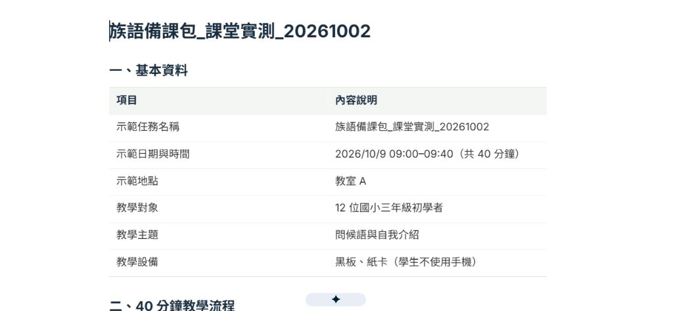
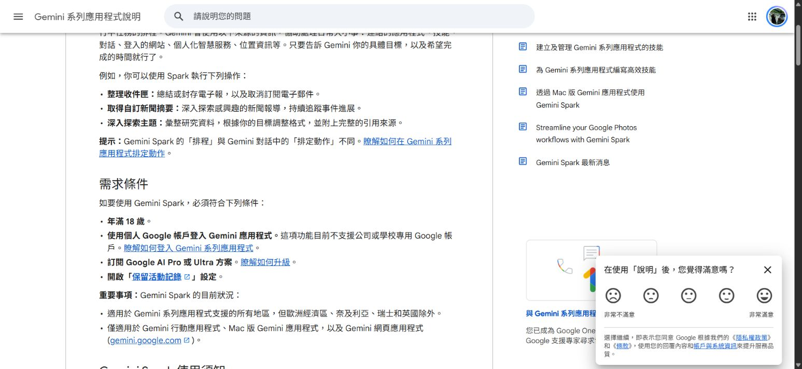
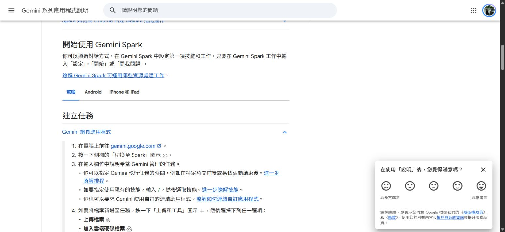
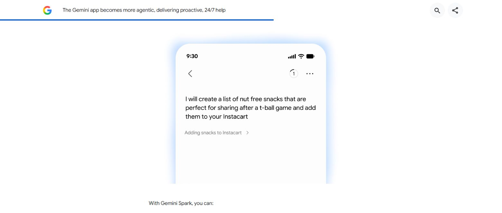

# 拒絕加班！把 Gemini 訓練成最懂你的 AI 備課助理

Gemini Spark × 族語老師的教學日常

2026/10/2｜19:00–22:00｜三小時

明天要上課，詞表還沒整理、家長通知還沒寫。今天就用你手上的教材，完成一份備課包，再把每週重複做的事情交給 Gemini Spark 協助。
## 完整章節架構
- Chapter 00｜今天，先幫自己省下一件事（10 分鐘）
- Chapter 01｜第一次把 Gemini 用在教學日常（15 分鐘）
- Chapter 02｜把需求說清楚，回覆才用得上（15 分鐘）
- Chapter 03｜把自己的教材交給 Gemini 整理（20 分鐘）
- Chapter 04｜完成一份下次上課能用的備課包（25 分鐘）
- Chapter 05｜認識 Gemini Spark：把工作接成流程（20 分鐘）
- Chapter 06｜第一個 Spark 任務：下週備課包（20 分鐘）
- Chapter 07｜把自己的備課規則存成技能（15 分鐘）
- Chapter 08｜每週備課：設定、測試、暫停排程（15 分鐘）
- Chapter 09｜核對內容、儲存成果、找回來再修改（10 分鐘）
- Chapter 10｜今天帶回去，用在下一堂課（5 分鐘）

## 課程目標
- 把自己的教材交給 Gemini 整理，保留族語原文與來源。
- 把模糊的要求改成能直接執行的提示詞。
- 完成教學流程、練習活動與家長通知組成的備課包。
- 分清 Gemini 對話、Spark 任務、技能與排程各自的用途。
- 建立或寫好一個自己下週就用得上的 Spark 工作流程。
- 會核對內容、修改結果、確認檔案，並停止不需要的排程。

## 課程流程與每章時間
| 時間 | 分鐘 | 實作內容 |
| --- | --- | --- |
| 19:00–19:10 | 10 | 選一件想少花時間的事 |
| 19:10–19:25 | 15 | 開啟 Gemini，做第一個日常任務 |
| 19:25–19:40 | 15 | 把要求說清楚，練習追問與修正 |
| 19:40–20:00 | 20 | 上傳教材，先整理再製作 |
| 20:00–20:25 | 25 | 完成一份明天能用的備課包 |
| 20:25–20:35 | 10 | 休息 |
| 20:35–20:55 | 20 | 認識 Spark，確認帳號與工作範圍 |
| 20:55–21:15 | 20 | 建立一個族語教學任務 |
| 21:15–21:30 | 15 | 存成自己的備課技能 |
| 21:30–21:45 | 15 | 設定、測試與暫停排程 |
| 21:45–21:55 | 10 | 檢查、存檔與排錯 |
| 21:55–22:00 | 5 | 分享今天完成的成果 |

課程共 180 分鐘，包含 10 分鐘休息。提示詞庫供選用，不需要逐段教完；先完成一份備課包，再練一個任務、固定規則與排程。

## 今天完成的成果
- 一份下次上課可修改使用的備課包
- 一組自己的族語教學提示詞
- 一個 Spark 任務與可重複使用的技能／排程，或完整的替代操作稿

## 先確認使用路線

Gemini Spark 的帳號條件與功能以 [Google 官方說明](https://support.google.com/gemini/answer/17094507?hl=zh-Hant) 為準。沒有 Spark 的學員使用一般 Gemini 對話、手動貼固定規則與行事曆提醒；這是替代路線，不算已建立 Spark 排程。

## 真的跑一次：讓 Spark 做出族語備課包

這次不是只看產品介紹。我們在 Spark 送出一次備課任務，實際建立 Google 文件，再開啟、下載並核對內容。下面三張是本次操作與新成品的真實截圖。

示範班級是虛構的：12 位國小三年級初學者，40 分鐘，主題是問候語與自我介紹。沒有提供正式族語，所以單字、詞義與答案全部留給老師填入。

### 01｜找到 Spark 的工作入口

進入 Gemini，選 Spark。這次帳號的介面是英文：Describe a task 就是「描述你要做的工作」。點輸入欄，先把學生、主題、時間與成果說清楚。


本課程帳號操作實拍。2026/10/2 實際進入 Spark；畫面保留工作入口，不包含既有任務內容。Describe a task 是任務輸入欄。本次帳號使用英文介面，沒有代替使用者更改語言設定。

### 02｜貼上要求，真的送出任務

把下方完整提示詞貼進去，按右下角向上的箭頭送出。這次不是只請它列計畫，而是明確允許建立一份新的示範成果。執行後看工作進度；遇到授權或需要接手的步驟，先讀清楚，不連續重送。


本課程新任務送出前實拍。畫面顯示提示詞前段，右下角向上箭頭用來送出。實際送出的完整要求見本節提示詞；本次確實執行任務，不是只輸入未送出的示意圖。

### 03｜開啟成品，不只相信「已完成」

這次 Spark 真正建立了「族語備課包_課堂實測_20261002」。我們開啟 Google 文件，也下載了 Word 檔。流程是 5＋10＋15＋10＝40 分鐘；檔案有學生版、教師答案版、核對表與通知草稿。族語欄位仍待老師提供，不能直接拿來評分。



本課程實際成品開啟畫面。這是 Spark 本次新建立的備課文件，不是生成的介面圖片。已開啟並下載 Word 檔核對；採虛構班級，不公開原始私人文件網址，也不更改分享權限。

### 這次真正送出的完整提示詞

```text
請完成一次「族語課備課包」課堂示範任務，名稱為「族語備課包_課堂實測_20261002」。

這是虛構班級的教學示範，不是真實學生資料。
對象：12 位國小三年級初學者。
主題：問候語與自我介紹。
時間：40 分鐘。
設備：黑板、紙卡，學生不使用手機。
示範日期：2026/10/9 09:00–09:40。
示範地點：教室 A。

目前沒有提供經族語老師核對的族語原文。因此你不可翻譯、猜測或新增任何族語。教材欄位請逐一保留【老師填入族語原文】與【老師填入中文意思】。不要把留白當成已核對教材，也不要編文化知識。

請實際製作以下成果，不只提供工作計畫：
1. 一份 40 分鐘教學流程，列出時間、老師示範、學生動作與需要的材料，分鐘數加總必須正確。
2. 一頁學生學習單填寫版：五筆詞卡欄位、配對活動規則、兩人互問步驟，答案版與學生版分開。
3. 一份教師核對表：明確標示族語與答案尚未提供，不能直接評分；列課前需要填入或確認的資料。
4. 一則 120 字內的 LINE 班群通知草稿，只用上方示範日期、地點與攜帶紙卡。
5. 整理成可下載或開啟修改的檔案；若環境不能建立檔案，就完整提供文字並說明限制，不編造下載連結。

全程使用臺灣繁體中文。只使用這段要求，不搜尋網路、不讀郵件、雲端硬碟、既有對話或其他私人檔案。不寄信、不公開、不建立排程、不變更權限，不覆蓋或刪除任何既有檔案。可在這個新任務中建立新的示範成果檔。直接完成一次，最後列真正完成的成果與仍待老師提供的內容。
```

### 老師核對時，真的找到一個問題

第一版的通知多寫了「上次發放的實體紙卡」，但要求只說要攜帶紙卡，沒有說已經發過。這就是老師需要核對的地方：看起來很合理，也可能是 AI 補出來的。

```text
我已開啟你這次新建立的「族語備課包_課堂實測_20261002」。發現 LINE 通知寫了「上次發放的實體紙卡」，但我沒有提供紙卡已發放的資訊。請刪除這個推測，改成「請攜帶紙卡」，不要增加發放或其他未提供的事情。

請只讀取並修正這次你自己建立的示範成果，保留 40 分鐘流程、學生版、教師答案版與待老師填入的族語欄位。不要讀取其他檔案、對話或私人資料。另建立一份新的 Google 文件，名稱為「族語備課包_課堂實測_20261002_修正版」，不覆蓋原版，不寄出、不公開、不建立排程、不更改任何權限。最後提供實際建立的檔案連結與這次改了哪一句。
```

這句修改要求也真的送進同一個 Spark 任務。Spark 另建了「族語備課包_課堂實測_20261002_修正版」；我們開啟並下載比對，通知已改成「請攜帶紙卡」，沒有覆蓋第一版。不過它也重寫了部分活動說明，並非只有一句變動。這也要教老師：要求只改一句，不代表其他地方一定原封不動，仍要核對整份新檔。

[下載 Spark 實際做出的第一版（Word）](spark-demo/spark-lesson-prep-demo.docx)

[下載 Spark 修正版（Word）](spark-demo/spark-lesson-prep-revised.docx)

兩份都是本次 Spark 真正建立的成品，不是正式可用的族語教材。第一版保留待修正句供練習；修正版通知已核對。兩版族語與答案仍留白，活動內容與學生版頁數也要由老師再確認。原始 Google 文件未改成公開分享。

### 老師先記這一句就好

Spark 做出檔案只是第一步；老師要開啟、核對，才能決定怎麼用。

### 馬上試試看

花 5 分鐘開啟示範 Word 檔，找出一句沒被要求卻出現在成品裡的話，再寫一句具體修改要求。

### 如果卡住了

- 介面是英文：Describe a task 是任務輸入欄；Tasks 是任務，Skills 是技能，Schedules 是排程。位置依帳號與版本可能不同。
- 只得到文字：仍可先複製到 Word；不要把一句「已建立」當成已有檔案。
- 成果看起來完整：還要逐項比對日期、地點、時間與教材；合理的句子不一定有資料依據。

### 完成確認

親自開啟成品，知道哪些內容已完成、哪些需要老師補資料，也能指出一項具體修改。

## Chapter 00｜今天，先幫自己省下一件事

預估 10 分鐘

想一想：每次上課，你最常重複做哪件事？今天不用全部解決，先挑一件。

可能是把詞表重新排成學習單、為不同年齡改活動、寫上課通知，或到處找能用的圖片。請選一項你手上有資料、下一次上課會用到的事情。

今天的案例與提示詞都是教學練習設計。AI 回覆與操作成果仍需以自己的帳號實際確認；示範圖片附有來源，不把示意畫面當成已完成的課堂作品。

| 你常做的事 | 今天交給 AI 的部分 | 老師最後確認 |
| --- | --- | --- |
| 詞表變學習單 | 分組、排版、用提供的詞句出題 | 族語、詞義、答案與方言別 |
| 課前通知 | 把資訊寫成清楚的中文通知 | 日期、地點、攜帶物品 |
| 下週備課 | 整理流程、素材與待辦 | 順序、難度、教學目標 |
| 搜尋教材資源 | 列出公開來源與可用片段 | 來源、授權與文化脈絡 |

### 老師先記這一句就好

先挑一件重複做的事，把自己的資料準備好。

### 馬上試試看

用三句話寫下：我要教誰？下次上課教什麼？希望 AI 幫我先完成哪一份草稿？

### 如果卡住了

- 想做太多：先選下週最需要的一項。
- 沒有完整教材：先用自己的五筆詞表或一段中文課程說明。
- 不知道族語怎麼打：先貼既有電子檔，不讓 AI 猜拼寫。

### 完成確認

你能說出一個任務、一種學生對象與一份預期成果。

## Chapter 01｜第一次把 Gemini 用在教學日常

預估 15 分鐘

先做一則上課通知。你提供事實，Gemini 幫你整理成學生或家長看得懂的文字。

提示詞就是你交代 AI 做事的話。把它當成說明工作，不用寫得像程式。

電腦先開 Gemini 網頁版；Windows 11 老師不必另外安裝軟體。不同帳號的功能與排列會有差異。

### Step 1｜進入 Gemini

你要做：

1. 開啟 Chrome 或平常用的瀏覽器。
2. 點上方網址列，輸入 https://gemini.google.com/，按 Enter。
3. 若畫面要求登入，使用你自己的 Google 帳號登入。
4. 若是學校帳號而不能用，先確認學校是否開放；Spark 的帳號條件另在後面說明。

你會看到：

看到 Gemini 畫面與可輸入文字的方框。

如果畫面不一樣：

左邊選單可能收起來了；先找畫面上的輸入欄即可。

完成標準：

可以把游標點進輸入欄。

### Step 2｜貼上第一段要求

你要做：

1. 在本講義開啟「上課通知」提示詞，按「複製」。
2. 回 Gemini，點輸入欄，按 Ctrl＋V 貼上。
3. 把【日期】等括號改成真正資訊；不知道的地方保留「待確認」。
4. 核對後按畫面上的送出圖示。

你會看到：

Gemini 開始回覆，產出中文通知草稿。

如果畫面不一樣：

若輸入欄沒有送出圖示，先確認貼入了文字；不要連按送出。

完成標準：

得到一則保留你所提供日期與地點的通知。

### Step 3｜把通知改成自己會說的話

你要做：

1. 在同一個對話再輸入：「改成我平常在 LINE 班群說話的口氣，120 字內，保留日期、時間與攜帶物品。」
2. 送出後，對照原始資訊。
3. 選取確認過的通知，複製到 Word 或自己的筆記；先不要直接傳進班群。

你會看到：

同一份通知變得較短，事實仍然相同。

如果畫面不一樣：

若它把地點或時間省掉了，補一句：「時間與地點要保留，請重寫。」

完成標準：

你得到一份自己看過、願意使用的中文通知。

### 這一章可用的提示詞

- G01 上課通知（見下方完整提示詞庫）
- G02 把行政通知改成待辦清單（見下方完整提示詞庫）
- G03 臨時調課通知（見下方完整提示詞庫）


Google 官方公開示範影片截圖，2026/10/2 擷取。這是 Google 公開的行動版介面示範；電腦版的排列可能不同，重點是輸入欄與送出操作。

[原始來源](https://blog.google/innovation-and-ai/products/gemini-app/next-evolution-gemini-app/)

### 老師先記這一句就好

先給正確資訊，再請 AI 幫你寫草稿。

### 馬上試試看

用自己的下一次上課資訊，做出一則 LINE 班群通知，再改短一次。

### 如果卡住了

- 文字貼錯地方：要點 Gemini 的輸入欄，不是瀏覽器網址列。
- 得到很多多餘資訊：指定字數與必須保留的三項資訊。
- 回覆中有假資料：請它只用你給的內容，缺漏寫「待確認」。

### 完成確認

有一則日期、地點與物品都正確的通知草稿。

操作依據：[Google：使用 Gemini 對話](https://support.google.com/gemini/answer/13275745?hl=zh-Hant)

## Chapter 02｜把需求說清楚，回覆才用得上

預估 15 分鐘

「幫我備課」太大了。換成「幫 12 位國小學生設計 40 分鐘的問候語課，使用這五句已核對的詞句」。

每次交代工作，補上五件事：對象、材料、任務、輸出樣子，以及不能更動的內容。

不用追求一次寫完。先取得第一版，再說明哪裡要改、為什麼要改。改完回頭比對資料，確認它沒順手更改族語。

| 原本的說法 | 改成這樣 |
| --- | --- |
| 幫我做教材 | 用以下六筆詞表，做一張 A4 學習單，分學生版與答案版。 |
| 寫得簡單一點 | 對象是小三學生，每句中文說明不超過 20 字。 |
| 給我好玩的活動 | 安排 10 分鐘兩人配對練習，沒手機也能進行。 |
| 幫我翻譯族語 | 請只排版我提供的族語與中文對照，不改字、不補詞。 |
| 幫我查資料 | 找三個官方公開來源，列網址與查詢日期，查不到請明說。 |
| 幫我修一下 | 保留第 1、3 段，只把第 2 段的規則改成三個操作步驟。 |

### 這一章可用的提示詞

- G04 把本週事情排出先後（見下方完整提示詞庫）
- R01 內容太多，縮成能上完（見下方完整提示詞庫）
- R02 學生程度不合，調活動（見下方完整提示詞庫）
- R03 只修一段，不重做全部（見下方完整提示詞庫）
- R04 字看不清楚，改閱讀方式（見下方完整提示詞庫）
- R05 拿掉 AI 腔的通知（見下方完整提示詞庫）
- R06 族語被改了，原文還原（見下方完整提示詞庫）

### 老師先記這一句就好

把「給誰用、用哪些資料、要什麼成果」說清楚。

### 馬上試試看

把自己常用的「幫我備課」，改成一段有對象、時間、材料與成果格式的要求。

### 如果卡住了

- AI 問很多問題：請它一次只問一題，最多三題。
- 一直重寫整份：指定只修改哪一段，其他段落保留。
- 字數合適卻不好教：補學生程度、可用裝置與活動時間。

### 完成確認

你能複製一段符合自己班級的提示詞，並提出一次具體修改。

## Chapter 03｜把自己的教材交給 Gemini 整理

預估 20 分鐘

今天讓 AI 看自己的教材。教材是依據，AI 不負責替老師決定正確族語。

先選一份小型、內容已確認的詞表。PDF、檔案、圖片等可透過檔案功能加入；如果傳不上去，也可以先貼文字。

照片辨識、錄音轉寫與 AI 整理可能有錯。族語拼寫與發音要逐筆比對，不能把流暢的回答當成正確答案。沒有權利公開的故事、錄音或學生個資，這堂課不拿來上傳。

### Step 1｜整理一份練習素材

你要做：

1. 在自己的電腦找到一份已確認的詞表、學習單或課程說明。
2. 先挑一頁或五至十筆資料，避免一次丟整學期。
3. 檢查有沒有學生姓名、電話與成績；練習檔不放這些內容。
4. 替檔案取容易辨認的名稱，例如「問候語_老師已確認」。

你會看到：

手上有一份知道來源與正確內容的小檔案。

如果畫面不一樣：

若族語無法在 Word 正確顯示，先保留原始檔並確認字型，不請 AI 修拼寫。

完成標準：

你知道哪個檔案要交給 AI。

### Step 2｜加入教材

你要做：

1. 在 Gemini 輸入欄旁找「新增檔案」或「＋」。
2. 選「上傳檔案」，在 Windows 視窗找到素材。
3. 點一次檔案，再按「開啟」。
4. 等附件名稱出現在輸入欄旁，再貼「只整理，不改字」提示詞送出。

你會看到：

對話附上教材名稱，Gemini 回覆資料表或摘要。

如果畫面不一樣：

若按鈕名稱不同，以檔案或加號圖示為線索；上傳失敗就先貼文字。

完成標準：

AI 的回覆明確使用你剛加入的教材。

### Step 3｜先確認資料，再做活動

你要做：

1. 請 Gemini 列出它讀到的條目、來源與不確定處。
2. 逐筆對照原始資料，特別看族語中的符號、空格與大小寫。
3. 錯誤直接貼正確寫法，要求只替換該筆。
4. 確認完再請它做學習單，不讓錯誤一路傳到後續教材。

你會看到：

有一份已比對的教材整理表。

如果畫面不一樣：

若它說檔案沒有內容，確認不是空白或模糊掃描；可改貼少量文字。

完成標準：

至少五筆教材與原始資料一致。

### 這一章可用的提示詞

- G05 只整理，不改族語（見下方完整提示詞庫）
- G06 手機照片變成教材整理表（見下方完整提示詞庫）
- G07 一份教材整理成三種程度（見下方完整提示詞庫）
- G08 逐字稿整理成中文教學筆記（見下方完整提示詞庫）
- G09 兩版教材差在哪裡（見下方完整提示詞庫）


Google 官方說明頁實際截圖，2026/10/2 擷取。先練習上傳一份小檔案。若用雲端硬碟加入教材，還需確認連結服務與檔案權限。

[原始來源](https://support.google.com/gemini/answer/14903178?hl=zh-Hant)

### 老師先記這一句就好

先核對 AI 讀到的資料，再讓它做教材。

### 馬上試試看

貼上五筆自己的詞表，讓 AI 排成表格；找出並更正至少一個需要確認的地方。

### 如果卡住了

- 圖片的字辨識錯：提供清晰區域性照片，或改用電子文字。
- 檔案太長：先提供本次課程需要的部分。
- 族語被自動校正：貼回正確原文，明講禁止更改。
- 同一詞有不同寫法：保留各版本，請老師確認方言別與採用版本。

### 完成確認

有一份內容與來源都能追溯的整理表。

操作依據：[Google：上傳及分析檔案](https://support.google.com/gemini/answer/14903178?hl=zh-Hant)

## Chapter 04｜完成一份下次上課能用的備課包

預估 25 分鐘

用同一份已核對教材，做出教學流程、練習與通知。先做文字版，就能帶回去用。

練習主題由你決定：問候、家人、飲食、天氣、上學或日常動作都可以。不要為了湊主題，請 AI 生出你還沒確認的族語。

核心練習先完成三份草稿。Canvas 的排版與互動測驗作為有時間時的延伸，不影響今天交出備課包。

### Step 1｜做出教學流程

你要做：

1. 保持在剛才已放入教材的對話。
2. 貼「40 分鐘教學流程」提示詞，填學生年齡、人數與裝置。
3. 核對每一段時間加總為 40 分鐘。
4. 檢查活動只使用你提供的詞句，再要求必要的調整。

你會看到：

一份包含暖身、示範、練習、收尾的流程表。

如果畫面不一樣：

如果時間加總錯，說「請重新加總，總時間必須 40 分鐘」。

完成標準：

你能想像學生實際如何完成每個活動。

### Step 2｜做學生版與答案版

你要做：

1. 貼「學習單與答案」提示詞，要求兩份分開。
2. 確認題目能只靠提供的教材作答。
3. 核對每一題答案，刪掉資料不足的題目。
4. 把學生版與答案版分別複製到 Word，另存自己的檔案。

你會看到：

學生版沒有露出答案；答案版可逐題核對。

如果畫面不一樣：

若 AI 把答案塞進學生版，說「學生版只留題目，答案全部移到另一份」。

完成標準：

至少五題題目與答案互相對得起來。

### Step 3｜補上課前通知與教材清單

你要做：

1. 貼「備課包收尾」提示詞。
2. 核對要印的張數、攜帶物品、錄音或圖片是否已備齊。
3. 將日期、班級與地點填實，不確定就標「待確認」。
4. 將三份成果存到同一個資料夾，名稱加上日期。

你會看到：

同一個資料夾內有流程、學習單／答案與通知。

如果畫面不一樣：

不想新建資料夾也可以先用一份 Word 分頁整理，重點是自己找得到。

完成標準：

下次上課前不必重新找三份散落的草稿。

### Step 4｜延伸：在 Canvas 邊看邊改

你要做：

1. 另開一個對話，在工具選單中找 Canvas；依帳號畫面，可能在「工具」或「新增檔案」附近。
2. 貼上已核對的備課包，要求整理為可編輯講義。
3. 在 Canvas 內或對話中指定一段修改，確認其他內容沒被更動。
4. 如有匯出選項，按實際顯示的格式儲存；找不到時就複製回 Word。

你會看到：

一份可持續修改的講義工作區。

如果畫面不一樣：

若帳號沒有 Canvas，文字版已可完成主要任務，不必停在這一步。

完成標準：

你儲存了一份自己能再修改的教材。

### 這一章可用的提示詞

- G10 40 分鐘教學流程（見下方完整提示詞庫）
- G11 學習單與答案分開（見下方完整提示詞庫）
- G12 十分鐘不插電活動（見下方完整提示詞庫）
- G13 長輩共學課的慢節奏版本（見下方完整提示詞庫）
- G14 從生活照片找教學情境（見下方完整提示詞庫）
- G15 備課包收尾（見下方完整提示詞庫）


Google 官方說明頁實際截圖，2026/10/2 擷取。Canvas 是可邊看邊修改的工作區；介面入口以自己帳號實際出現的名稱為準。

[原始來源](https://support.google.com/gemini/answer/16047321?hl=zh-Hant)

### 老師先記這一句就好

同一份教材，先完成一包真的要用的東西。

### 馬上試試看

用自己的教材，完成教學流程、五題練習／答案與一則課前通知。

### 如果卡住了

- 結果看起來很完整卻超時：減少活動，保留主要練習。
- 題目沒有教過：刪除超出詞表的內容。
- 答案不唯一：改成開放題，列出評量重點，不硬判唯一正解。

### 完成確認

備課包三份內容齊全，詞句、時間與答案已由你核對。

操作依據：[Google：Canvas 文件、內容與匯出](https://support.google.com/gemini/answer/16047321?hl=zh-Hant)

## Chapter 05｜認識 Gemini Spark：把工作接成流程

預估 20 分鐘

一般對話幫你寫出草稿；Spark 讓你把多個步驟交代成任務，追蹤進度，再搭配技能和排程重複使用。

AI 代理，可以先理解為會照你的交代分步做事、使用工具並回報進度的助手。實際能做多少，仍要看連結服務、權限與當時功能。

本講義於 2026/10/2 核對 Google 官方說明：Spark 需年滿 18 歲、個人 Google 帳號、Google AI Pro 或 Ultra 訂閱，並開啟「保留活動記錄」。目前不支援學校或公司專用帳號。費用以自己的方案頁為準，本課程不要求當場購買。

臺灣老師使用網頁版示範；若沒有「切換至 Spark」，先檢查帳號、方案與功能開放情況。沒權限的老師用一般對話完成同一份任務草稿，並把排程時間存到自己的行事曆。這不等於 Spark 已設定成功。

| 名稱 | 用老師的日常理解 | 這堂課的例子 |
| --- | --- | --- |
| Gemini 對話 | 這次請它幫忙整理或寫草稿 | 把下週通知寫成 120 字 |
| 任務 | 這次要完成的整件工作 | 整理教材，做流程、學習單與通知 |
| 技能 | 下次也要遵守的固定工作方式 | 不改族語、用指定格式、資料不足就問 |
| 排程 | 何時再次執行一件工作 | 每週日晚上七點整理下週備課清單 |
| 連結的應用程式 | 允許它讀取或處理的服務 | 你指定的 Drive 教材、檔案或日曆 |

### 這一章可用的提示詞

- S01 先問出適合我的第一個任務（見下方完整提示詞庫）



Google 官方說明頁實際截圖，2026/10/2 擷取。看「需求條件」：個人帳號、年滿 18 歲、Pro 或 Ultra 訂閱及活動記錄設定。

[原始來源](https://support.google.com/gemini/answer/17094507?hl=zh-Hant)

### 老師先記這一句就好

任務是做什麼，技能是怎麼做，排程是什麼時候做。

### 馬上試試看

把「每週日整理下週備課包」拆成一個任務、一組固定規則與一個時間。

### 如果卡住了

- 用的是學校帳號：Spark 目前需個人帳號；一般 Gemini 是否可用依學校設定。
- 沒有訂閱：先完成一般對話路線，再看示範。
- 看到的是「排定動作」：它與 Spark 排程是不同功能，不能只憑名稱當成同一件事。

### 完成確認

你知道自己今天能用哪條路線，能分清任務、技能與排程。

操作依據：[Google：Gemini Spark 任務與適用條件](https://support.google.com/gemini/answer/17094507?hl=zh-Hant)、[Google：建立及管理技能](https://support.google.com/gemini/answer/17094296?hl=zh-Hant)

## Chapter 06｜第一個 Spark 任務：下週備課包

預估 20 分鐘

先做一次性任務，確認做得對，再談自動化。

教材先直接上傳，比一次連整個雲端硬碟更容易看清楚範圍。若要用 Google 服務，先檢查「連結的應用程式」，確認使用的是哪個帳號；不想連結，仍可以用手動上傳與複製儲存。

連結帳號不代表檔案已找到；AI 說完成也不等於你拿到正確檔案。請開啟成果，確認標題、內容與存放位置。

「只用指定檔案」是你交代的工作範圍，不是技術上的權限鎖。連結服務前要閱讀授權內容；不想開放帳號資料，就用小檔案上傳路線。也別把「先問我」當成絕對保證，執行中仍要看工作進度。

### Step 1｜切換到 Spark

你要做：

1. 在 Gemini 網頁版找「Spark」切換按鈕；有的版本顯示「切換至 Spark」。若側欄收起，先按左上角三條線。
2. 點「Spark」進入工作入口；本次英文介面顯示「Put Gemini Spark to work for you」與「Describe a task」輸入欄。
3. 若出現啟用、方案或資料使用說明，先閱讀並自行決定是否啟用；課堂不代老師更改設定。
4. 若找不到入口，改用一般 Gemini，依相同提示詞手動做任務。

你會看到：

進入 Spark 的工作入口，或確定自己的替代路線。

如果畫面不一樣：

側欄可能是圖示，滑鼠移過去看提示文字；不要把其他名為 Spark 的產品開啟。

完成標準：

知道自己是在 Spark 任務，還是一般對話。

### Step 2｜交代工作範圍

你要做：

1. 加入剛才核對的教材，或貼上五至十筆詞句。
2. 複製「下週備課包任務」提示詞，填本次學生、日期與主題。
3. 先要求它列工作計畫，這一回合不修改既有檔案。
4. 送出後看計畫：它要讀哪些資料、做哪些成果？

你會看到：

列出使用資料、製作步驟與待確認項目。

如果畫面不一樣：

若計畫包含沒要求的寄信、修改資料或搜尋私人檔案，請它刪除該步。

完成標準：

計畫只使用你指定的資料。

### Step 3｜確認後做一次

你要做：

1. 核對計畫後，告訴它：「依上面計畫製作一次，先回報草稿，不寄出、不公開。」
2. 檢視工作進度，有問題就直接補充；不要另外重複開相同任務。
3. 完成後開啟它提供的成果或檔案連結。
4. 若你允許建立 Google 文件，確認新檔內容與權限；若未連結服務，複製草稿到 Word。

你會看到：

一份可閱讀、能核對的備課包。

如果畫面不一樣：

若成果只有文字，也可完成本次任務；沒有檔案連結不表示檔案已建立。

完成標準：

你親自看過成果，不只看它說「完成」。

### Step 4｜檢查與收尾

你要做：

1. 逐筆比對族語、題目與答案。
2. 指出一項要改的內容，要求只改那一項。
3. 將確認版另存，命名包含日期與主題。
4. 檢視任務進度，確認沒有等待你接手的步驟；不需要繼續就停止本次工作。

你會看到：

得到確認版，知道哪些步驟仍未完成。

如果畫面不一樣：

找不到工作面板時，先從任務對話頂端的進度區檢視；畫面名稱可能不同。

完成標準：

備課包內容與存放位置都已確認。

### 這一章可用的提示詞

- S02 下週備課包任務（見下方完整提示詞庫）
- S03 只找指定的雲端教材（見下方完整提示詞庫）
- S04 把核對版做成新的 Google 文件（見下方完整提示詞庫）
- S05 課務郵件整理成待辦，不寄信（見下方完整提示詞庫）
- S06 找下週能用的公開教材（見下方完整提示詞庫）
- S07 從匿名課後記錄接下一堂課（見下方完整提示詞庫）



Google 官方說明頁實際截圖，2026/10/2 擷取。對照官方的「建立任務」操作；課堂提示詞放在下方，不需要照抄官方的生活案例。

[原始來源](https://support.google.com/gemini/answer/17094507?hl=zh-Hant)

### 老師先記這一句就好

先把一次任務做對，才值得讓它重複做。

### 馬上試試看

用指定教材完成一次備課包任務；至少核對一份檔案與一項修改。

### 如果卡住了

- 一直等待授權：看它要哪個服務，不需要就改用上傳。
- AI 搜尋不到教材：提供檔名與連結；仍不行就手動加入。
- 日期或資料錯了：立即指出正確內容，再確認其他部分。
- 看到「需要你接手」：閱讀原因，自己處理必要登入，不把密碼貼進對話。

### 完成確認

有一份親自核對的任務成果；替代組有同樣內容的手動備課包。

操作依據：[Google：Gemini Spark 任務與適用條件](https://support.google.com/gemini/answer/17094507?hl=zh-Hant)、[Google：連結的應用程式](https://support.google.com/gemini/answer/13695044?hl=zh-Hant)

## Chapter 07｜把自己的備課規則存成技能

預估 15 分鐘

每次都說「不要改族語、用繁體中文、先確認資料」很累。把這些規則存成一份固定做法。

技能是可重複使用的指令。它可以被指定使用，也可能在相關工作中被套用。仍要檢查每次結果；存了技能不代表 AI 從此不會出錯。

依官方說明，技能正逐步開放給個人帳號的一般對話使用，不需把「能建技能」與「能用 Spark 排程」混為一談。看不到技能入口時，把規則存成文字檔，每次手動貼上。

### Step 1｜開啟技能頁

你要做：

1. 在 Gemini 側欄找「設定」，再找「技能」。
2. 若畫面已有「技能」入口，也可直接進入。
3. 選「手動建立」；或用「使用 Gemini 建立」並貼上本講義的技能指令。

你會看到：

可填名稱、用途說明與指令的區域，或引導建立的對話。

如果畫面不一樣：

這些名稱依帳號排列可能不同；沒有入口就使用文字檔路線。

完成標準：

準備好一份可儲存的固定規則。

### Step 2｜填入自己的規則

你要做：

1. 名稱填「我的族語備課助手」。
2. 用途填「依老師提供的教材整理教案、練習與通知」。
3. 在指令欄貼「族語備課技能」，改學生對象與固定格式。
4. 核對後按「建立」，再確認清單出現這個名稱。

你會看到：

技能出現在清單，能再開啟檢視內容。

如果畫面不一樣：

若使用對話建立，請它回報技能名稱，再到技能清單確認，不只相信一句已建立。

完成標準：

規則有儲存；替代路線則儲存成 Word 或文字檔。

### Step 3｜用新主題測試

你要做：

1. 開一個新的任務或對話。
2. 輸入 /，選剛建立的技能；若介面不支援，先貼完整規則。
3. 提供不同主題的五筆已核對教材，要求一份短流程。
4. 核對它是否仍遵守不改族語、資料不足不猜、輸出固定格式。

你會看到：

同一套規則用在不同主題。

如果畫面不一樣：

若沒有套用或格式不符，指定技能名稱或貼規則，並回技能內容補足說明。

完成標準：

新主題也得到可用的草稿。

### 這一章可用的提示詞

- K01 我的族語備課技能（見下方完整提示詞庫）
- K02 課務通知技能（見下方完整提示詞庫）
- K03 公開教材資源整理技能（見下方完整提示詞庫）


Google 官方說明頁實際截圖，2026/10/2 擷取。官方列出多種建立方式。這堂課從「手動建立」或「使用 Gemini 建立」開始。

[原始來源](https://support.google.com/gemini/answer/17094296?hl=zh-Hant)

### 老師先記這一句就好

技能存的是工作規則，族語正確性仍由老師確認。

### 馬上試試看

把自己的三條備課習慣寫進技能，再換一個主題測試。

### 如果卡住了

- 名稱有了內容卻空白：重新開啟檢查指令欄。
- 規則互相矛盾：例如「一定五題」卻「教材不足不補猜」，改成資料足夠才五題。
- 手機建立後沒儲存：改在電腦網頁版建立；官方目前列有行動版手動建立的已知問題。

### 完成確認

儲存一份固定規則，且用另一個主題測過一次。

操作依據：[Google：建立及管理技能](https://support.google.com/gemini/answer/17094296?hl=zh-Hant)、[Google：撰寫有效技能](https://support.google.com/gemini/answer/17102773?hl=zh-Hant)

## Chapter 08｜每週備課：設定、測試、暫停排程

預估 15 分鐘

把同一件工作安排在固定時間做。先用簡單的每週清單，不從寄信或修改重要檔案開始。

Spark 排程可用時間、符合條件的 Gmail 或主題監控觸發。本次只練時間排程；資源監控放在提示詞庫當延伸。

排程必須有資料來源、時間與成果要求。沒有新的教材時，要回報「需要老師提供資料」，不能自行生成一套族語。排程也不適合保證即時搶名額或重要截止提醒，重要日期仍放自己的行事曆。

### Step 1｜先把這次任務排定

你要做：

1. 回到已測過的 Spark 任務對話。
2. 貼「每週備課排程」，填每週幾、時間與要使用的資料。
3. 寫明「Asia/Taipei／臺北時間」，並指定先產出草稿，不寄給學生。
4. 送出後核對排程名稱、頻率、時區與下一次執行時間。

你會看到：

排程已建立，或出現需要你確認的設定。

如果畫面不一樣：

一般對話的「排定動作」是別的功能；沒有 Spark 就把工作清單與時間存到個人行事曆，手動開啟對話執行。

完成標準：

你知道它什麼時候會做什麼。

### Step 2｜測試一次

你要做：

1. 到 Spark 的「排程」頁，找到本次名稱。
2. 依畫面找排程旁的「更多」；也可先按排程名稱進入詳細資料頁，再找頂端的「更多」。
3. 如果畫面有「立即執行」，執行一次；也可依介面請它現在測試這個排程。
4. 看產出與資料來源；確認這是已設定排程的測試，而不是另一個臨時問答。

你會看到：

有一次測試結果與對應工作進度。

如果畫面不一樣：

若功能有用量或排程限制，儲存指令與時間，課堂不反覆重送。

完成標準：

確認排程能做出需要的清單，或留下實際失敗原因。

### Step 3｜練習暫停與恢復

你要做：

1. 在排程清單找到本次測試項目，按名稱進入詳細資料頁。
2. 在頂端開啟「更多」，選「暫停」。
3. 確認它移到暫停區，或顯示暫停狀態。
4. 若真的需要下週開始使用，再恢復執行並核對下一次時間；示範排程保留暫停。

你會看到：

你能控制這個工作是否繼續執行。

如果畫面不一樣：

若不知道哪一個是本次建立的，不操作其他排程；用名稱與建立時間比對。

完成標準：

知道如何停下來，沒有留下不需要的自動工作。

### 這一章可用的提示詞

- T01 每週日備課清單（見下方完整提示詞庫）
- T02 星期一先列課前準備（見下方完整提示詞庫）
- T03 每週找一次新的公開教材（見下方完整提示詞庫）
- T04 研習報名資訊追蹤（見下方完整提示詞庫）
- T05 測試排程，不新增副本（見下方完整提示詞庫）
- T06 排程暫停與放假收尾（見下方完整提示詞庫）


Google 官方說明頁實際截圖，2026/10/2 擷取。本課程練習每週備課排程。時間必須寫明臺北時區，並核對系統顯示的執行時間。

[原始來源](https://support.google.com/gemini/answer/17094710?hl=zh-Hant)


Google 官方說明頁實際截圖，2026/10/2 擷取。找到不需要的排程，先暫停；要恢復時再繼續執行。

[原始來源](https://support.google.com/gemini/answer/17094710?hl=zh-Hant)

### 老師先記這一句就好

設定完，要測一次，也要會暫停。

### 馬上試試看

把每週備課清單排定一次，核對臺北時間，最後把示範排程暫停。

### 如果卡住了

- 時間不對：核對時區與上午、下午。
- 沒有新教材卻仍出題：加上「沒資料就停止製作並列缺漏」。
- 沒準時完成：看用量、任務狀態與待接手步驟；重要期限不只依賴 Spark。
- 只看到 AI 說已排定：進排程清單確認實際存在。

### 完成確認

排程有名稱、時間、來源與測試紀錄；替代組有完整手動執行計畫。

操作依據：[Google：建立及管理 Spark 排程](https://support.google.com/gemini/answer/17094710?hl=zh-Hant)

## Chapter 09｜核對內容、儲存成果、找回來再修改

預估 10 分鐘

有草稿很方便，但「內容正確、找得到、下次改得動」才是完成。

把族語逐筆對照、把日期逐項核對。AI 做出的活動也要想一遍學生怎麼操作，不能只看版面好看。

最穩的儲存方式，是把確認版複製到自己的 Word 或 Google 文件。若 Gemini 顯示匯出或檔案下載，再依實際選項儲存。分享對話連結前，先看整段對話與附件是否都能公開；班級不一定需要看到老師和 AI 的全部討論。

| 看到的問題 | 先查這裡 | 可直接說 |
| --- | --- | --- |
| 族語被改了 | 比對原文與版本 | 只還原我列出的族語，其他中文說明保留。 |
| 題目與答案不同 | 逐題對照編號 | 列出題號、答案與依據，不足則停用該題。 |
| 明明說建立檔案卻找不到 | 檔案連結與存放位置 | 給我實際檔案連結；沒有建立就說明原因。 |
| 排程沒跑 | 排程狀態、時間、用量 | 指出哪一步未完成，不重新建立相同排程。 |
| 用舊資料備課 | 資料日期與版本 | 只用這份最新教材，其餘版本不採用。 |
| 不想繼續做了 | 任務停止與排程暫停 | 停止本次工作；另到清單確認排程狀態。 |

### Step 1｜把確認版存到 Word

你要做：

1. 在 Gemini 找到自己核對完的回覆，只選取要保留的教材文字，按 Ctrl＋C。若回覆下方有「複製回覆」按鈕，也可按它。
2. 開啟 Word，選「空白文件」，點紙張內的空白處，按 Ctrl＋V。
3. 點左上角「檔案」，選「另存新檔」，再選「瀏覽」。
4. 在左邊選「文件」，在檔名欄輸入「日期_班級_主題_確認版」，按「儲存」。若視窗不同，也可用已熟悉的儲存位置。
5. 回 Windows 的檔案總管，打開剛才儲存的位置，再按兩下確認版檔案，檢查族語符號與分頁。

你會看到：

一份放在自己電腦、可以重新開啟修改的教材。

如果畫面不一樣：

沒有 Word 就用 Google 文件或自己的文字工具；重點是把確認版另外保存，不能只有對話草稿。

完成標準：

重新打開檔案後，內容完整而且族語原文沒變。

### Step 2｜延伸：從 Gemini 匯出到 Google 文件

你要做：

1. 在已核對的回覆下方，找「分享及匯出」。按鈕有時只有圖示，滑鼠停一下看說明文字。
2. 若選單有「匯出到 Google 文件」，按一下；這一步會在自己的雲端硬碟建立文件。沒有選項就用前面的 Word 路線。
3. 等建立完成，按畫面提供的「開啟文件」或文件連結。
4. 點文件左上方名稱，改成有日期、班級與主題的名稱，按 Enter。核對內容，等儲存狀態完成。
5. 需要給學生時，再按文件右上角「共用」，檢查誰可以看；本次課堂先不公開，也不變更學校限制。

你會看到：

Google 文件實際打得開；不是 AI 自己打出一句「已建立」。

如果畫面不一樣：

學校帳號或某些回覆可能沒有匯出功能；無法建立就先複製文字，不反覆重送。

完成標準：

你知道檔名、存放位置與目前共用範圍。

### 這一章可用的提示詞

- R07 題目與答案逐題查核（見下方完整提示詞庫）
- R08 成果檔案與未完成事項查核（見下方完整提示詞庫）

### 老師先記這一句就好

親自開啟、核對、存好，才算拿到成果。

### 馬上試試看

對自己的一份成果核對族語、日期、答案，再從資料夾重新開啟確認版。

### 如果卡住了

- 找不到匯出選項：先複製到 Word。
- 連結打不開：檢查權限與登入帳號，用文字檔分享替代。
- 公開連結有不該給學生看的對話：改分享整理過的教材檔。

### 完成確認

能重新開啟確認版，知道有哪些內容仍待老師補充。

操作依據：[Google：匯出 Gemini 回覆](https://support.google.com/gemini/answer/14184041?hl=zh-Hant)、[Google：分享 Gemini 對話](https://support.google.com/gemini/answer/13743730?hl=zh-Hant)

## Chapter 10｜今天帶回去，用在下一堂課

預估 5 分鐘

用一句話介紹：我原本要重複做什麼，現在已經完成了哪份可以修改使用的成果？

有 Spark 的老師展示任務成果與暫停中的練習排程；沒有 Spark 的老師展示備課包、固定規則與手動執行時間。兩條路線都能交出教學成果，但要清楚說明哪些功能真的設定完成。

下週只選一個班級、一個主題再用一次。記下節省了哪個步驟，以及還需要老師判斷的地方，慢慢形成自己的做法。

### 老師先記這一句就好

把今天的成果用一次，再修成自己的習慣。

### 馬上試試看

跟旁邊老師分享一份確認版與一段你最想再用的提示詞。

### 如果卡住了

- 還沒完成全部：先儲存已完成的教材與提示詞，寫明剩餘步驟。
- 怕回家忘記：把確認版、提示詞與教材放同一個資料夾。

### 完成確認

能展示實際檔案，說出下一次何時、用在哪個班級。

## 完整提示詞庫

每段先填【括號】內的資訊；「修改句」是第一次回覆後再送出的要求。所有練習都是草稿，不能取代族語老師核對。

### G01｜上課通知

分類：日常課務

準備：下次上課的日期、時間、地點與物品

使用方式：一般 Gemini 對話

```text
請替我的族語班寫一則 LINE 課前通知。
對象：【學生或家長】
日期：【日期】
時間：【時間】
地點：【地點】
主題：【主題】
要帶的東西：【物品】
請用親切直接的語氣，120 字內。先說何時、在哪裡，再說準備什麼。缺的資訊寫「待確認」，不要補活動或承諾。

請使用臺灣繁體中文。族語、方言別、拼寫、大小寫、標點與詞義以我提供並確認的資料為準；不要自行翻譯、校正族語或編造文化知識。資訊不足時列出缺漏，不要補猜。所有輸出先當草稿，由我確認後才使用。
```

第一版之後再接這句：

> 再給我一版給學生、一版給家長；事實要相同。

老師最後核對：核對日期、地點與需要準備的物品。

### G02｜把行政通知改成待辦清單

分類：日常課務

準備：不含個資的通知文字

使用方式：一般 Gemini 對話

```text
以下是我收到的研習／課務通知：【貼上文字】。
請整理成「要做什麼、截止日期、提交方式、需準備資料、原文依據」表格。
不要猜期限、費用或資格。原文沒寫就列「未提供」。最後列出我應向承辦人確認的三個問題。

請使用臺灣繁體中文。族語、方言別、拼寫、大小寫、標點與詞義以我提供並確認的資料為準；不要自行翻譯、校正族語或編造文化知識。資訊不足時列出缺漏，不要補猜。所有輸出先當草稿，由我確認後才使用。
```

第一版之後再接這句：

> 請把最先到期的項目排前面，保留原文日期。

老師最後核對：核對每一個期限與承辦資訊。

### G03｜臨時調課通知

分類：日常課務

準備：原課程與新課程的明確時間

使用方式：一般 Gemini 對話

```text
我要通知族語班調課。
原日期時間：【填寫】；新日期時間：【填寫】；地點是否變更：【填寫】；原因可以公開的說法：【填寫】。
寫一則 100 字內通知，清楚對照舊、新時間，並請收件人回覆已收到。不要把它寫成道歉長文，不要自行補補課時數。

請使用臺灣繁體中文。族語、方言別、拼寫、大小寫、標點與詞義以我提供並確認的資料為準；不要自行翻譯、校正族語或編造文化知識。資訊不足時列出缺漏，不要補猜。所有輸出先當草稿，由我確認後才使用。
```

第一版之後再接這句：

> 第一行就放新日期時間，再補原時間取消。

老師最後核對：確認沒有把舊、新時間顛倒。

### G04｜把本週事情排出先後

分類：日常課務

準備：自己的課務工作清單

使用方式：一般 Gemini 對話

```text
我的本週待辦如下：【貼上不含個資的清單】。
可工作的時段：【時段】。請依真實截止時間與先後關係，整理今天、明天與本週稍後的工作。
每段不超過三件事。未知工作時間標「估計」，不要新增行程或自動建立日曆。若排不完，指出需要刪減或延期的項目。

請使用臺灣繁體中文。族語、方言別、拼寫、大小寫、標點與詞義以我提供並確認的資料為準；不要自行翻譯、校正族語或編造文化知識。資訊不足時列出缺漏，不要補猜。所有輸出先當草稿，由我確認後才使用。
```

第一版之後再接這句：

> 我今天只剩 45 分鐘，請保留最重要的兩件。

老師最後核對：估計時間是否符合自己的工作習慣。

### G05｜只整理，不改族語

分類：教材整理

準備：五至十筆已核對的詞表

使用方式：貼文字或上傳教材

```text
請先讀我提供的教材，暫時不要做新題目。
把資料整理成「編號、族語原文、中文意思、方言別／來源、待確認事項」表格。
原文缺少哪一欄就寫「未提供」。族語逐字保留，不自動改拼寫。無法讀清楚的部分標「辨識不確定」。
最後告訴我讀到幾筆，以及有哪些資料要由老師確認。

請使用臺灣繁體中文。族語、方言別、拼寫、大小寫、標點與詞義以我提供並確認的資料為準；不要自行翻譯、校正族語或編造文化知識。資訊不足時列出缺漏，不要補猜。所有輸出先當草稿，由我確認後才使用。
```

第一版之後再接這句：

> 我核對第【題號】筆後，正確原文是【貼上】；只替換這一筆。

老師最後核對：逐字對照符號、空格與大小寫。

### G06｜手機照片變成教材整理表

分類：教材整理

準備：有權使用、沒有個資的教材照片

使用方式：加入圖片後提問

```text
這張照片是我的教材。請轉成可複製的表格，保留原來的段落與順序。
只做文字辨識與整理；族語的特殊符號看不清楚時，以「待核對」標出，不猜。中文也不要替我補句子。
分成「辨識出的原文」與「需要人工確認的地方」兩區。

請使用臺灣繁體中文。族語、方言別、拼寫、大小寫、標點與詞義以我提供並確認的資料為準；不要自行翻譯、校正族語或編造文化知識。資訊不足時列出缺漏，不要補猜。所有輸出先當草稿，由我確認後才使用。
```

第一版之後再接這句：

> 第【位置】段我補上清楚原文：【貼上】，請只修這個位置。

老師最後核對：照片辨識不是校對，要回看原圖。

### G07｜一份教材整理成三種程度

分類：教材整理

準備：已核對詞句與學生程度

使用方式：一般對話或教材附件

```text
請使用下方已確認教材：【貼上】。
班上有初學、已學過、能做簡單對話三種程度。
各設計一個 8 分鐘練習，說明學生實際要做什麼、老師如何觀察、需要哪些材料。
三組都只能使用相同詞句庫，難度靠任務變化，不增加新族語。不要拿年齡直接判定能力。

請使用臺灣繁體中文。族語、方言別、拼寫、大小寫、標點與詞義以我提供並確認的資料為準；不要自行翻譯、校正族語或編造文化知識。資訊不足時列出缺漏，不要補猜。所有輸出先當草稿，由我確認後才使用。
```

第一版之後再接這句：

> 初學組不識字，改成聽辨或指認，但音檔必須由老師提供。

老師最後核對：三組都能用現有教材完成。

### G08｜逐字稿整理成中文教學筆記

分類：教材整理

準備：經同意使用、已去識別的逐字稿

使用方式：貼上逐字稿；錄音辨識需另外核對

```text
以下是經同意使用的訪談逐字稿：【貼上】。
請整理中文重點、可討論問題、需要補問的地方，以及適合教學的段落位置。
引述與原句分開，註明來源段落。不改受訪者原話，不推測祭儀、族群或年代；族語原文保留，辨識不確定處列出。

請使用臺灣繁體中文。族語、方言別、拼寫、大小寫、標點與詞義以我提供並確認的資料為準；不要自行翻譯、校正族語或編造文化知識。資訊不足時列出缺漏，不要補猜。所有輸出先當草稿，由我確認後才使用。
```

第一版之後再接這句：

> 把文化資訊分成「受訪者原話」與「仍須確認」，不要寫成普遍事實。

老師最後核對：確認授權、語境與引述是否完整。

### G09｜兩版教材差在哪裡

分類：教材整理

準備：舊、新版教材文字

使用方式：一般 Gemini 對話

```text
請比較以下舊版與新版教材。
舊版：【貼上】
新版：【貼上】
列出新增、刪除、不同拼寫與中文意思變化，逐項保留兩版原文。
不要判定哪個族語寫法正確，不合併不同方言別。最後列出需要老師決定的項目。

請使用臺灣繁體中文。族語、方言別、拼寫、大小寫、標點與詞義以我提供並確認的資料為準；不要自行翻譯、校正族語或編造文化知識。資訊不足時列出缺漏，不要補猜。所有輸出先當草稿，由我確認後才使用。
```

第一版之後再接這句：

> 只比較第【段落】段，其餘不分析。

老師最後核對：比較結果不能變成 AI 自行校正。

### G10｜40 分鐘教學流程

分類：教學活動

準備：學生條件與老師核對過的教材

使用方式：一般對話或 Spark 任務的一個步驟

```text
請用我提供並核對過的教材，設計 40 分鐘族語課。
學生：【年齡／程度】；人數：【人數】；主題：【主題】；裝置：【可用裝置】。
教材：【貼上或指出附件】
分成暖身、老師示範、學生練習、收尾，列每段分鐘數、學生操作、老師觀察與需要素材。時間要合計 40 分鐘。
不新增詞句，文化內容只用我提供的資料。

請使用臺灣繁體中文。族語、方言別、拼寫、大小寫、標點與詞義以我提供並確認的資料為準；不要自行翻譯、校正族語或編造文化知識。資訊不足時列出缺漏，不要補猜。所有輸出先當草稿，由我確認後才使用。
```

第一版之後再接這句：

> 只有黑板與紙本，請保留目標、改掉需要手機的活動。

老師最後核對：時間加總、學生操作與詞句範圍。

### G11｜學習單與答案分開

分類：教學活動

準備：至少五筆可出題的教材

使用方式：一般 Gemini 對話

```text
請依我提供的教材做五題族語練習。
題型：【配對／指認／排序／情境選擇】；學生：【對象】。
先輸出學生版，只放題目；再輸出答案版，逐題列答案與教材依據。
不得編造新詞句或文化事實。若某題無法由資料確定答案，刪掉或標需要老師補充，不用湊足五題。

請使用臺灣繁體中文。族語、方言別、拼寫、大小寫、標點與詞義以我提供並確認的資料為準；不要自行翻譯、校正族語或編造文化知識。資訊不足時列出缺漏，不要補猜。所有輸出先當草稿，由我確認後才使用。
```

第一版之後再接這句：

> 把題目改成可印 A4 的格式，一次一題，題號一致。

老師最後核對：每題答案都能追溯到提供的教材。

### G12｜十分鐘不插電活動

分類：教學活動

準備：詞句清單與場地條件

使用方式：一般 Gemini 對話

```text
請用這份已核對詞句：【貼上】，設計一個 10 分鐘族語活動。
學生：【對象】，人數：【人數】，沒有手機或投影機。
用紙卡、指認或兩人練習完成。列材料、開始說明、三個學生動作、收尾與觀察指標。
不要以速度淘汰學生，不要求學生念未教過的句子。

請使用臺灣繁體中文。族語、方言別、拼寫、大小寫、標點與詞義以我提供並確認的資料為準；不要自行翻譯、校正族語或編造文化知識。資訊不足時列出缺漏，不要補猜。所有輸出先當草稿，由我確認後才使用。
```

第一版之後再接這句：

> 教室不能走動，請改成坐在位置上進行。

老師最後核對：活動能讓每個人練到目標詞句。

### G13｜長輩共學課的慢節奏版本

分類：教學活動

準備：老師提供的詞句與共學條件

使用方式：一般 Gemini 對話

```text
我要帶成年與年長學員進行 30 分鐘族語共學。
教材：【貼上】，預計人數：【人數】，可用裝置：【裝置】。
請安排聽一次、老師示範、一起練習、兩人互問與收尾。保留足夠等待時間，指令短，每次只交代一件事。
不要把長輩一概寫成不會操作；提供口頭、紙本兩種參與方式。

請使用臺灣繁體中文。族語、方言別、拼寫、大小寫、標點與詞義以我提供並確認的資料為準；不要自行翻譯、校正族語或編造文化知識。資訊不足時列出缺漏，不要補猜。所有輸出先當草稿，由我確認後才使用。
```

第一版之後再接這句：

> 其中有老師也有初學者，加入自選難度，不用年齡分組。

老師最後核對：指令清楚，練習不造成時間壓力。

### G14｜從生活照片找教學情境

分類：教學活動

準備：自己的生活照片與核對詞表

使用方式：加入圖片與文字

```text
我提供一張有使用權的生活照片，以及已核對詞表：【貼上】。
請先說明照片中看得到的人物、物品與動作，再設計三個口語練習情境，使用我提供的詞句。
照片中的植物、衣飾或文化物品若無法辨識，寫「待老師確認」，不要推測族群。
每個情境列提問、學生可採用的詞句與老師核對事項。

請使用臺灣繁體中文。族語、方言別、拼寫、大小寫、標點與詞義以我提供並確認的資料為準；不要自行翻譯、校正族語或編造文化知識。資訊不足時列出缺漏，不要補猜。所有輸出先當草稿，由我確認後才使用。
```

第一版之後再接這句：

> 把三個情境改成問候、請求與道謝，只用現有詞句。

老師最後核對：影像觀察與文化解釋分開。

### G15｜備課包收尾

分類：教學活動

準備：已完成的教學流程與學習單

使用方式：同一個教材對話

```text
請根據我們確認的教學流程與學習單，整理課前備課清單：
1. 需要列印或準備的材料。
2. 老師要先核對的族語與答案。
3. 一則 120 字內的班群通知草稿。
4. 尚缺哪些資料。
日期：【日期】；地點：【地點】。不要自動寄出，不新增課程內容，不自行補時間、張數或聯絡資料。

請使用臺灣繁體中文。族語、方言別、拼寫、大小寫、標點與詞義以我提供並確認的資料為準；不要自行翻譯、校正族語或編造文化知識。資訊不足時列出缺漏，不要補猜。所有輸出先當草稿，由我確認後才使用。
```

第一版之後再接這句：

> 改成一頁清單；數量不足以確認就寫待確認。

老師最後核對：準備清單與實際活動相符。

### G16｜族語老師外出上課行前清單

分類：生活與資源

準備：地點、行程、裝置與班級條件

使用方式：一般 Gemini 對話

```text
我明天要到【地點】帶族語課，搭乘【交通方式】，課程【時長】，學生【對象】。
現場裝置：【已確認裝置】；活動：【內容】。
請整理前一晚、出門前、到場後三份清單，包括教材、轉接頭、紙本與備用活動。
交通與天氣沒有即時資料時不要猜，列出要我另查的官方資訊。

請使用臺灣繁體中文。族語、方言別、拼寫、大小寫、標點與詞義以我提供並確認的資料為準；不要自行翻譯、校正族語或編造文化知識。資訊不足時列出缺漏，不要補猜。所有輸出先當草稿，由我確認後才使用。
```

第一版之後再接這句：

> 我只帶一個背包，請把必要與可省略分開。

老師最後核對：裝置與交通資訊需要實際確認。

### G17｜課後反思整理

分類：生活與資源

準備：不含學生個資的教學觀察

使用方式：一般 Gemini 對話

```text
這是我今天的課堂觀察：【貼上匿名文字】。
請分成學生已會、還需練習、活動安排問題與下一堂調整，保留我看到的事實。
不要推測學生心理、診斷能力或替學生貼標籤。每項調整須對應一個觀察，給我三個能實際採取的動作。

請使用臺灣繁體中文。族語、方言別、拼寫、大小寫、標點與詞義以我提供並確認的資料為準；不要自行翻譯、校正族語或編造文化知識。資訊不足時列出缺漏，不要補猜。所有輸出先當草稿，由我確認後才使用。
```

第一版之後再接這句：

> 其中一項只是我的猜測，請改列「需要觀察」而非結論。

老師最後核對：觀察與推測有分開。

### G18｜社群共學活動流程

分類：生活與資源

準備：已確認活動內容與主辦資訊

使用方式：一般 Gemini 對話

```text
我要辦一場 60 分鐘族語共學，來的人有孩子、家長與長輩。
已確認內容：【貼上】；場地：【場地】；可用詞句：【貼上】。
請規劃報到、暖身、共同活動、小組交流與收尾。列工作人員要準備什麼。
未授權的文化內容不加入，不把族群經驗當共同習俗。重要事實缺漏就問。

請使用臺灣繁體中文。族語、方言別、拼寫、大小寫、標點與詞義以我提供並確認的資料為準；不要自行翻譯、校正族語或編造文化知識。資訊不足時列出缺漏，不要補猜。所有輸出先當草稿，由我確認後才使用。
```

第一版之後再接這句：

> 活動不能錄影，請改掉需要拍攝的環節。

老師最後核對：流程、文化內容與拍攝規則由主辦核對。

### G19｜找公開教學資源，不亂編連結

分類：生活與資源

準備：族語別、方言別、年齡與搜尋範圍

使用方式：具備搜尋功能時；否則手動搜尋後貼資料

```text
請找適合【族語別／方言別】、【學生年齡】的公開教學資源，主題【主題】。
優先官方教材、原民會／族語相關機構、教育單位與作者公開授權資源。
列名稱、機構、直接網址、適用原因、查詢日期與授權是否明確。查不到就說查不到，不編網址。
先列最多五筆，不下載或轉載受限教材。

請使用臺灣繁體中文。族語、方言別、拼寫、大小寫、標點與詞義以我提供並確認的資料為準；不要自行翻譯、校正族語或編造文化知識。資訊不足時列出缺漏，不要補猜。所有輸出先當草稿，由我確認後才使用。
```

第一版之後再接這句：

> 將不是指定方言別的項目移到「可能參考、須確認」，不要混成同教材。

老師最後核對：親自開連結，查來源、方言別與授權。

### G20｜把課程需求寫給承辦人

分類：生活與資源

準備：明確課程與裝置需求

使用方式：一般 Gemini 對話

```text
請幫我草擬一封給承辦人的課程確認信。
課程：【名稱】；時間：【時間】；學生：【對象】；我已知裝置：【裝置】。
請確認人數、場地、網路、音響、投影、列印與無障礙需求，不新增報酬或約定。
語氣清楚、不催促，200 字內。信件只做草稿，我自行檢查後寄。

請使用臺灣繁體中文。族語、方言別、拼寫、大小寫、標點與詞義以我提供並確認的資料為準；不要自行翻譯、校正族語或編造文化知識。資訊不足時列出缺漏，不要補猜。所有輸出先當草稿，由我確認後才使用。
```

第一版之後再接這句：

> 把問題濃縮為五項，日期時間放在第一段。

老師最後核對：沒有不小心加入新的承諾或費用。

### S01｜先問出適合我的第一個任務

分類：Spark 任務

準備：自己的重複性工作

使用方式：Spark；沒有權限用一般對話

```text
我是一位族語老師，想先用 Gemini Spark 處理一件重複的教學工作。
我的工作有：【備課／整理詞表／寫通知／追蹤公開資源】。
請一次問我一題，最多三題，瞭解資料在哪、希望拿到什麼成果。
先推薦一件範圍小、能人工核對的任務，列需要的資料與功能。不要要求我現在連結所有帳號，不先執行。

請使用臺灣繁體中文。族語、方言別、拼寫、大小寫、標點與詞義以我提供並確認的資料為準；不要自行翻譯、校正族語或編造文化知識。資訊不足時列出缺漏，不要補猜。所有輸出先當草稿，由我確認後才使用。
```

第一版之後再接這句：

> 先選我已能提供教材的任務，不從搜私人郵件開始。

老師最後核對：範圍小、有資料、有明確成果。

### S02｜下週備課包任務

分類：Spark 任務

準備：核對教材、學生條件與日期

使用方式：Spark 任務／一般對話手動替代

```text
請規劃一次「下週族語備課包」任務。
學生：【年齡、程度、人數】；日期：【日期】；主題：【主題】；課程：【分鐘】。
只用我這次提供的教材：【附件名或貼上內容】。
成果要有：教學流程、五題以內練習與答案、材料清單、一則班群通知草稿。
第一回合先列步驟與缺漏。經我確認再做，不搜尋其他私人資料、不修改既有檔案、不寄出、不公開、不設排程。

請使用臺灣繁體中文。族語、方言別、拼寫、大小寫、標點與詞義以我提供並確認的資料為準；不要自行翻譯、校正族語或編造文化知識。資訊不足時列出缺漏，不要補猜。所有輸出先當草稿，由我確認後才使用。
```

第一版之後再接這句：

> 確認，依這份計畫做一次。先提供草稿，列實際使用的教材與未完成項目。

老師最後核對：族語、答案、時間與實際成果逐項核對。

### S03｜只找指定的雲端教材

分類：Spark 任務

準備：明確檔名或檔案連結，已連結服務

使用方式：Spark，需相應 Drive 權限

```text
請在我已授權的 Google 雲端硬碟中，尋找名稱為【檔名】或我提供的連結【網址】的教材。
只列候選檔案名稱、更新時間與連結。不要改名、移動、刪除或分享，不讀取其他無關檔案。
若有多個版本，先讓我選；無權讀取就直接說明，不猜內容。

請使用臺灣繁體中文。族語、方言別、拼寫、大小寫、標點與詞義以我提供並確認的資料為準；不要自行翻譯、校正族語或編造文化知識。資訊不足時列出缺漏，不要補猜。所有輸出先當草稿，由我確認後才使用。
```

第一版之後再接這句：

> 我選【檔案】；僅讀這份，先列教材摘要與族語待核對處。

老師最後核對：確認真正開啟的是指定檔案與版本。

### S04｜把核對版做成新的 Google 文件

分類：Spark 任務

準備：已核對成果、已連結服務與建立權限

使用方式：Spark，可用服務時才執行

```text
以下是我已核對的教材：【貼上】。
請先說明是否能建立新的 Google 文件，擬用的檔名【日期_主題_確認版】與內容安排。
我確認後再建立新檔，保留族語原文。不要覆蓋既有檔案，不變更共用權限、不公開。
完成後提供實際檔案連結與尚待處理內容；無法建立就給可複製文字，不要聲稱成功。

請使用臺灣繁體中文。族語、方言別、拼寫、大小寫、標點與詞義以我提供並確認的資料為準；不要自行翻譯、校正族語或編造文化知識。資訊不足時列出缺漏，不要補猜。所有輸出先當草稿，由我確認後才使用。
```

第一版之後再接這句：

> 確認建立這個新檔，內容僅限剛才的核對版。

老師最後核對：開啟真實連結，確認檔案與權限。

### S05｜課務郵件整理成待辦，不寄信

分類：Spark 任務

準備：明確郵件範圍，已連結 Gmail

使用方式：Spark，需相關 Gmail 權限

```text
請只查看【指定寄件者／主旨】在【日期區間】的課程通知。
整理主旨、活動時間、報名截止、應準備資料與原信連結。
不要封存、刪除、標記或回覆郵件，不讀其他郵件。期限不明確就列待確認。
先回報查詢計畫，由我確認再執行。

請使用臺灣繁體中文。族語、方言別、拼寫、大小寫、標點與詞義以我提供並確認的資料為準；不要自行翻譯、校正族語或編造文化知識。資訊不足時列出缺漏，不要補猜。所有輸出先當草稿，由我確認後才使用。
```

第一版之後再接這句：

> 只草擬需要詢問承辦人的問題，先不寄信。

老師最後核對：回看原信核對日期與通知是否更新。

### S06｜找下週能用的公開教材

分類：Spark 任務

準備：明確語別、方言別、主題與來源

使用方式：Spark 公開資源搜尋任務

```text
請替下週【主題】族語課找三筆公開資源。
族語別與方言別：【填寫】；學生：【對象】；允許來源：【機構網站或指定網址】。
列直接連結、內容、適用片段與授權是否明確。不要下載未授權資料，不猜族語或文化解釋。
把推薦理由和已經驗證的事實分開；沒找到就說明。

請使用臺灣繁體中文。族語、方言別、拼寫、大小寫、標點與詞義以我提供並確認的資料為準；不要自行翻譯、校正族語或編造文化知識。資訊不足時列出缺漏，不要補猜。所有輸出先當草稿，由我確認後才使用。
```

第一版之後再接這句：

> 請重新開啟三個連結，剔除打不開或不符合方言別的項目。

老師最後核對：自己核對連結、來源、授權與教材適用性。

### S07｜從匿名課後記錄接下一堂課

分類：Spark 任務

準備：匿名觀察與已有教材

使用方式：Spark，一次性多步任務

```text
依我提供的匿名課堂記錄：【貼上】，與已核對教材：【貼上】，規劃下一堂課。
先整理事實觀察，再指出最多兩項教學調整，最後做 30 分鐘流程與三題檢查。
不推測學生能力或個別背景，不生成新族語。若資料不足，先問，不自動寫入學生紀錄。

請使用臺灣繁體中文。族語、方言別、拼寫、大小寫、標點與詞義以我提供並確認的資料為準；不要自行翻譯、校正族語或編造文化知識。資訊不足時列出缺漏，不要補猜。所有輸出先當草稿，由我確認後才使用。
```

第一版之後再接這句：

> 保留已經有效的活動，只調整我確認的一個問題。

老師最後核對：每個調整都對應真實觀察。

### K01｜我的族語備課技能

分類：固定技能

準備：學生條件與固定輸出格式

使用方式：技能指令欄；未開放時存文字檔

```text
技能名稱：我的族語備課助手
用途：依老師確認的教材，整理可修改的教學草稿。

適用情況：我要求備課、活動、學習單、答案或課前通知時。
處理順序：
1. 確認學生對象、課程時間、主題與教材來源；缺資料一次問一題。
2. 先列讀到的詞句與待確認內容，不自行翻譯或改拼寫。
3. 資料確認後，整理教學流程、學生練習／答案、材料清單與中文通知。
4. 用短句、清楚題號，學生版與答案版分開，時間需加總。
5. 最後列老師必須核對的三項內容。
界線：只用指定教材，不混用方言別，不編文化資訊；不寄信、不公開、不覆蓋或刪除檔案，不自動建立排程。
資訊不足時回報缺漏。草稿必須由老師確認。

請使用臺灣繁體中文。族語、方言別、拼寫、大小寫、標點與詞義以我提供並確認的資料為準；不要自行翻譯、校正族語或編造文化知識。資訊不足時列出缺漏，不要補猜。所有輸出先當草稿，由我確認後才使用。
```

第一版之後再接這句：

> 學生主要是【對象】，預設流程長【分鐘】；這些條件可隨本次任務改。

老師最後核對：換另一主題測試是否仍遵守規則。

### K02｜課務通知技能

分類：固定技能

準備：自己的通知習慣

使用方式：技能指令欄／每次手動貼上

```text
每次我提供課程、調課或活動資訊，請替我草擬中文通知。
先確認對象、日期、時間、地點與要帶的物品。缺漏不補猜。
輸出兩版：LINE 版 120 字內、較完整的郵件版 200 字內。第一段寫行動與時間，保留必要事實。
不誇大效果、不增加費用或承諾、不推測原因。只提供草稿，傳送前由我確認。
若包含族語原句，逐字保留。

請使用臺灣繁體中文。族語、方言別、拼寫、大小寫、標點與詞義以我提供並確認的資料為準；不要自行翻譯、校正族語或編造文化知識。資訊不足時列出缺漏，不要補猜。所有輸出先當草稿，由我確認後才使用。
```

第一版之後再接這句：

> 通知風格改成我平常說話的口氣，但重要事實不要刪。

老師最後核對：兩版日期、時間與地點完全相同。

### K03｜公開教材資源整理技能

分類：固定技能

準備：指定來源與資源篩選規則

使用方式：技能指令欄／每次手動貼上

```text
當我要求尋找教學資源，先確認語別、方言別、對象與主題。
優先使用我指定的官方與公開來源，列機構、直接連結、查詢日期、內容與授權狀況。
區分原文事實、整理判斷與需確認事項；不能把相近族語或方言自動合併。
網址打不開就標註，找不到不編造。引用不要超過必要範圍，不轉載未授權素材。
每次最多五筆，最後列老師該核對的地方。

請使用臺灣繁體中文。族語、方言別、拼寫、大小寫、標點與詞義以我提供並確認的資料為準；不要自行翻譯、校正族語或編造文化知識。資訊不足時列出缺漏，不要補猜。所有輸出先當草稿，由我確認後才使用。
```

第一版之後再接這句：

> 我接著提供允許來源名單，請把它作為這次範圍。

老師最後核對：來源真實、連結能開、授權標示準確。

### T01｜每週日備課清單

分類：每週排程

準備：已測過的備課任務與來源

使用方式：Spark 排程；替代組用行事曆提醒

```text
請為這個已測過的任務建立每週排程。
名稱：下週族語備課清單。
時間：每週日 19:00，Asia/Taipei／臺北時間。
資料：只用【指定教材與課程說明】；若缺下週主題或最新版詞表，列缺漏，不編教材。
成果：草擬下週流程、準備清單與中文通知，留在這個任務內讓我確認。
不寄給家長、不公開、不修改既有檔案。建立前讓我核對設定，建立後列下一次執行時間；沒有功能或權限就明說。

請使用臺灣繁體中文。族語、方言別、拼寫、大小寫、標點與詞義以我提供並確認的資料為準；不要自行翻譯、校正族語或編造文化知識。資訊不足時列出缺漏，不要補猜。所有輸出先當草稿，由我確認後才使用。
```

第一版之後再接這句：

> 請顯示這個排程的實際名稱、狀態、時區與下一次時間。

老師最後核對：一定到排程清單確認實際存在。

### T02｜星期一先列課前準備

分類：每週排程

準備：指定課表與教材清單

使用方式：Spark 時間排程

```text
規劃每週一 07:00、Asia/Taipei 的課前準備清單排程。
僅依我指定的課表【來源】與教材清單【來源】，列今天要上哪一課、材料與待確認事項。
先給設定讓我核對，不建立日曆、不改檔案、不傳送通知。確認後才建立排程。
若沒有當週資料，回報缺漏並停止推測。

請使用臺灣繁體中文。族語、方言別、拼寫、大小寫、標點與詞義以我提供並確認的資料為準；不要自行翻譯、校正族語或編造文化知識。資訊不足時列出缺漏，不要補猜。所有輸出先當草稿，由我確認後才使用。
```

第一版之後再接這句：

> 這週放假，請暫停這項排程；我會去清單核對狀態。

老師最後核對：假日與調課要手動確認，不能只相信舊課表。

### T03｜每週找一次新的公開教材

分類：每週排程

準備：明確主題與官方來源名單

使用方式：Spark 主題／時間監控延伸

```text
請規劃一個每週五 17:00、臺北時間的公開資源整理排程。
主題：【語別、方言別與教材主題】；來源僅限：【指定機構網站】。
只列本週新增或更新的最多三筆資源，附來源、直接連結與更新時間；沒有更新就說沒有，不重複舊資料。
不下載或公開受限素材，不把監控當即時提醒。先給我設定，不立刻啟動。

請使用臺灣繁體中文。族語、方言別、拼寫、大小寫、標點與詞義以我提供並確認的資料為準；不要自行翻譯、校正族語或編造文化知識。資訊不足時列出缺漏，不要補猜。所有輸出先當草稿，由我確認後才使用。
```

第一版之後再接這句：

> 改成一個月一次，其他範圍不變。

老師最後核對：時區、來源、更新日期與重複項目。

### T04｜研習報名資訊追蹤

分類：每週排程

準備：指定機構與公開公告頁

使用方式：Spark 主題監控延伸

```text
請先規劃追蹤【機構公告網址】的族語師資研習資訊。
每次整理活動名、報名期間、資格、舉辦時間與原始網址。只有有新公告或重要更新才回報。
不替我報名、不填寫個人資料、不支付費用；重要報名期限我自己設行事曆。
先列能執行的方式與限制，等我確認才建立監控。

請使用臺灣繁體中文。族語、方言別、拼寫、大小寫、標點與詞義以我提供並確認的資料為準；不要自行翻譯、校正族語或編造文化知識。資訊不足時列出缺漏，不要補猜。所有輸出先當草稿，由我確認後才使用。
```

第一版之後再接這句：

> 將與我資格不符的活動分開，不自動判定我符合報名條件。

老師最後核對：原始公告與資格由自己核對，不能保證即時性。

### T05｜測試排程，不新增副本

分類：每週排程

準備：已建立的排程名稱

使用方式：原 Spark 任務對話

```text
請測試現有排程【名稱】一次。
先確認這是哪一個已存在的排程；不要新建另一個，不變更時間、來源或權限。
執行後列實際完成步驟、成果位置與未完成原因。若無法測試，說明並給我到排程頁手動執行的方式。

請使用臺灣繁體中文。族語、方言別、拼寫、大小寫、標點與詞義以我提供並確認的資料為準；不要自行翻譯、校正族語或編造文化知識。資訊不足時列出缺漏，不要補猜。所有輸出先當草稿，由我確認後才使用。
```

第一版之後再接這句：

> 結果符合需求，請保留同一個排程，不再次複製。

老師最後核對：確認未出現重複排程。

### T06｜排程暫停與放假收尾

分類：每週排程

準備：自己這次建立的排程名稱

使用方式：Spark 排程頁或相關對話

```text
這次課堂示範結束了。請協助我找到排程【名稱】，只針對這一項說明如何暫停。
不要刪除任務或檔案，不影響其他排程。
我操作暫停後，請告訴我在哪裡確認暫停狀態；若你不能看到目前狀態就說明，不假裝已停。
未來恢復時仍要核對資料與下一次時間。

請使用臺灣繁體中文。族語、方言別、拼寫、大小寫、標點與詞義以我提供並確認的資料為準；不要自行翻譯、校正族語或編造文化知識。資訊不足時列出缺漏，不要補猜。所有輸出先當草稿，由我確認後才使用。
```

第一版之後再接這句：

> 只提供操作說明；等我手動確認後再繼續。

老師最後核對：排程清單顯示暫停，才算完成。

### R01｜內容太多，縮成能上完

分類：修改與核對

準備：現有流程與課程時間

使用方式：原對話接續修改

```text
這版內容超過我能上課的時間。
總時間：【分鐘】；最重要的目標：【目標】。
保留達成這個目標必要的示範與學生練習，刪除重複活動。不要增加新詞句。
給一份時間加總正確的新版，再列刪去哪些段落與原因。

請使用臺灣繁體中文。族語、方言別、拼寫、大小寫、標點與詞義以我提供並確認的資料為準；不要自行翻譯、校正族語或編造文化知識。資訊不足時列出缺漏，不要補猜。所有輸出先當草稿，由我確認後才使用。
```

第一版之後再接這句：

> 學生練習至少保留【分鐘】，其餘段落再縮短。

老師最後核對：縮短後仍達成學習目標。

### R02｜學生程度不合，調活動

分類：修改與核對

準備：學生現有能力與現有教材

使用方式：原對話接續修改

```text
目前活動對我的學生太難。
他們已經會：【能力】；還不會：【能力】。
保留族語教材原文與學習目標，把指令改成一次一件事，先示範再練習。
只調整活動，不增加詞彙或文化背景。列我該先示範的三個動作。

請使用臺灣繁體中文。族語、方言別、拼寫、大小寫、標點與詞義以我提供並確認的資料為準；不要自行翻譯、校正族語或編造文化知識。資訊不足時列出缺漏，不要補猜。所有輸出先當草稿，由我確認後才使用。
```

第一版之後再接這句：

> 不能閱讀的學生也要能參與，請補口頭或指認版本。

老師最後核對：活動難度來自真實能力，不從年齡推斷。

### R03｜只修一段，不重做全部

分類：修改與核對

準備：具體段落與期望修改

使用方式：原對話接續修改

```text
請只修改第【段落或題號】。
原內容：【貼上】
要改成：【要求】
保留：【其他內容與族語原文】
先說明改哪一處，再給修改段落。不要重寫其他部分，不變更題號與答案。

請使用臺灣繁體中文。族語、方言別、拼寫、大小寫、標點與詞義以我提供並確認的資料為準；不要自行翻譯、校正族語或編造文化知識。資訊不足時列出缺漏，不要補猜。所有輸出先當草稿，由我確認後才使用。
```

第一版之後再接這句：

> 請列改前、改後，方便我比對。

老師最後核對：無關內容有沒有被順手改動。

### R04｜字看不清楚，改閱讀方式

分類：修改與核對

準備：現有講義與閱讀對象

使用方式：Canvas 或文字稿修改

```text
這份教材用於【對象】。請保留內容與族語，把中文說明縮短，一次只顯示一個動作。
重要標題放大、正文清楚、按鈕標籤直接說明動作；不要只靠顏色提示對錯。
先列要改善的三個閱讀問題，再依我的確認修改。若是紙本，保留填寫空間。

請使用臺灣繁體中文。族語、方言別、拼寫、大小寫、標點與詞義以我提供並確認的資料為準；不要自行翻譯、校正族語或編造文化知識。資訊不足時列出缺漏，不要補猜。所有輸出先當草稿，由我確認後才使用。
```

第一版之後再接這句：

> 手機直式閱讀時不要左右捲動，請換成單欄。

老師最後核對：用自己的手機或列印實際看一次。

### R05｜拿掉 AI 腔的通知

分類：修改與核對

準備：真實事實與原通知

使用方式：原對話接續修改

```text
把這則通知改成族語老師平常在 LINE 說話的語氣：【貼上】。
保留日期、時間、地點與要求。刪掉誇張形容、客套開場與空泛結尾。
不要新增故事、感受或承諾。120 字內，語氣親切，重要事情一次說清楚。

請使用臺灣繁體中文。族語、方言別、拼寫、大小寫、標點與詞義以我提供並確認的資料為準；不要自行翻譯、校正族語或編造文化知識。資訊不足時列出缺漏，不要補猜。所有輸出先當草稿，由我確認後才使用。
```

第一版之後再接這句：

> 再短 20 字，但時間與地點不能刪除。

老師最後核對：內容仍完全準確。

### R06｜族語被改了，原文還原

分類：修改與核對

準備：逐筆正確原文

使用方式：原對話接續修改

```text
你改動了我提供的族語。請依下列對照還原：
目前：【目前內容】
正確原文：【老師確認的內容】
只替換我指出的條目，不自動修正其他族語。保持題目與答案對照一致。
最後逐項列出你實際替換的位置，讓我核對。

請使用臺灣繁體中文。族語、方言別、拼寫、大小寫、標點與詞義以我提供並確認的資料為準；不要自行翻譯、校正族語或編造文化知識。資訊不足時列出缺漏，不要補猜。所有輸出先當草稿，由我確認後才使用。
```

第一版之後再接這句：

> 原文中的大小寫、空格和符號也要保留。

老師最後核對：對照原資料逐字確認。

### R07｜題目與答案逐題查核

分類：修改與核對

準備：教材、題目與答案

使用方式：原對話接續修改

```text
請核對這份題目與答案，不改寫族語。
教材：【貼上】
題目與答案：【貼上】
逐題列題號、答案、教材依據與是否一致。資料不足時標「需老師確認」，不要用常識補答案。
發現不一致先列出，不自動釋出或評分。

請使用臺灣繁體中文。族語、方言別、拼寫、大小寫、標點與詞義以我提供並確認的資料為準；不要自行翻譯、校正族語或編造文化知識。資訊不足時列出缺漏，不要補猜。所有輸出先當草稿，由我確認後才使用。
```

第一版之後再接這句：

> 只重做不一致的題目，其餘保留。

老師最後核對：老師親自檢視依據與正確答案。

### R08｜成果檔案與未完成事項查核

分類：修改與核對

準備：實際任務名稱與成果

使用方式：Spark 任務／一般對話

```text
請整理這次工作交付情況：
1. 實際已完成的內容。
2. 真正建立的檔案名稱與可開啟連結。
3. 只提供文字、尚未建立檔案的內容。
4. 等待老師確認或權限的問題。
不要把計畫當成已完成，不編連結。沒有建立排程就明說。最後給下一步最小操作。

請使用臺灣繁體中文。族語、方言別、拼寫、大小寫、標點與詞義以我提供並確認的資料為準；不要自行翻譯、校正族語或編造文化知識。資訊不足時列出缺漏，不要補猜。所有輸出先當草稿，由我確認後才使用。
```

第一版之後再接這句：

> 我打不開【連結】，先說明權限或失敗原因，不重複聲稱完成。

老師最後核對：自己開啟檔案與排程清單。

## 講師課前準備
- 用自己的帳號確認 Gemini 與 Spark 的入口、訂閱、活動記錄及網路，避免課堂才發現缺權限。
- 備妥一份已核對且可使用的族語詞表；寫明語別、方言別、教材來源與版本。
- 備一份去識別的課務通知、一張可使用的生活照片，以及有正確答案的練習樣本。
- 預先跑一次小型 Spark 任務；資料範圍只用指定檔案，示範排程完成後暫停。
- 為沒有 Spark 的學員準備一般對話路線，投影公開示範，不要求現場訂閱或開啟活動記錄。
- 把截圖與紙本備份準備好；官方畫面可能更新，操作名稱以課堂實際帳號為準。

## 學員帳號與素材
- 能登入的個人 Google 帳號；請自行保管密碼，不交給講師或貼入對話。
- Windows 筆電或可操作的電腦、Chrome／慣用瀏覽器；手機用來測試閱讀即可。
- 五至十筆自己確認的族語與中文對照，最好可直接複製。
- 下一次課程的年齡、程度、人數、時間與主題。
- 一份可使用、無學生個資的素材；不用帶完整學期或敏感訪談。
- 有 Spark 權限者使用進階路線；沒有者不必購買，先完成文字版備課包。

## 常見問題與排錯

### 學校帳號能不能用？

一般 Gemini 依學校管理員與版本設定。Spark 目前官方要求個人帳號，不支援學校或公司專用帳號；這堂課提供一般對話替代。

### 一定要買 Pro 或 Ultra 才能上這堂課嗎？

不用。Spark 功能需要相應訂閱，但一般 Gemini 可完成文字草稿與主要備課包，視賬號與用量。課前不用為了這堂課購買方案。

### 技能是不是把 Gemini 真的訓練成我的老師？

這裡是儲存可重複使用的指令與背景。每次仍需提供正確教材並核對結果，不保證永久記憶或族語正確。

### 找不到 Spark、技能或 Canvas 按鈕怎麼辦？

先確認自己登入哪個帳號，檢查功能是否開放。不要換成別的 Spark。沒有入口就按一般對話、文字規則、Word 儲存的路線完成成果。

### 可以直接把全部族語教材或長輩訪談傳上去嗎？

這堂課只用有權使用、內容已確認、範圍小的資料。訪談須先取得同意、確認可使用範圍；學生個資不作練習素材。

### AI 可以幫我判斷族語發音正不正確嗎？

可以協助整理回饋或需要聽看的位置，但不把它當最終族語發音評分者。示範音與答案仍由老師確認。

### AI 說已建立檔案或排程，為什麼找不到？

要求實際檔名與連結，回檔案或排程清單確認。權限不足或沒有完成時，應說明原因；不能只憑文字回報判定完成。

### 排程會不會一直跑？

會依設定與功能狀態執行。課堂測試用排程完成後先暫停，到清單核對狀態，只有真的需要才恢復。

### Spark 是否關電腦也能做事？

部分遠端工作可在背景進行；若任務依賴本機 Chrome，裝置與瀏覽器需可用。不能一概保證關機仍會完成，重要任務應查工作狀態。

### 可以把對話網址直接給學生嗎？

先檢查整段對話與附件，確認都能公開，再看實際分享權限。通常分享整理好的教材，比把全部備課討論給學生更清楚。

## 課後成果檢查表
- [ ] 我準備的教材有語別、方言別與來源。
- [ ] 至少五筆族語與原始資料逐字一致。
- [ ] 教學流程時間加總正確，學生實際做法清楚。
- [ ] 學生版與答案版分開，答案有教材依據。
- [ ] 通知的日期、時間、地點與物品正確。
- [ ] 我把確認版與提示詞儲存到找得到的位置。
- [ ] 我知道哪些結果是草稿、哪些檔案真的建立了。
- [ ] 我能分清 Spark 任務、技能與排程。
- [ ] 我完成一次任務／一般對話替代，並核對成果。
- [ ] 我儲存一份固定規則，並用新主題測一次。
- [ ] 已建立排程者核對時區、測試、暫停；替代組儲存手動執行時間。
- [ ] 我知道下次會在哪個班級使用這份成果。

## 真實截圖清單與來源

本講義共使用 12 張真實截圖。本課程實作圖片來自本次新任務與新成品；Google 公開示範與官方說明頁另外標明。沒有生成圖片冒充介面，也沒有把官方畫面說成本次任務成果。

### 本次實作：Spark 的任務輸入入口


種類：本課程帳號操作實拍

2026/10/2 實際進入 Spark；畫面保留工作入口，不包含既有任務內容。Describe a task 是任務輸入欄。本次帳號使用英文介面，沒有代替使用者更改語言設定。

[原始來源](https://gemini.google.com/)

### 本次實作：送出族語備課包的要求


種類：本課程新任務送出前實拍

畫面顯示提示詞前段，右下角向上箭頭用來送出。實際送出的完整要求見本節提示詞；本次確實執行任務，不是只輸入未送出的示意圖。

[原始來源](https://gemini.google.com/)

### 本次實作：Spark 新建立的 Google 文件


種類：本課程實際成品開啟畫面

這是 Spark 本次新建立的備課文件，不是生成的介面圖片。已開啟並下載 Word 檔核對；採虛構班級，不公開原始私人文件網址，也不更改分享權限。

[原始來源](https://gemini.google.com/)

### Spark 的工作進度



種類：Google 官方公開示範影片截圖

畫面為 Google 公開的英文示範，示意 Spark 會回報正在執行的動作；不是本課程案例的實測成果。

[原始來源](https://blog.google/innovation-and-ai/products/gemini-app/next-evolution-gemini-app/)

### 先確認自己的帳號能不能用


種類：Google 官方說明頁實際截圖

看「需求條件」：個人帳號、年滿 18 歲、Pro 或 Ultra 訂閱及活動記錄設定。

[原始來源](https://support.google.com/gemini/answer/17094507?hl=zh-Hant)

### 建立 Spark 任務的入口


種類：Google 官方說明頁實際截圖

對照官方的「建立任務」操作；課堂提示詞放在下方，不需要照抄官方的生活案例。

[原始來源](https://support.google.com/gemini/answer/17094507?hl=zh-Hant)

### 把固定規則存成技能


種類：Google 官方說明頁實際截圖

官方列出多種建立方式。這堂課從「手動建立」或「使用 Gemini 建立」開始。

[原始來源](https://support.google.com/gemini/answer/17094296?hl=zh-Hant)

### 告訴 Spark 什麼時間做


種類：Google 官方說明頁實際截圖

本課程練習每週備課排程。時間必須寫明臺北時區，並核對系統顯示的執行時間。

[原始來源](https://support.google.com/gemini/answer/17094710?hl=zh-Hant)

### 放假了，記得暫停排程


種類：Google 官方說明頁實際截圖

找到不需要的排程，先暫停；要恢復時再繼續執行。

[原始來源](https://support.google.com/gemini/answer/17094710?hl=zh-Hant)

### 把已確認的教材加進對話


種類：Google 官方說明頁實際截圖

先練習上傳一份小檔案。若用雲端硬碟加入教材，還需確認連結服務與檔案權限。

[原始來源](https://support.google.com/gemini/answer/14903178?hl=zh-Hant)

### 用 Canvas 整理可修改的講義


種類：Google 官方說明頁實際截圖

Canvas 是可邊看邊修改的工作區；介面入口以自己帳號實際出現的名稱為準。

[原始來源](https://support.google.com/gemini/answer/16047321?hl=zh-Hant)

### Gemini 的對話入口


種類：Google 官方公開示範影片截圖

這是 Google 公開的行動版介面示範；電腦版的排列可能不同，重點是輸入欄與送出操作。

[原始來源](https://blog.google/innovation-and-ai/products/gemini-app/next-evolution-gemini-app/)

## 資料核對與引用
- [Google：Gemini Spark 任務與適用條件](https://support.google.com/gemini/answer/17094507?hl=zh-Hant)
- [Google：建立及管理技能](https://support.google.com/gemini/answer/17094296?hl=zh-Hant)
- [Google：建立及管理 Spark 排程](https://support.google.com/gemini/answer/17094710?hl=zh-Hant)
- [Google：撰寫有效技能](https://support.google.com/gemini/answer/17102773?hl=zh-Hant)
- [Google：使用 Gemini 對話](https://support.google.com/gemini/answer/13275745?hl=zh-Hant)
- [Google：上傳及分析檔案](https://support.google.com/gemini/answer/14903178?hl=zh-Hant)
- [Google：Canvas 文件、內容與匯出](https://support.google.com/gemini/answer/16047321?hl=zh-Hant)
- [Google：分享 Gemini 對話](https://support.google.com/gemini/answer/13743730?hl=zh-Hant)
- [Google：匯出 Gemini 回覆](https://support.google.com/gemini/answer/14184041?hl=zh-Hant)
- [Google：連結的應用程式](https://support.google.com/gemini/answer/13695044?hl=zh-Hant)
- [Google 官方公開的 Gemini 與 Spark 示範](https://blog.google/innovation-and-ai/products/gemini-app/next-evolution-gemini-app/)
- [Gemini 網頁版：本課程實際操作與新成品截圖](https://gemini.google.com/)

功能資料核對日期：2026/10/2。族語教學情境、練習與提示詞為本課程自行設計。